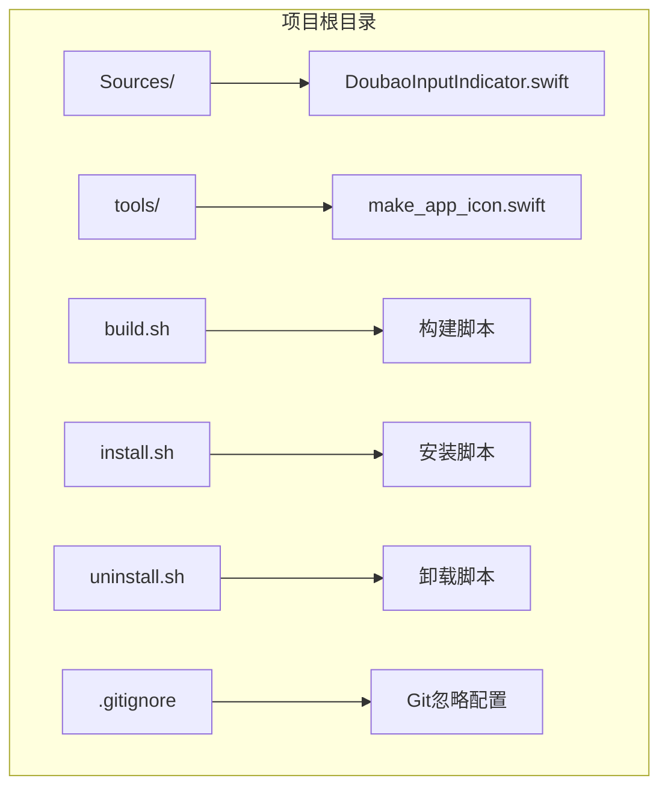
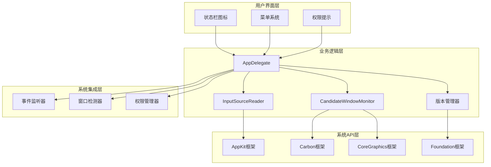
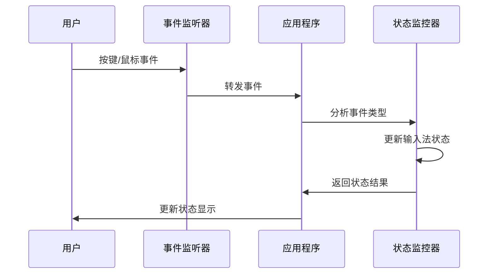
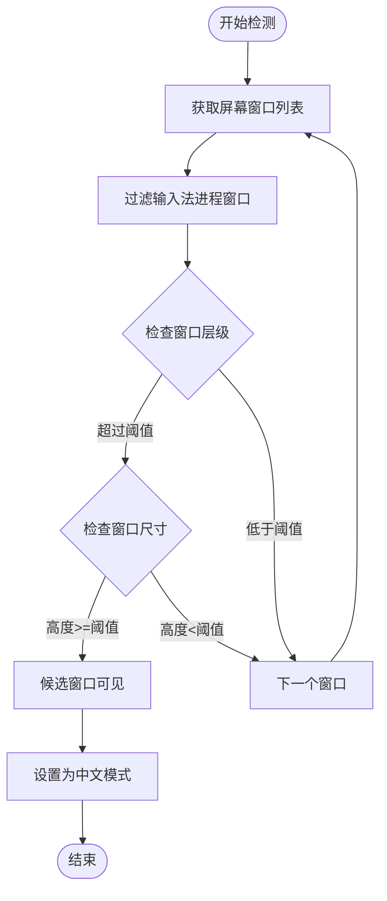
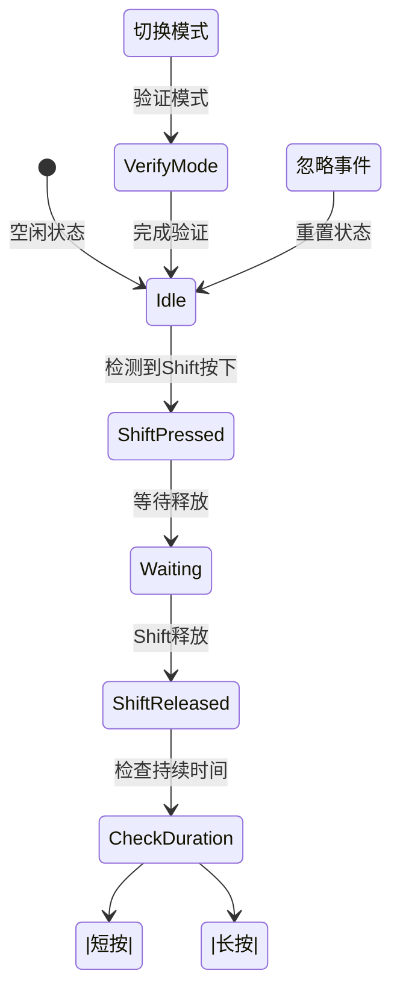
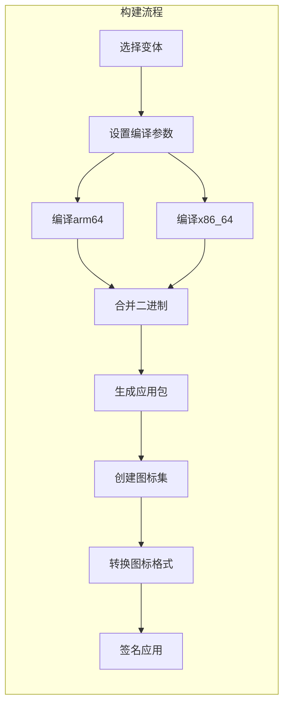
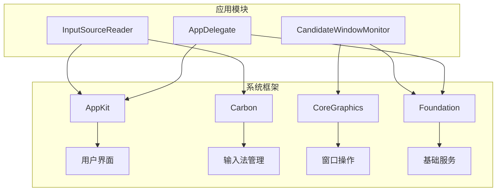
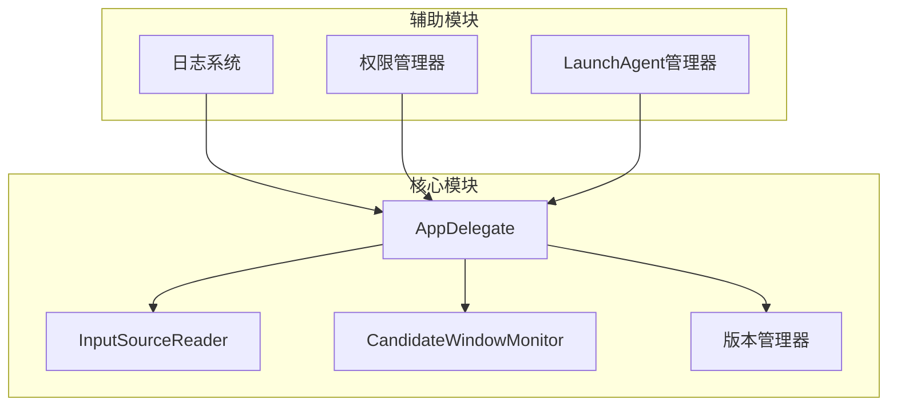

# 开发者指南

<cite>
**本文档引用的文件**
- [DoubaoInputIndicator.swift](file://Sources/DoubaoInputIndicator.swift)
- [build.sh](file://build.sh)
- [install.sh](file://install.sh)
- [uninstall.sh](file://uninstall.sh)
- [make_app_icon.swift](file://tools/make_app_icon.swift)
- [.gitignore](file://.gitignore)
</cite>

## 目录
1. [简介](#简介)
2. [项目结构](#项目结构)
3. [核心组件](#核心组件)
4. [架构概览](#架构概览)
5. [详细组件分析](#详细组件分析)
6. [依赖关系分析](#依赖关系分析)
7. [性能考虑](#性能考虑)
8. [故障排除指南](#故障排除指南)
9. [结论](#结论)
10. [附录](#附录)

## 简介

这是一个基于 Swift 的 macOS 输入法指示器应用程序，用于检测和显示当前输入法的中英文状态。该应用支持两种输入法：豆包输入法（Doubao）和微信输入法（WeType），通过系统级事件监听和窗口检测技术来实时跟踪输入法状态变化。

## 项目结构

该项目采用简洁的单文件架构设计，主要包含以下目录和文件：

**图表来源**
- [DoubaoInputIndicator.swift:1-1410](file://Sources/DoubaoInputIndicator.swift#L1-L1410)
- [build.sh:1-117](file://build.sh#L1-L117)
- [install.sh:1-60](file://install.sh#L1-L60)
- [uninstall.sh:1-30](file://uninstall.sh#L1-L30)
- [make_app_icon.swift:1-95](file://tools/make_app_icon.swift#L1-L95)

**章节来源**
- [DoubaoInputIndicator.swift:1-1410](file://Sources/DoubaoInputIndicator.swift#L1-L1410)
- [build.sh:1-117](file://build.sh#L1-L117)
- [install.sh:1-60](file://install.sh#L1-L60)
- [uninstall.sh:1-30](file://uninstall.sh#L1-L30)
- [make_app_icon.swift:1-95](file://tools/make_app_icon.swift#L1-L95)

## 核心组件

### 应用程序入口点

应用程序的核心逻辑集中在 `AppDelegate` 类中，该类实现了 `NSApplicationDelegate` 和 `NSMenuDelegate` 协议，负责管理整个应用的生命周期和用户界面。

### 输入源检测器

`InputSourceReader` 类提供了对当前输入源的实时检测功能，包括输入法的 ID、名称、bundle ID 和输入模式 ID。

### 候选窗口监控器

`CandidateWindowMonitor` 类专门用于监控输入法候选窗口的状态，通过屏幕截图和窗口属性分析来判断当前输入法的中英文状态。

### 版本管理系统

应用内置了完整的版本管理功能，包括版本号比较、GitHub 发布检查和自动更新提示。

**章节来源**
- [DoubaoInputIndicator.swift:280-1410](file://Sources/DoubaoInputIndicator.swift#L280-L1410)

## 架构概览

该应用采用了多层架构设计，结合了系统级事件监听、窗口检测和用户界面管理：

**图表来源**
- [DoubaoInputIndicator.swift:104-131](file://Sources/DoubaoInputIndicator.swift#L104-L131)
- [DoubaoInputIndicator.swift:133-278](file://Sources/DoubaoInputIndicator.swift#L133-L278)
- [DoubaoInputIndicator.swift:280-1410](file://Sources/DoubaoInputIndicator.swift#L280-L1410)

## 详细组件分析

### 输入法状态检测机制

应用通过多种方式来检测输入法状态，确保准确性：

#### 1. 事件监听机制

应用使用 `CGEvent.tapCreate` 和 `NSEvent.addGlobalMonitorForEvents` 来监听系统级键盘和鼠标事件：

**图表来源**
- [DoubaoInputIndicator.swift:408-480](file://Sources/DoubaoInputIndicator.swift#L408-L480)
- [DoubaoInputIndicator.swift:482-538](file://Sources/DoubaoInputIndicator.swift#L482-L538)

#### 2. 窗口检测算法

应用通过分析输入法候选窗口的高度和位置来判断输入法状态：

**图表来源**
- [DoubaoInputIndicator.swift:165-212](file://Sources/DoubaoInputIndicator.swift#L165-L212)
- [DoubaoInputIndicator.swift:622-716](file://Sources/DoubaoInputIndicator.swift#L622-L716)

#### 3. Shift 键切换机制

应用实现了智能的 Shift 键切换检测，支持双输入法的无缝切换：

**图表来源**
- [DoubaoInputIndicator.swift:866-980](file://Sources/DoubaoInputIndicator.swift#L866-L980)

**章节来源**
- [DoubaoInputIndicator.swift:104-131](file://Sources/DoubaoInputIndicator.swift#L104-L131)
- [DoubaoInputIndicator.swift:133-278](file://Sources/DoubaoInputIndicator.swift#L133-L278)
- [DoubaoInputIndicator.swift:280-1410](file://Sources/DoubaoInputIndicator.swift#L280-L1410)

### 应用构建系统

#### 构建脚本架构

构建系统支持多架构编译和双输入法变体：

**图表来源**
- [build.sh:44-75](file://build.sh#L44-L75)

#### 图标生成系统

应用使用 Swift 脚本自动生成多分辨率的应用图标：

**章节来源**
- [build.sh:1-117](file://build.sh#L1-L117)
- [make_app_icon.swift:1-95](file://tools/make_app_icon.swift#L1-L95)

### 权限管理系统

应用需要请求多种系统权限来正常工作：

#### 1. 辅助功能权限

用于通过无障碍 API 读取输入法状态：

#### 2. 输入监控权限

用于监听系统级输入事件：

#### 3. 屏幕录制权限

某些情况下可能需要此权限：

**章节来源**
- [DoubaoInputIndicator.swift:379-406](file://Sources/DoubaoInputIndicator.swift#L379-L406)
- [DoubaoInputIndicator.swift:1152-1155](file://Sources/DoubaoInputIndicator.swift#L1152-L1155)

## 依赖关系分析

### 外部框架依赖

应用依赖以下系统框架：

**图表来源**
- [DoubaoInputIndicator.swift:1-6](file://Sources/DoubaoInputIndicator.swift#L1-L6)

### 内部模块依赖

**图表来源**
- [DoubaoInputIndicator.swift:280-1410](file://Sources/DoubaoInputIndicator.swift#L280-L1410)

**章节来源**
- [DoubaoInputIndicator.swift:1-10](file://Sources/DoubaoInputIndicator.swift#L1-L10)
- [DoubaoInputIndicator.swift:280-1410](file://Sources/DoubaoInputIndicator.swift#L280-L1410)

## 性能考虑

### 事件处理优化

应用采用了多种优化策略来减少系统资源消耗：

1. **事件去重**：避免同一物理按键通过多个路径重复触发
2. **定时器节流**：限制轮询频率，减少 CPU 占用
3. **内存管理**：及时清理定时器和监听器
4. **条件检查**：只在必要时进行昂贵的操作

### 内存使用优化

- 使用弱引用避免循环引用
- 及时释放不再使用的对象
- 合理使用定时器和回调

### 系统资源管理

- 动态启用/禁用事件监听器
- 条件加载权限检查
- 智能缓存机制

## 故障排除指南

### 常见问题及解决方案

#### 1. 输入法状态不准确

**症状**：状态栏图标显示与实际输入法状态不符

**可能原因**：
- 缺少辅助功能权限
- 输入监控权限未授予
- 窗口检测失败

**解决步骤**：
1. 检查辅助功能权限设置
2. 重新授权输入监控权限
3. 手动校准输入法状态

#### 2. Shift 键切换失效

**症状**：按住 Shift 键无法切换中英文状态

**可能原因**：
- Shift 键检测异常
- 事件监听器失效
- 权限不足

**解决步骤**：
1. 检查事件监听器状态
2. 重新授权相关权限
3. 查看日志文件定位问题

#### 3. 应用启动失败

**症状**：应用无法正常启动或崩溃

**可能原因**：
- 代码签名问题
- 权限配置错误
- 系统兼容性问题

**解决步骤**：
1. 检查代码签名证书
2. 验证 LaunchAgent 配置
3. 查看系统兼容性要求

**章节来源**
- [DoubaoInputIndicator.swift:1174-1284](file://Sources/DoubaoInputIndicator.swift#L1174-L1284)
- [DoubaoInputIndicator.swift:1388-1403](file://Sources/DoubaoInputIndicator.swift#L1388-L1403)

## 结论

这个输入法指示器应用展现了现代 macOS 应用开发的最佳实践，包括：

1. **模块化设计**：清晰的职责分离和组件化架构
2. **系统集成**：深度集成 macOS 系统 API 和权限模型
3. **用户体验**：直观的界面设计和智能的状态检测
4. **可维护性**：简洁的代码结构和完善的错误处理

该应用为开发者提供了学习 macOS 系统级编程、事件监听和权限管理的优秀示例。

## 附录

### 开发环境搭建

#### 系统要求
- macOS 12.0 或更高版本
- Xcode 14.0 或更高版本
- Swift 5.0 或更高版本

#### 开发工具
- Xcode IDE
- 命令行工具
- Git 版本控制

### 代码贡献流程

#### 提交规范
1. 遵循统一的代码风格
2. 添加必要的注释和文档
3. 编写单元测试
4. 进行充分的功能测试

#### 分支管理
- `main` 分支：稳定版本
- `develop` 分支：开发版本
- 功能分支：特定功能开发

### 质量保证标准

#### 代码质量
- 遵循 Swift 编码规范
- 保持代码简洁易懂
- 注重错误处理和边界情况

#### 测试要求
- 单元测试覆盖率 ≥ 80%
- 集成测试覆盖主要功能
- 兼容性测试（不同 macOS 版本）

### 自动化部署方案

#### 构建自动化
- 支持 CI/CD 集成
- 多架构自动编译
- 自动版本管理

#### 发布流程
1. 代码审查和测试
2. 版本标记和发布
3. 自动化分发
4. 用户反馈收集