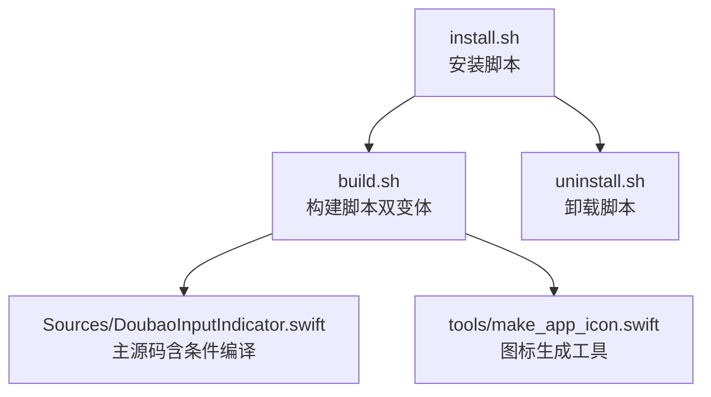
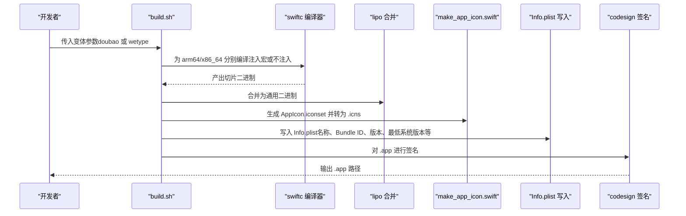
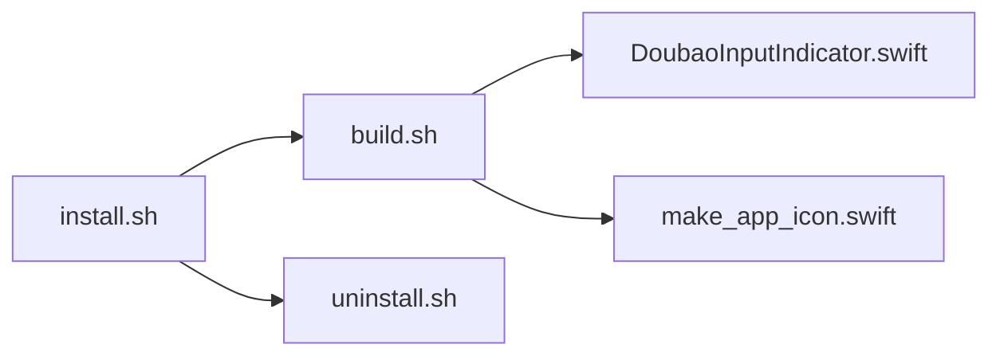

# 构建流程

<cite>
**本文引用的文件**
- [build.sh](file://build.sh)
- [Sources/DoubaoInputIndicator.swift](file://Sources/DoubaoInputIndicator.swift)
- [install.sh](file://install.sh)
- [uninstall.sh](file://uninstall.sh)
- [tools/make_app_icon.swift](file://tools/make_app_icon.swift)
- [DEVELOPMENT_CONTEXT.md](file://DEVELOPMENT_CONTEXT.md)
</cite>

## 目录
1. [简介](#简介)
2. [项目结构](#项目结构)
3. [核心组件](#核心组件)
4. [架构总览](#架构总览)
5. [详细组件分析](#详细组件分析)
6. [依赖关系分析](#依赖关系分析)
7. [性能与优化建议](#性能与优化建议)
8. [故障排查指南](#故障排查指南)
9. [结论](#结论)
10. [附录](#附录)

## 简介
本指南面向开发者，系统性讲解该项目的构建流程与实现细节，重点覆盖：
- build.sh 脚本功能与用法：如何编译支持豆包输入法与微信输入法的两个版本
- Swift 编译选项、链接参数与输出配置
- 宏定义 WETYPE 的作用与编译时配置
- 本地开发环境的 Swift 编译命令示例（含 Xcode 项目配置与命令行编译）
- 构建优化选项、调试符号配置与发布版本打包流程

## 项目结构
该仓库采用“单源多变体”的构建策略：同一份 Swift 源码通过编译宏区分两个应用变体，并在构建脚本中注入不同的编译参数与资源信息，最终产出两个独立的 .app 包。

图表来源
- [build.sh:1-117](file://build.sh#L1-L117)
- [Sources/DoubaoInputIndicator.swift:1-1410](file://Sources/DoubaoInputIndicator.swift#L1-L1410)
- [tools/make_app_icon.swift:1-95](file://tools/make_app_icon.swift#L1-L95)
- [install.sh:1-60](file://install.sh#L1-L60)
- [uninstall.sh:1-30](file://uninstall.sh#L1-L30)

章节来源
- [build.sh:1-117](file://build.sh#L1-L117)
- [Sources/DoubaoInputIndicator.swift:1-1410](file://Sources/DoubaoInputIndicator.swift#L1-L1410)
- [tools/make_app_icon.swift:1-95](file://tools/make_app_icon.swift#L1-L95)
- [install.sh:1-60](file://install.sh#L1-L60)
- [uninstall.sh:1-30](file://uninstall.sh#L1-L30)

## 核心组件
- 构建脚本 build.sh：负责根据变体选择编译宏、生成二进制切片、合并为通用二进制、生成图标、写入 Info.plist 并进行签名。
- 条件编译源码 DoubaoInputIndicator.swift：通过宏 WETYPE 控制目标输入法、显示名、Bundle ID、偏好键与日志文件名等配置。
- 图标生成工具 make_app_icon.swift：按标准尺寸生成 AppIcon.iconset 并转换为 .icns。
- 安装/卸载脚本：封装安装与卸载流程，包含 LaunchAgent 配置与开机启动控制。

章节来源
- [build.sh:1-117](file://build.sh#L1-L117)
- [Sources/DoubaoInputIndicator.swift:84-102](file://Sources/DoubaoInputIndicator.swift#L84-L102)
- [tools/make_app_icon.swift:1-95](file://tools/make_app_icon.swift#L1-L95)
- [install.sh:1-60](file://install.sh#L1-L60)
- [uninstall.sh:1-30](file://uninstall.sh#L1-L30)

## 架构总览
下图展示从源码到最终 .app 的构建路径与关键步骤。

图表来源
- [build.sh:44-75](file://build.sh#L44-L75)
- [tools/make_app_icon.swift:1-95](file://tools/make_app_icon.swift#L1-L95)
- [Sources/DoubaoInputIndicator.swift:84-102](file://Sources/DoubaoInputIndicator.swift#L84-L102)

## 详细组件分析

### 构建脚本 build.sh
- 变体选择与默认值
  - 支持变体：doubao、wetype（或 wechat）。默认变体为 doubao。
  - 版本号与部署目标可通过环境变量覆盖，默认部署目标为 12.0。
- 变体差异
  - doubao：无编译宏；Bundle ID 与显示名为豆包相关。
  - wetype/wechat：注入编译宏 WETYPE；Bundle ID 与显示名为微信输入法相关。
- 编译流程
  - 为 arm64 与 x86_64 分别调用 swiftc 编译，注入 -target、-O 与所需框架。
  - 使用 lipo 将两个切片合并为通用二进制。
- 资源与清单
  - 生成 AppIcon.iconset 并转换为 .icns。
  - 写入 Info.plist，包含开发区域、可执行文件名、图标文件名、Bundle ID、显示名、短版本号、版本号、最低系统版本、LSUIElement 等。
- 签名
  - 对 .app 执行 ad-hoc 签名（用于本地运行与测试）。

章节来源
- [build.sh:5-27](file://build.sh#L5-L27)
- [build.sh:44-75](file://build.sh#L44-L75)
- [build.sh:77-116](file://build.sh#L77-L116)

### Swift 条件编译与宏定义 WETYPE
- 宏定义 WETYPE 的作用
  - 通过宏切换目标输入法、显示名、Bundle ID、偏好键与日志文件名等配置。
  - 在 DoubaoInputIndicator.swift 中，宏控制了 appConfig 的初始化与菜单项提示。
- 编译时注入
  - build.sh 在编译时根据变体决定是否向 swiftc 注入 -D WETYPE。
- 开发者注意事项
  - 若需要针对微信输入法进行特定逻辑调整，可在源码中以 #if WETYPE 包裹相应分支。

章节来源
- [Sources/DoubaoInputIndicator.swift:84-102](file://Sources/DoubaoInputIndicator.swift#L84-L102)
- [Sources/DoubaoInputIndicator.swift:1071-1077](file://Sources/DoubaoInputIndicator.swift#L1071-L1077)
- [build.sh:48-51](file://build.sh#L48-L51)
- [DEVELOPMENT_CONTEXT.md:28-29](file://DEVELOPMENT_CONTEXT.md#L28-L29)

### 图标生成工具 make_app_icon.swift
- 功能概述
  - 接收输出目录与 Emoji 字符作为参数，生成多分辨率 PNG 文件，组成 AppIcon.iconset。
  - 使用 iconutil 将 iconset 转换为 .icns。
- 关键点
  - 生成尺寸覆盖 16×16 到 1024×1024，适配 macOS 应用图标规范。
  - 使用渐变背景与阴影增强视觉效果。

章节来源
- [tools/make_app_icon.swift:17-28](file://tools/make_app_icon.swift#L17-L28)
- [tools/make_app_icon.swift:30-82](file://tools/make_app_icon.swift#L30-L82)
- [build.sh:72-75](file://build.sh#L72-L75)

### 安装与卸载脚本
- install.sh
  - 根据变体选择目标应用与 LaunchAgent ID。
  - 先调用 build.sh 生成 .app，再复制到 ~/Applications，并写入 LaunchAgent plist，最后通过 launchctl 加载。
- uninstall.sh
  - 停止运行中的进程、卸载 LaunchAgent、删除 .app。

章节来源
- [install.sh:7-20](file://install.sh#L7-L20)
- [install.sh:26-56](file://install.sh#L26-L56)
- [uninstall.sh:6-19](file://uninstall.sh#L6-L19)
- [uninstall.sh:24-27](file://uninstall.sh#L24-L27)

## 依赖关系分析
- 组件耦合
  - build.sh 依赖 DoubaoInputIndicator.swift 作为唯一源文件，依赖 make_app_icon.swift 生成图标。
  - install.sh 依赖 build.sh 产出的 .app 与 LaunchAgent 配置。
  - uninstall.sh 依赖 install.sh 写入的 LaunchAgent 与 ~/Applications 下的应用路径。
- 外部依赖
  - swiftc、lipo、iconutil、codesign 等系统工具。
  - macOS 框架：AppKit、Carbon、CoreGraphics。
- 可能的循环依赖
  - 未发现直接循环依赖；脚本间通过文件系统交互，顺序明确。

图表来源
- [build.sh:44-75](file://build.sh#L44-L75)
- [tools/make_app_icon.swift:1-95](file://tools/make_app_icon.swift#L1-L95)
- [install.sh:26-56](file://install.sh#L26-L56)
- [uninstall.sh:24-27](file://uninstall.sh#L24-L27)

章节来源
- [build.sh:44-75](file://build.sh#L44-L75)
- [install.sh:26-56](file://install.sh#L26-L56)
- [uninstall.sh:24-27](file://uninstall.sh#L24-L27)

## 性能与优化建议
- 编译优化
  - 当前使用 -O（release 优化），适合发布版本。若需调试，可替换为 -Ounchecked 或在本地临时改用 -O0（不推荐长期使用）。
- 二进制体积
  - 仅链接必要框架（AppKit、Carbon、CoreGraphics），避免引入额外依赖可减小体积。
- 符号与调试
  - 默认未开启调试符号。如需调试，可在本地临时添加调试相关标志（例如 -g），但发布版应移除。
- 并行编译
  - build.sh 已对 arm64 与 x86_64 并行编译，无需额外改动。
- 签名与权限
  - 本地 ad-hoc 签名便于测试；发布前请使用正式证书签名，并确保 Info.plist 中的 Bundle ID 与签名一致。

[本节为通用建议，不直接分析具体文件]

## 故障排查指南
- 构建失败（swiftc 无法找到头文件或符号）
  - 确认系统已安装 Xcode Command Line Tools。
  - 确认 macOS SDK 版本与 DEPLOYMENT_TARGET 设置匹配。
- 二进制不可运行（沙盒/权限问题）
  - 确保已授予“输入监控”权限；若权限缺失，状态栏图标会显示异常提示。
- 图标不生效
  - 检查 AppIcon.iconset 是否生成成功，以及 Info.plist 中 CFBundleIconFile/CFBundleIconName 是否正确。
- 安装后无法开机启动
  - 检查 ~/Library/LaunchAgents 下的 plist 是否存在且内容正确；使用 launchctl 重新加载。
- 变体配置错误
  - 确认传入 build.sh 的变体参数是否为 doubao 或 wetype；确认 Info.plist 中的 Bundle ID 与显示名是否符合预期。

章节来源
- [build.sh:77-116](file://build.sh#L77-L116)
- [install.sh:33-56](file://install.sh#L33-L56)
- [uninstall.sh:24-27](file://uninstall.sh#L24-L27)

## 结论
本项目通过单一源码与构建脚本实现了双变体的快速构建与分发。借助宏定义 WETYPE，开发者可以在不修改其他逻辑的前提下切换目标输入法；build.sh 提供了完善的编译、合并、资源生成与签名流程。配合 install.sh/uninstall.sh，可完成本地安装与卸载。发布流程可参考 DEVELOPMENT_CONTEXT.md 中的 Homebrew 打包工作流。

[本节为总结性内容，不直接分析具体文件]

## 附录

### 本地开发环境的 Swift 编译命令示例
- 基于 build.sh 的编译参数映射
  - 目标平台与部署版本：-target <arch>-apple-macosx<DEPLOYMENT_TARGET>
  - 优化级别：-O
  - 链接框架：-framework AppKit -framework Carbon -framework CoreGraphics
  - 源文件：Sources/DoubaoInputIndicator.swift
  - 输出：各架构切片二进制
  - 合并：lipo -create <切片> -output <通用二进制>
- 注入宏定义（微信输入法）
  - 在 swiftc 参数中加入 -D WETYPE
- 生成图标
  - swift tools/make_app_icon.swift <输出.iconset> <Emoji>
  - iconutil -c icns <输出.iconset> -o <输出.icns>
- 写入 Info.plist
  - 使用 build.sh 中的模板字段（名称、Bundle ID、版本、最低系统版本、LSUIElement 等）

章节来源
- [build.sh:44-75](file://build.sh#L44-L75)
- [tools/make_app_icon.swift:1-95](file://tools/make_app_icon.swift#L1-L95)

### Xcode 项目配置建议（可选）
- 如果需要在 Xcode 中进行本地调试：
  - 新建一个 macOS 命令行工具工程，设置目标为 macOS 12.0+。
  - 添加 Sources/DoubaoInputIndicator.swift 为源文件。
  - 在 Build Settings 中设置：
    - Deployment Target 为 12.0
    - Swift Compiler - Custom Compiler Flags：在 Debug 中添加 -D WETYPE（若需要微信输入法配置）
    - Linking - Other Linker Flags：添加 -framework AppKit -framework Carbon -framework CoreGraphics
  - 运行时注意：Xcode 默认不会自动创建 .app 结构，建议仍使用 build.sh 生成 .app 以便测试完整行为。

[本节为概念性说明，不直接分析具体文件]

### 发布版本打包流程（Homebrew）
- 更新版本号：在 build.sh 中更新版本与构建号，确保写入 Info.plist。
- 打包与校验：
  - 使用 DEVELOPMENT_CONTEXT.md 中的脚本在 tap 仓库中打包两个变体，生成 zip 并计算 SHA-256。
  - 更新 cask 文件的版本与哈希。
- 提交与发布：
  - 在产品仓库打标签并推送；在 GitHub 创建 Release 并上传 zip。
  - 在 tap 仓库执行语法与样式检查，提交并推送。

章节来源
- [DEVELOPMENT_CONTEXT.md:252-321](file://DEVELOPMENT_CONTEXT.md#L252-L321)