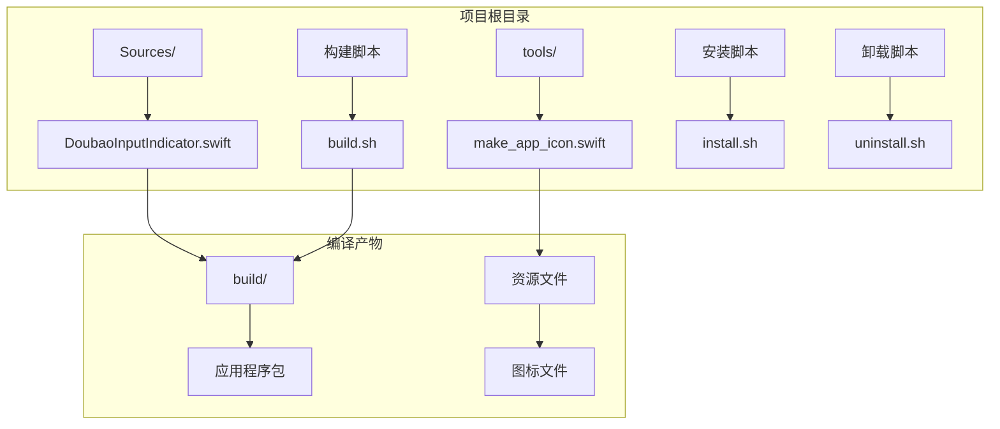
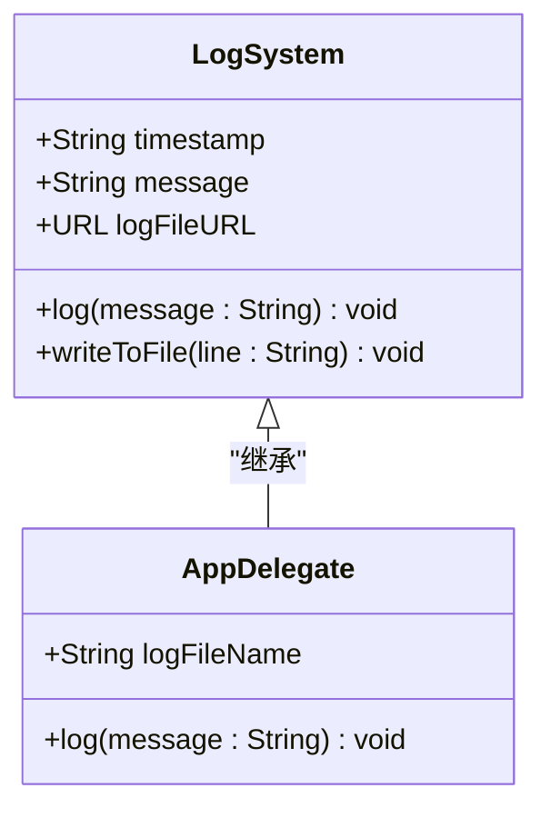
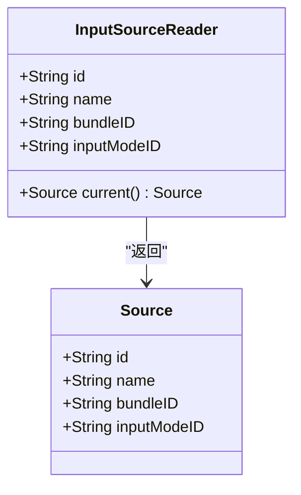
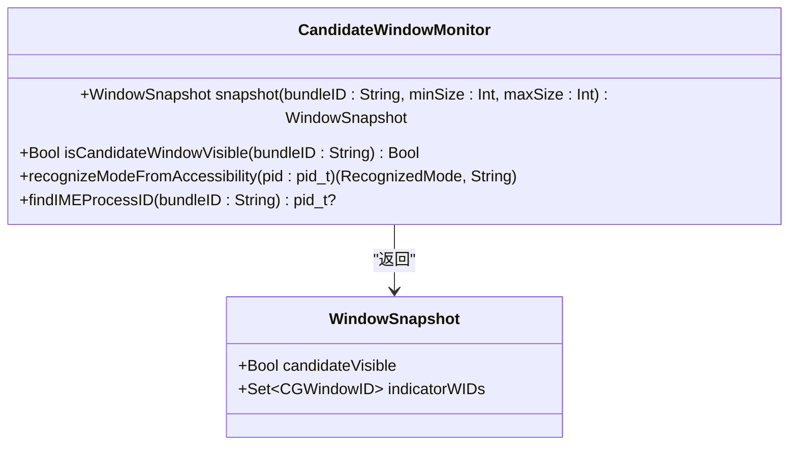
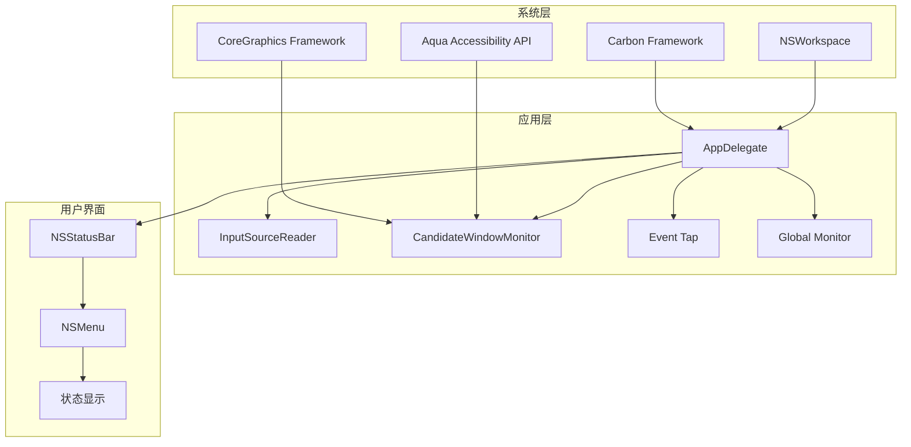
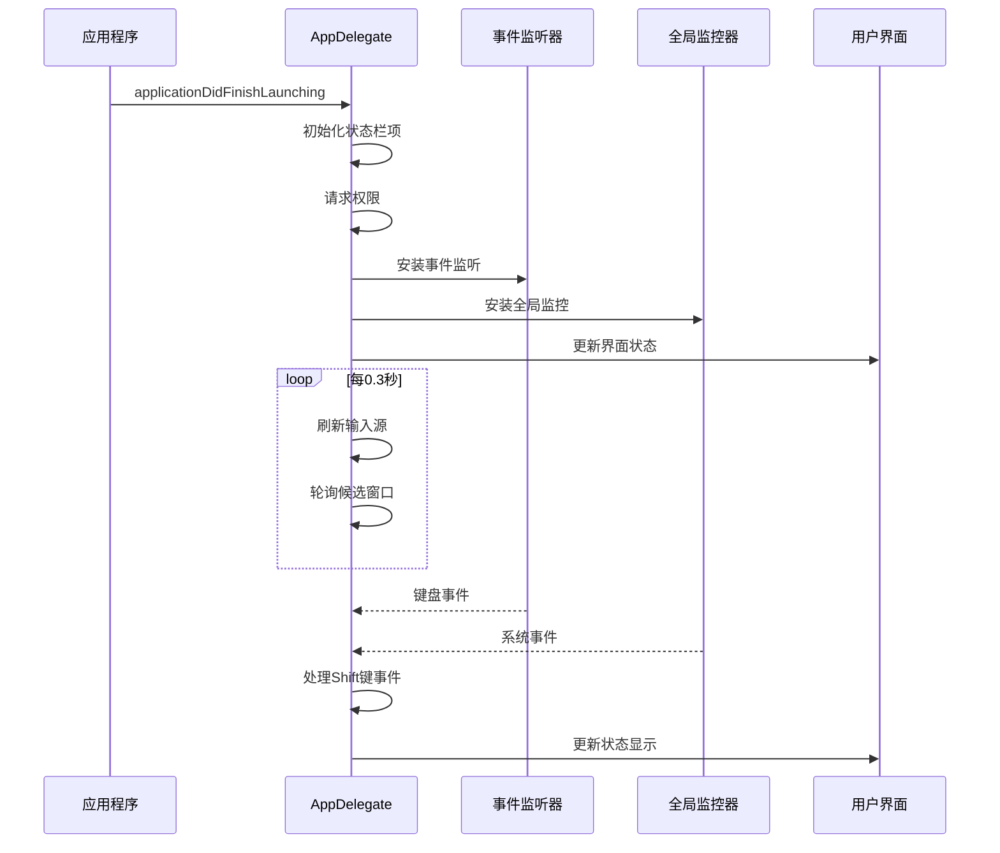
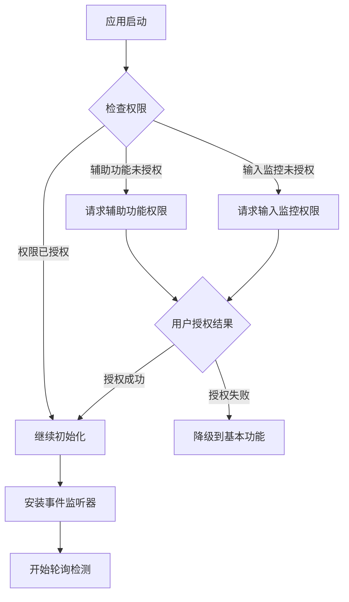
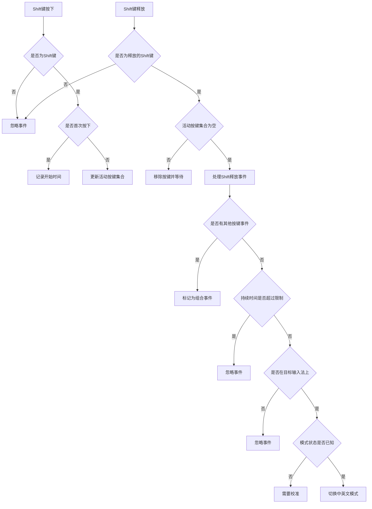
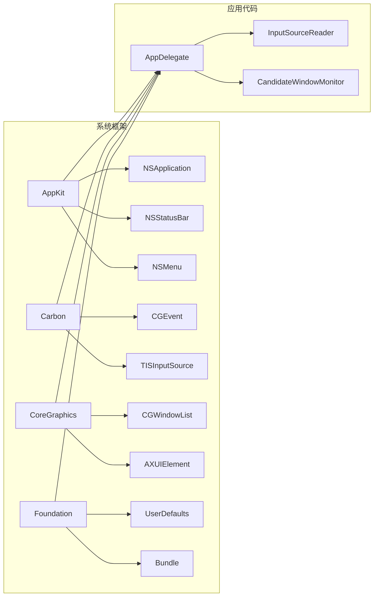

# 调试与测试

<cite>
**本文引用的文件**
- [DoubaoInputIndicator.swift](file://Sources/DoubaoInputIndicator.swift)
- [build.sh](file://build.sh)
- [install.sh](file://install.sh)
- [uninstall.sh](file://uninstall.sh)
- [make_app_icon.swift](file://tools/make_app_icon.swift)
</cite>

## 目录
1. [简介](#简介)
2. [项目结构](#项目结构)
3. [核心组件](#核心组件)
4. [架构概览](#架构概览)
5. [详细组件分析](#详细组件分析)
6. [依赖关系分析](#依赖关系分析)
7. [性能考虑](#性能考虑)
8. [故障排除指南](#故障排除指南)
9. [结论](#结论)
10. [附录](#附录)

## 简介

这是一个用于检测和显示中文/英文输入法状态的 macOS 应用程序。该应用通过监听系统事件、检测候选窗口和使用辅助功能 API 来确定当前输入法的中英文模式，并在菜单栏中以表情符号显示当前状态。

## 项目结构

该项目采用简洁的单文件架构设计：



**图表来源**
- [build.sh:1-117](file://build.sh#L1-L117)
- [install.sh:1-60](file://install.sh#L1-L60)
- [uninstall.sh:1-30](file://uninstall.sh#L1-L30)

**章节来源**
- [build.sh:1-117](file://build.sh#L1-L117)
- [install.sh:1-60](file://install.sh#L1-L60)
- [uninstall.sh:1-30](file://uninstall.sh#L1-L30)

## 核心组件

### 日志系统

应用实现了自定义的日志记录系统，支持时间戳格式化和文件写入：



**图表来源**
- [DoubaoInputIndicator.swift:1388-1403](file://Sources/DoubaoInputIndicator.swift#L1388-L1403)

日志系统特点：
- 使用 ISO8601 格式的时间戳
- 将日志写入用户主目录的 Library/Logs 文件夹
- 支持追加写入现有日志文件
- 自动创建日志文件

**章节来源**
- [DoubaoInputIndicator.swift:1388-1403](file://Sources/DoubaoInputIndicator.swift#L1388-L1403)

### 输入源检测器

负责检测当前活动的输入法源：



**图表来源**
- [DoubaoInputIndicator.swift:104-131](file://Sources/DoubaoInputIndicator.swift#L104-L131)

**章节来源**
- [DoubaoInputIndicator.swift:104-131](file://Sources/DoubaoInputIndicator.swift#L104-L131)

### 候选窗口监控器

监控输入法的候选窗口和指示器窗口：



**图表来源**
- [DoubaoInputIndicator.swift:133-278](file://Sources/DoubaoInputIndicator.swift#L133-L278)

**章节来源**
- [DoubaoInputIndicator.swift:133-278](file://Sources/DoubaoInputIndicator.swift#L133-L278)

## 架构概览

应用采用事件驱动架构，通过多种机制检测输入法状态：



**图表来源**
- [DoubaoInputIndicator.swift:1-102](file://Sources/DoubaoInputIndicator.swift#L1-L102)
- [DoubaoInputIndicator.swift:280-406](file://Sources/DoubaoInputIndicator.swift#L280-L406)

## 详细组件分析

### AppDelegate 类详解

AppDelegate 是应用的核心控制器，负责协调所有功能模块：



**图表来源**
- [DoubaoInputIndicator.swift:339-362](file://Sources/DoubaoInputIndicator.swift#L339-L362)
- [DoubaoInputIndicator.swift:408-480](file://Sources/DoubaoInputIndicator.swift#L408-L480)

#### 权限管理机制

应用需要两种主要权限：

1. **辅助功能权限**：用于读取输入法的模式指示器文本
2. **输入监控权限**：用于监听键盘事件和鼠标事件



**图表来源**
- [DoubaoInputIndicator.swift:379-406](file://Sources/DoubaoInputIndicator.swift#L379-L406)
- [DoubaoInputIndicator.swift:408-480](file://Sources/DoubaoInputIndicator.swift#L408-L480)

**章节来源**
- [DoubaoInputIndicator.swift:280-406](file://Sources/DoubaoInputIndicator.swift#L280-L406)

### Shift键事件处理

应用实现了复杂的Shift键事件处理逻辑：



**图表来源**
- [DoubaoInputIndicator.swift:866-980](file://Sources/DoubaoInputIndicator.swift#L866-L980)

**章节来源**
- [DoubaoInputIndicator.swift:866-980](file://Sources/DoubaoInputIndicator.swift#L866-L980)

## 依赖关系分析

应用的主要依赖关系如下：



**图表来源**
- [DoubaoInputIndicator.swift:1-6](file://Sources/DoubaoInputIndicator.swift#L1-L6)

**章节来源**
- [DoubaoInputIndicator.swift:1-102](file://Sources/DoubaoInputIndicator.swift#L1-L102)

## 性能考虑

### 内存管理

应用采用了弱引用和及时清理的策略：
- 所有定时器都使用弱引用避免循环引用
- 事件监听器在应用终止时正确移除
- 全局监控器在适当时候被禁用

### CPU使用优化

- 主定时器间隔为0.3秒，平衡了响应性和性能
- 候选窗口检测使用阈值过滤，避免不必要的计算
- 事件去重机制防止重复处理相同的输入事件

### I/O操作优化

- 日志文件采用追加写入，减少文件操作开销
- 图标生成在构建时完成，运行时无需实时生成

## 故障排除指南

### Xcode调试设置

#### 设置断点位置

1. **应用启动断点**
   - 在 `applicationDidFinishLaunching` 方法处设置断点
   - 路径参考：[DoubaoInputIndicator.swift:339-362](file://Sources/DoubaoInputIndicator.swift#L339-L362)

2. **权限检查断点**
   - 在 `requestAccessibilityIfNeeded` 和 `refreshListenAccessStatus` 方法处设置断点
   - 路径参考：[DoubaoInputIndicator.swift:379-406](file://Sources/DoubaoInputIndicator.swift#L379-L406)

3. **事件处理断点**
   - 在 `handleFlagsChanged` 和 `handle` 方法处设置断点
   - 路径参考：[DoubaoInputIndicator.swift:482-538](file://Sources/DoubaoInputIndicator.swift#L482-L538)

#### 变量检查要点

1. **输入源状态**
   - 检查 `currentSource` 变量的 `bundleID` 和 `inputModeID`
   - 路径参考：[DoubaoInputIndicator.swift:290](file://Sources/DoubaoInputIndicator.swift#L290)

2. **权限状态**
   - 检查 `listenAccessGranted` 和 `observedInputEvent` 变量
   - 路径参考：[DoubaoInputIndicator.swift:293-294](file://Sources/DoubaoInputIndicator.swift#L293-L294)

3. **Shift键状态**
   - 检查 `activeShiftKeys` 和 `shiftDownAt` 变量
   - 路径参考：[DoubaoInputIndicator.swift:305-306](file://Sources/DoubaoInputIndicator.swift#L305-L306)

### 日志系统使用

#### 查看应用日志

1. **日志文件位置**
   - 豆包输入法：`~/Library/Logs/DoubaoInputIndicator.log`
   - 微信输入法：`~/Library/Logs/WeTypeInputIndicator.log`

2. **日志格式**
   - 时间戳：ISO8601格式（例如：2023-12-01T10:30:45Z）
   - 消息内容：包含事件类型和详细描述

3. **常用日志关键字**
   - `accessibility trusted=` - 辅助功能权限状态
   - `listen access granted=` - 输入监控权限状态
   - `event tap active` - 事件监听器状态
   - `shift toggled` - Shift键切换事件
   - `auto-calibrate` - 自动校准事件

#### Console.app使用

1. **打开Console.app**
   - Applications > Utilities > Console.app

2. **过滤应用日志**
   - 在搜索框中输入应用名称或Bundle ID
   - 或者选择左侧的应用列表中的对应应用

3. **实时查看日志**
   - 确保选择了"实时"模式
   - 可以使用过滤器只显示特定级别的日志

### 常见问题诊断

#### 输入法状态检测失败

**症状**：状态栏图标不显示或显示问号

**诊断步骤**：
1. 检查输入法是否为目标输入法
   - 查看日志中的 `source changed` 记录
   - 路径参考：[DoubaoInputIndicator.swift:786-792](file://Sources/DoubaoInputIndicator.swift#L786-L792)

2. 验证候选窗口检测
   - 检查 `candidateVisible` 状态
   - 路径参考：[DoubaoInputIndicator.swift:544-620](file://Sources/DoubaoInputIndicator.swift#L544-L620)

3. 测试辅助功能权限
   - 查看 `accessibility trusted` 日志
   - 路径参考：[DoubaoInputIndicator.swift:379-383](file://Sources/DoubaoInputIndicator.swift#L379-L383)

#### 权限问题

**症状**：Shift键切换无效或状态栏显示警告

**诊断步骤**：
1. 检查输入监控权限
   - 查看 `listen access granted` 日志
   - 路径参考：[DoubaoInputIndicator.swift:389-400](file://Sources/DoubaoInputIndicator.swift#L389-L400)

2. 验证事件监听器状态
   - 检查 `event tap active` 和 `event tap create failed` 日志
   - 路径参考：[DoubaoInputIndicator.swift:440-453](file://Sources/DoubaoInputIndicator.swift#L440-L453)

3. 使用系统偏好设置检查权限
   - 打开系统偏好设置 > 安全性与隐私 > 隐私
   - 查找"辅助功能"和"输入监控"权限
   - 路径参考：[DoubaoInputIndicator.swift:1152-1155](file://Sources/DoubaoInputIndicator.swift#L1152-L1155)

#### 事件监听异常

**症状**：应用无响应或事件处理延迟

**诊断步骤**：
1. 检查事件监听器是否被禁用
   - 查看 `event tap disabled` 日志
   - 路径参考：[DoubaoInputIndicator.swift:733-747](file://Sources/DoubaoInputIndicator.swift#L733-L747)

2. 验证全局监控器状态
   - 检查 `global monitor active` 和 `global monitor create failed` 日志
   - 路径参考：[DoubaoInputIndicator.swift:475-480](file://Sources/DoubaoInputIndicator.swift#L475-L480)

3. 检查事件去重机制
   - 查看 `noteAlphaKeyDown` 方法的去重逻辑
   - 路径参考：[DoubaoInputIndicator.swift:634-663](file://Sources/DoubaoInputIndicator.swift#L634-L663)

### 系统偏好设置检查

#### 辅助功能权限

1. 打开系统偏好设置
2. 点击"安全性与隐私"
3. 选择"隐私"标签
4. 在左侧列表中选择"辅助功能"
5. 确保应用在右侧列表中被勾选

#### 输入监控权限

1. 在同一"隐私"页面中
2. 选择"输入监控"
3. 确保应用被勾选

#### 权限状态验证

应用提供了直接跳转到权限设置的功能：
- 路径参考：[DoubaoInputIndicator.swift:1152-1155](file://Sources/DoubaoInputIndicator.swift#L1152-L1155)

## 结论

该应用通过多种技术手段实现了可靠的输入法状态检测，包括事件监听、窗口检测和辅助功能API。其调试系统完善，日志记录详细，便于开发者进行问题诊断和性能优化。建议在开发过程中充分利用日志系统和Xcode调试工具，结合系统偏好设置检查来确保应用的稳定运行。

## 附录

### 单元测试编写指南

由于这是一个系统级应用，传统的单元测试可能不够充分。建议采用以下测试策略：

#### 集成测试方法

1. **权限测试**
   ```swift
   // 测试权限请求流程
   func testPermissionRequest() {
       // 模拟权限未授权状态
       // 验证权限请求对话框出现
       // 验证授权后的状态变化
   }
   ```

2. **事件监听测试**
   ```swift
   // 测试事件处理逻辑
   func testEventHandling() {
       // 模拟键盘事件
       // 验证事件处理函数被调用
       // 验证状态更新
   }
   ```

3. **日志系统测试**
   ```swift
   // 测试日志写入功能
   func testLogWriting() {
       // 调用log函数
       // 验证日志文件存在且包含正确格式
   }
   ```

#### 测试环境准备

1. **模拟系统环境**
   - 使用Xcode的Scheme配置来模拟不同的系统版本
   - 创建测试专用的Bundle ID

2. **权限模拟**
   - 使用Xcode的"Allow"选项来模拟权限授予
   - 测试不同权限组合下的行为

### 构建和部署

#### 构建脚本使用

1. **构建应用**
   ```bash
   ./build.sh doubao    # 构建豆包输入法版本
   ./build.sh wetype   # 构建微信输入法版本
   ```

2. **安装应用**
   ```bash
   ./install.sh doubao   # 安装豆包输入法版本
   ./install.sh wetype  # 安装微信输入法版本
   ```

3. **卸载应用**
   ```bash
   ./uninstall.sh doubao   # 卸载豆包输入法版本
   ./uninstall.sh wetype  # 卸载微信输入法版本
   ```

**章节来源**
- [build.sh:1-117](file://build.sh#L1-L117)
- [install.sh:1-60](file://install.sh#L1-L60)
- [uninstall.sh:1-30](file://uninstall.sh#L1-L30)