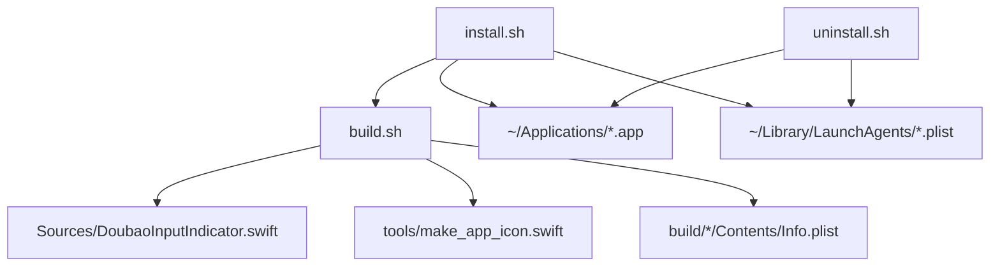
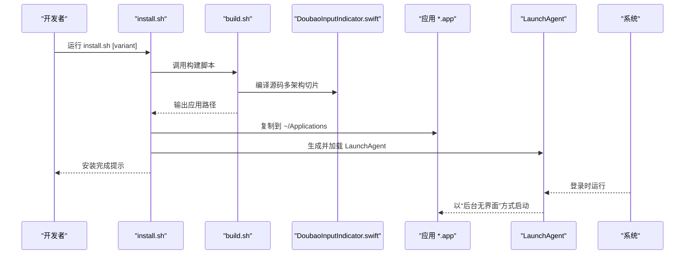
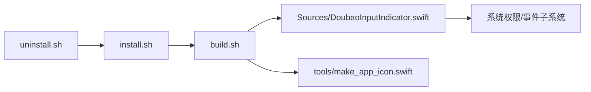

# 部署与发布

<cite>
**本文引用的文件**
- [install.sh](file://install.sh)
- [uninstall.sh](file://uninstall.sh)
- [build.sh](file://build.sh)
- [Sources/DoubaoInputIndicator.swift](file://Sources/DoubaoInputIndicator.swift)
- [tools/make_app_icon.swift](file://tools/make_app_icon.swift)
- [build/DoubaoInputIndicator.app/Contents/Info.plist](file://build/DoubaoInputIndicator.app/Contents/Info.plist)
- [build/WeTypeInputIndicator.app/Contents/Info.plist](file://build/WeTypeInputIndicator.app/Contents/Info.plist)
- [README.md](file://README.md)
- [DEVELOPMENT_CONTEXT.md](file://DEVELOPMENT_CONTEXT.md)
</cite>

## 目录
1. [简介](#简介)
2. [项目结构](#项目结构)
3. [核心组件](#核心组件)
4. [架构总览](#架构总览)
5. [详细组件分析](#详细组件分析)
6. [依赖关系分析](#依赖关系分析)
7. [性能考虑](#性能考虑)
8. [故障排查指南](#故障排查指南)
9. [结论](#结论)
10. [附录](#附录)

## 简介
本指南面向开发者，提供从本地构建到用户安装、从版本发布到持续集成的完整部署与发布流程说明。内容覆盖以下要点：
- install.sh 与 uninstall.sh 的功能与系统集成（LaunchAgent、权限与路径）
- build.sh 的编译与打包流程（多架构切片、签名、Info.plist 生成）
- GitHub Releases 发布流程（版本标签、二进制上传、Homebrew Tap 配套）
- 应用签名与权限配置、用户安装指引
- 自动化发布流程（CI/CD 集成、版本管理策略）
- 用户反馈与问题追踪机制

## 项目结构
仓库采用“脚本驱动 + 单源码 + 工具”的组织方式：
- 构建与安装脚本：build.sh、install.sh、uninstall.sh
- 核心业务逻辑：Sources/DoubaoInputIndicator.swift
- 图标生成工具：tools/make_app_icon.swift
- 构建产物示例：build/*/Contents/Info.plist
- 文档：README.md、DEVELOPMENT_CONTEXT.md

图表来源
- [install.sh:1-60](file://install.sh#L1-L60)
- [uninstall.sh:1-30](file://uninstall.sh#L1-L30)
- [build.sh:1-117](file://build.sh#L1-L117)
- [Sources/DoubaoInputIndicator.swift:1-1410](file://Sources/DoubaoInputIndicator.swift#L1-L1410)
- [tools/make_app_icon.swift:1-95](file://tools/make_app_icon.swift#L1-L95)
- [build/DoubaoInputIndicator.app/Contents/Info.plist:1-35](file://build/DoubaoInputIndicator.app/Contents/Info.plist#L1-L35)
- [build/WeTypeInputIndicator.app/Contents/Info.plist:1-35](file://build/WeTypeInputIndicator.app/Contents/Info.plist#L1-L35)

章节来源
- [README.md:1-155](file://README.md#L1-L155)
- [DEVELOPMENT_CONTEXT.md:145-171](file://DEVELOPMENT_CONTEXT.md#L145-L171)

## 核心组件
- 构建脚本 build.sh：负责多架构切片编译、资源与 Info.plist 生成、临时目录清理、应用签名与输出路径打印
- 安装脚本 install.sh：调用构建脚本、复制应用至用户 Applications、生成并加载 LaunchAgent、重启旧进程
- 卸载脚本 uninstall.sh：卸载 LaunchAgent、终止进程、删除应用与 LaunchAgent 文件
- Swift 源码：实现菜单栏指示器、权限请求、事件监听、开机启动、更新检查、日志记录等
- 图标工具：基于 Emoji 生成多分辨率 AppIcon.iconset 并转换为 icns
- Info.plist：定义 Bundle 标识、显示名、版本、最低系统版本、LSUIElement 等

章节来源
- [build.sh:1-117](file://build.sh#L1-L117)
- [install.sh:1-60](file://install.sh#L1-L60)
- [uninstall.sh:1-30](file://uninstall.sh#L1-L30)
- [Sources/DoubaoInputIndicator.swift:1-1410](file://Sources/DoubaoInputIndicator.swift#L1-L1410)
- [tools/make_app_icon.swift:1-95](file://tools/make_app_icon.swift#L1-L95)
- [build/DoubaoInputIndicator.app/Contents/Info.plist:1-35](file://build/DoubaoInputIndicator.app/Contents/Info.plist#L1-L35)
- [build/WeTypeInputIndicator.app/Contents/Info.plist:1-35](file://build/WeTypeInputIndicator.app/Contents/Info.plist#L1-L35)

## 架构总览
下图展示从脚本到应用、再到系统集成的整体流程。

图表来源
- [install.sh:26-56](file://install.sh#L26-L56)
- [build.sh:44-75](file://build.sh#L44-L75)
- [Sources/DoubaoInputIndicator.swift:280-362](file://Sources/DoubaoInputIndicator.swift#L280-L362)

## 详细组件分析

### install.sh 分析
- 功能概览
  - 接收 variant 参数（默认 doubao），解析应用名与 LaunchAgent ID
  - 调用构建脚本生成应用
  - 创建 ~/Applications 与 ~/Library/LaunchAgents 目录
  - 停止旧进程、删除旧应用、复制新应用
  - 生成 LaunchAgent plist（ProgramArguments 使用 /usr/bin/open -g 打开应用）
  - 使用 launchctl bootout/bootstrap/enable 加载与启用
  - 输出安装路径与 LaunchAgent 路径

- 关键行为
  - 通过 launchctl 对当前 GUI 用户域进行操作，确保开机自启
  - 使用 open -g 以“后台无界面”方式启动应用（符合 LSUIElement 设计）

- 错误处理
  - 对可选操作（如 pkill）使用 || true，避免脚本中断
  - launchctl 操作失败时静默继续，保证安装流程连贯性

- 权限与系统集成
  - LaunchAgent 位于用户目录，无需管理员权限
  - 通过 open -g 启动，避免 Dock 图标与前台激活

章节来源
- [install.sh:1-60](file://install.sh#L1-L60)

### uninstall.sh 分析
- 功能概览
  - 解析 variant，定位应用与 LaunchAgent 路径
  - 卸载 LaunchAgent、终止进程、删除 LaunchAgent plist 与应用目录
  - 输出卸载结果

- 与 install.sh 的一致性
  - 两者对 variant 的支持保持一致，确保路径与 ID 匹配

章节来源
- [uninstall.sh:1-30](file://uninstall.sh#L1-L30)

### build.sh 分析
- 多架构切片编译
  - arm64 与 x86_64 分别编译，使用 lipo 合成为统一二进制
  - 支持通过环境变量 DEPLOYMENT_TARGET 控制最低系统版本
- 资源与元数据
  - 生成 AppIcon.iconset 并转换为 icns
  - 生成 Info.plist，包含 Bundle 标识、显示名、版本、最低系统版本、LSUIElement 等
- 应用签名
  - 使用 codesign --deep 对应用进行签名（开发态使用 - 表示 ad-hoc）
- 输出与清理
  - 清理临时目录并在退出时回收
  - 输出最终应用路径

- 版本与变体
  - 通过 APP_VERSION/VERSION 环境变量控制 CFBundleShortVersionString 与 CFBundleVersion
  - 通过 SWIFT_DEFINE 控制变体（-D WETYPE）

章节来源
- [build.sh:1-117](file://build.sh#L1-L117)
- [build/DoubaoInputIndicator.app/Contents/Info.plist:1-35](file://build/DoubaoInputIndicator.app/Contents/Info.plist#L1-L35)
- [build/WeTypeInputIndicator.app/Contents/Info.plist:1-35](file://build/WeTypeInputIndicator.app/Contents/Info.plist#L1-L35)

### Swift 源码（应用逻辑）分析
- 权限与事件监听
  - 请求并检查输入监控权限；若不可用则显示警告
  - 使用 CGEvent tap 与 NSEvent 全局监听，避免重复处理同一事件
- 状态检测与切换
  - 通过候选窗口可见性与模式指示器窗口检测，结合 Accessibility API 辅助校准
  - 支持 Shift 单键触发的中英文切换，并进行去抖与容错
- 开机启动
  - 通过 LaunchAgent plist 实现开机自启；菜单中提供开关
- 更新检查
  - 访问 GitHub Releases 页面，解析最新版本标签并与当前版本比较
- 日志与调试
  - 将日志写入 ~/Library/Logs/*，区分 Doubao/WeType 变体

章节来源
- [Sources/DoubaoInputIndicator.swift:280-362](file://Sources/DoubaoInputIndicator.swift#L280-L362)
- [Sources/DoubaoInputIndicator.swift:1174-1284](file://Sources/DoubaoInputIndicator.swift#L1174-L1284)
- [Sources/DoubaoInputIndicator.swift:1297-1386](file://Sources/DoubaoInputIndicator.swift#L1297-L1386)
- [Sources/DoubaoInputIndicator.swift:1388-1404](file://Sources/DoubaoInputIndicator.swift#L1388-L1404)

### 图标工具（make_app_icon.swift）分析
- 输入：输出目录与 Emoji 字符
- 行为：生成 10 个尺寸的 PNG，写入 AppIcon.iconset
- 输出：供 build.sh 调用 iconutil 转换为 icns

章节来源
- [tools/make_app_icon.swift:1-95](file://tools/make_app_icon.swift#L1-L95)

## 依赖关系分析
- install.sh 依赖 build.sh 产出的应用
- install.sh 与 uninstall.sh 共同维护 LaunchAgent 与应用目录的一致性
- build.sh 依赖 Swift 源码与图标工具
- 应用通过 Swift 代码与系统权限、事件子系统交互

图表来源
- [install.sh:26-56](file://install.sh#L26-L56)
- [uninstall.sh:24-27](file://uninstall.sh#L24-L27)
- [build.sh:44-75](file://build.sh#L44-L75)
- [Sources/DoubaoInputIndicator.swift:280-362](file://Sources/DoubaoInputIndicator.swift#L280-L362)

## 性能考虑
- 事件监听去重：同时使用 CGEvent tap 与 NSEvent 全局监听时，避免重复处理同一物理按键事件
- 候选窗口检测：通过阈值与定时器减少误判与频繁刷新
- 日志落盘：仅在必要时追加写入，避免高频 I/O
- 构建阶段：多架构切片并行编译，lipo 合并，减少重复工作

## 故障排查指南
- 首次启动被拦截
  - 由于未签名或来源不受信，系统可能阻止打开。可参考文档指引解除隔离或手动授权
- 权限不足导致状态异常
  - 若显示“输入监控权限未完成”，请在系统设置中为对应应用开启“输入监控”
- 开机启动无效
  - 检查 ~/Library/LaunchAgents 下的 plist 是否存在，确认 launchctl 加载状态
- 版本更新检查失败
  - 检查网络与 GitHub Releases 页面可达性；应用会通过 HEAD 请求检查最新版本并解析标签

章节来源
- [README.md:70-95](file://README.md#L70-L95)
- [README.md:114-128](file://README.md#L114-L128)
- [Sources/DoubaoInputIndicator.swift:1174-1240](file://Sources/DoubaoInputIndicator.swift#L1174-L1240)

## 结论
本项目通过简洁的脚本与统一的 Swift 源码实现了跨输入法的菜单栏指示器。安装脚本负责应用与 LaunchAgent 的系统集成，构建脚本负责多架构与资源生成，应用自身提供权限管理、事件监听、开机启动与更新检查能力。配合 GitHub Releases 与 Homebrew Tap，可形成从本地到用户的完整发布链路。

## 附录

### GitHub Releases 发布流程
- 版本标签命名
  - 使用语义化版本前缀 v，如 v1.0.1
- 二进制上传
  - 上传格式：DoubaoInputIndicator-<版本>.zip 与 WeTypeInputIndicator-<版本>.zip
  - 上传位置：GitHub Releases 对应版本标签页面
- Homebrew Tap 配套
  - Tap 中的 cask 使用固定下载地址模板，与版本标签保持一致
  - 发布后在 Tap 仓库执行打包、校验与推送流程

章节来源
- [DEVELOPMENT_CONTEXT.md:229-322](file://DEVELOPMENT_CONTEXT.md#L229-L322)

### 应用签名与权限配置
- 签名
  - 构建阶段使用 codesign 对应用进行签名；开发态采用 ad-hoc 签名
- 权限
  - 输入监控权限用于可靠地监听 Shift 切换
  - Accessibility 权限用于读取模式指示器文本，辅助校准
- 用户安装
  - 支持拖拽到 ~/Applications 或 /Applications；也可通过 Homebrew 安装

章节来源
- [build.sh:114](file://build.sh#L114)
- [Sources/DoubaoInputIndicator.swift:379-406](file://Sources/DoubaoInputIndicator.swift#L379-L406)
- [README.md:32-69](file://README.md#L32-L69)

### CI/CD 集成与版本管理策略
- 版本管理
  - 在构建脚本中集中维护版本号，修改后重新打包
- 自动化流程建议
  - 触发条件：打上 v* 标签或合并到主分支
  - 步骤：构建双变体、生成 zip、创建 GitHub Release、更新 Tap cask（含校验）、推送 Tap
  - 校验：在 Tap 侧执行语法与审计检查，确保发布质量

章节来源
- [DEVELOPMENT_CONTEXT.md:252-311](file://DEVELOPMENT_CONTEXT.md#L252-L311)

### 用户反馈与问题追踪
- 反馈渠道
  - 通过 GitHub Issues 提交问题与建议
- 建议收集
  - 在应用菜单中提供“检查更新”入口，引导用户前往 Releases 页面
  - 日志文件位于 ~/Library/Logs/*，便于问题定位

章节来源
- [README.md:144-147](file://README.md#L144-L147)
- [Sources/DoubaoInputIndicator.swift:1174-1240](file://Sources/DoubaoInputIndicator.swift#L1174-L1240)
- [Sources/DoubaoInputIndicator.swift:1388-1404](file://Sources/DoubaoInputIndicator.swift#L1388-L1404)