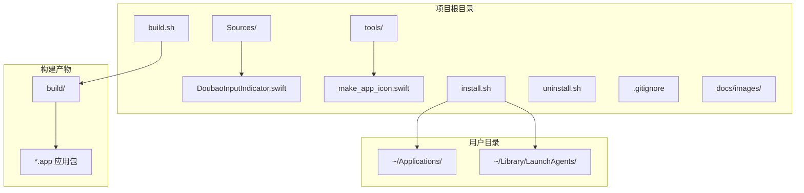
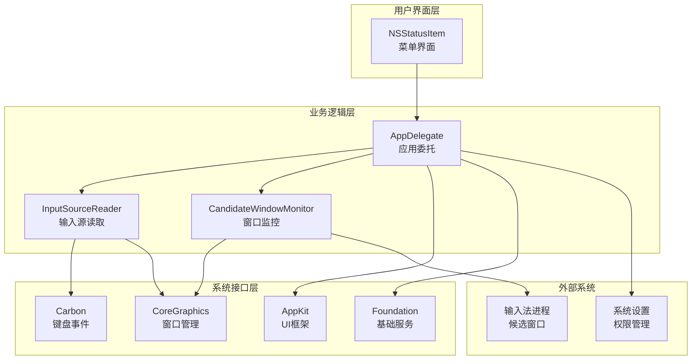
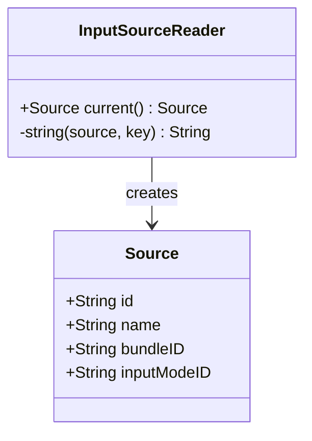
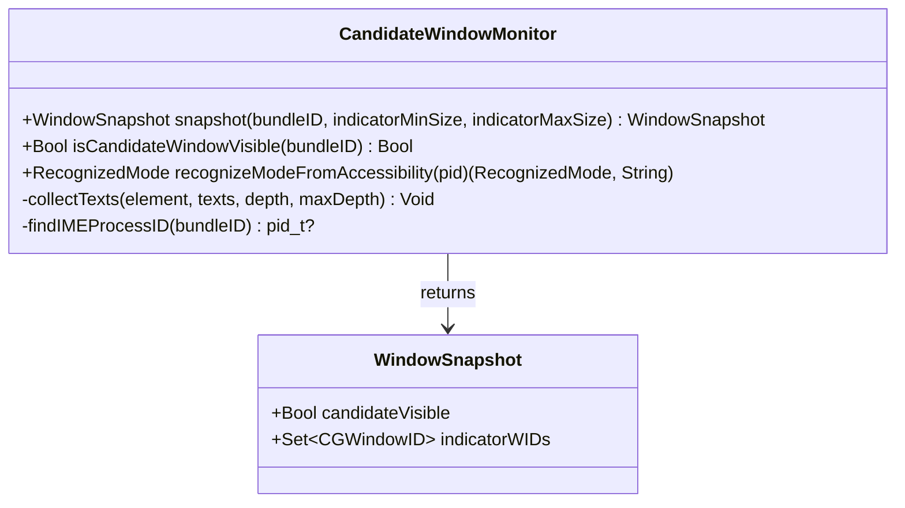
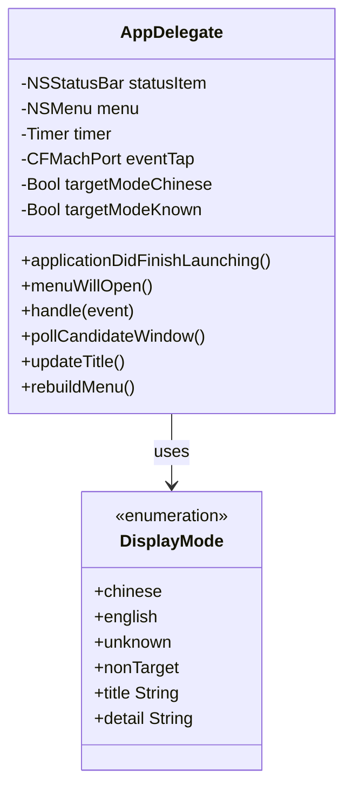
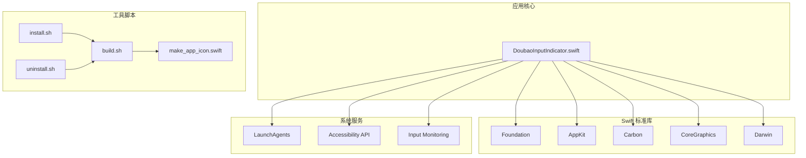
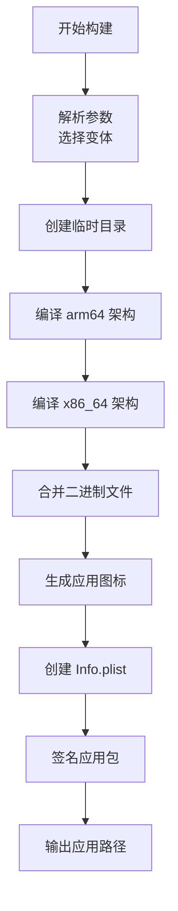
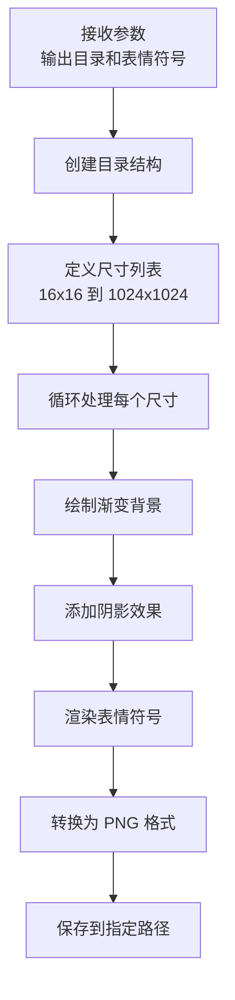
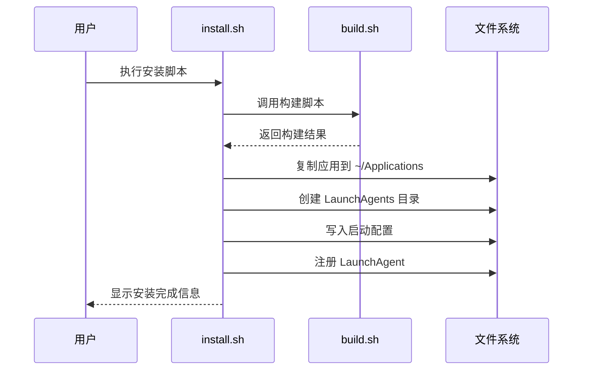
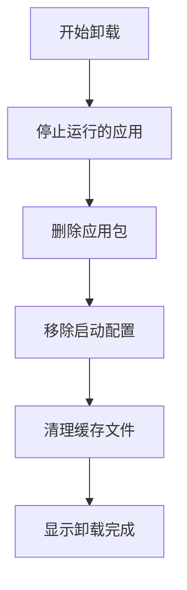

# 项目结构

<cite>
**本文档引用的文件**
- [DoubaoInputIndicator.swift](file://Sources/DoubaoInputIndicator.swift)
- [make_app_icon.swift](file://tools/make_app_icon.swift)
- [build.sh](file://build.sh)
- [install.sh](file://install.sh)
- [uninstall.sh](file://uninstall.sh)
</cite>

## 目录

1. [简介](#简介)
2. [项目结构概览](#项目结构概览)
3. [核心组件分析](#核心组件分析)
4. [架构设计](#架构设计)
5. [详细组件分析](#详细组件分析)
6. [依赖关系分析](#依赖关系分析)
7. [构建系统](#构建系统)
8. [安装与部署](#安装与部署)
9. [故障排除指南](#故障排除指南)
10. [总结](#总结)

## 简介

这是一个基于 Swift 开发的 macOS 输入法指示器应用，主要用于检测和显示中文输入法（豆包输入法和微信输入法）的当前输入模式。该应用通过监听系统事件、扫描输入法候选窗口和使用辅助功能 API 来准确判断当前的中英文输入状态，并在菜单栏中提供直观的状态显示。

## 项目结构概览

项目采用简洁的目录结构设计，主要包含以下核心目录和文件：

**图表来源**
- [build.sh:1-117](file://build.sh#L1-L117)
- [install.sh:1-60](file://install.sh#L1-L60)

**章节来源**
- [build.sh:1-117](file://build.sh#L1-L117)
- [install.sh:1-60](file://install.sh#L1-L60)
- [uninstall.sh:1-30](file://uninstall.sh#L1-L30)

## 核心组件分析

### DoubaoInputIndicator.swift - 主要功能模块

这是项目的核心文件，实现了完整的输入法状态检测和管理功能。该文件包含了多个关键组件：

#### 主要功能模块

1. **输入源读取器 (InputSourceReader)** - 负责获取当前选中的输入法信息
2. **候选窗口监控器 (CandidateWindowMonitor)** - 检测输入法候选窗口和模式指示器
3. **应用委托类 (AppDelegate)** - 管理应用生命周期和用户界面
4. **配置管理** - 支持豆包输入法和微信输入法两种变体

#### 核心特性

- **多输入法支持**：通过编译时宏区分豆包输入法和微信输入法
- **智能模式检测**：结合候选窗口检测和辅助功能 API
- **Shift 键同步**：通过 Shift 键切换中英文模式
- **自动校准**：基于候选窗口可见性自动判断输入模式
- **开机自启动**：支持 LaunchAgent 自动启动

**章节来源**
- [DoubaoInputIndicator.swift:1-1410](file://Sources/DoubaoInputIndicator.swift#L1-L1410)

## 架构设计

项目采用分层架构设计，清晰分离了不同职责的组件：

**图表来源**
- [DoubaoInputIndicator.swift:280-1410](file://Sources/DoubaoInputIndicator.swift#L280-L1410)

## 详细组件分析

### 输入源读取器 (InputSourceReader)

负责从系统获取当前选中的输入法信息，包括输入法 ID、名称、包标识符和输入模式 ID。

**图表来源**
- [DoubaoInputIndicator.swift:104-131](file://Sources/DoubaoInputIndicator.swift#L104-L131)

### 候选窗口监控器 (CandidateWindowMonitor)

监控输入法进程的候选窗口和模式指示器，用于检测中英文输入状态。

**图表来源**
- [DoubaoInputIndicator.swift:133-278](file://Sources/DoubaoInputIndicator.swift#L133-L278)

### 应用委托类 (AppDelegate)

应用的核心控制器，管理应用生命周期、用户界面和系统集成。

**图表来源**
- [DoubaoInputIndicator.swift:280-1410](file://Sources/DoubaoInputIndicator.swift#L280-L1410)

## 依赖关系分析

项目具有明确的依赖层次结构：

**图表来源**
- [DoubaoInputIndicator.swift:1-6](file://Sources/DoubaoInputIndicator.swift#L1-L6)
- [build.sh:44-65](file://build.sh#L44-L65)

**章节来源**
- [DoubaoInputIndicator.swift:1-1410](file://Sources/DoubaoInputIndicator.swift#L1-L1410)
- [build.sh:1-117](file://build.sh#L1-L117)

## 构建系统

### build.sh - 构建脚本

负责编译和打包应用，支持双架构（arm64 和 x86_64）构建：

**图表来源**
- [build.sh:44-75](file://build.sh#L44-L75)

### make_app_icon.swift - 图标生成工具

使用 Swift 编写的图标生成器，支持多种分辨率的图标生成：

**图表来源**
- [make_app_icon.swift:17-28](file://tools/make_app_icon.swift#L17-L28)
- [make_app_icon.swift:30-82](file://tools/make_app_icon.swift#L30-L82)

**章节来源**
- [build.sh:1-117](file://build.sh#L1-L117)
- [make_app_icon.swift:1-95](file://tools/make_app_icon.swift#L1-L95)

## 安装与部署

### install.sh - 安装脚本

提供完整的安装流程，包括构建、复制应用和配置启动项：

**图表来源**
- [install.sh:26-56](file://install.sh#L26-L56)

### uninstall.sh - 卸载脚本

提供安全的卸载流程，清理所有相关文件：

**图表来源**
- [uninstall.sh:24-27](file://uninstall.sh#L24-L27)

**章节来源**
- [install.sh:1-60](file://install.sh#L1-L60)
- [uninstall.sh:1-30](file://uninstall.sh#L1-L30)

## 故障排除指南

### 常见问题及解决方案

1. **权限问题**
   - 症状：菜单栏图标显示警告标志
   - 解决方案：通过菜单打开系统偏好设置，授予输入监控权限

2. **Shift 键切换无效**
   - 症状：按住 Shift 键无法切换中英文状态
   - 解决方案：检查输入监控权限是否已授予

3. **候选窗口检测失败**
   - 症状：自动校准功能不工作
   - 解决方案：启用辅助功能权限，允许应用访问 UI 元素

4. **开机自启动问题**
   - 症状：重启后应用不会自动启动
   - 解决方案：检查 LaunchAgents 配置是否正确

**章节来源**
- [DoubaoInputIndicator.swift:379-406](file://Sources/DoubaoInputIndicator.swift#L379-L406)
- [DoubaoInputIndicator.swift:1152-1155](file://Sources/DoubaoInputIndicator.swift#L1152-L1155)

## 总结

该项目展现了优秀的 macOS 应用开发实践，具有以下特点：

1. **模块化设计**：清晰的功能分离，便于维护和扩展
2. **跨输入法支持**：通过编译时配置支持多种输入法
3. **智能检测机制**：结合多种技术手段确保准确性
4. **完善的工具链**：提供完整的构建、安装和卸载工具
5. **良好的用户体验**：直观的界面和详细的错误处理

该架构为类似系统级工具的开发提供了优秀的参考模板，特别是在权限管理、系统集成和用户体验方面都有很好的实践。