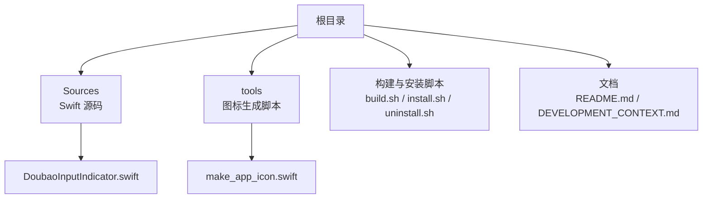
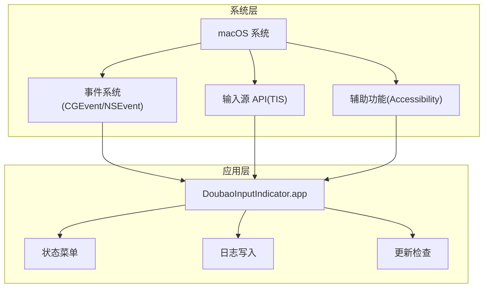
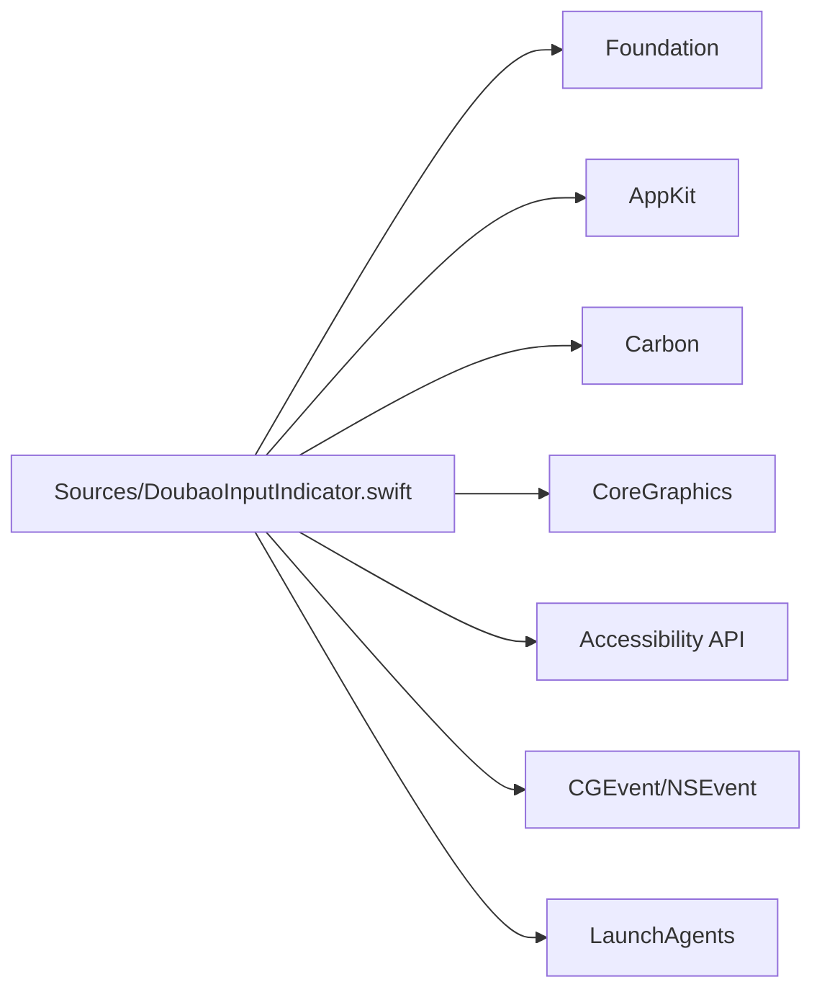

# 快速开始

<cite>
**本文引用的文件**
- [README.md](file://README.md)
- [DEVELOPMENT_CONTEXT.md](file://DEVELOPMENT_CONTEXT.md)
- [build.sh](file://build.sh)
- [install.sh](file://install.sh)
- [uninstall.sh](file://uninstall.sh)
- [Sources/DoubaoInputIndicator.swift](file://Sources/DoubaoInputIndicator.swift)
- [tools/make_app_icon.swift](file://tools/make_app_icon.swift)
</cite>

## 目录
1. [简介](#简介)
2. [项目结构](#项目结构)
3. [核心组件](#核心组件)
4. [架构总览](#架构总览)
5. [详细组件分析](#详细组件分析)
6. [依赖关系分析](#依赖关系分析)
7. [性能考虑](#性能考虑)
8. [故障排除指南](#故障排除指南)
9. [结论](#结论)
10. [附录](#附录)

## 简介
本指南面向首次使用“中文输入法指示器”的用户，覆盖从安装到首次启动、权限配置、基本使用与常见问题排查的完整流程。该应用为 macOS 菜单栏常驻指示器，支持“豆包输入法”和“微信输入法”，通过菜单栏图标直观显示当前输入法的中英文状态，并提供开机自启、手动校准、检查更新等能力。

## 项目结构
仓库采用“功能/脚本/源码”组织方式，核心文件如下：
- 安装与构建脚本：build.sh、install.sh、uninstall.sh
- 应用源码：Sources/DoubaoInputIndicator.swift（Swift 实现）
- 图标生成工具：tools/make_app_icon.swift
- 文档：README.md、DEVELOPMENT_CONTEXT.md

图表来源
- [build.sh:1-117](file://build.sh#L1-L117)
- [install.sh:1-60](file://install.sh#L1-L60)
- [uninstall.sh:1-30](file://uninstall.sh#L1-L30)
- [Sources/DoubaoInputIndicator.swift:1-1410](file://Sources/DoubaoInputIndicator.swift#L1-L1410)
- [tools/make_app_icon.swift:1-95](file://tools/make_app_icon.swift#L1-L95)

章节来源
- [README.md:1-155](file://README.md#L1-L155)
- [DEVELOPMENT_CONTEXT.md:1-322](file://DEVELOPMENT_CONTEXT.md#L1-L322)

## 核心组件
- 应用主体：菜单栏指示器，显示当前输入法中英文状态；提供菜单项用于校准、开机启动、检查更新、退出。
- 权限与事件监听：通过输入监控权限与全局事件监听，识别“独立 Shift 切换”手势，从而推断中英文状态。
- 自动校准：结合候选窗口可见性与模式指示器窗口（Accessibility API）进行自动校准。
- 开机自启：通过 LaunchAgent 实现开机自启，菜单项可切换开关。
- 日志与更新：记录运行日志至用户日志目录；检查 GitHub Releases 进行版本更新。

章节来源
- [Sources/DoubaoInputIndicator.swift:280-1410](file://Sources/DoubaoInputIndicator.swift#L280-L1410)
- [README.md:96-128](file://README.md#L96-L128)

## 架构总览
应用采用“菜单栏常驻 + 事件监听 + 自动校准”的轻量架构，核心交互如下：

图表来源
- [Sources/DoubaoInputIndicator.swift:104-1410](file://Sources/DoubaoInputIndicator.swift#L104-L1410)

## 详细组件分析

### 安装与卸载流程
- Homebrew 安装（推荐）
  - 添加 tap：brew tap jianzhoujz/tap
  - 安装对应 cask：doubao-input-indicator 或 wetype-input-indicator
  - 卸载：brew uninstall 对应 cask
- 手动安装
  - 从 GitHub Releases 下载对应 zip，解压后将 .app 拖入 ~/Applications 或 /Applications，然后启动
- 首次启动与开发者签名
  - 由于未使用 Apple Developer ID 签名，首次启动可能出现“无法验证开发者/应用已损坏/阻止打开”的提示；按提示在“隐私与安全性”中选择“仍要打开”，再次启动即可；若仍失败，可移除 quarantine 标记

章节来源
- [README.md:32-95](file://README.md#L32-L95)

### 权限配置步骤
- 输入监控权限
  - 若菜单显示“输入监控权限未完成”，请在“系统设置 -> 隐私与安全性 -> 输入监控”中启用对应应用（DoubaoInputIndicator.app 或 WeTypeInputIndicator.app），授权后退出并重启应用
- 微信输入法特殊设置
  - 使用微信输入法版本时，需在微信输入法设置中开启“使用 shift 切换中英文”

章节来源
- [README.md:114-136](file://README.md#L114-L136)
- [Sources/DoubaoInputIndicator.swift:379-406](file://Sources/DoubaoInputIndicator.swift#L379-L406)

### 首次启动设置
- 启动后应用出现在菜单栏，点击图标打开菜单
- 若状态显示“?”，表示中英文状态未知，可在菜单中选择“校准为中文/英文”
- 如检测到可能遗漏的 Shift 切换，也会显示“?”，请使用菜单项重新同步

章节来源
- [README.md:70-113](file://README.md#L70-L113)
- [Sources/DoubaoInputIndicator.swift:1042-1128](file://Sources/DoubaoInputIndicator.swift#L1042-L1128)

### 基本使用示例
- 打开菜单：点击菜单栏图标
- 校准状态：在菜单中选择“校准为中文”或“校准为英文”
- 开机启动：勾选菜单中的“开机启动”
- 检查更新：点击“检查更新...”，如发现新版本可直接跳转到 GitHub Releases 页面下载

章节来源
- [README.md:96-111](file://README.md#L96-L111)
- [Sources/DoubaoInputIndicator.swift:1174-1284](file://Sources/DoubaoInputIndicator.swift#L1174-L1284)

### 构建与安装脚本（开发者视角）
- build.sh：编译并打包应用，支持 doubao 与 wetype 两种变体，生成 Info.plist、图标等资源
- install.sh：构建并安装到 ~/Applications，同时写入 LaunchAgent 并通过 launchctl 加载
- uninstall.sh：卸载应用与 LaunchAgent

章节来源
- [build.sh:1-117](file://build.sh#L1-L117)
- [install.sh:1-60](file://install.sh#L1-L60)
- [uninstall.sh:1-30](file://uninstall.sh#L1-L30)

## 依赖关系分析
- 外部框架与系统服务
  - AppKit、Carbon、CoreGraphics：用于 UI、事件与图形处理
  - Foundation：基础数据结构与偏好存储
  - Accessibility API：读取 IME 模式指示器文本
  - CGEvent/NSEvent：全局键盘与鼠标事件监听
- 运行时依赖
  - 输入法进程（豆包/微信输入法）：用于候选窗口与模式指示器窗口检测
  - LaunchAgents：开机自启机制

图表来源
- [Sources/DoubaoInputIndicator.swift:1-6](file://Sources/DoubaoInputIndicator.swift#L1-L6)
- [Sources/DoubaoInputIndicator.swift:408-480](file://Sources/DoubaoInputIndicator.swift#L408-L480)

章节来源
- [Sources/DoubaoInputIndicator.swift:1-1410](file://Sources/DoubaoInputIndicator.swift#L1-L1410)

## 性能考虑
- 事件监听策略：同时使用 CGEvent tap 与 NSEvent 全局监听，避免重复处理同一事件；在 CGEvent tap 激活时，将 NSEvent 作为降级回退
- 自动校准节流：对候选窗口检测与 Shift 切换进行冷却时间控制，减少误判与资源消耗
- 日志写入：仅在必要时追加写入日志文件，避免频繁 I/O

章节来源
- [Sources/DoubaoInputIndicator.swift:408-480](file://Sources/DoubaoInputIndicator.swift#L408-L480)
- [Sources/DoubaoInputIndicator.swift:540-716](file://Sources/DoubaoInputIndicator.swift#L540-L716)
- [Sources/DoubaoInputIndicator.swift:1388-1404](file://Sources/DoubaoInputIndicator.swift#L1388-L1404)

## 故障排除指南
- 首次启动被阻止
  - 在“系统设置 -> 隐私与安全性”中选择“仍要打开”，再次启动
  - 若仍失败，移除 quarantine 标记（针对 ~/Applications 或 /Applications）
- 输入监控权限未完成
  - 在“系统设置 -> 隐私与安全性 -> 输入监控”中启用对应应用，授权后退出并重启
- 状态显示“?”或与实际不符
  - 使用菜单中的“校准为中文/英文”进行手动校准
  - 若处于启动瞬间或 Shift 按下到松开期间输入源发生变化，应用会标记状态未知，需手动校准
- 微信输入法无法切换
  - 在微信输入法设置中开启“使用 shift 切换中英文”
- 开机启动无效
  - 在菜单中勾选“开机启动”，若已勾选则取消后再重新勾选，触发 LaunchAgent 重载

章节来源
- [README.md:70-136](file://README.md#L70-L136)
- [Sources/DoubaoInputIndicator.swift:1042-1128](file://Sources/DoubaoInputIndicator.swift#L1042-L1128)
- [Sources/DoubaoInputIndicator.swift:1297-1337](file://Sources/DoubaoInputIndicator.swift#L1297-L1337)

## 结论
本指南提供了从安装到首次使用的完整路径，涵盖 Homebrew 与手动安装、权限配置、首次启动设置与基本使用示例，并总结了常见问题与解决方案。建议在首次使用前完成输入监控权限授权与必要的输入法设置，以获得最佳体验。

## 附录
- 系统要求：macOS 12.0+，支持 Intel 与 Apple Silicon
- 反馈与问题：欢迎在 GitHub Issues 提交反馈

章节来源
- [README.md:139-147](file://README.md#L139-L147)