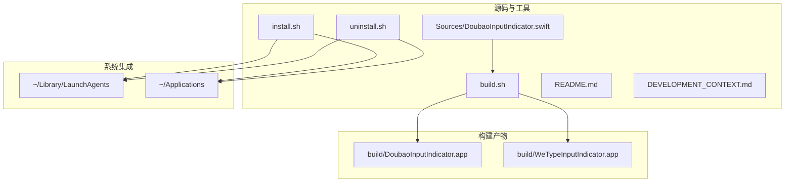
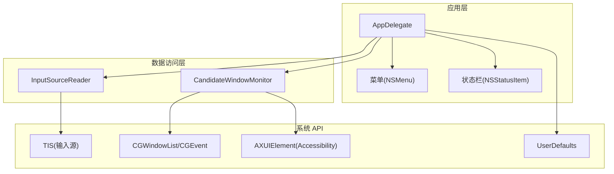
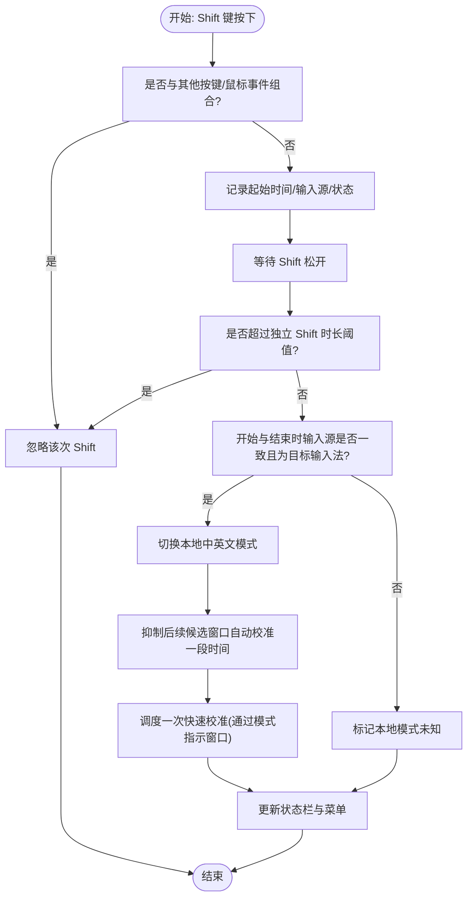
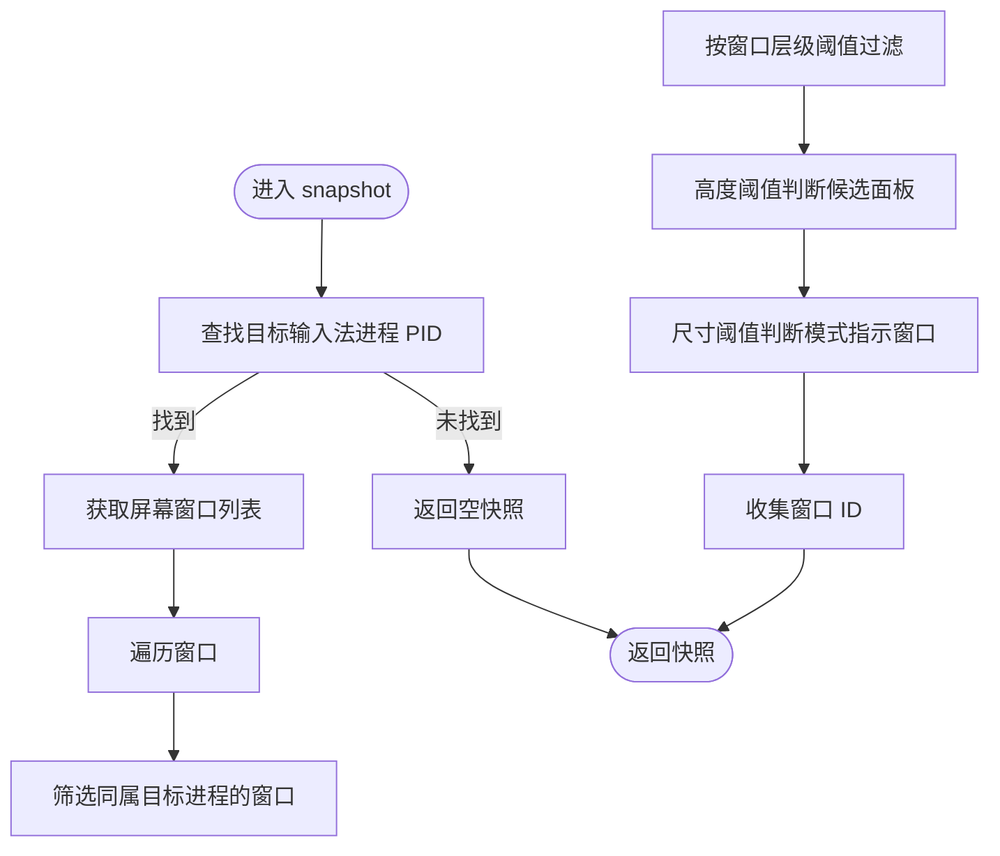
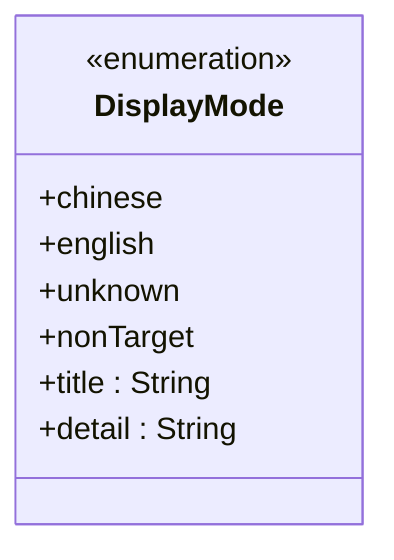
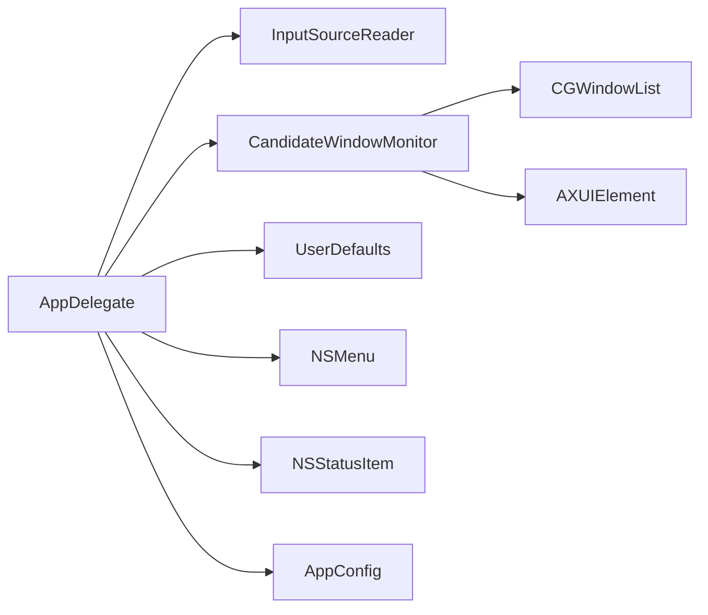

# 技术架构

<cite>
**本文档引用的文件**
- [DoubaoInputIndicator.swift](file://Sources/DoubaoInputIndicator.swift)
- [build.sh](file://build.sh)
- [install.sh](file://install.sh)
- [uninstall.sh](file://uninstall.sh)
- [README.md](file://README.md)
- [DEVELOPMENT_CONTEXT.md](file://DEVELOPMENT_CONTEXT.md)
- [Info.plist](file://build/DoubaoInputIndicator.app/Contents/Info.plist)
</cite>

## 目录
1. [引言](#引言)
2. [项目结构](#项目结构)
3. [核心组件](#核心组件)
4. [架构总览](#架构总览)
5. [详细组件分析](#详细组件分析)
6. [依赖关系分析](#依赖关系分析)
7. [性能考量](#性能考量)
8. [故障排查指南](#故障排查指南)
9. [结论](#结论)
10. [附录](#附录)

## 引言
本项目是一个运行于 macOS 的菜单栏状态指示器，用于显示当前输入法的中英文模式（中文/英文/未知/非目标输入法）。其核心目标是在第三方输入法（如豆包输入法、微信输入法）无法通过系统 UI 显示内部中英文状态时，提供一个稳定、直观的本地状态指示与切换能力。应用采用轻量级设计，无 Dock 图标与主窗口，仅以菜单栏图标呈现状态，并通过多种数据采集与判定策略确保状态准确性。

## 项目结构
项目采用“单一源码 + 多变体构建”的组织方式：
- 源码集中于一个 Swift 文件，通过编译宏区分不同输入法变体。
- 构建脚本负责跨架构编译、打包、签名与安装。
- 安装/卸载脚本负责将应用安装至用户目录并管理登录启动代理。

图表来源
- [DoubaoInputIndicator.swift:1-1410](file://Sources/DoubaoInputIndicator.swift#L1-L1410)
- [build.sh:1-117](file://build.sh#L1-L117)
- [install.sh:1-60](file://install.sh#L1-L60)
- [uninstall.sh:1-30](file://uninstall.sh#L1-L30)

章节来源
- [DoubaoInputIndicator.swift:1-1410](file://Sources/DoubaoInputIndicator.swift#L1-L1410)
- [build.sh:1-117](file://build.sh#L1-L117)
- [install.sh:1-60](file://install.sh#L1-L60)
- [uninstall.sh:1-30](file://uninstall.sh#L1-L30)
- [README.md:1-155](file://README.md#L1-L155)
- [DEVELOPMENT_CONTEXT.md:1-322](file://DEVELOPMENT_CONTEXT.md#L1-L322)

## 核心组件
- AppDelegate：应用主控制器，负责生命周期、菜单构建、权限请求、事件监听、状态计算与 UI 更新。
- InputSourceReader：输入源读取器，封装 TIS API 获取当前输入法的标识与模式。
- CandidateWindowMonitor：候选窗口监测器，基于 CGWindowList 与 Accessibility API 检测候选面板与模式指示窗口。
- DisplayMode：状态枚举，定义四种显示模式及其标题与详情文本。
- AppConfig：配置对象，按变体存储应用名、显示名、目标输入法 Bundle ID、偏好键、日志文件名等。

章节来源
- [DoubaoInputIndicator.swift:7-102](file://Sources/DoubaoInputIndicator.swift#L7-L102)
- [DoubaoInputIndicator.swift:104-131](file://Sources/DoubaoInputIndicator.swift#L104-L131)
- [DoubaoInputIndicator.swift:133-278](file://Sources/DoubaoInputIndicator.swift#L133-L278)
- [DoubaoInputIndicator.swift:280-1410](file://Sources/DoubaoInputIndicator.swift#L280-L1410)

## 架构总览
应用采用“主控制器 + 数据访问层 + 表示层”的分层架构：
- 主控制器（AppDelegate）协调各子系统，维护状态机与 UI。
- 数据访问层（InputSourceReader、CandidateWindowMonitor）负责从系统 API 读取输入法状态与候选窗口信息。
- 表示层（DisplayMode、菜单与状态栏按钮）负责将状态以图标与文本形式呈现给用户。

图表来源
- [DoubaoInputIndicator.swift:104-131](file://Sources/DoubaoInputIndicator.swift#L104-L131)
- [DoubaoInputIndicator.swift:133-278](file://Sources/DoubaoInputIndicator.swift#L133-L278)
- [DoubaoInputIndicator.swift:280-1410](file://Sources/DoubaoInputIndicator.swift#L280-L1410)

## 详细组件分析

### AppDelegate：主控制器
职责与控制流
- 生命周期：应用启动时设置激活策略、初始化状态栏、构建菜单、刷新输入源、请求权限、安装事件监听与全局监控。
- 事件处理：同时监听 Core Graphics 事件与 NSEvent 全局事件，去重与过滤，识别独立 Shift 按键组合，触发状态切换或校准。
- 状态机：维护目标输入法选择状态、本地中英文模式状态（已知/未知）、权限状态、候选窗口可见性等。
- UI 更新：定时刷新输入源与候选窗口，动态更新状态栏图标与菜单项。

关键流程图（Shift 切换）

图表来源
- [DoubaoInputIndicator.swift:866-991](file://Sources/DoubaoInputIndicator.swift#L866-L991)

章节来源
- [DoubaoInputIndicator.swift:280-1410](file://Sources/DoubaoInputIndicator.swift#L280-L1410)

### InputSourceReader：输入源读取器
职责与实现要点
- 封装 TIS API，读取当前输入法的唯一标识、本地化名称、Bundle ID、输入模式 ID。
- 提供静态方法返回当前输入源，便于上层判断是否为目标输入法。

复杂度与性能
- 单次调用为 O(1)，频繁轮询（每 0.3 秒）对 CPU 开销极低。
- 通过比较 id、bundleID、inputModeID 判断变化，避免重复 UI 更新。

章节来源
- [DoubaoInputIndicator.swift:104-131](file://Sources/DoubaoInputIndicator.swift#L104-L131)

### CandidateWindowMonitor：候选窗口监测器
职责与实现要点
- 基于 CGWindowList 过滤目标输入法进程的窗口，识别候选面板与模式指示窗口。
- 使用 Accessibility API（AXUIElement）递归遍历 UI 元素，提取文本内容以识别“中/英”模式。
- 提供快照与可见性检测接口，支持自动校准逻辑。

算法流程（候选窗口快照）

图表来源
- [DoubaoInputIndicator.swift:133-212](file://Sources/DoubaoInputIndicator.swift#L133-L212)

章节来源
- [DoubaoInputIndicator.swift:133-278](file://Sources/DoubaoInputIndicator.swift#L133-L278)

### DisplayMode：状态表示层
职责与实现要点
- 定义四种显示模式：中文、英文、未知、非目标输入法。
- 提供标题与详情文本，用于状态栏图标与菜单展示。
- 与 AppDelegate 的 displayMode 计算逻辑配合，决定最终 UI 展示。

类图

图表来源
- [DoubaoInputIndicator.swift:7-38](file://Sources/DoubaoInputIndicator.swift#L7-L38)

章节来源
- [DoubaoInputIndicator.swift:7-38](file://Sources/DoubaoInputIndicator.swift#L7-L38)
- [DoubaoInputIndicator.swift:845-854](file://Sources/DoubaoInputIndicator.swift#L845-L854)

### 设计模式应用
- 观察者模式：AppDelegate 通过 CGEvent.tapCreate 与 NSEvent.addGlobalMonitorForEvents 订阅系统事件；当事件到达时回调处理，实现事件驱动的状态更新。
- 策略模式：候选窗口校准策略由多条路径组成（模式指示窗口识别、候选面板可见性、按键数量统计），在 AppDelegate 中根据条件选择最优策略。
- 状态模式：DisplayMode 与本地模式状态（已知/未知）共同构成状态机，根据输入法选择与事件流动态转换状态，UI 随之更新。

章节来源
- [DoubaoInputIndicator.swift:280-1410](file://Sources/DoubaoInputIndicator.swift#L280-L1410)

## 依赖关系分析
模块间依赖
- AppDelegate 依赖 InputSourceReader 与 CandidateWindowMonitor 获取数据，依赖 UserDefaults 存储本地模式状态，依赖 NSMenu/NSStatusItem 更新 UI。
- CandidateWindowMonitor 依赖 CGWindowList 与 AXUIElement，间接依赖目标输入法进程。
- AppConfig 为配置中心，被 AppDelegate 与构建脚本共享。

图表来源
- [DoubaoInputIndicator.swift:104-131](file://Sources/DoubaoInputIndicator.swift#L104-L131)
- [DoubaoInputIndicator.swift:133-278](file://Sources/DoubaoInputIndicator.swift#L133-L278)
- [DoubaoInputIndicator.swift:280-1410](file://Sources/DoubaoInputIndicator.swift#L280-L1410)

章节来源
- [DoubaoInputIndicator.swift:104-131](file://Sources/DoubaoInputIndicator.swift#L104-L131)
- [DoubaoInputIndicator.swift:133-278](file://Sources/DoubaoInputIndicator.swift#L133-L278)
- [DoubaoInputIndicator.swift:280-1410](file://Sources/DoubaoInputIndicator.swift#L280-L1410)

## 性能考量
- 事件监听去重：同一物理按键在 CGEvent 与 NSEvent 两条流中均会触发，通过时间窗（约 20ms）去重，避免重复处理。
- 轮询频率：主定时器每 0.3 秒刷新一次输入源与候选窗口，兼顾实时性与资源消耗。
- 自动校准冷却：切换模式后短暂抑制候选窗口自动校准，减少误判。
- 权限检测：输入监控权限不可用时，状态栏显示警告，菜单提供引导，避免无效尝试。
- 构建优化：使用 Swift 编译优化参数与 lipo 合并多架构二进制，减小体积与加载时间。

章节来源
- [DoubaoInputIndicator.swift:622-716](file://Sources/DoubaoInputIndicator.swift#L622-L716)
- [DoubaoInputIndicator.swift:358-361](file://Sources/DoubaoInputIndicator.swift#L358-L361)
- [DoubaoInputIndicator.swift:972-979](file://Sources/DoubaoInputIndicator.swift#L972-L979)
- [build.sh:48-64](file://build.sh#L48-L64)

## 故障排查指南
常见问题与定位
- 输入监控权限未授予：状态栏显示警告，菜单提供“打开输入监控授权…”入口；可通过系统设置页面手动授权。
- Shift 切换无效：检查是否在目标输入法上执行独立 Shift；若在启动瞬间或长时间按住 Shift，会被忽略；必要时使用菜单进行手动校准。
- 状态与实际不符：使用菜单中的“校准为中文/英文”进行强制校准。
- 候选窗口识别失败：若 Accessibility 权限不足，可降级依赖候选面板可见性；建议授予 Accessibility 权限以提升识别准确率。
- 登录启动异常：检查 LaunchAgent 是否存在与已启用；可通过菜单开关或脚本重新安装。

章节来源
- [DoubaoInputIndicator.swift:1042-1128](file://Sources/DoubaoInputIndicator.swift#L1042-L1128)
- [DoubaoInputIndicator.swift:1174-1240](file://Sources/DoubaoInputIndicator.swift#L1174-L1240)
- [DEVELOPMENT_CONTEXT.md:101-122](file://DEVELOPMENT_CONTEXT.md#L101-L122)

## 结论
本项目通过清晰的分层架构与多种数据采集策略，实现了对第三方输入法中英文状态的可靠指示与切换。AppDelegate 作为主控制器，协调输入源读取、候选窗口监测与 UI 更新；InputSourceReader 与 CandidateWindowMonitor 提供稳健的数据访问；DisplayMode 与本地状态共同构成稳定的表示层。在 macOS 权限与系统 API 的约束下，通过观察者、策略与状态等设计模式，实现了低耦合、高可维护性的轻量级菜单栏应用。

## 附录
- 系统 API 使用概览
  - TIS：读取当前输入法源与模式。
  - CGWindowList/CGEvent：扫描窗口与监听键盘/鼠标事件。
  - AXUIElement：读取 UI 文本以识别模式指示。
  - UserDefaults：持久化本地模式状态。
- 构建与安装
  - 构建脚本支持双架构编译与打包，生成 Info.plist 并进行签名。
  - 安装脚本将应用复制到用户 Applications 目录并写入 LaunchAgent，实现开机自启。
  - 卸载脚本移除应用与 LaunchAgent。

章节来源
- [build.sh:1-117](file://build.sh#L1-L117)
- [install.sh:1-60](file://install.sh#L1-L60)
- [uninstall.sh:1-30](file://uninstall.sh#L1-L30)
- [Info.plist:1-35](file://build/DoubaoInputIndicator.app/Contents/Info.plist#L1-L35)