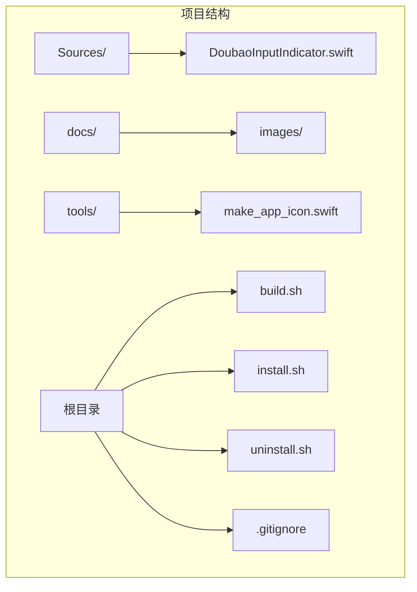
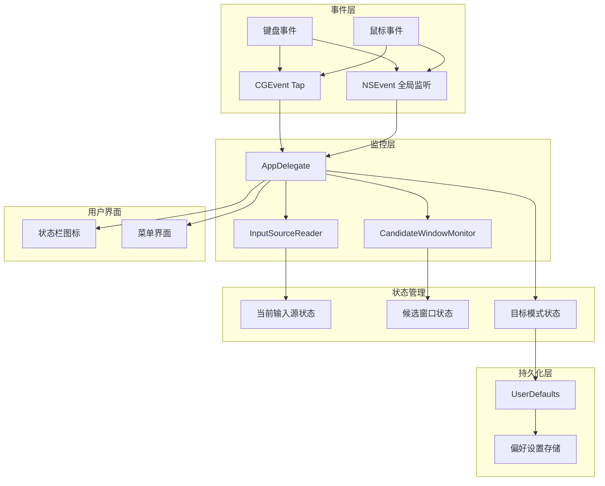
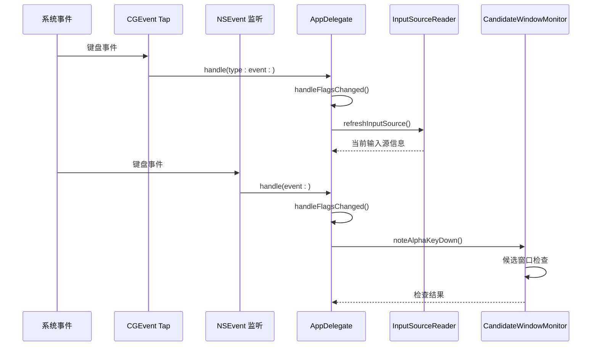
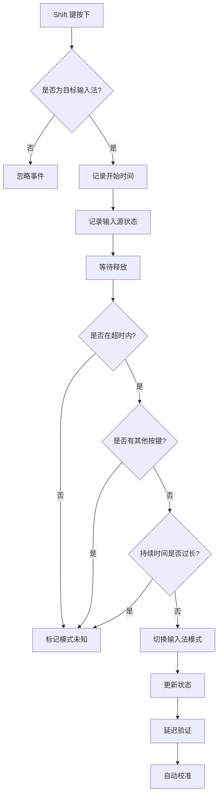
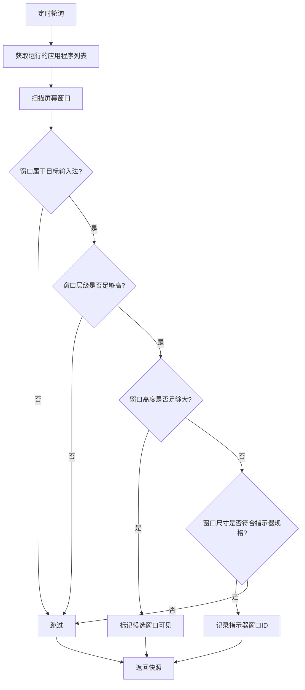
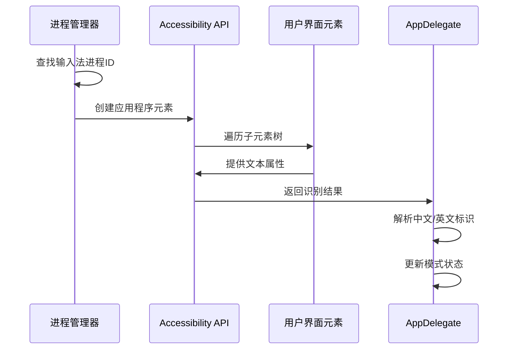
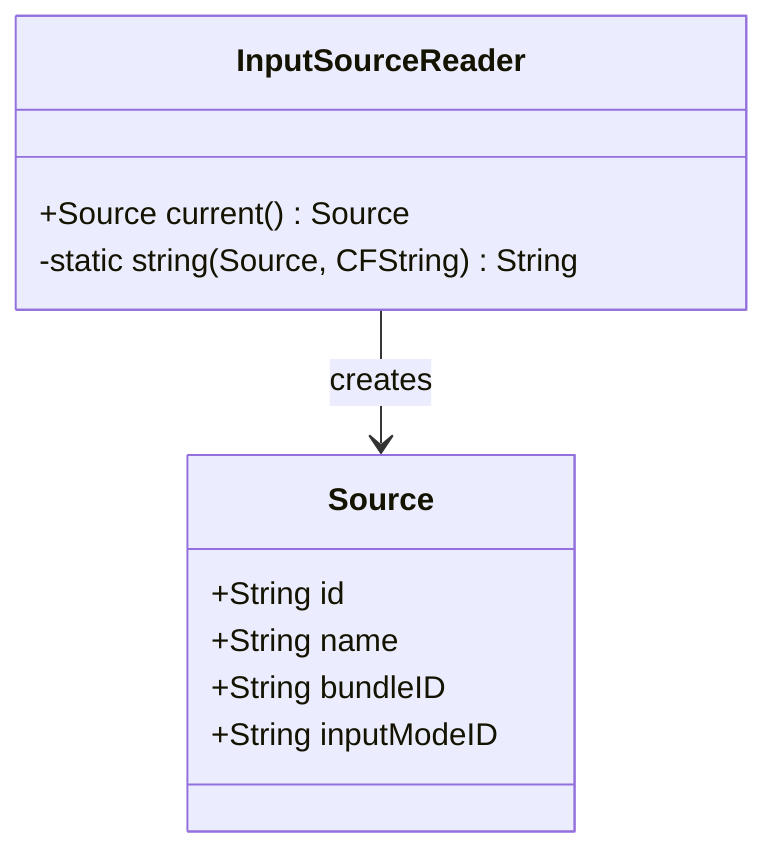
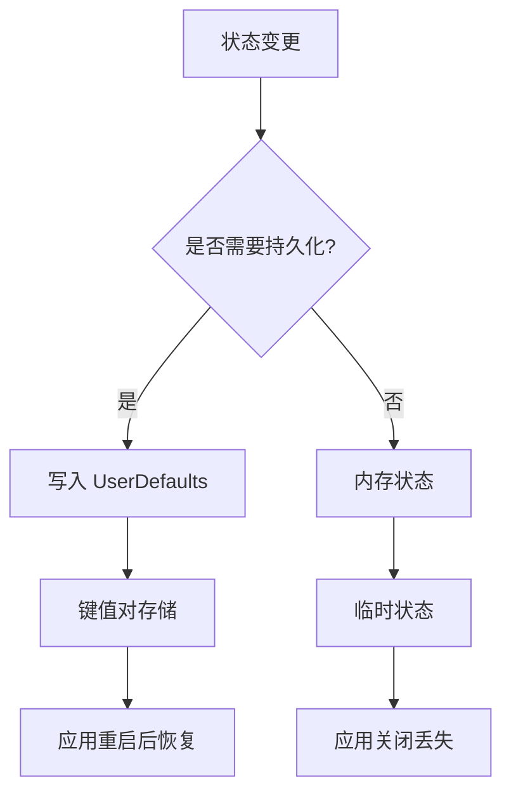
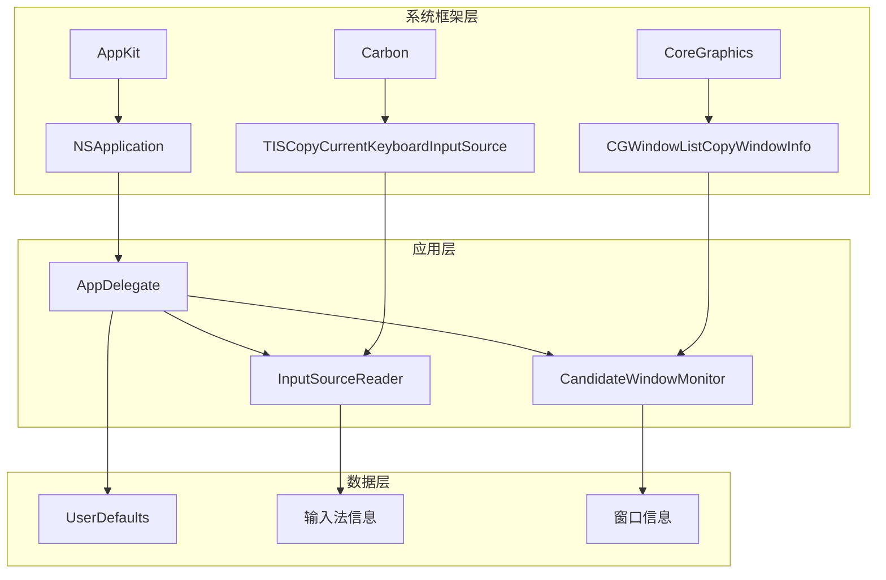

# 数据流

<cite>
**本文档引用的文件**
- [DoubaoInputIndicator.swift](file://Sources/DoubaoInputIndicator.swift)
</cite>

## 目录
1. [简介](#简介)
2. [项目结构](#项目结构)
3. [核心组件](#核心组件)
4. [架构概览](#架构概览)
5. [详细组件分析](#详细组件分析)
6. [依赖关系分析](#依赖关系分析)
7. [性能考虑](#性能考虑)
8. [故障排除指南](#故障排除指南)
9. [结论](#结论)

## 简介

这是一个基于 macOS 的输入法指示器应用程序，用于监控和显示中文/英文输入法状态。该应用通过多种技术手段实现准确的输入法状态检测，包括键盘事件捕获、Shift 键跟踪、候选窗口检测和状态确认机制。

## 项目结构

该项目采用简洁的单文件架构设计，所有功能都集中在单一的 Swift 源文件中：

**图表来源**
- [DoubaoInputIndicator.swift:1-50](file://Sources/DoubaoInputIndicator.swift#L1-L50)

**章节来源**
- [DoubaoInputIndicator.swift:1-50](file://Sources/DoubaoInputIndicator.swift#L1-L50)

## 核心组件

应用的核心由三个主要组件构成：

### 1. InputSourceReader（输入源读取器）
负责从系统获取当前输入法信息，包括输入法 ID、名称、Bundle ID 和输入模式 ID。

### 2. CandidateWindowMonitor（候选窗口监控器）
通过窗口扫描和 Accessibility API 监控输入法候选窗口和状态指示器。

### 3. AppDelegate（应用委托）
协调所有事件处理、状态管理和用户界面更新。

**章节来源**
- [DoubaoInputIndicator.swift:104-131](file://Sources/DoubaoInputIndicator.swift#L104-L131)
- [DoubaoInputIndicator.swift:133-278](file://Sources/DoubaoInputIndicator.swift#L133-L278)
- [DoubaoInputIndicator.swift:280-400](file://Sources/DoubaoInputIndicator.swift#L280-L400)

## 架构概览

应用采用事件驱动的架构模式，通过多个监听器和监控器协同工作：

**图表来源**
- [DoubaoInputIndicator.swift:408-480](file://Sources/DoubaoInputIndicator.swift#L408-L480)
- [DoubaoInputIndicator.swift:104-131](file://Sources/DoubaoInputIndicator.swift#L104-L131)
- [DoubaoInputIndicator.swift:133-278](file://Sources/DoubaoInputIndicator.swift#L133-L278)

## 详细组件分析

### Keyboard Event Capture（键盘事件捕获）

应用实现了双重事件捕获机制来确保可靠的状态检测：

**图表来源**
- [DoubaoInputIndicator.swift:408-480](file://Sources/DoubaoInputIndicator.swift#L408-L480)
- [DoubaoInputIndicator.swift:482-538](file://Sources/DoubaoInputIndicator.swift#L482-L538)
- [DoubaoInputIndicator.swift:104-131](file://Sources/DoubaoInputIndicator.swift#L104-L131)

#### Shift Key Tracking（Shift 键跟踪）

应用实现了复杂的 Shift 键状态跟踪机制：

**图表来源**
- [DoubaoInputIndicator.swift:866-980](file://Sources/DoubaoInputIndicator.swift#L866-L980)
- [DoubaoInputIndicator.swift:985-991](file://Sources/DoubaoInputIndicator.swift#L985-L991)

**章节来源**
- [DoubaoInputIndicator.swift:749-774](file://Sources/DoubaoInputIndicator.swift#L749-L774)
- [DoubaoInputIndicator.swift:866-980](file://Sources/DoubaoInputIndicator.swift#L866-L980)

### Candidate Window Detection（候选窗口检测）

应用通过两种方式检测候选窗口状态：

#### 候选窗口扫描

**图表来源**
- [DoubaoInputIndicator.swift:165-212](file://Sources/DoubaoInputIndicator.swift#L165-L212)
- [DoubaoInputIndicator.swift:544-620](file://Sources/DoubaoInputIndicator.swift#L544-L620)

#### Accessibility API 模式识别

**图表来源**
- [DoubaoInputIndicator.swift:233-277](file://Sources/DoubaoInputIndicator.swift#L233-L277)
- [DoubaoInputIndicator.swift:568-600](file://Sources/DoubaoInputIndicator.swift#L568-L600)

**章节来源**
- [DoubaoInputIndicator.swift:133-278](file://Sources/DoubaoInputIndicator.swift#L133-L278)
- [DoubaoInputIndicator.swift:544-620](file://Sources/DoubaoInputIndicator.swift#L544-L620)

### InputSourceReader Implementation（输入源读取器实现）

InputSourceReader 使用 Carbon 输入法服务 API 获取实时输入法信息：

**图表来源**
- [DoubaoInputIndicator.swift:104-131](file://Sources/DoubaoInputIndicator.swift#L104-L131)

**章节来源**
- [DoubaoInputIndicator.swift:104-131](file://Sources/DoubaoInputIndicator.swift#L104-L131)

### Data Storage Mechanism（数据存储机制）

应用使用 UserDefaults 实现状态持久化：

**图表来源**
- [DoubaoInputIndicator.swift:291-292](file://Sources/DoubaoInputIndicator.swift#L291-L292)
- [DoubaoInputIndicator.swift:575](file://Sources/DoubaoInputIndicator.swift#L575)
- [DoubaoInputIndicator.swift:694](file://Sources/DoubaoInputIndicator.swift#L694)

**章节来源**
- [DoubaoInputIndicator.swift:291-292](file://Sources/DoubaoInputIndicator.swift#L291-L292)
- [DoubaoInputIndicator.swift:575](file://Sources/DoubaoInputIndicator.swift#L575)
- [DoubaoInputIndicator.swift:694](file://Sources/DoubaoInputIndicator.swift#L694)

## 依赖关系分析

应用的依赖关系呈现清晰的分层结构：

**图表来源**
- [DoubaoInputIndicator.swift:1-6](file://Sources/DoubaoInputIndicator.swift#L1-L6)
- [DoubaoInputIndicator.swift:104-131](file://Sources/DoubaoInputIndicator.swift#L104-L131)
- [DoubaoInputIndicator.swift:133-278](file://Sources/DoubaoInputIndicator.swift#L133-L278)

**章节来源**
- [DoubaoInputIndicator.swift:1-6](file://Sources/DoubaoInputIndicator.swift#L1-L6)
- [DoubaoInputIndicator.swift:104-131](file://Sources/DoubaoInputIndicator.swift#L104-L131)

## 性能考虑

应用在性能优化方面采用了多项策略：

### 事件去重机制
- 通过 20ms 内的重复事件检测避免同一物理按键的重复处理
- 使用 `lastAlphaKeyNoteAt` 时间戳进行事件去重

### 轮询优化
- 主定时器间隔为 0.3 秒，平衡准确性与性能
- 自动校准冷却时间为 2 秒，避免频繁检查

### 内存管理
- 使用弱引用避免循环引用
- 及时清理定时器和监听器

### 权限检查
- 动态检查输入监控权限，避免不必要的系统调用

## 故障排除指南

### 常见问题及解决方案

#### Shift 键同步失效
**症状**: Shift 键点击不触发模式切换
**原因**: 缺少输入监控权限或事件监听器禁用
**解决方法**:
1. 检查系统偏好设置中的输入监控权限
2. 重新启动应用或手动触发权限检查
3. 确认事件监听器状态正常

#### 候选窗口检测失败
**症状**: 应用无法正确识别输入法状态
**原因**: Accessibility 权限缺失或窗口扫描失败
**解决方法**:
1. 授权 Accessibility 权限
2. 检查输入法进程是否正常运行
3. 验证窗口层级和尺寸阈值设置

#### 状态持久化问题
**症状**: 应用重启后状态丢失
**原因**: UserDefaults 访问权限问题
**解决方法**:
1. 检查应用沙盒权限
2. 验证键名配置正确性
3. 确认偏好设置目录可访问

**章节来源**
- [DoubaoInputIndicator.swift:389-406](file://Sources/DoubaoInputIndicator.swift#L389-L406)
- [DoubaoInputIndicator.swift:733-747](file://Sources/DoubaoInputIndicator.swift#L733-L747)

## 结论

该输入指示器应用通过精心设计的数据流架构实现了可靠的输入法状态监控。其核心优势包括：

1. **多层检测机制**: 结合事件监听、窗口扫描和 Accessibility API 提供冗余检测
2. **智能去重算法**: 有效避免重复事件处理和误判
3. **灵活的校准策略**: 支持自动和手动模式校准
4. **完善的错误处理**: 提供详细的日志记录和故障诊断能力

该架构为类似输入法监控应用提供了优秀的参考模型，展示了如何在保证准确性的同时优化性能和用户体验。