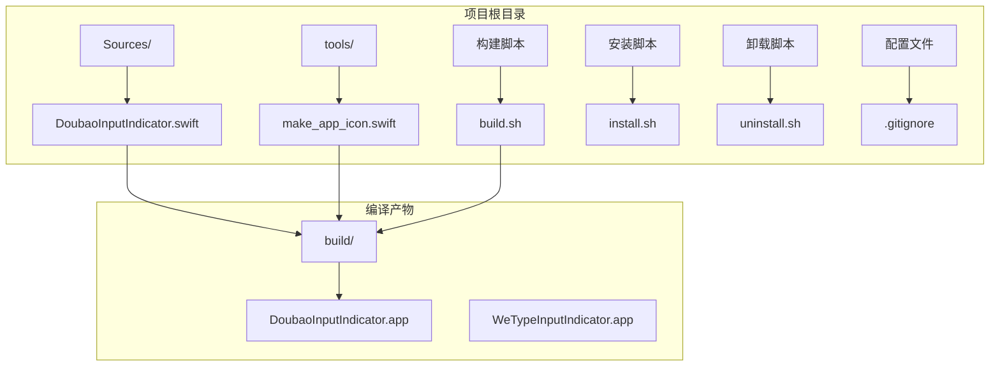
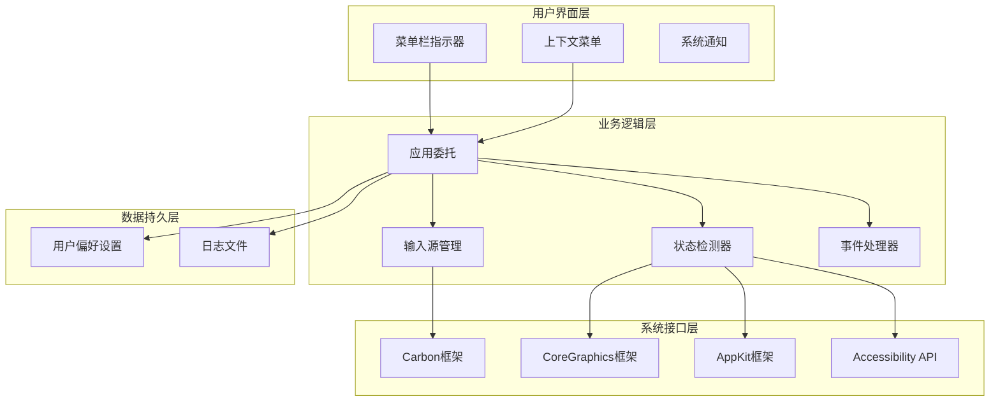
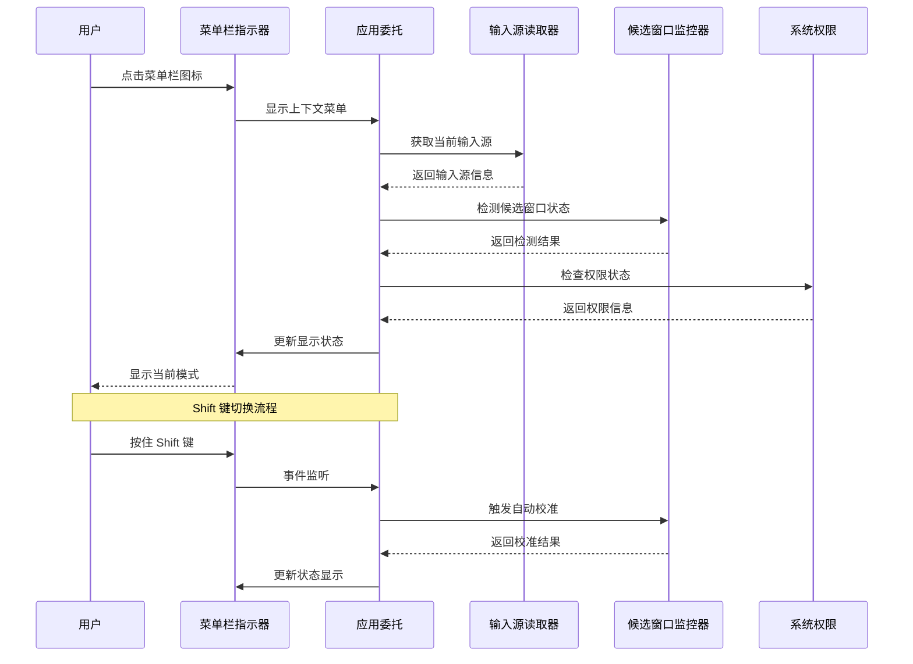
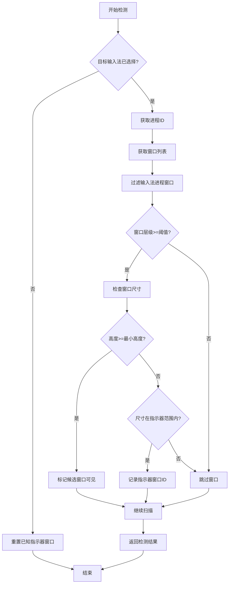
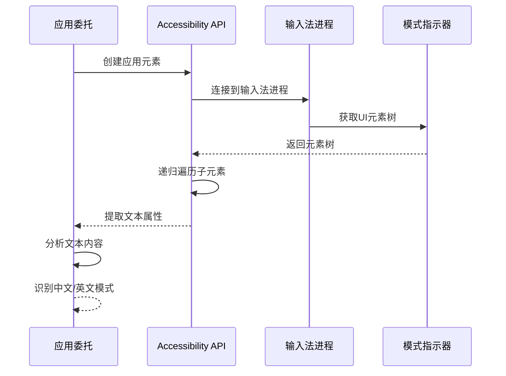
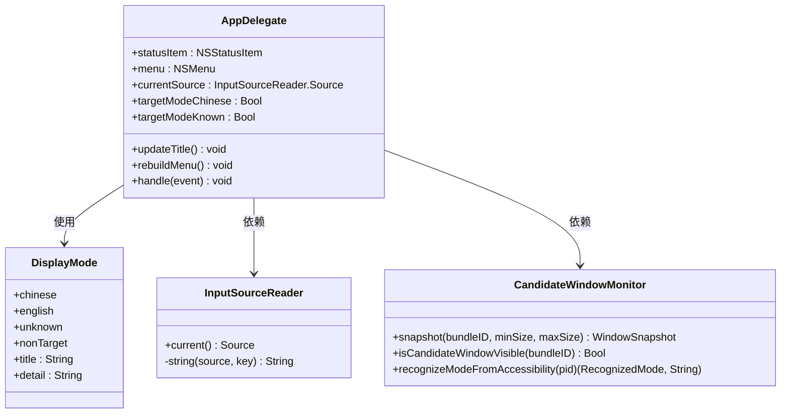
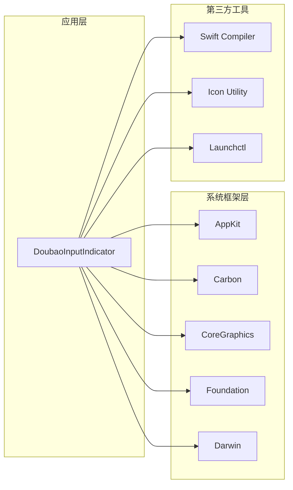

# 整体设计

<cite>
**本文档引用的文件**
- [DoubaoInputIndicator.swift](file://Sources/DoubaoInputIndicator.swift)
- [build.sh](file://build.sh)
- [install.sh](file://install.sh)
- [uninstall.sh](file://uninstall.sh)
- [make_app_icon.swift](file://tools/make_app_icon.swift)
</cite>

## 目录
1. [简介](#简介)
2. [项目结构](#项目结构)
3. [核心组件](#核心组件)
4. [架构概览](#架构概览)
5. [详细组件分析](#详细组件分析)
6. [依赖关系分析](#依赖关系分析)
7. [性能考虑](#性能考虑)
8. [故障排除指南](#故障排除指南)
9. [结论](#结论)

## 简介

这是一个基于 macOS 的输入法状态指示器应用，专门为豆包输入法和微信输入法设计。该应用采用单文件架构，将所有功能集成在一个 Swift 源文件中，实现了轻量级、高可靠性的输入法状态监控和显示功能。

应用的核心功能包括：
- 实时监控输入法状态（中文/英文）
- 通过菜单栏指示器显示当前输入法模式
- 支持 Shift 键切换输入法模式
- 多种检测机制确保状态准确性
- 自动化安装和卸载管理

## 项目结构

该项目采用了极简的单文件架构设计，所有功能都集中在单一的 Swift 源文件中：



**图表来源**
- [DoubaoInputIndicator.swift:1-50](file://Sources/DoubaoInputIndicator.swift#L1-L50)
- [build.sh:1-30](file://build.sh#L1-L30)

**章节来源**
- [DoubaoInputIndicator.swift:1-100](file://Sources/DoubaoInputIndicator.swift#L1-L100)
- [build.sh:1-20](file://build.sh#L1-L20)

## 核心组件

应用采用模块化设计，主要包含以下核心组件：

### 1. 显示模式枚举
定义了四种输入法状态显示模式：
- 中文模式：🇨🇳 + "中文"
- 英文模式：🇺🇸 + "英文"  
- 未知模式：? + "未知"
- 非目标输入法：🤐 + "非目标输入法"

### 2. 应用配置结构
封装了针对不同输入法的配置信息：
- 应用名称和显示名称
- 目标输入法 Bundle ID
- Launch Agent ID
- 模式状态存储键
- 日志文件名

### 3. 输入源读取器
负责从系统获取当前输入法信息：
- 获取当前键盘输入源
- 提取输入源 ID、名称、Bundle ID 和输入模式 ID

### 4. 候选窗口监控器
实现多层检测机制：
- 候选窗口可见性检测
- 模式指示器窗口识别
- Accessibility API 文本读取

### 5. 应用委托类
主控制器，协调各个组件工作：
- 菜单栏指示器管理
- 事件监听和处理
- 自动校准逻辑
- 用户界面更新

**章节来源**
- [DoubaoInputIndicator.swift:7-38](file://Sources/DoubaoInputIndicator.swift#L7-L38)
- [DoubaoInputIndicator.swift:40-47](file://Sources/DoubaoInputIndicator.swift#L40-L47)
- [DoubaoInputIndicator.swift:104-131](file://Sources/DoubaoInputIndicator.swift#L104-L131)
- [DoubaoInputIndicator.swift:133-278](file://Sources/DoubaoInputIndicator.swift#L133-L278)
- [DoubaoInputIndicator.swift:280-1410](file://Sources/DoubaoInputIndicator.swift#L280-L1410)

## 架构概览

应用采用分层架构设计，实现了清晰的职责分离：



**图表来源**
- [DoubaoInputIndicator.swift:280-360](file://Sources/DoubaoInputIndicator.swift#L280-L360)
- [DoubaoInputIndicator.swift:104-131](file://Sources/DoubaoInputIndicator.swift#L104-L131)
- [DoubaoInputIndicator.swift:133-278](file://Sources/DoubaoInputIndicator.swift#L133-L278)

### 数据流图



**图表来源**
- [DoubaoInputIndicator.swift:358-362](file://Sources/DoubaoInputIndicator.swift#L358-L362)
- [DoubaoInputIndicator.swift:544-620](file://Sources/DoubaoInputIndicator.swift#L544-L620)
- [DoubaoInputIndicator.swift:866-980](file://Sources/DoubaoInputIndicator.swift#L866-L980)

## 详细组件分析

### 输入法状态检测机制

应用实现了三层检测机制来确保输入法状态的准确性：

#### 1. 候选窗口检测
通过扫描屏幕上的输入法候选窗口来判断当前模式：



**图表来源**
- [DoubaoInputIndicator.swift:165-212](file://Sources/DoubaoInputIndicator.swift#L165-L212)
- [DoubaoInputIndicator.swift:148-153](file://Sources/DoubaoInputIndicator.swift#L148-L153)

#### 2. 模式指示器识别
使用 Accessibility API 读取输入法模式指示器中的文本内容：



**图表来源**
- [DoubaoInputIndicator.swift:233-277](file://Sources/DoubaoInputIndicator.swift#L233-L277)
- [DoubaoInputIndicator.swift:252-276](file://Sources/DoubaoInputIndicator.swift#L252-L276)

#### 3. Shift 键事件处理
实现智能的 Shift 键切换逻辑：

```mermaid
stateDiagram-v2
[*] --> 空闲状态
空闲状态 --> 按下Shift : 监听按键事件
按下Shift --> 监听释放 : 记录按压时间
监听释放 --> 切换模式 : 松开且持续时间合适
监听释放 --> 等待释放 : 持续按压
切换模式 --> 确认校准 : 触发自动校准
切换模式 --> 空闲状态 : 更新显示
等待释放 --> 空闲状态 : 超时或组合按键
确认校准 --> 空闲状态 : 完成校准
状态说明 :
- 持续时间限制 : ≤1.0秒
- 组合按键检测 : 同时按下其他按键则忽略
- 源变化检测 : 输入源改变则忽略
- 防抖机制 : ≥0.35秒间隔
```

**图表来源**
- [DoubaoInputIndicator.swift:866-980](file://Sources/DoubaoInputIndicator.swift#L866-L980)
- [DoubaoInputIndicator.swift:985-991](file://Sources/DoubaoInputIndicator.swift#L985-L991)

### 菜单栏指示器实现

应用使用 NSStatusBar 实现菜单栏指示器，提供了丰富的用户交互功能：

#### 菜单结构设计



**图表来源**
- [DoubaoInputIndicator.swift:280-360](file://Sources/DoubaoInputIndicator.swift#L280-L360)
- [DoubaoInputIndicator.swift:7-38](file://Sources/DoubaoInputIndicator.swift#L7-L38)
- [DoubaoInputIndicator.swift:104-131](file://Sources/DoubaoInputIndicator.swift#L104-L131)
- [DoubaoInputIndicator.swift:133-278](file://Sources/DoubaoInputIndicator.swift#L133-L278)

**章节来源**
- [DoubaoInputIndicator.swift:280-406](file://Sources/DoubaoInputIndicator.swift#L280-L406)
- [DoubaoInputIndicator.swift:1024-1128](file://Sources/DoubaoInputIndicator.swift#L1024-L1128)

## 依赖关系分析

应用的依赖关系相对简单，主要依赖于 macOS 系统框架：



**图表来源**
- [DoubaoInputIndicator.swift:1-6](file://Sources/DoubaoInputIndicator.swift#L1-L6)
- [build.sh:48-61](file://build.sh#L48-L61)

### 外部依赖关系

| 依赖类型 | 依赖名称 | 用途 | 版本要求 |
|---------|----------|------|----------|
| 系统框架 | AppKit | 用户界面和菜单栏 | macOS 12.0+ |
| 系统框架 | Carbon | 输入事件处理 | - |
| 系统框架 | CoreGraphics | 窗口信息获取 | - |
| 系统框架 | Foundation | 基础数据结构 | - |
| 系统框架 | Darwin | 底层系统调用 | - |
| 构建工具 | Swift Compiler | 代码编译 | Swift 5.x |
| 工具程序 | iconutil | 图标转换 | 系统自带 |
| 系统工具 | launchctl | 启动代理管理 | 系统自带 |

**章节来源**
- [DoubaoInputIndicator.swift:1-6](file://Sources/DoubaoInputIndicator.swift#L1-L6)
- [build.sh:48-61](file://build.sh#L48-L61)

## 性能考虑

应用在设计时充分考虑了性能优化：

### 1. 事件处理优化
- 使用定时器每 0.3 秒轮询一次，平衡准确性和性能
- 实现事件去重机制，避免重复处理同一物理按键
- 采用防抖机制，减少频繁切换造成的性能问题

### 2. 内存管理
- 使用弱引用避免循环引用
- 及时清理定时器和监听器
- 合理使用可选类型避免内存泄漏

### 3. 系统资源使用
- 仅在需要时启用事件监听
- 智能判断权限状态，避免不必要的系统调用
- 使用轻量级的数据结构存储状态信息

## 故障排除指南

### 常见问题及解决方案

#### 1. 输入监控权限问题
**症状**: 菜单显示需要开启输入监控权限
**原因**: 系统权限未正确授予
**解决方法**:
- 在菜单中点击"打开输入监控授权"
- 手动前往系统偏好设置→隐私→输入监控
- 授权应用访问权限

#### 2. Shift 键切换无效
**症状**: 按住 Shift 键无法切换输入法模式
**原因**: 
- 输入监控权限不足
- 事件监听器未正确安装
- 组合按键检测到其他按键

**解决方法**:
- 确认输入监控权限已授予
- 重新安装应用或重启系统
- 确保 Shift 键单独按下，不与其他按键同时按下

#### 3. 候选窗口检测失败
**症状**: 候选窗口检测不到，状态显示异常
**原因**:
- Accessibility 权限未授予
- 输入法进程未正确运行
- 窗口层级检测阈值设置不当

**解决方法**:
- 授予 Accessibility 权限
- 重启输入法进程
- 检查输入法版本兼容性

#### 4. 应用启动问题
**症状**: 应用无法正常启动或退出
**解决方法**:
- 使用卸载脚本完全移除应用
- 清理 Launch Agents 配置
- 重新安装应用

**章节来源**
- [DoubaoInputIndicator.swift:379-406](file://Sources/DoubaoInputIndicator.swift#L379-L406)
- [DoubaoInputIndicator.swift:866-980](file://Sources/DoubaoInputIndicator.swift#L866-L980)
- [install.sh:26-56](file://install.sh#L26-L56)

## 结论

该输入法指示器应用展现了优秀的软件工程实践：

### 设计优势

1. **单文件架构**: 将所有功能集成在一个文件中，简化了部署和维护
2. **模块化设计**: 清晰的职责分离，便于理解和扩展
3. **多层检测机制**: 确保输入法状态检测的准确性
4. **优雅降级**: 在权限不足时仍能提供基本功能
5. **用户友好**: 直观的菜单界面和详细的错误提示

### 技术亮点

- 智能的 Shift 键事件处理和防抖机制
- 多种检测方法的组合使用提高准确性
- 完善的权限管理和错误处理
- 轻量级的系统资源使用

### 改进建议

1. 可以考虑添加更多的输入法支持
2. 增加更详细的日志记录功能
3. 实现配置文件支持自定义参数
4. 添加更多的人机交互反馈

该应用为 macOS 平台的输入法状态监控提供了一个可靠、高效的解决方案，其简洁而强大的设计体现了优秀的软件工程理念。