# 组件架构

<cite>
**本文档引用的文件**
- [DoubaoInputIndicator.swift](file://Sources/DoubaoInputIndicator.swift)
- [build.sh](file://build.sh)
- [install.sh](file://install.sh)
- [uninstall.sh](file://uninstall.sh)
- [make_app_icon.swift](file://tools/make_app_icon.swift)
</cite>

## 目录
1. [简介](#简介)
2. [项目结构](#项目结构)
3. [核心组件](#核心组件)
4. [架构概览](#架构概览)
5. [详细组件分析](#详细组件分析)
6. [依赖关系分析](#依赖关系分析)
7. [性能考虑](#性能考虑)
8. [故障排除指南](#故障排除指南)
9. [结论](#结论)

## 简介

这是一个基于 macOS 的输入法指示器应用程序，用于监控和显示中文/英文输入法状态。该应用通过多种技术手段检测输入法状态，包括键盘事件监听、窗口监控和 Accessibility API 调用，为用户提供直观的状态指示和手动切换功能。

## 项目结构

项目采用简洁的单文件架构设计，所有核心逻辑都集中在单一 Swift 源文件中，便于维护和理解。

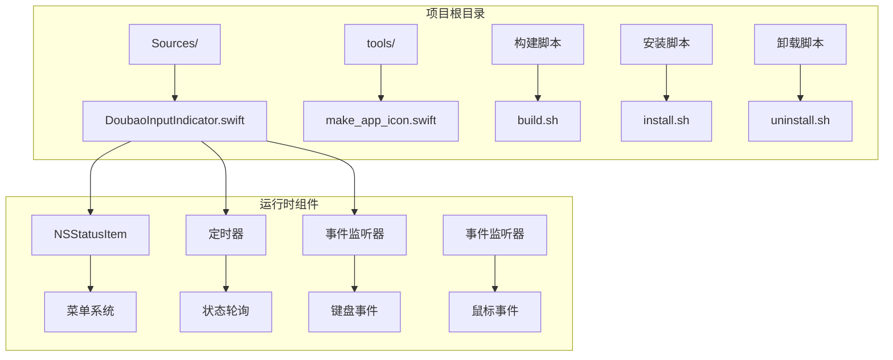

**图表来源**
- [DoubaoInputIndicator.swift:1-1410](file://Sources/DoubaoInputIndicator.swift#L1-L1410)
- [build.sh:1-117](file://build.sh#L1-L117)

**章节来源**
- [DoubaoInputIndicator.swift:1-1410](file://Sources/DoubaoInputIndicator.swift#L1-L1410)
- [build.sh:1-117](file://build.sh#L1-L117)

## 核心组件

### AppDelegate - 主控制器

AppDelegate 是整个应用程序的核心控制器，负责管理应用生命周期、事件处理和状态协调。它实现了 NSApplicationDelegate 和 NSMenuDelegate 协议，提供完整的输入法状态监控功能。

主要职责包括：
- 应用程序生命周期管理（启动、终止）
- 状态栏集成和菜单管理
- 多种事件监听机制
- 自动校准算法
- 用户界面更新

### InputSourceReader - 数据访问层

InputSourceReader 提供对系统输入源的访问能力，通过 TIS (Text Input System) API 获取当前输入法的详细信息。

关键功能：
- 获取当前输入源的完整信息
- 解析输入源属性（ID、名称、Bundle ID、输入模式ID）
- 封装 TIS API 调用，提供类型安全的接口

### CandidateWindowMonitor - 窗口监控机制

CandidateWindowMonitor 实现了复杂的窗口监控机制，用于检测候选窗口和模式指示器。

核心特性：
- 候选窗口检测（高图层、高度阈值过滤）
- 模式指示器识别（"中"/"英"提示框）
- Accessibility API 集成
- 进程所有权验证

### DisplayMode - 状态表示层

DisplayMode 定义了输入法状态的枚举类型，提供状态到用户界面的映射。

状态类型：
- 中文模式（🇨🇳/中文）
- 英文模式（🇺🇸/英文）
- 未知状态（?/未知）
- 非目标输入法（🤐/非目标输入法）

**章节来源**
- [DoubaoInputIndicator.swift:280-1410](file://Sources/DoubaoInputIndicator.swift#L280-L1410)

## 架构概览

应用程序采用分层架构设计，各组件职责明确，耦合度低。

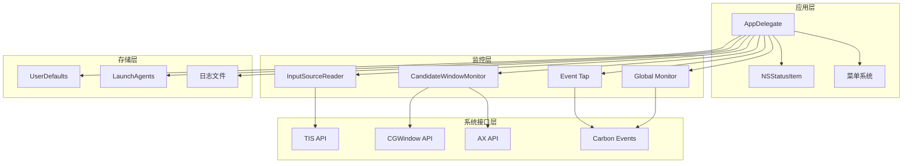

**图表来源**
- [DoubaoInputIndicator.swift:104-278](file://Sources/DoubaoInputIndicator.swift#L104-L278)
- [DoubaoInputIndicator.swift:280-1410](file://Sources/DoubaoInputIndicator.swift#L280-L1410)

## 详细组件分析

### AppDelegate 组件深度分析

#### 类结构设计

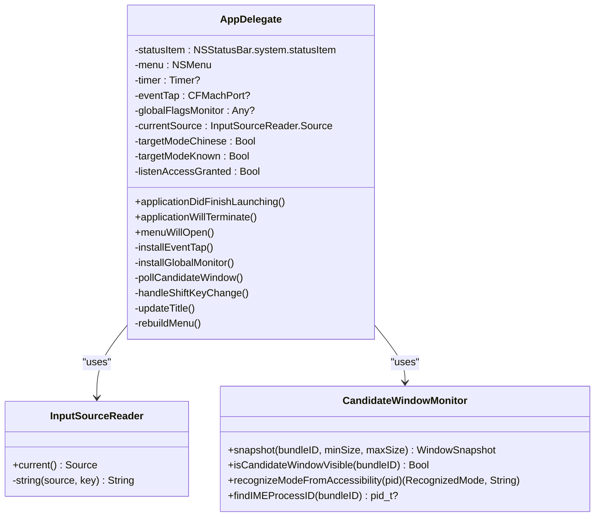

**图表来源**
- [DoubaoInputIndicator.swift:104-278](file://Sources/DoubaoInputIndicator.swift#L104-L278)
- [DoubaoInputIndicator.swift:280-1410](file://Sources/DoubaoInputIndicator.swift#L280-L1410)

#### 应用生命周期管理

AppDelegate 实现了完整的应用生命周期管理：

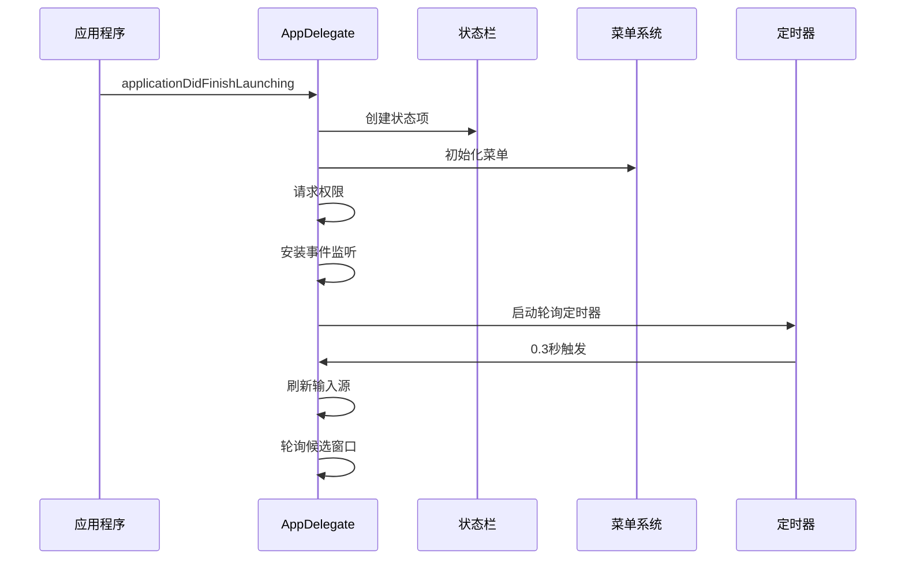

**图表来源**
- [DoubaoInputIndicator.swift:339-362](file://Sources/DoubaoInputIndicator.swift#L339-L362)
- [DoubaoInputIndicator.swift:358-361](file://Sources/DoubaoInputIndicator.swift#L358-L361)

#### 事件处理机制

应用程序采用多层事件处理架构：

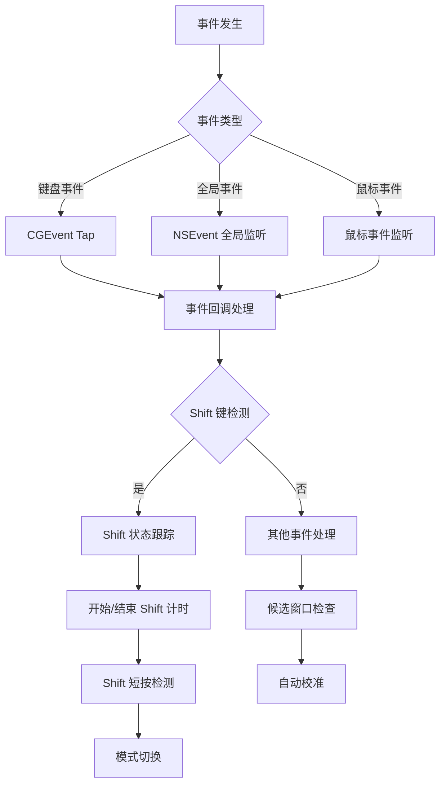

**图表来源**
- [DoubaoInputIndicator.swift:482-538](file://Sources/DoubaoInputIndicator.swift#L482-L538)
- [DoubaoInputIndicator.swift:866-980](file://Sources/DoubaoInputIndicator.swift#L866-L980)

**章节来源**
- [DoubaoInputIndicator.swift:280-1410](file://Sources/DoubaoInputIndicator.swift#L280-L1410)

### InputSourceReader 组件分析

#### 数据访问层设计

InputSourceReader 通过 TIS API 提供类型安全的输入源访问：

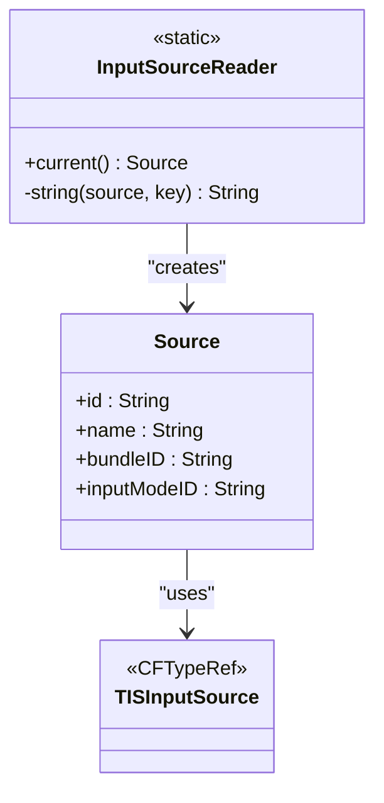

**图表来源**
- [DoubaoInputIndicator.swift:104-131](file://Sources/DoubaoInputIndicator.swift#L104-L131)

#### TIS API 集成策略

组件通过以下方式集成 TIS API：

1. **安全内存管理**：使用 `takeRetainedValue()` 确保正确的内存管理
2. **属性访问封装**：提供统一的字符串属性访问方法
3. **错误处理**：对缺失属性返回空字符串，避免崩溃
4. **类型安全**：通过内部结构体提供强类型接口

**章节来源**
- [DoubaoInputIndicator.swift:104-131](file://Sources/DoubaoInputIndicator.swift#L104-L131)

### CandidateWindowMonitor 组件分析

#### 窗口监控机制

CandidateWindowMonitor 实现了多层次的窗口监控：

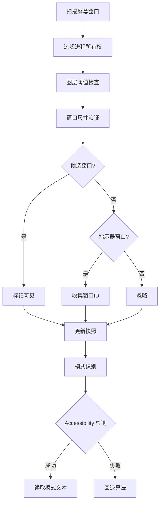

**图表来源**
- [DoubaoInputIndicator.swift:133-278](file://Sources/DoubaoInputIndicator.swift#L133-L278)

#### Accessibility API 集成

组件通过 Accessibility API 实现精确的模式识别：

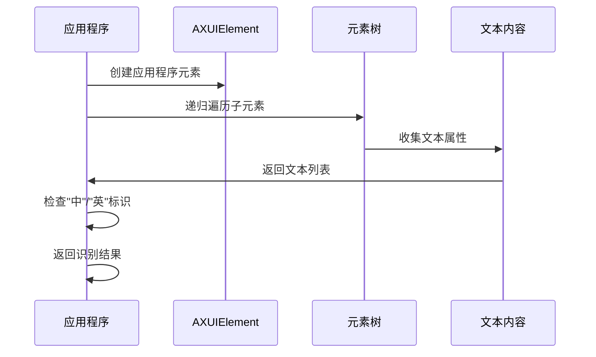

**图表来源**
- [DoubaoInputIndicator.swift:229-277](file://Sources/DoubaoInputIndicator.swift#L229-L277)

**章节来源**
- [DoubaoInputIndicator.swift:133-278](file://Sources/DoubaoInputIndicator.swift#L133-L278)

### DisplayMode 状态表示层

#### 状态设计模式

DisplayMode 采用枚举类型实现状态管理：

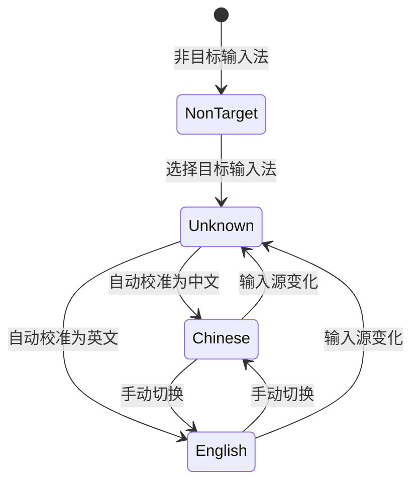

**图表来源**
- [DoubaoInputIndicator.swift:7-38](file://Sources/DoubaoInputIndicator.swift#L7-L38)

#### 状态转换逻辑

状态转换遵循以下规则：

1. **非目标输入法**：始终显示为非目标状态
2. **未知状态**：当输入法切换或重新选择时进入
3. **自动校准**：通过候选窗口检测和模式指示器识别
4. **手动切换**：通过 Shift 键短按实现
5. **持久化存储**：使用 UserDefaults 保存用户偏好

**章节来源**
- [DoubaoInputIndicator.swift:7-38](file://Sources/DoubaoInputIndicator.swift#L7-L38)
- [DoubaoInputIndicator.swift:845-854](file://Sources/DoubaoInputIndicator.swift#L845-L854)

## 依赖关系分析

### 外部框架依赖

应用程序依赖以下系统框架：

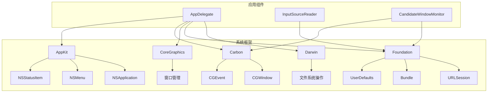

**图表来源**
- [DoubaoInputIndicator.swift:1-6](file://Sources/DoubaoInputIndicator.swift#L1-L6)

### 内部组件依赖

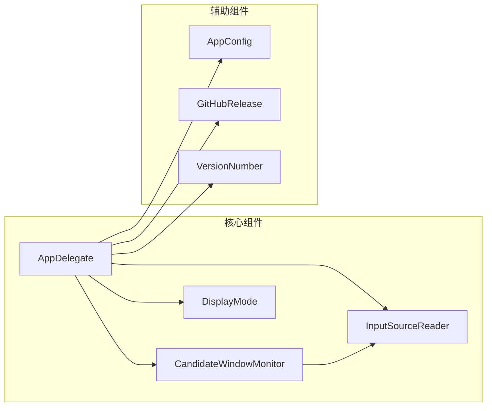

**图表来源**
- [DoubaoInputIndicator.swift:40-102](file://Sources/DoubaoInputIndicator.swift#L40-L102)
- [DoubaoInputIndicator.swift:53-82](file://Sources/DoubaoInputIndicator.swift#L53-L82)

**章节来源**
- [DoubaoInputIndicator.swift:1-1410](file://Sources/DoubaoInputIndicator.swift#L1-L1410)

## 性能考虑

### 事件处理优化

应用程序采用了多项性能优化策略：

1. **事件去重**：通过时间戳检查避免重复处理相同事件
2. **定时器节流**：0.3秒轮询间隔平衡准确性与性能
3. **条件检查**：仅在必要时执行昂贵的操作
4. **内存管理**：正确管理 CFTypeRef 生命周期

### 内存管理最佳实践

```mermaid
flowchart TD
A[获取 CFTypeRef] --> B{是否需要保留?}
B --> |是| C[takeRetainedValue()]
B --> |否| D[takeUnretainedValue()]
C --> E[正确释放]
D --> E
E --> F[避免内存泄漏]
```

### 系统资源使用

- **CPU 使用率**：低频率轮询 + 事件驱动触发
- **内存占用**：轻量级状态存储 + 及时清理
- **权限需求**：最小权限原则（仅请求必要权限）

## 故障排除指南

### 常见问题诊断

#### 权限相关问题

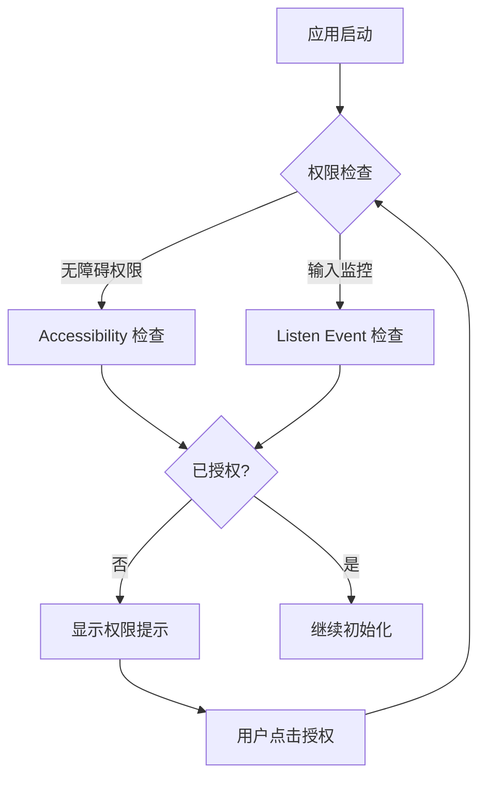

#### 事件监听问题

当事件监听失效时的恢复流程：

1. **检测失效**：监听器状态检查
2. **自动重试**：重新创建监听器
3. **状态同步**：重新获取当前输入源
4. **用户通知**：显示状态变化

**章节来源**
- [DoubaoInputIndicator.swift:379-406](file://Sources/DoubaoInputIndicator.swift#L379-L406)
- [DoubaoInputIndicator.swift:733-747](file://Sources/DoubaoInputIndicator.swift#L733-L747)

### 日志记录系统

应用程序提供了完整的日志记录功能：

- **日志文件位置**：`~/Library/Logs/`
- **日志格式**：ISO8601 时间戳 + 信息内容
- **日志级别**：调试信息、状态变更、错误报告
- **日志轮转**：支持文件追加写入

## 结论

该输入法指示器应用程序展现了优秀的软件架构设计：

1. **模块化设计**：清晰的组件分离和职责划分
2. **事件驱动架构**：高效的事件处理和状态管理
3. **多层容错**：通过多种检测机制确保可靠性
4. **用户体验优先**：直观的界面和及时的状态反馈
5. **系统集成深度**：充分利用 macOS 系统能力

该架构为类似系统工具开发提供了良好的参考模板，展示了如何在保证功能完整性的同时保持代码的可维护性和扩展性。