# 设计模式

<cite>
**本文档引用的文件**
- [DoubaoInputIndicator.swift](file://Sources/DoubaoInputIndicator.swift)
- [build.sh](file://build.sh)
- [install.sh](file://install.sh)
- [uninstall.sh](file://uninstall.sh)
- [make_app_icon.swift](file://tools/make_app_icon.swift)
</cite>

## 目录
1. [引言](#引言)
2. [项目结构](#项目结构)
3. [核心组件](#核心组件)
4. [架构概览](#架构概览)
5. [详细组件分析](#详细组件分析)
6. [依赖关系分析](#依赖关系分析)
7. [性能考虑](#性能考虑)
8. [故障排除指南](#故障排除指南)
9. [结论](#结论)

## 引言

本文档深入分析了输入指示器项目中应用的各种设计模式，重点解释了观察者模式在事件监听中的实现、策略模式在双输入法支持中的应用、状态模式在输入法状态管理中的使用，以及单例模式在应用实例管理中的作用。该项目是一个macOS应用程序，用于监控和显示中文输入法的状态，支持豆包输入法和微信输入法两种模式。

## 项目结构

项目采用简洁的单文件架构设计，主要包含以下组件：

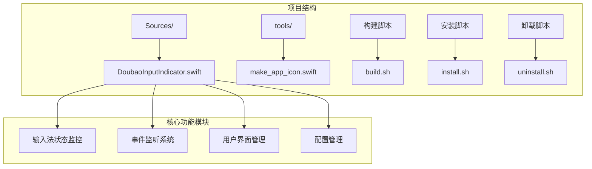

**图表来源**
- [DoubaoInputIndicator.swift:1-1410](file://Sources/DoubaoInputIndicator.swift#L1-L1410)
- [build.sh:1-117](file://build.sh#L1-L117)

**章节来源**
- [DoubaoInputIndicator.swift:1-1410](file://Sources/DoubaoInputIndicator.swift#L1-L1410)
- [build.sh:1-117](file://build.sh#L1-L117)

## 核心组件

项目的核心由一个单一的Swift文件组成，包含了完整的应用程序逻辑。主要组件包括：

### 应用程序入口点
- **AppDelegate**: 应用程序的主要控制器，负责管理状态栏图标、菜单和事件处理
- **InputSourceReader**: 输入法源读取器，用于获取当前输入法信息
- **CandidateWindowMonitor**: 候选窗口监控器，用于检测输入法候选面板

### 配置管理系统
- **AppConfig**: 应用程序配置结构体，包含不同输入法的特定配置
- **DisplayMode**: 显示模式枚举，定义中英文状态的不同显示方式

### 事件处理系统
- **事件监听器**: 支持键盘事件、鼠标事件和全局事件监控
- **状态跟踪器**: 跟踪Shift键状态和输入法切换事件

**章节来源**
- [DoubaoInputIndicator.swift:280-1410](file://Sources/DoubaoInputIndicator.swift#L280-L1410)

## 架构概览

项目采用了模块化的架构设计，通过编译时配置实现双输入法支持：

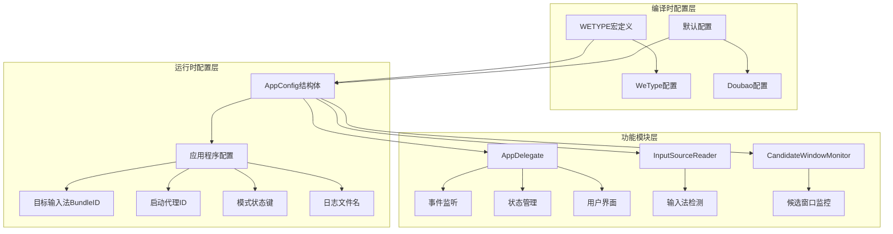

**图表来源**
- [DoubaoInputIndicator.swift:84-102](file://Sources/DoubaoInputIndicator.swift#L84-L102)
- [DoubaoInputIndicator.swift:40-47](file://Sources/DoubaoInputIndicator.swift#L40-L47)

## 详细组件分析

### 观察者模式在事件监听中的实现

项目实现了完整的观察者模式，通过多种事件监听机制来监控输入法状态变化：

#### 事件监听器架构

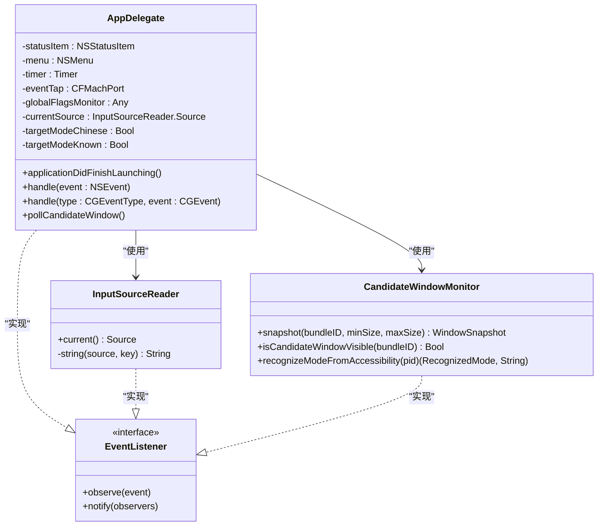

**图表来源**
- [DoubaoInputIndicator.swift:280-1410](file://Sources/DoubaoInputIndicator.swift#L280-L1410)
- [DoubaoInputIndicator.swift:104-131](file://Sources/DoubaoInputIndicator.swift#L104-L131)
- [DoubaoInputIndicator.swift:133-278](file://Sources/DoubaoInputIndicator.swift#L133-L278)

#### 键盘事件监听机制

项目实现了多层次的键盘事件监听：

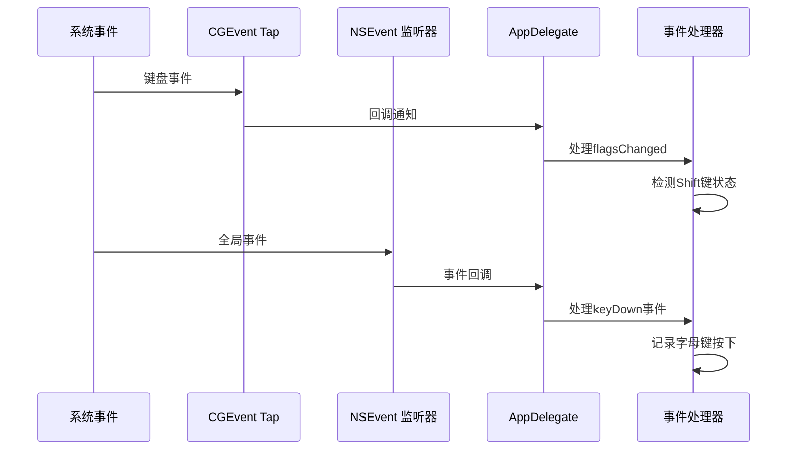

**图表来源**
- [DoubaoInputIndicator.swift:408-480](file://Sources/DoubaoInputIndicator.swift#L408-L480)
- [DoubaoInputIndicator.swift:482-538](file://Sources/DoubaoInputIndicator.swift#L482-L538)

#### 鼠标事件监听机制

项目同样支持鼠标事件的监听：

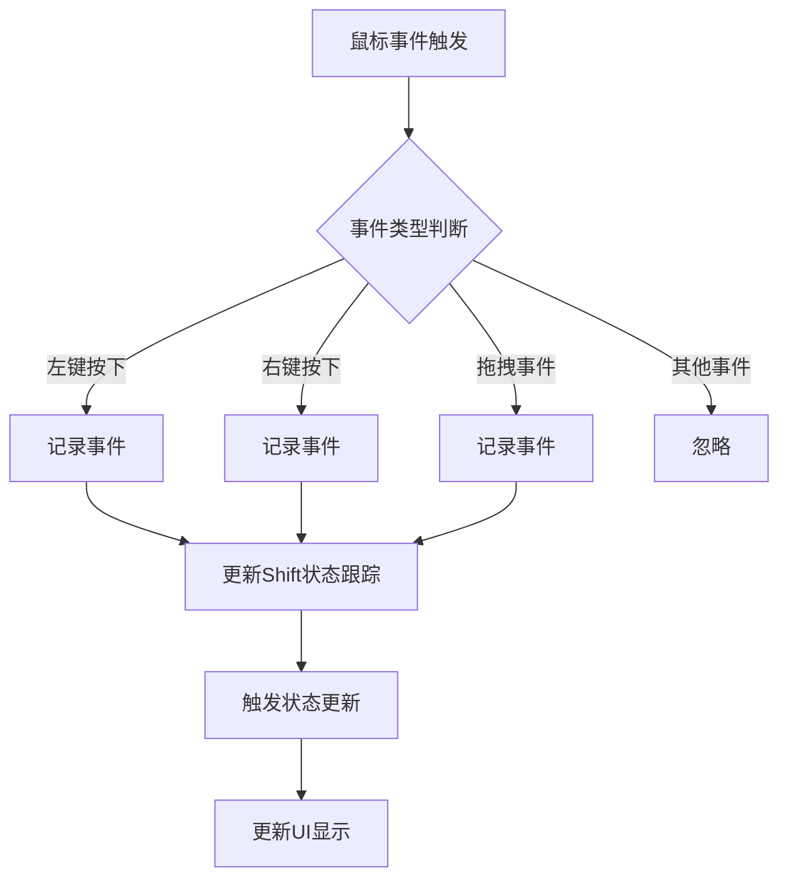

**图表来源**
- [DoubaoInputIndicator.swift:495-504](file://Sources/DoubaoInputIndicator.swift#L495-L504)
- [DoubaoInputIndicator.swift:528-532](file://Sources/DoubaoInputIndicator.swift#L528-L532)

#### 输入法状态变化监听

项目通过多种机制监听输入法状态变化：

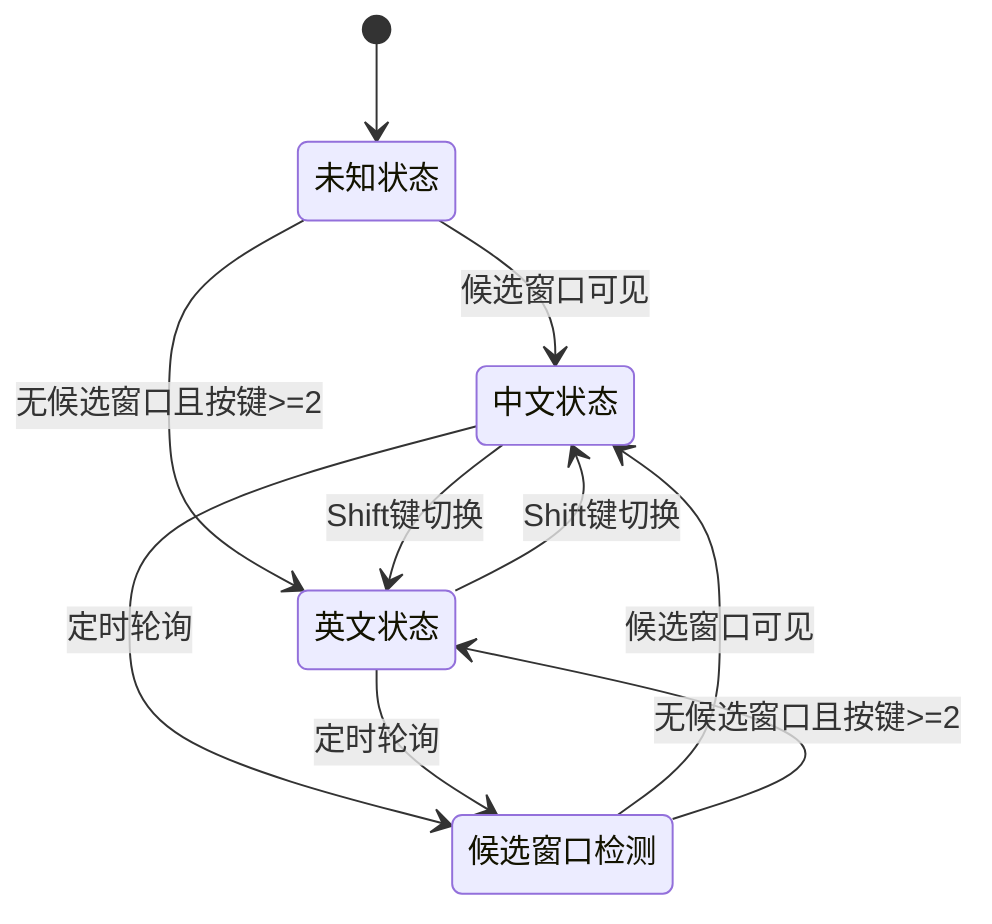

**图表来源**
- [DoubaoInputIndicator.swift:544-620](file://Sources/DoubaoInputIndicator.swift#L544-L620)
- [DoubaoInputIndicator.swift:969-980](file://Sources/DoubaoInputIndicator.swift#L969-L980)

**章节来源**
- [DoubaoInputIndicator.swift:280-814](file://Sources/DoubaoInputIndicator.swift#L280-L814)

### 策略模式在双输入法支持中的应用

项目通过编译时配置实现了策略模式，支持不同的输入法适配：

#### 编译时配置策略

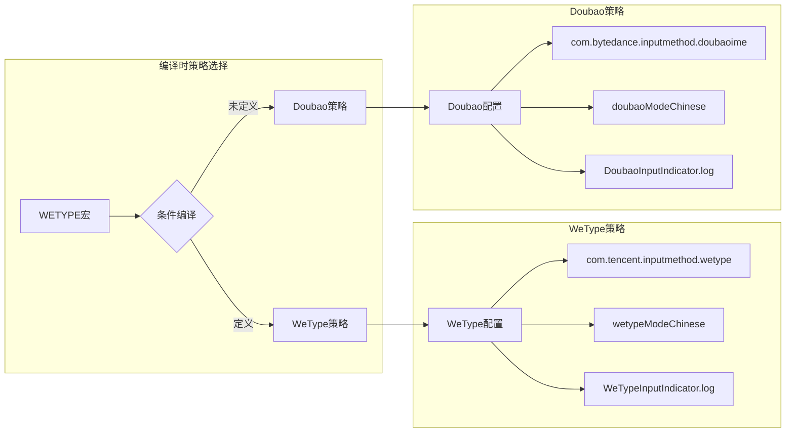

**图表来源**
- [DoubaoInputIndicator.swift:84-102](file://Sources/DoubaoInputIndicator.swift#L84-L102)
- [build.sh:10-27](file://build.sh#L10-L27)

#### 运行时策略切换

项目通过环境变量和构建参数实现运行时策略切换：

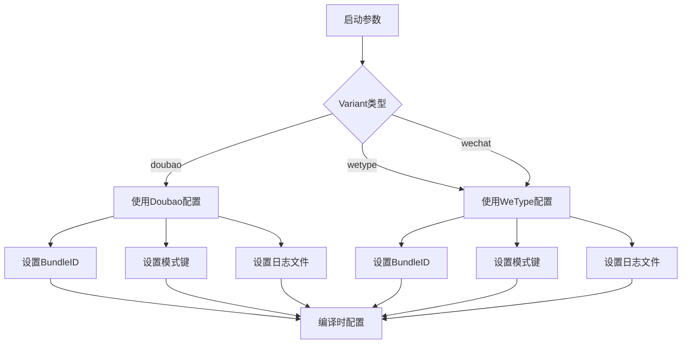

**图表来源**
- [build.sh:10-27](file://build.sh#L10-L27)
- [install.sh:7-20](file://install.sh#L7-L20)

**章节来源**
- [DoubaoInputIndicator.swift:84-102](file://Sources/DoubaoInputIndicator.swift#L84-L102)
- [build.sh:10-27](file://build.sh#L10-L27)

### 状态模式在输入法状态管理中的使用

项目实现了完整的状态管理模式来处理输入法的中英文状态转换：

#### 状态定义和转换

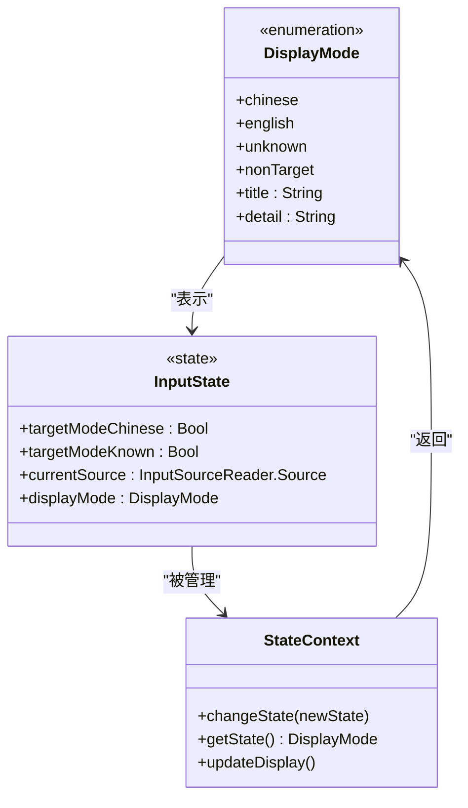

**图表来源**
- [DoubaoInputIndicator.swift:7-38](file://Sources/DoubaoInputIndicator.swift#L7-L38)
- [DoubaoInputIndicator.swift:845-854](file://Sources/DoubaoInputIndicator.swift#L845-L854)

#### 状态转换流程

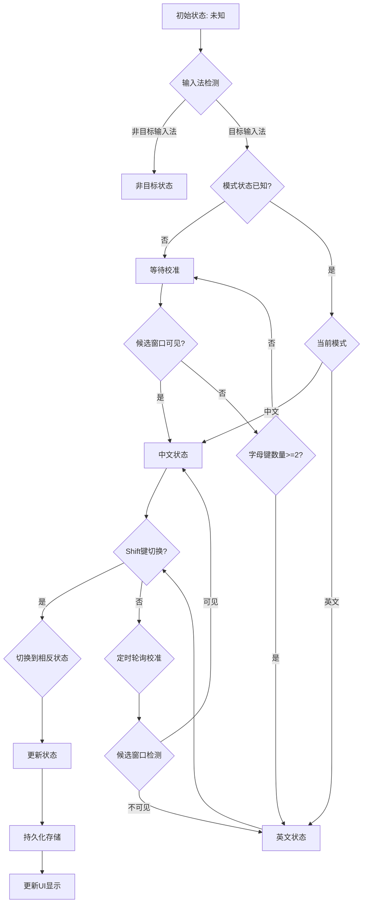

**图表来源**
- [DoubaoInputIndicator.swift:544-620](file://Sources/DoubaoInputIndicator.swift#L544-L620)
- [DoubaoInputIndicator.swift:969-980](file://Sources/DoubaoInputIndicator.swift#L969-L980)

#### 持久化存储机制

项目使用UserDefaults实现状态的持久化存储：

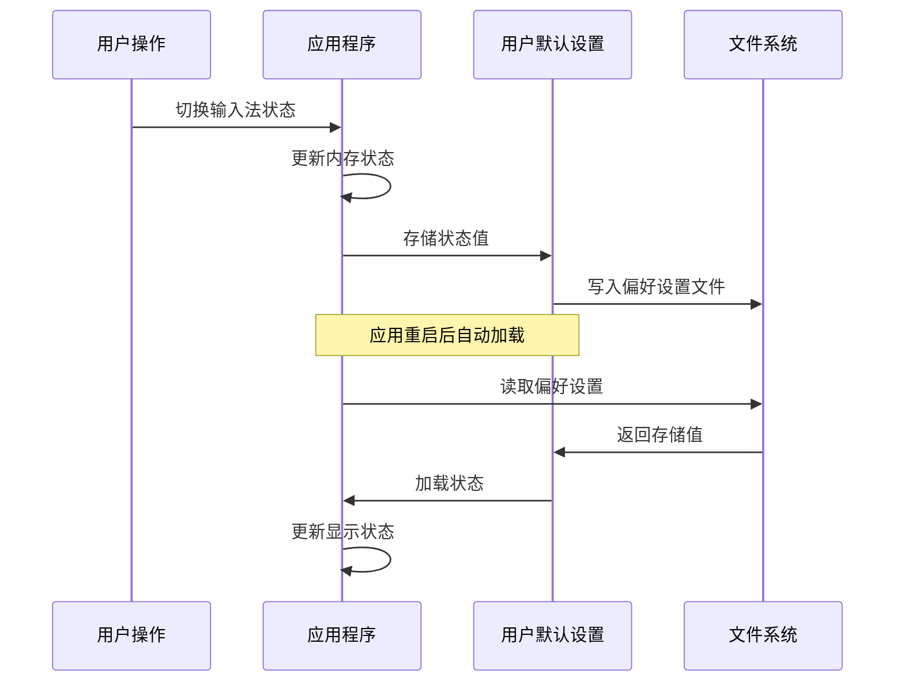

**图表来源**
- [DoubaoInputIndicator.swift:291-293](file://Sources/DoubaoInputIndicator.swift#L291-L293)
- [DoubaoInputIndicator.swift:575](file://Sources/DoubaoInputIndicator.swift#L575)
- [DoubaoInputIndicator.swift:694](file://Sources/DoubaoInputIndicator.swift#L694)

**章节来源**
- [DoubaoInputIndicator.swift:7-38](file://Sources/DoubaoInputIndicator.swift#L7-L38)
- [DoubaoInputIndicator.swift:544-620](file://Sources/DoubaoInputIndicator.swift#L544-L620)

### 单例模式在应用实例管理中的作用

项目采用了单例模式来管理应用程序实例：

#### 应用程序生命周期管理

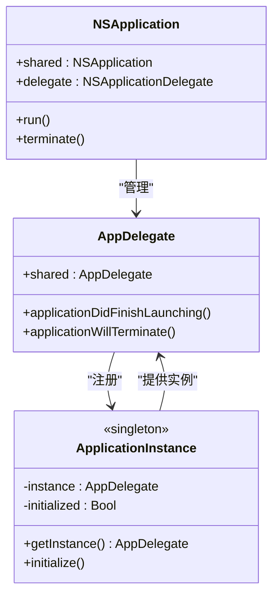

**图表来源**
- [DoubaoInputIndicator.swift:1406-1410](file://Sources/DoubaoInputIndicator.swift#L1406-L1410)
- [DoubaoInputIndicator.swift:1407-1408](file://Sources/DoubaoInputIndicator.swift#L1407-L1408)

#### 单例实现细节

项目通过直接创建AppDelegate实例的方式实现单例模式：

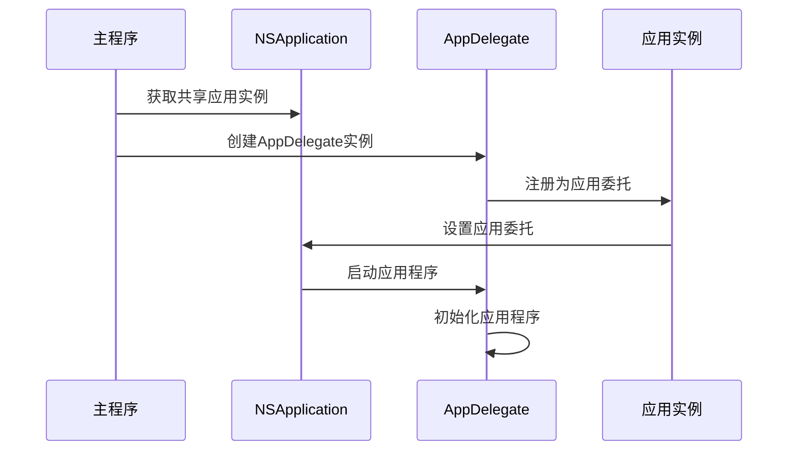

**图表来源**
- [DoubaoInputIndicator.swift:1406-1410](file://Sources/DoubaoInputIndicator.swift#L1406-L1410)

**章节来源**
- [DoubaoInputIndicator.swift:1406-1410](file://Sources/DoubaoInputIndicator.swift#L1406-L1410)

## 依赖关系分析

项目展示了清晰的依赖层次结构：

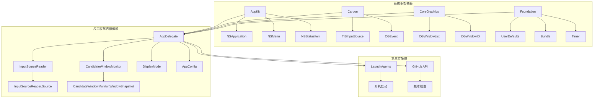

**图表来源**
- [DoubaoInputIndicator.swift:1-6](file://Sources/DoubaoInputIndicator.swift#L1-L6)
- [DoubaoInputIndicator.swift:280-1410](file://Sources/DoubaoInputIndicator.swift#L280-L1410)

**章节来源**
- [DoubaoInputIndicator.swift:1-6](file://Sources/DoubaoInputIndicator.swift#L1-L6)

## 性能考虑

项目在设计时充分考虑了性能优化：

### 事件处理优化
- 使用事件去重机制避免重复处理相同的物理事件
- 实现事件忽略窗口减少启动阶段的误触发
- 采用定时器节流避免过度的候选窗口检测

### 内存管理
- 使用弱引用避免循环引用
- 及时清理定时器和监听器资源
- 合理的内存释放策略

### 线程安全
- 所有UI更新都在主线程执行
- 使用适当的同步机制保护共享状态

## 故障排除指南

### 常见问题诊断

#### 权限问题
- **输入监控权限**: 需要在系统偏好设置中启用
- **辅助功能权限**: Accessibility权限用于读取模式指示器
- **监听事件权限**: ListenEvent权限用于事件监听

#### 状态同步问题
- **Shift键切换失效**: 检查输入监控权限和事件监听状态
- **模式状态不准确**: 通过手动校准或等待自动校准
- **候选窗口检测失败**: 检查输入法进程状态和窗口层级

#### 配置问题
- **双输入法支持**: 确认编译时宏定义正确
- **启动代理配置**: 检查LaunchAgents配置文件
- **日志文件位置**: 查看用户主目录下的日志文件

**章节来源**
- [DoubaoInputIndicator.swift:379-406](file://Sources/DoubaoInputIndicator.swift#L379-L406)
- [DoubaoInputIndicator.swift:1072-1076](file://Sources/DoubaoInputIndicator.swift#L1072-L1076)

## 结论

输入指示器项目成功地应用了多种设计模式来解决复杂的输入法状态监控问题：

1. **观察者模式**: 通过多层次的事件监听机制实现了完整的事件观察系统
2. **策略模式**: 通过编译时配置实现了灵活的双输入法支持
3. **状态模式**: 通过明确的状态定义和转换实现了稳定的输入法状态管理
4. **单例模式**: 通过应用程序实例管理确保了系统的稳定性和一致性

这些设计模式的综合应用使得项目具有良好的可扩展性、可维护性和用户体验。项目展示了如何在实际应用中有效地运用设计模式来解决复杂的技术挑战。