# 故障排除

<cite>
**本文档引用的文件**
- [DoubaoInputIndicator.swift](file://Sources/DoubaoInputIndicator.swift)
- [build.sh](file://build.sh)
- [install.sh](file://install.sh)
- [uninstall.sh](file://uninstall.sh)
- [make_app_icon.swift](file://tools/make_app_icon.swift)
</cite>

## 目录
1. [简介](#简介)
2. [权限相关问题](#权限相关问题)
3. [输入法检测失败](#输入法检测失败)
4. [菜单栏图标异常](#菜单栏图标异常)
5. [Shift 键切换问题](#shift-键切换问题)
6. [日志分析方法](#日志分析方法)
7. [调试技巧](#调试技巧)
8. [系统兼容性问题](#系统兼容性问题)
9. [输入法版本兼容性](#输入法版本兼容性)
10. [性能问题处理](#性能问题处理)
11. [常见问题排查流程](#常见问题排查流程)
12. [预防性维护](#预防性维护)

## 简介

输入指示器是一个用于监控和显示 macOS 输入法状态的工具应用。它能够检测当前使用的输入法，识别中英文模式，并通过菜单栏图标直观地展示输入法状态。该应用支持两种输入法：豆包输入法（默认）和微信输入法（WeType），并通过多种技术手段确保准确的状态检测。

## 权限相关问题

### 问题症状
- 菜单栏显示⚠️警告图标
- Shift 键切换功能无法正常工作
- 提示需要开启输入监控权限

### 根本原因分析
应用依赖三个关键权限：
1. **辅助功能权限（Accessibility）** - 用于读取输入法模式指示器窗口文本
2. **输入监控权限（Listen Event Access）** - 用于监听键盘事件和鼠标事件
3. **屏幕录制权限** - 实际上不需要此权限（代码中明确标注）

### 排查步骤

#### 1. 检查辅助功能权限
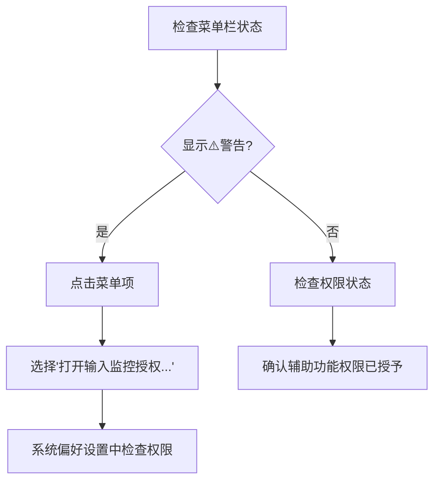

**图表来源**
- [DoubaoInputIndicator.swift:379-383](file://Sources/DoubaoInputIndicator.swift#L379-L383)
- [DoubaoInputIndicator.swift:1046-1060](file://Sources/DoubaoInputIndicator.swift#L1046-L1060)

#### 2. 检查输入监控权限
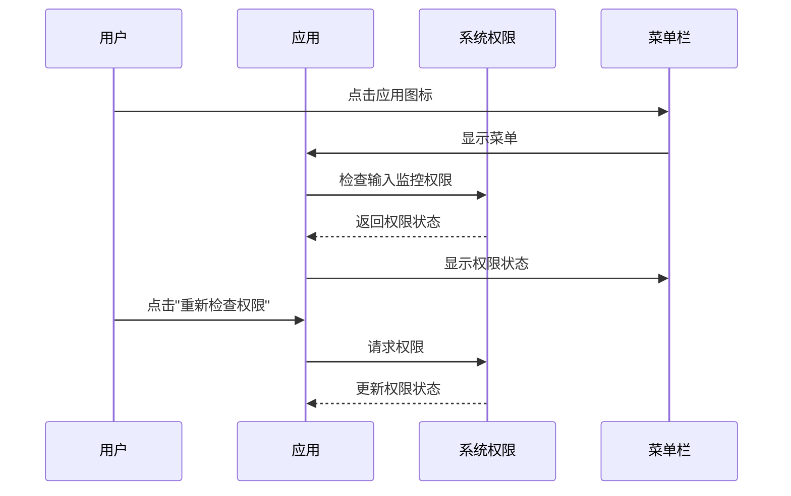

**图表来源**
- [DoubaoInputIndicator.swift:389-406](file://Sources/DoubaoInputIndicator.swift#L389-L406)
- [DoubaoInputIndicator.swift:1145-1150](file://Sources/DoubaoInputIndicator.swift#L1145-L1150)

#### 3. 手动授权流程
1. 在菜单中选择"打开输入监控授权..."
2. 系统会打开系统偏好设置的安全与隐私面板
3. 在"隐私"选项卡中找到"输入监控"
4. 勾选应用名称以授予权限
5. 重启应用使权限生效

**章节来源**
- [DoubaoInputIndicator.swift:1152-1155](file://Sources/DoubaoInputIndicator.swift#L1152-L1155)
- [DoubaoInputIndicator.swift:389-406](file://Sources/DoubaoInputIndicator.swift#L389-L406)

## 输入法检测失败

### 问题症状
- 菜单栏显示"非目标输入法"
- 无法正确识别当前输入法状态
- 模式切换功能失效

### 根本原因分析
应用通过以下方式检测输入法：
1. **键盘输入源 API** - 使用 TISCopyCurrentKeyboardInputSource 获取当前输入法信息
2. **窗口检测** - 通过 CGWindowListCopyWindowInfo 检测输入法候选窗口
3. **模式指示器** - 通过 Accessibility API 读取输入法模式指示器文本

### 排查步骤

#### 1. 检查输入法识别
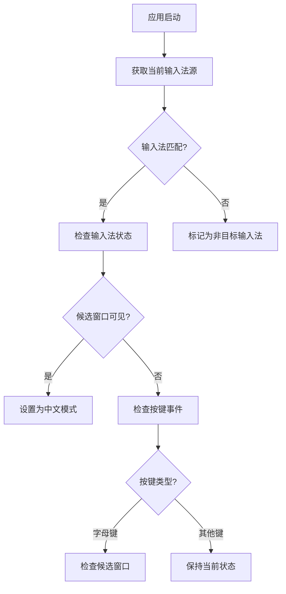

**图表来源**
- [DoubaoInputIndicator.swift:112-123](file://Sources/DoubaoInputIndicator.swift#L112-L123)
- [DoubaoInputIndicator.swift:544-620](file://Sources/DoubaoInputIndicator.swift#L544-L620)

#### 2. 验证输入法配置
1. 确认安装了正确的输入法版本
2. 检查输入法是否在系统偏好设置中正确配置
3. 验证输入法的 Bundle ID 是否正确

#### 3. 手动测试输入法检测
1. 在终端中运行：`osascript -e 'tell application "System Events" to tell current user to display dialog "Test"'`
2. 检查应用是否能正确识别当前输入法

**章节来源**
- [DoubaoInputIndicator.swift:820-822](file://Sources/DoubaoInputIndicator.swift#L820-L822)
- [DoubaoInputIndicator.swift:112-123](file://Sources/DoubaoInputIndicator.swift#L112-L123)

## 菜单栏图标异常

### 问题症状
- 图标显示异常字符或问号
- 图标不显示或显示为空白
- 工具提示文本错误

### 根本原因分析
图标显示依赖于以下因素：
1. **显示模式枚举** - 根据输入法状态返回不同的图标
2. **系统字体支持** - 使用 Emoji 字符作为图标内容
3. **权限状态** - 权限不足时显示警告图标

### 排查步骤

#### 1. 检查显示模式
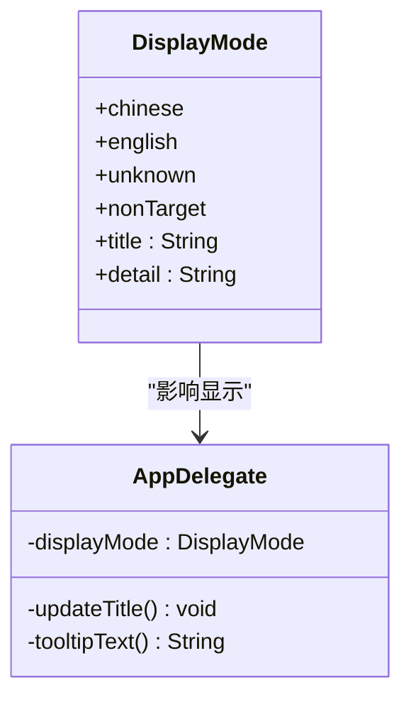

**图表来源**
- [DoubaoInputIndicator.swift:7-38](file://Sources/DoubaoInputIndicator.swift#L7-L38)
- [DoubaoInputIndicator.swift:845-854](file://Sources/DoubaoInputIndicator.swift#L845-L854)

#### 2. 验证图标生成
1. 检查应用图标是否正确生成
2. 验证系统字体是否支持显示的 Emoji 字符
3. 确认应用具有正确的图标文件

#### 3. 清理缓存
1. 删除应用缓存目录
2. 重新启动应用
3. 检查系统 Dock 缓存

**章节来源**
- [DoubaoInputIndicator.swift:1024-1040](file://Sources/DoubaoInputIndicator.swift#L1024-L1040)
- [DoubaoInputIndicator.swift:72-74](file://Sources/DoubaoInputIndicator.swift#L72-L74)

## Shift 键切换问题

### 问题症状
- 按下 Shift 键无反应
- 模式切换不稳定
- 切换后立即恢复到原状态

### 根本原因分析
Shift 键处理机制包括多个保护措施：
1. **事件去重** - 防止同一物理按键通过多个路径触发
2. **时间限制** - 限制独立 Shift 按下的持续时间
3. **组合键检测** - 忽略与其他按键同时按下的情况
4. **输入源验证** - 确保切换开始和结束时使用相同的输入法

### 排查步骤

#### 1. 分析 Shift 处理流程
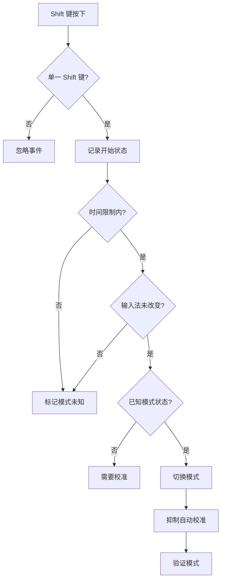

**图表来源**
- [DoubaoInputIndicator.swift:896-980](file://Sources/DoubaoInputIndicator.swift#L896-L980)
- [DoubaoInputIndicator.swift:985-991](file://Sources/DoubaoInputIndicator.swift#L985-L991)

#### 2. 检查权限要求
1. 确认输入监控权限已授予
2. 验证辅助功能权限状态
3. 测试权限变更后的功能恢复

#### 3. 调试 Shift 处理
1. 查看应用日志中的 Shift 相关记录
2. 观察 Shift 键状态变化
3. 检查是否有其他应用程序干扰

**章节来源**
- [DoubaoInputIndicator.swift:953-960](file://Sources/DoubaoInputIndicator.swift#L953-L960)
- [DoubaoInputIndicator.swift:993-1004](file://Sources/DoubaoInputIndicator.swift#L993-L1004)

## 日志分析方法

### 日志位置和格式
应用将日志写入用户主目录的 Library/Logs 目录，文件名根据应用变体而定：
- 豆包输入法：DoubaoInputIndicator.log
- 微信输入法：WeTypeInputIndicator.log

### 日志分析技巧

#### 1. 关键日志条目识别
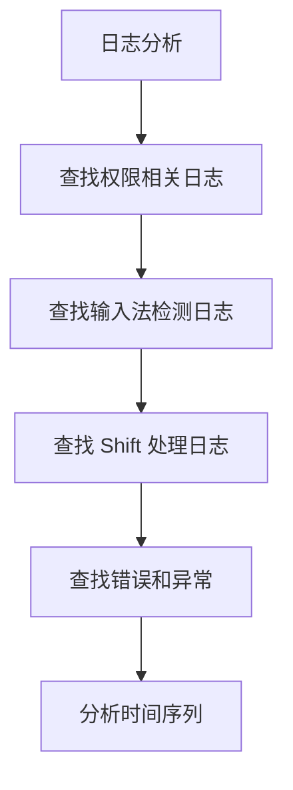

**图表来源**
- [DoubaoInputIndicator.swift:1388-1403](file://Sources/DoubaoInputIndicator.swift#L1388-L1403)

#### 2. 常见日志模式
- 权限状态：`accessibility trusted=`, `listen access granted=`
- 输入法检测：`source changed`, `candidate window visible`
- Shift 处理：`shift down/up`, `toggle mode`
- 错误信息：`event tap create failed`, `access denied`

#### 3. 日志查看命令
```bash
# 查看实时日志
tail -f ~/Library/Logs/DoubaoInputIndicator.log

# 过滤特定事件
grep "shift" ~/Library/Logs/DoubaoInputIndicator.log

# 查看最近错误
grep -i "error\|failed" ~/Library/Logs/DoubaoInputIndicator.log
```

**章节来源**
- [DoubaoInputIndicator.swift:1388-1403](file://Sources/DoubaoInputIndicator.swift#L1388-L1403)

## 调试技巧

### 1. 启用详细日志
1. 重新启动应用以确保日志文件创建
2. 执行可能导致问题的操作
3. 检查日志文件中的详细信息

### 2. 权限调试
```bash
# 检查应用权限状态
tccutil list | grep -i input

# 重置特定权限
tccutil reset ListenEvent

# 检查辅助功能权限
tccutil list | grep -i accessibility
```

### 3. 输入法调试
1. 使用系统工具检查输入法状态
2. 验证输入法的 Bundle ID
3. 测试输入法的基本功能

### 4. 系统环境检查
1. 检查 macOS 版本兼容性
2. 验证系统完整性保护状态
3. 确认系统资源使用情况

## 系统兼容性问题

### macOS 版本适配

#### 1. 权限 API 变化
- macOS 10.15+：引入新的输入监控权限 API
- 旧版本：使用传统的权限检查方法

#### 2. 窗口检测 API
- 不同版本的窗口层级可能有所变化
- 候选窗口的属性可能随系统版本调整

#### 3. 辅助功能 API
- Accessibility API 在不同版本间有细微差异
- 需要适当的权限检查和降级处理

### 兼容性检查清单
1. 验证目标 macOS 版本
2. 检查系统权限状态
3. 测试关键功能在不同版本上的表现
4. 准备降级方案

**章节来源**
- [DoubaoInputIndicator.swift:392-399](file://Sources/DoubaoInputIndicator.swift#L392-L399)

## 输入法版本兼容性

### 支持的输入法版本

#### 1. 豆包输入法
- Bundle ID: `com.bytedance.inputmethod.doubaoime`
- 版本要求：支持从 v1.0.0 开始
- 特殊功能：支持模式指示器窗口检测

#### 2. 微信输入法（WeType）
- Bundle ID: `com.tencent.inputmethod.wetype`
- 版本要求：支持从 v1.0.0 开始
- 特殊功能：需要开启「使用 shift 切换中英文」

### 版本检测和降级

#### 1. 自动版本识别
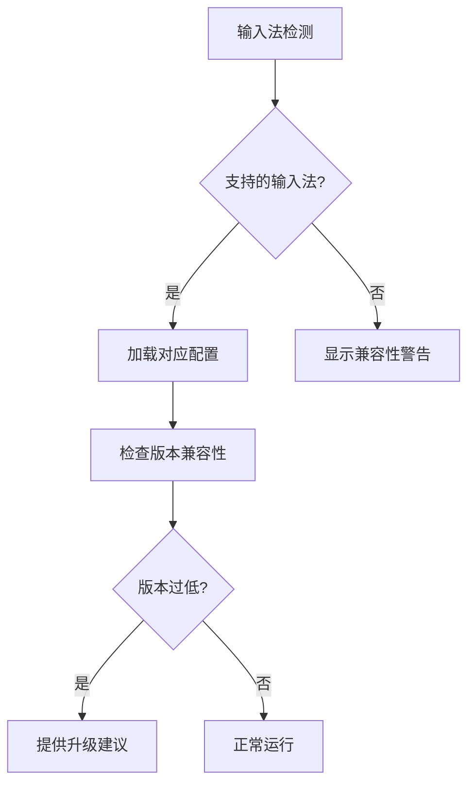

**图表来源**
- [DoubaoInputIndicator.swift:84-102](file://Sources/DoubaoInputIndicator.swift#L84-L102)

#### 2. 版本兼容性检查
1. 验证输入法版本号
2. 检查输入法功能支持情况
3. 提供版本升级指导

**章节来源**
- [DoubaoInputIndicator.swift:1072-1076](file://Sources/DoubaoInputIndicator.swift#L1072-L1076)

## 性能问题处理

### 性能监控指标

#### 1. 内存使用
- 应用内存占用应保持稳定
- 定期检查内存泄漏
- 监控长时间运行的内存增长

#### 2. CPU 使用率
- 主循环频率：约 3Hz
- 事件处理开销
- 窗口检测频率控制

#### 3. 磁盘 I/O
- 日志文件写入频率
- 配置文件访问
- 缓存管理

### 性能优化策略

#### 1. 事件处理优化
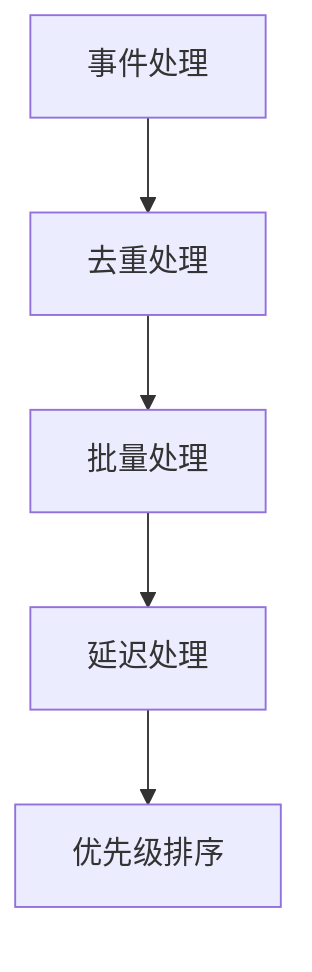

**图表来源**
- [DoubaoInputIndicator.swift:634-663](file://Sources/DoubaoInputIndicator.swift#L634-L663)

#### 2. 资源管理
1. 合理使用定时器
2. 优化窗口检测频率
3. 管理内存使用

#### 3. 异步处理
1. 将耗时操作移至后台线程
2. 使用异步网络请求
3. 避免阻塞主线程

**章节来源**
- [DoubaoInputIndicator.swift:358-361](file://Sources/DoubaoInputIndicator.swift#L358-L361)
- [DoubaoInputIndicator.swift:669-716](file://Sources/DoubaoInputIndicator.swift#L669-L716)

## 常见问题排查流程

### 1. 权限问题排查
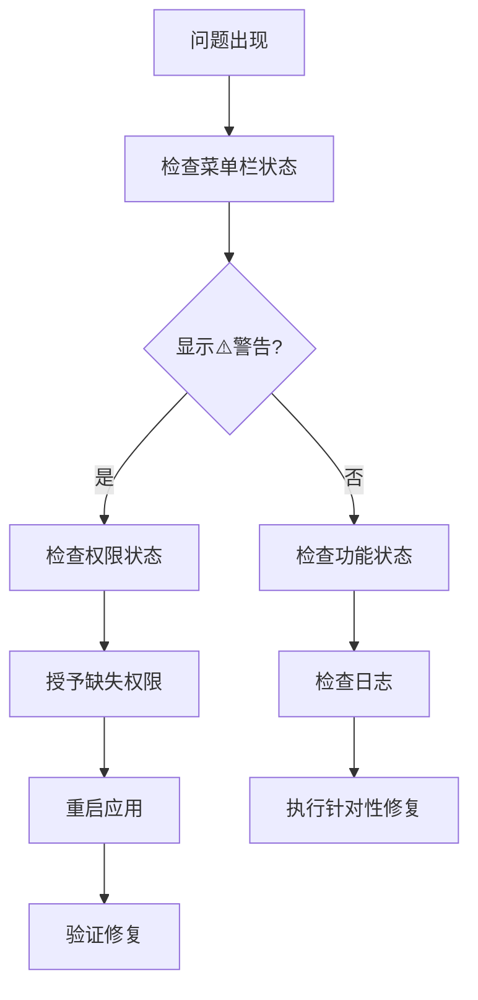

### 2. 输入法检测问题
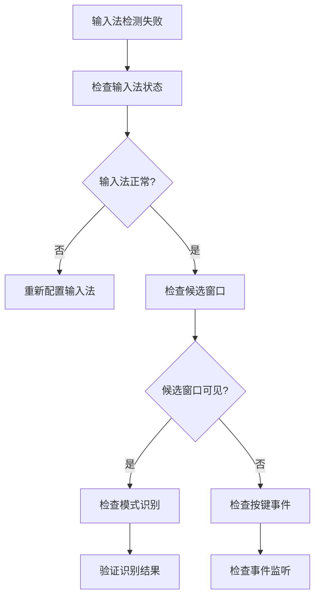

### 3. 功能异常排查
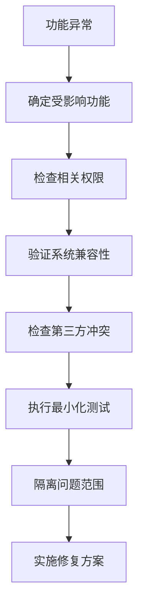

## 预防性维护

### 1. 定期维护任务
- 清理应用缓存
- 更新输入法版本
- 检查系统权限状态
- 验证应用完整性

### 2. 监控指标
- 应用运行稳定性
- 系统资源使用情况
- 用户反馈收集
- 兼容性测试

### 3. 备份和恢复
- 备份应用配置
- 记录系统状态
- 准备恢复方案
- 建立回滚机制

### 4. 用户教育
- 提供使用指南
- 解释权限需求
- 说明兼容性要求
- 建立反馈渠道

通过遵循这些故障排除指南，用户可以有效地诊断和解决输入指示器应用的各种问题。建议按照问题类型分类进行排查，并结合日志分析来精确定位问题根源。