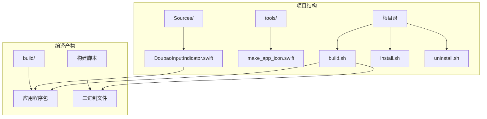
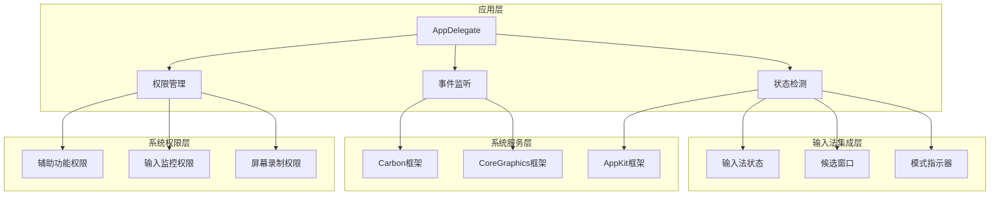
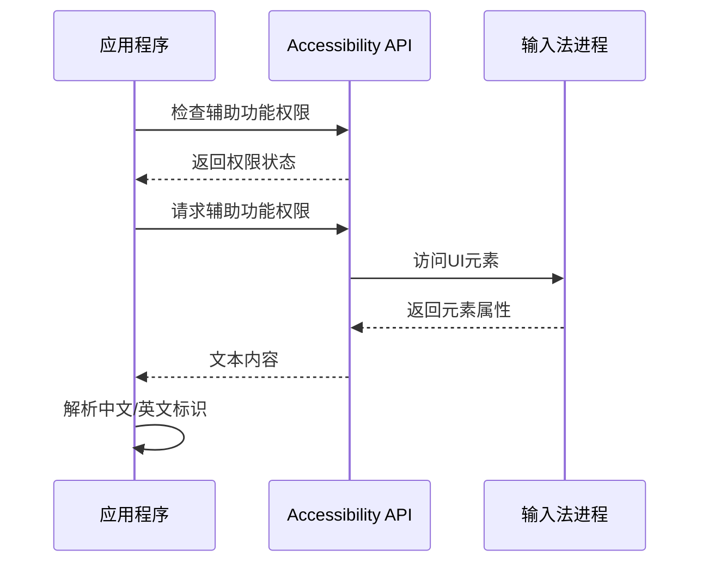
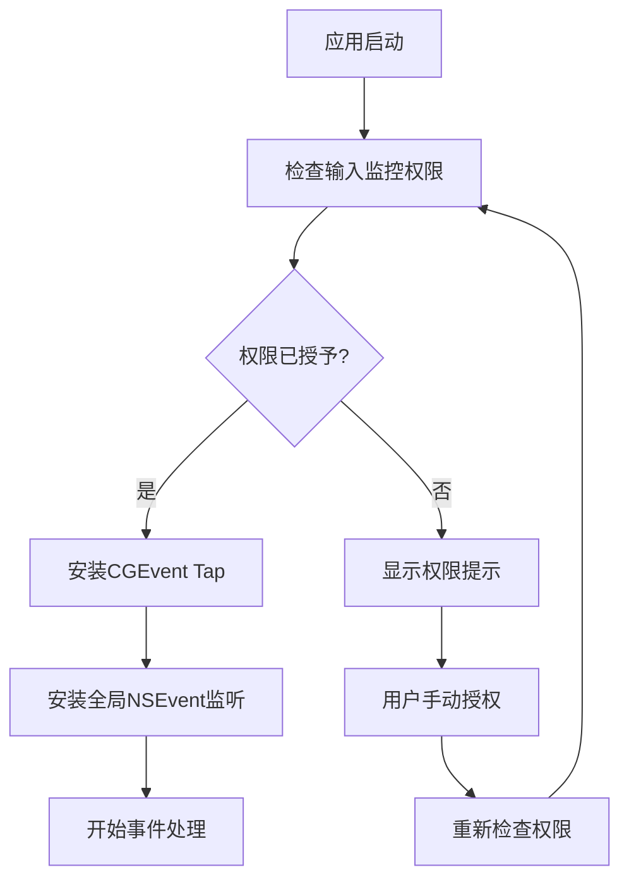
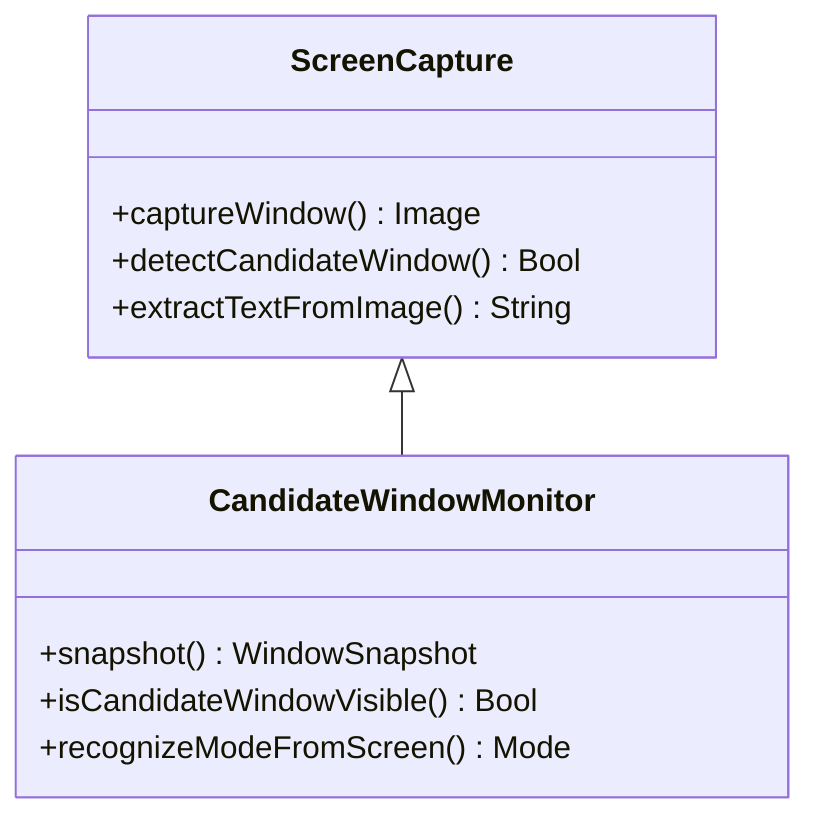
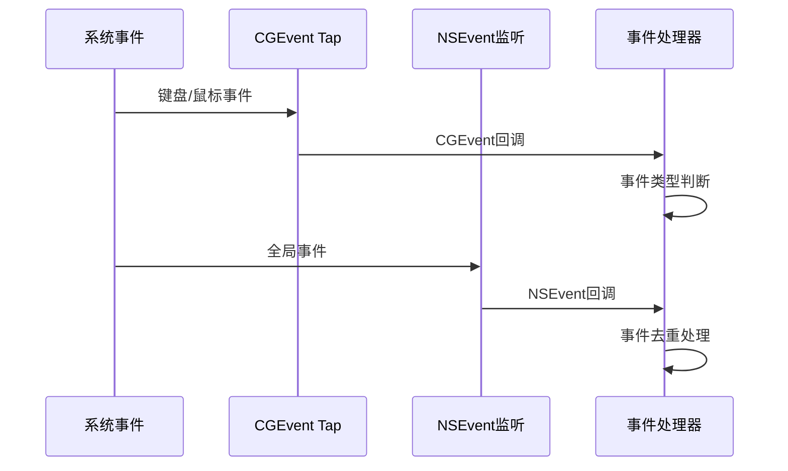
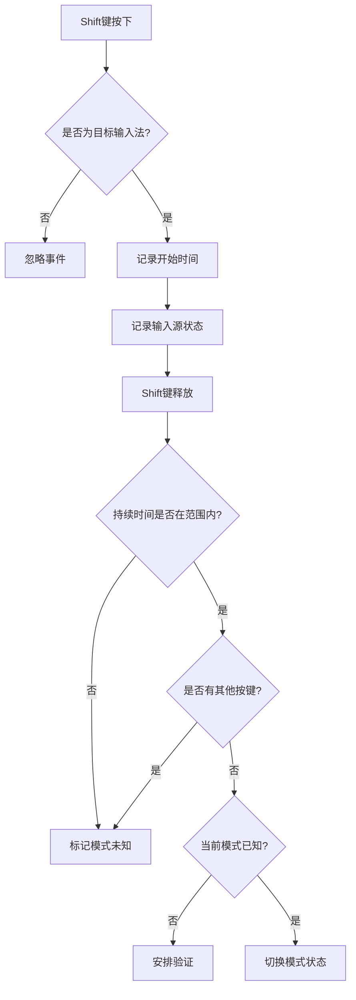
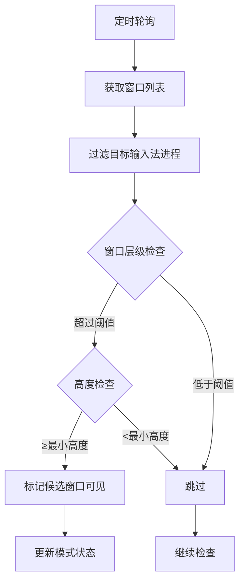
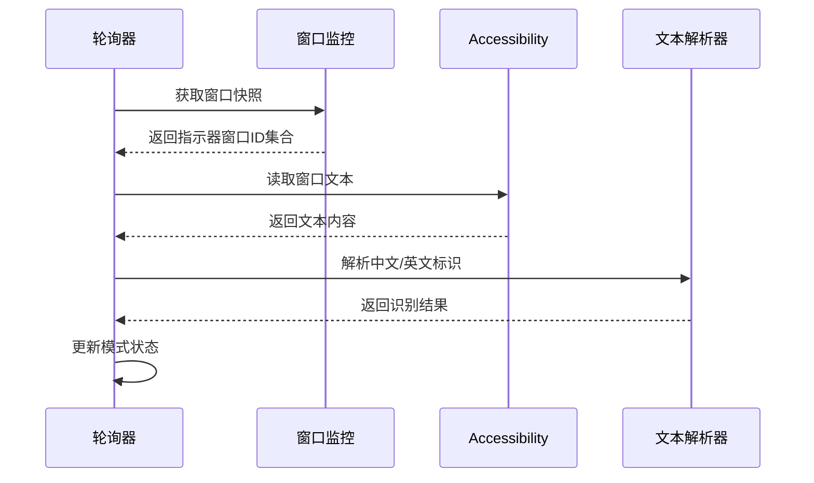
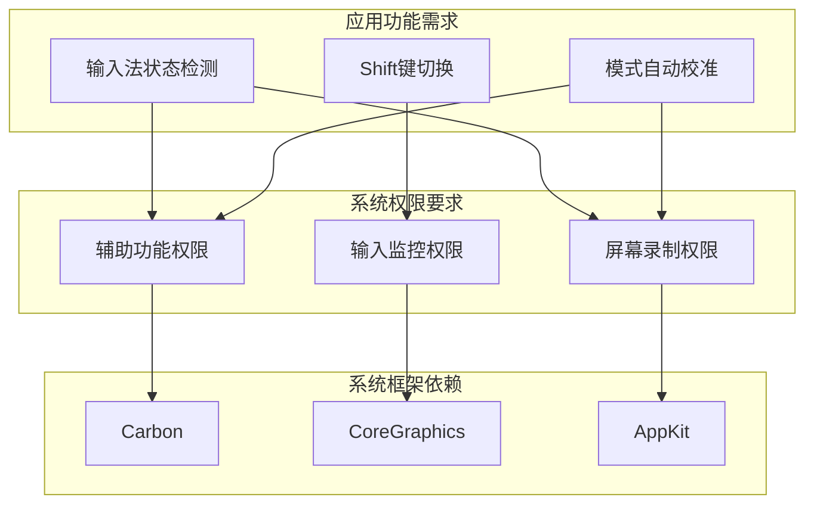

# 权限与安全

<cite>
**本文档引用的文件**
- [DoubaoInputIndicator.swift](file://Sources/DoubaoInputIndicator.swift)
- [build.sh](file://build.sh)
- [install.sh](file://install.sh)
- [uninstall.sh](file://uninstall.sh)
</cite>

## 目录
1. [简介](#简介)
2. [项目结构](#项目结构)
3. [核心组件](#核心组件)
4. [架构概览](#架构概览)
5. [详细组件分析](#详细组件分析)
6. [依赖关系分析](#依赖关系分析)
7. [性能考虑](#性能考虑)
8. [故障排除指南](#故障排除指南)
9. [结论](#结论)

## 简介

本文档全面解释了输入法指示器应用所需的系统权限和安全考虑。该应用通过监控键盘事件和输入法状态来提供中文/英文输入模式指示功能，需要访问多个系统权限才能正常工作。

应用主要涉及以下权限：
- **辅助功能权限（Accessibility）**：用于读取输入法界面元素文本内容
- **输入监控权限（Input Monitoring）**：用于监听键盘和鼠标事件
- **屏幕录制权限（Screen Recording）**：用于检测候选窗口和模式指示器

## 项目结构

该项目采用简洁的单文件架构设计：



**图表来源**
- [build.sh:77-112](file://build.sh#L77-L112)
- [Sources/DoubaoInputIndicator.swift:1406-1410](file://Sources/DoubaoInputIndicator.swift#L1406-L1410)

**章节来源**
- [build.sh:1-117](file://build.sh#L1-117)
- [install.sh:1-60](file://install.sh#L1-L60)
- [uninstall.sh:1-30](file://uninstall.sh#L1-L30)

## 核心组件

应用的核心功能围绕三个关键组件构建：

### 1. 权限管理组件
负责权限检查、请求和状态管理，包括：
- 辅助功能权限检查和请求
- 输入监控权限检查和请求
- 权限状态持久化存储

### 2. 输入事件监听组件
实现多层事件监听机制：
- CGEvent Tap会话级监听
- 全局NSEvent监听
- Shift键状态跟踪

### 3. 输入法状态检测组件
通过多种方式检测输入法状态：
- 候选窗口检测
- 模式指示器窗口检测
- Accessibility API文本读取

**章节来源**
- [DoubaoInputIndicator.swift:280-480](file://Sources/DoubaoInputIndicator.swift#L280-L480)
- [DoubaoInputIndicator.swift:104-278](file://Sources/DoubaoInputIndicator.swift#L104-L278)

## 架构概览

应用采用分层架构设计，各组件职责明确：



**图表来源**
- [DoubaoInputIndicator.swift:280-362](file://Sources/DoubaoInputIndicator.swift#L280-L362)
- [DoubaoInputIndicator.swift:104-131](file://Sources/DoubaoInputIndicator.swift#L104-L131)

## 详细组件分析

### 权限管理系统

#### 辅助功能权限（Accessibility）
应用使用Accessibility API来读取输入法界面元素的文本内容：



**图表来源**
- [DoubaoInputIndicator.swift:379-383](file://Sources/DoubaoInputIndicator.swift#L379-L383)
- [DoubaoInputIndicator.swift:233-248](file://Sources/DoubaoInputIndicator.swift#L233-L248)

#### 输入监控权限（Input Monitoring）
应用通过CGEvent Tap和NSEvent监听系统级输入事件：



**图表来源**
- [DoubaoInputIndicator.swift:385-406](file://Sources/DoubaoInputIndicator.swift#L385-L406)
- [DoubaoInputIndicator.swift:408-456](file://Sources/DoubaoInputIndicator.swift#L408-L456)

#### 屏幕录制权限（Screen Recording）
虽然应用主要使用Accessibility API进行模式检测，但具备屏幕录制能力：



**图表来源**
- [DoubaoInputIndicator.swift:133-212](file://Sources/DoubaoInputIndicator.swift#L133-L212)

**章节来源**
- [DoubaoInputIndicator.swift:379-406](file://Sources/DoubaoInputIndicator.swift#L379-L406)
- [DoubaoInputIndicator.swift:233-278](file://Sources/DoubaoInputIndicator.swift#L233-L278)

### 事件监听系统

#### 多层事件监听机制
应用实现了双重事件监听机制以确保可靠性：



**图表来源**
- [DoubaoInputIndicator.swift:470-480](file://Sources/DoubaoInputIndicator.swift#L470-L480)
- [DoubaoInputIndicator.swift:482-538](file://Sources/DoubaoInputIndicator.swift#L482-L538)

#### Shift键状态跟踪
应用实现了复杂的Shift键状态跟踪逻辑：



**图表来源**
- [DoubaoInputIndicator.swift:866-980](file://Sources/DoubaoInputIndicator.swift#L866-L980)

**章节来源**
- [DoubaoInputIndicator.swift:470-538](file://Sources/DoubaoInputIndicator.swift#L470-L538)
- [DoubaoInputIndicator.swift:866-980](file://Sources/DoubaoInputIndicator.swift#L866-L980)

### 输入法状态检测系统

#### 候选窗口检测
应用通过窗口列表API检测输入法候选窗口：



**图表来源**
- [DoubaoInputIndicator.swift:165-212](file://Sources/DoubaoInputIndicator.swift#L165-L212)
- [DoubaoInputIndicator.swift:544-620](file://Sources/DoubaoInputIndicator.swift#L544-L620)

#### 模式指示器检测
应用检测输入法显示的"中"/"英"模式指示器：



**图表来源**
- [DoubaoInputIndicator.swift:558-601](file://Sources/DoubaoInputIndicator.swift#L558-L601)
- [DoubaoInputIndicator.swift:233-248](file://Sources/DoubaoInputIndicator.swift#L233-L248)

**章节来源**
- [DoubaoInputIndicator.swift:165-212](file://Sources/DoubaoInputIndicator.swift#L165-L212)
- [DoubaoInputIndicator.swift:544-620](file://Sources/DoubaoInputIndicator.swift#L544-L620)

## 依赖关系分析

应用的权限依赖关系如下：



**图表来源**
- [DoubaoInputIndicator.swift:104-131](file://Sources/DoubaoInputIndicator.swift#L104-L131)
- [DoubaoInputIndicator.swift:280-362](file://Sources/DoubaoInputIndicator.swift#L280-L362)

**章节来源**
- [DoubaoInputIndicator.swift:104-131](file://Sources/DoubaoInputIndicator.swift#L104-L131)
- [DoubaoInputIndicator.swift:280-362](file://Sources/DoubaoInputIndicator.swift#L280-L362)

## 性能考虑

### 权限检查优化
应用实现了智能的权限检查策略：

1. **延迟检查**：应用启动时不会立即请求权限，而是在需要时才检查
2. **状态缓存**：权限状态会持久化到UserDefaults中
3. **条件授权**：根据功能需求动态决定是否需要特定权限

### 事件处理优化
1. **事件去重**：同一物理事件可能通过多个路径到达，应用实现了去重机制
2. **定时器优化**：使用定时器而非持续轮询来减少CPU占用
3. **内存管理**：及时清理不再使用的定时器和监听器

### 安全性考虑
1. **最小权限原则**：只在需要时请求必要的权限
2. **权限降级**：当权限不可用时，应用仍可提供基本功能
3. **数据隔离**：不存储或传输用户的输入数据

## 故障排除指南

### 权限相关问题

#### 辅助功能权限问题
**症状**：模式指示器无法正确识别中文/英文状态
**解决步骤**：
1. 打开系统偏好设置 → 隐私与安全性 → 辅助功能
2. 确保应用已勾选
3. 重启应用

#### 输入监控权限问题
**症状**：Shift键切换功能无法使用
**解决步骤**：
1. 打开系统偏好设置 → 隐私与安全性 → 输入监控
2. 确保应用已勾选
3. 重新安装应用

#### 屏幕录制权限问题
**症状**：候选窗口检测功能异常
**解决步骤**：
1. 打开系统偏好设置 → 隐私与安全性 → 屏幕录制
2. 确保应用已勾选
3. 检查应用是否在前台运行

### 事件监听问题

#### 事件监听失效
**症状**：键盘事件无法被检测
**解决步骤**：
1. 检查输入监控权限状态
2. 重启应用
3. 重新安装应用

#### Shift键状态错误
**症状**：Shift键切换后模式状态不正确
**解决步骤**：
1. 等待候选窗口消失
2. 手动校准模式状态
3. 检查输入法设置

### 日志诊断

应用会在用户主目录的Library/Logs目录下生成日志文件：

```bash
# 查看应用日志
tail -f ~/Library/Logs/DoubaoInputIndicator.log

# 或者查看微信输入法版本日志
tail -f ~/Library/Logs/WeTypeInputIndicator.log
```

**章节来源**
- [DoubaoInputIndicator.swift:1388-1403](file://Sources/DoubaoInputIndicator.swift#L1388-L1403)
- [DoubaoInputIndicator.swift:1152-1155](file://Sources/DoubaoInputIndicator.swift#L1152-L1155)

## 结论

该输入法指示器应用通过精心设计的权限管理系统，在提供强大功能的同时确保了用户隐私和系统安全。应用遵循最小权限原则，仅在需要时请求必要权限，并提供了完善的故障排除机制。

### 关键安全特性
1. **权限最小化**：只请求实现功能所必需的权限
2. **权限降级**：在权限不可用时提供基本功能
3. **数据保护**：不存储或传输用户输入数据
4. **透明度**：清晰的权限使用说明和用户控制

### 最佳实践建议
1. **用户教育**：向用户提供权限使用说明
2. **错误处理**：提供清晰的错误信息和解决步骤
3. **定期审计**：定期检查权限使用情况
4. **安全更新**：及时更新以修复安全漏洞

通过这些设计和实践，应用能够在保证功能完整性的同时，为用户提供安全可靠的使用体验。