# Shift键事件追踪系统

<cite>
**本文档引用的文件**
- [DoubaoInputIndicator.swift](file://Sources/DoubaoInputIndicator.swift)
- [build.sh](file://build.sh)
- [install.sh](file://install.sh)
- [uninstall.sh](file://uninstall.sh)
</cite>

## 更新摘要
**变更内容**
- 新增了 `isSpecificShiftDown` 方法的详细说明，改进了 Shift 键检测机制
- 更新了 Shift 键状态检测算法的实现细节
- 增强了设备级修饰符标志检查的技术说明
- 补充了左右 Shift 键区分的实现原理

## 目录
1. [简介](#简介)
2. [项目结构](#项目结构)
3. [核心组件](#核心组件)
4. [架构概览](#架构概览)
5. [详细组件分析](#详细组件分析)
6. [依赖关系分析](#依赖关系分析)
7. [性能考虑](#性能考虑)
8. [故障排除指南](#故障排除指南)
9. [结论](#结论)

## 简介

Shift键事件追踪系统是一个用于监控和管理Mac系统中Shift键事件的工具，特别针对中文输入法（如豆包输入法）进行优化。该系统实现了双重事件监听策略，通过CGEvent tap和NSEvent global monitor同时监听Shift键事件，确保在各种情况下都能准确检测Shift键状态变化。

该系统的主要功能包括：
- 全局Shift键事件监听
- 设备级修饰符标志检查
- 左右Shift键区分
- 输入法切换检测
- 状态同步机制
- 错误恢复和权限管理

**更新** 系统采用了改进的 Shift 键检测机制，通过 `isSpecificShiftDown` 方法分析设备级修饰符标志而非 `CGEventSource.keyState`，提供了更准确的按键状态检测。

## 项目结构

项目采用简洁的单文件架构设计，所有核心逻辑都集中在单一Swift源文件中：

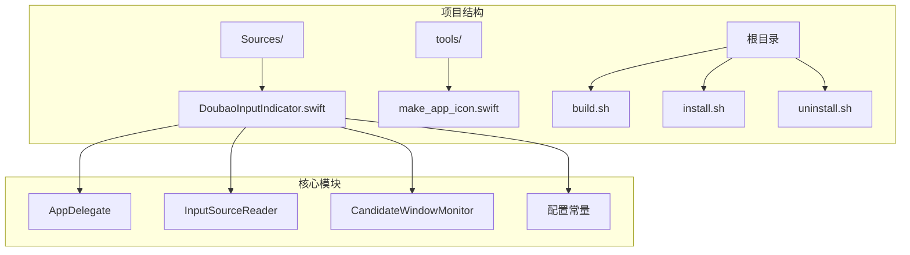

**图表来源**
- [DoubaoInputIndicator.swift:1-1427](file://Sources/DoubaoInputIndicator.swift#L1-L1427)

**章节来源**
- [DoubaoInputIndicator.swift:1-1427](file://Sources/DoubaoInputIndicator.swift#L1-L1427)
- [build.sh:1-117](file://build.sh#L1-L117)

## 核心组件

系统由四个主要组件构成，每个组件都有特定的功能职责：

### 1. AppDelegate - 应用程序主控制器
负责整个应用的生命周期管理、事件监听器安装、状态管理和用户界面更新。

### 2. InputSourceReader - 输入源读取器
提供当前输入法源的信息读取功能，包括输入法ID、名称、bundle ID和输入模式ID。

### 3. CandidateWindowMonitor - 候选窗口监控器
监控输入法候选窗口和模式指示器窗口，用于自动校准输入法状态。

### 4. 配置常量和数据结构
定义应用程序配置、显示模式枚举和版本比较逻辑。

**章节来源**
- [DoubaoInputIndicator.swift:280-1427](file://Sources/DoubaoInputIndicator.swift#L280-L1427)

## 架构概览

系统采用双层事件监听架构，确保高可靠性的Shift键事件检测：

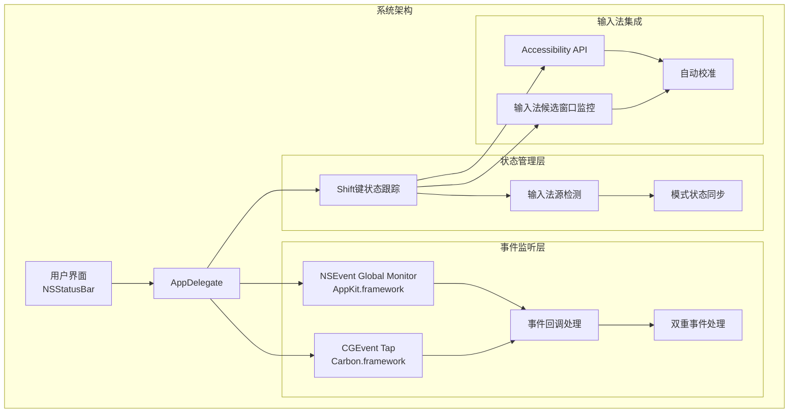

**图表来源**
- [DoubaoInputIndicator.swift:408-480](file://Sources/DoubaoInputIndicator.swift#L408-L480)
- [DoubaoInputIndicator.swift:776-822](file://Sources/DoubaoInputIndicator.swift#L776-L822)

## 详细组件分析

### 全局事件监听器实现

系统实现了双重事件监听策略，确保在各种情况下都能准确捕获Shift键事件：

#### CGEvent Tap配置

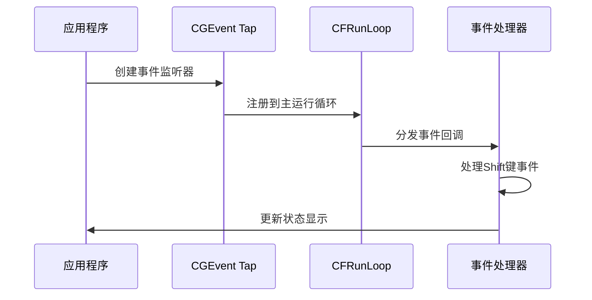

**图表来源**
- [DoubaoInputIndicator.swift:408-456](file://Sources/DoubaoInputIndicator.swift#L408-L456)

#### NSEvent Global Monitor配置

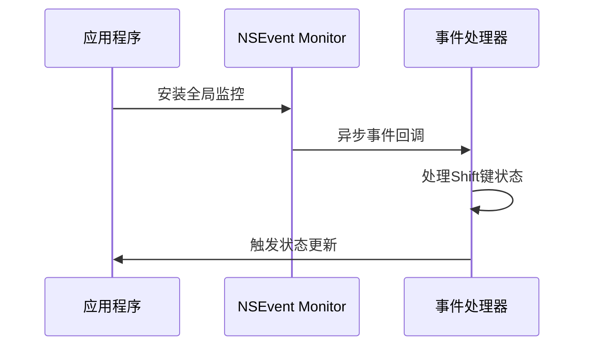

**图表来源**
- [DoubaoInputIndicator.swift:470-480](file://Sources/DoubaoInputIndicator.swift#L470-L480)

**章节来源**
- [DoubaoInputIndicator.swift:408-480](file://Sources/DoubaoInputIndicator.swift#L408-L480)

### Shift键状态检测算法

系统实现了复杂的Shift键状态检测算法，包括设备级修饰符标志检查、左右Shift键区分和状态同步机制。

#### 改进的 Shift 键检测机制

**更新** 系统采用了新的 `isSpecificShiftDown` 方法来检测 Shift 键状态，该方法通过分析事件中的设备级修饰符标志来确定具体按键的状态，相比传统的 `CGEventSource.keyState` 更加准确。

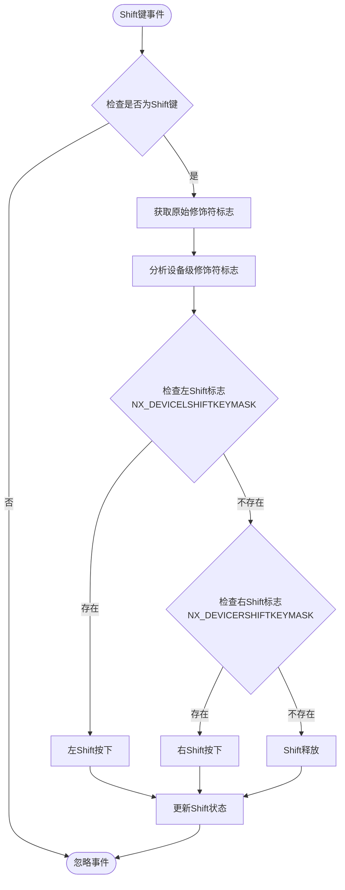

**图表来源**
- [DoubaoInputIndicator.swift:763-774](file://Sources/DoubaoInputIndicator.swift#L763-L774)

#### 设备级修饰符标志检查

系统通过 `isSpecificShiftDown` 方法实现精确的设备级修饰符标志检查：

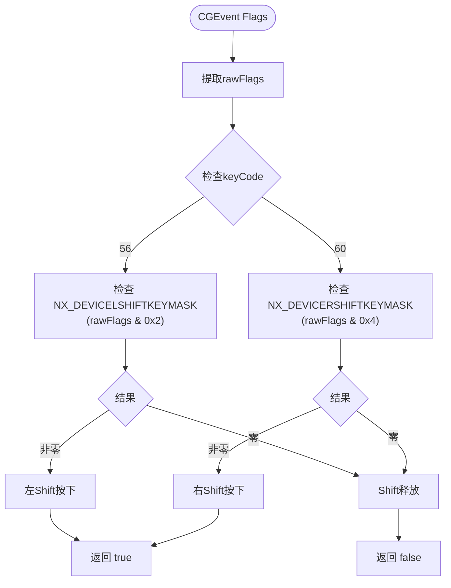

**图表来源**
- [DoubaoInputIndicator.swift:763-774](file://Sources/DoubaoInputIndicator.swift#L763-L774)

#### 左右Shift键区分机制

系统通过设备级修饰符标志精确区分左右Shift键：

| 修饰符标志 | 对应按键 | 二进制值 | 十六进制值 | 说明 |
|-----------|----------|----------|------------|------|
| NX_DEVICELSHIFTKEYMASK | 左Shift键 | 0010 | 0x2 | keyCode == 56 |
| NX_DEVICERSHIFTKEYMASK | 右Shift键 | 0100 | 0x4 | keyCode == 60 |

**更新** 这种方法比使用 `CGEventSource.keyState` 更可靠，因为它反映的是事件发生时刻的按键状态，而不是事件处理完成后的瞬时状态。

**章节来源**
- [DoubaoInputIndicator.swift:763-774](file://Sources/DoubaoInputIndicator.swift#L763-L774)

### Shift键触发的输入法切换检测逻辑

系统实现了智能的输入法切换检测逻辑，包括按键去重、时间窗口控制和状态标记更新。

#### 按键去重机制

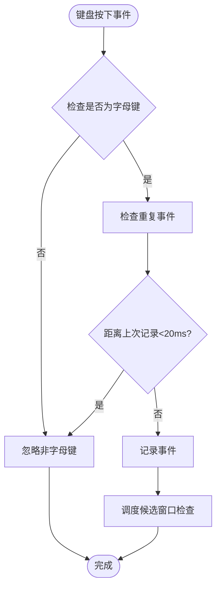

**图表来源**
- [DoubaoInputIndicator.swift:634-663](file://Sources/DoubaoInputIndicator.swift#L634-L663)

#### 时间窗口控制

系统使用多个时间阈值来确保准确的状态检测：

| 功能 | 时间阈值 | 用途 |
|------|----------|------|
| 启动期事件忽略 | 1.0秒 | 避免启动时的误触发 |
| 字母键重复检测 | 0.02秒 | 去除CGEvent和NSEvent的重复事件 |
| 候选窗口检查延迟 | 0.25秒 | 等待候选窗口完全显示 |
| 自动校准冷却期 | 2.0秒 | 防止频繁的自动校准 |
| 快速验证间隔 | 0.15-0.7秒 | Shift切换后的快速验证 |
| Shift切换去抖动 | 0.35秒 | 防止快速连续切换 |

**章节来源**
- [DoubaoInputIndicator.swift:283-329](file://Sources/DoubaoInputIndicator.swift#L283-L329)

### 状态管理与同步机制

系统实现了复杂的状态管理系统，确保Shift键状态与输入法实际状态保持同步。

#### Shift键状态跟踪

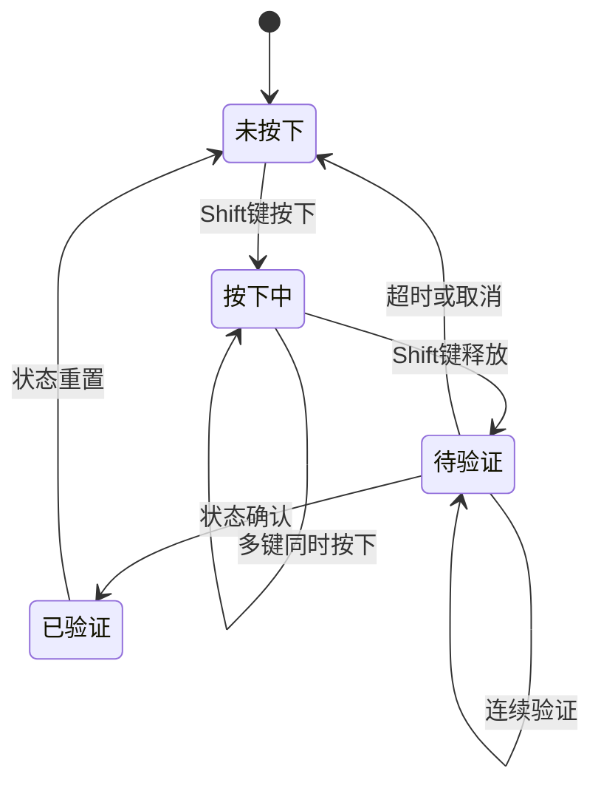

**图表来源**
- [DoubaoInputIndicator.swift:866-980](file://Sources/DoubaoInputIndicator.swift#L866-L980)

#### 输入法源检测与切换

系统能够检测输入法源的变化并相应调整Shift键行为：

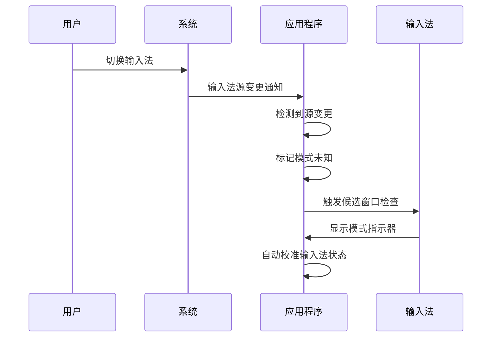

**图表来源**
- [DoubaoInputIndicator.swift:776-814](file://Sources/DoubaoInputIndicator.swift#L776-L814)

**章节来源**
- [DoubaoInputIndicator.swift:866-1022](file://Sources/DoubaoInputIndicator.swift#L866-L1022)

### 错误恢复机制

系统实现了完善的错误恢复机制，确保在各种异常情况下都能正常运行：

#### 事件监听器恢复

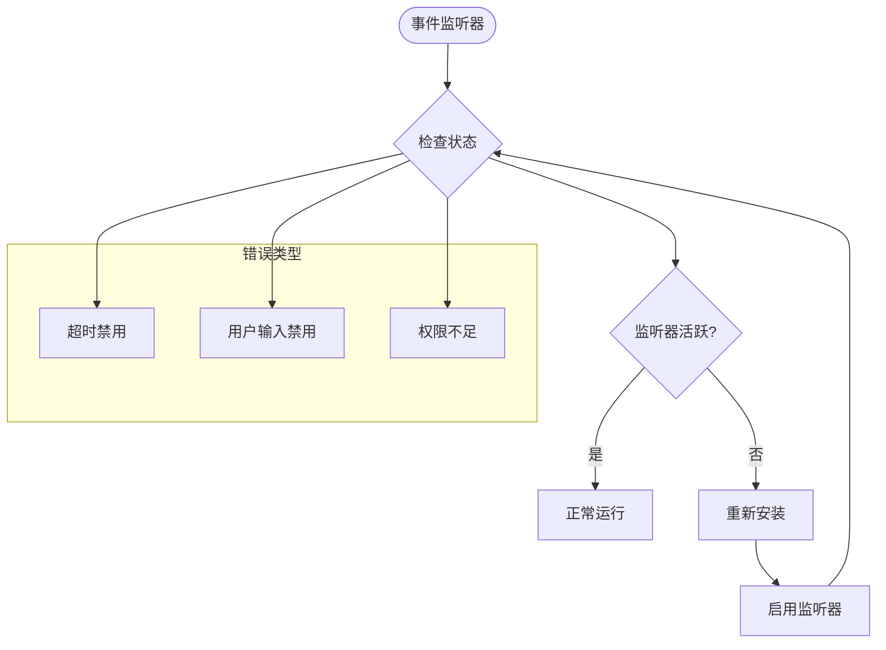

**图表来源**
- [DoubaoInputIndicator.swift:733-747](file://Sources/DoubaoInputIndicator.swift#L733-L747)

**章节来源**
- [DoubaoInputIndicator.swift:733-747](file://Sources/DoubaoInputIndicator.swift#L733-L747)

## 依赖关系分析

系统依赖于多个苹果框架和API：

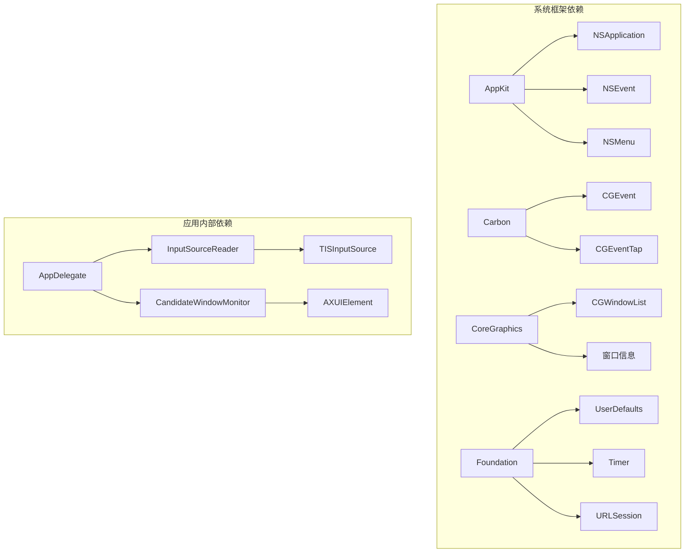

**图表来源**
- [DoubaoInputIndicator.swift:1-6](file://Sources/DoubaoInputIndicator.swift#L1-L6)

**章节来源**
- [DoubaoInputIndicator.swift:1-6](file://Sources/DoubaoInputIndicator.swift#L1-L6)

## 性能考虑

系统在设计时充分考虑了性能优化：

### 内存管理
- 使用弱引用避免循环引用
- 及时清理定时器和监听器
- 合理使用Set和字典进行状态存储

### CPU使用率优化
- 事件去重减少不必要的处理
- 条件检查避免无效操作
- 定时器延迟执行减少CPU占用

### 内存使用优化
- 使用结构体而非类进行状态存储
- 及时释放不需要的对象
- 合理使用闭包避免内存泄漏

## 故障排除指南

### 常见问题及解决方案

#### 1. Shift键事件未被检测到

**可能原因：**
- 输入监控权限未授予
- 事件监听器安装失败
- 系统权限设置问题

**解决步骤：**
1. 检查输入监控权限状态
2. 重新安装事件监听器
3. 重启应用程序

#### 2. 输入法状态不同步

**可能原因：**
- 候选窗口检测失败
- Accessibility权限不足
- 输入法源切换频繁

**解决步骤：**
1. 手动校准输入法状态
2. 检查Accessibility权限
3. 等待自动校准完成

#### 3. 应用程序崩溃或无响应

**可能原因：**
- 事件处理中的异常
- 内存泄漏
- 线程安全问题

**解决步骤：**
1. 检查日志文件
2. 重启应用程序
3. 更新到最新版本

**章节来源**
- [DoubaoInputIndicator.swift:1174-1284](file://Sources/DoubaoInputIndicator.swift#L1174-L1284)

## 结论

Shift键事件追踪系统是一个设计精良的macOS应用程序，通过双重事件监听策略实现了高精度的Shift键状态检测。系统的主要优势包括：

1. **可靠性高**：双重监听策略确保在各种情况下都能准确检测Shift键事件
2. **智能化**：自动校准机制和去重算法减少了误判
3. **用户友好**：直观的状态显示和权限管理
4. **可维护性**：清晰的代码结构和完善的错误处理

**更新** 系统采用了先进的 `isSpecificShiftDown` 方法，通过分析设备级修饰符标志而非传统的 `CGEventSource.keyState`，提供了更准确、更可靠的Shift键状态检测。这种改进使得系统能够精确区分左右Shift键，并在事件发生时刻准确反映按键状态，显著提升了用户体验。

该系统为中文输入法用户提供了一个可靠的Shift键切换辅助工具，通过精确的状态检测和智能的校准机制，显著提升了用户体验。