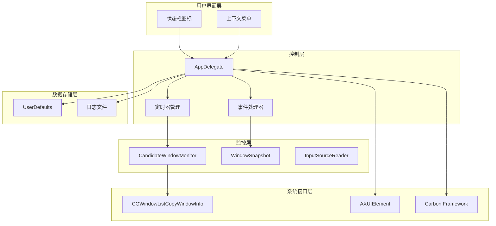
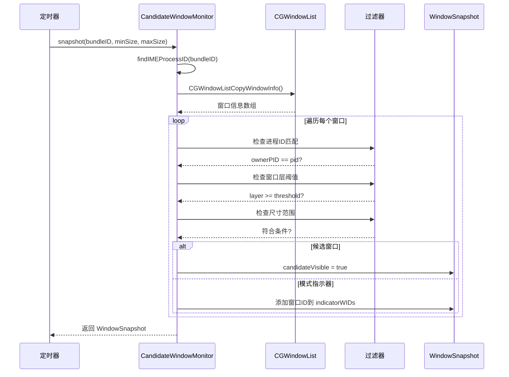
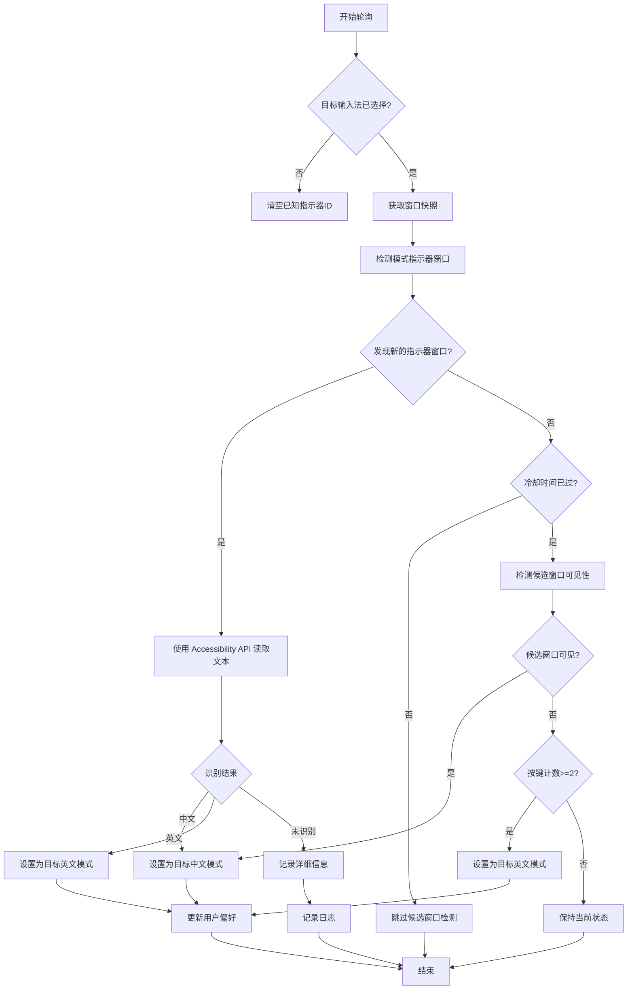
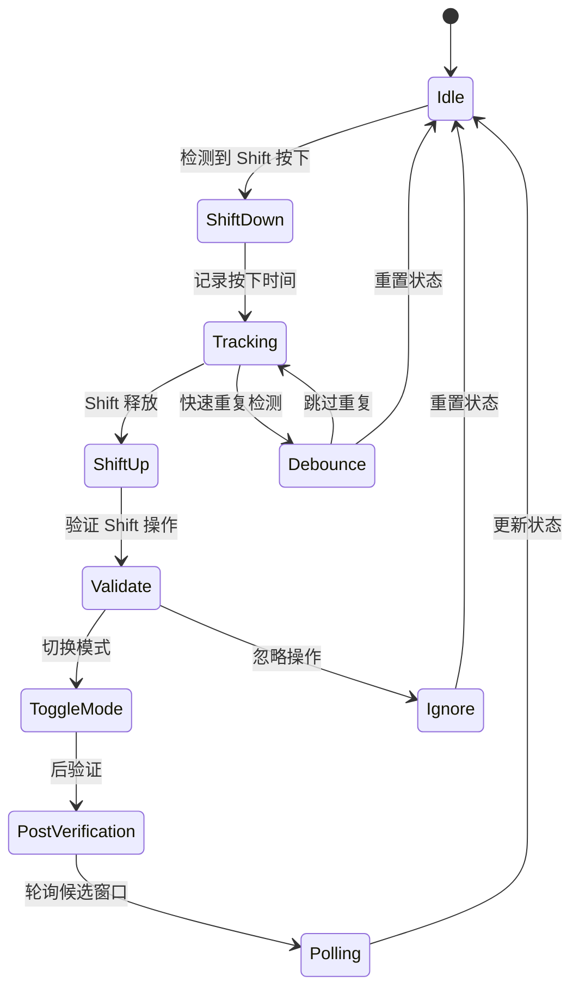
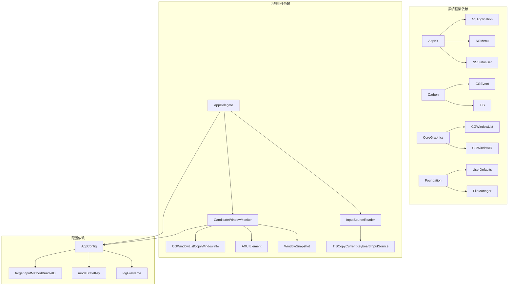

# 候选项窗口监控

<cite>
**本文档引用的文件**
- [DoubaoInputIndicator.swift](file://Sources/DoubaoInputIndicator.swift)
- [build.sh](file://build.sh)
- [install.sh](file://install.sh)
- [uninstall.sh](file://uninstall.sh)
</cite>

## 更新摘要
**变更内容**
- 新增了完整的候选窗口监控架构分析
- 详细介绍了 CandidateWindowMonitor 类的设计和实现
- 新增了 WindowSnapshot 数据结构的技术规范
- 深入分析了高度阈值检测算法和指示器窗口跟踪机制
- 更新了 Accessibility API 在模式指示器读取中的应用
- 完善了自动校准算法和 Shift 键处理机制

## 目录
1. [简介](#简介)
2. [项目结构](#项目结构)
3. [核心组件](#核心组件)
4. [架构概览](#架构概览)
5. [详细组件分析](#详细组件分析)
6. [依赖关系分析](#依赖关系分析)
7. [性能考虑](#性能考虑)
8. [故障排除指南](#故障排除指南)
9. [结论](#结论)

## 简介

这是一个基于 macOS 平台的输入法模式指示器应用程序，专门用于监控候选项窗口并自动检测输入法的中英文模式状态。该系统通过全新的窗口监控架构实现精确的模式识别，包括基于 CGWindowListCopyWindowInfo API 的窗口扫描、窗口层检测、尺寸过滤、进程ID匹配以及 Accessibility API 文本读取。

该应用程序支持两种主流输入法：豆包输入法（Doubao）和微信输入法（WeType），并通过精心设计的 CandidateWindowMonitor 类实现智能的模式识别功能。系统引入了全新的 WindowSnapshot 数据结构来统一管理窗口监控结果，并通过高度阈值检测和指示器窗口跟踪机制提高了检测精度。

## 项目结构

项目采用现代化的单文件架构设计，主要包含以下核心组件：

```mermaid
graph TB
subgraph "应用程序结构"
A[DoubaoInputIndicator.swift<br/>主应用程序文件"]
B[build.sh<br/>构建脚本]
C[install.sh<br/>安装脚本]
D[uninstall.sh<br/>卸载脚本]
end
subgraph "核心监控组件"
E[CandidateWindowMonitor<br/>候选项窗口监控器]
F[WindowSnapshot<br/>窗口快照数据结构]
G[InputSourceReader<br/>输入源读取器]
H[AppDelegate<br/>应用程序委托]
end
A --> E
A --> F
A --> G
A --> H
B --> A
C --> A
D --> A
```

**图表来源**
- [DoubaoInputIndicator.swift:133-278](file://Sources/DoubaoInputIndicator.swift#L133-L278)
- [DoubaoInputIndicator.swift:104-131](file://Sources/DoubaoInputIndicator.swift#L104-L131)
- [DoubaoInputIndicator.swift:280-1427](file://Sources/DoubaoInputIndicator.swift#L280-L1427)

**章节来源**
- [DoubaoInputIndicator.swift:1-1427](file://Sources/DoubaoInputIndicator.swift#L1-L1427)
- [build.sh:1-117](file://build.sh#L1-L117)
- [install.sh:1-60](file://install.sh#L1-L60)
- [uninstall.sh:1-30](file://uninstall.sh#L1-L30)

## 核心组件

### CandidateWindowMonitor 类

`CandidateWindowMonitor` 是系统的核心监控组件，负责通过 CGWindowListCopyWindowInfo API 扫描屏幕上的输入法窗口。该类实现了完整的窗口监控架构，包括以下关键功能：

#### 窗口层检测机制
- 使用 `candidateLayerThreshold` 阈值（约 21.47 亿）来识别输入法的高层数窗口
- 豆包输入法使用层 2,147,483,628，微信输入法使用层 2,147,483,628 和 2,147,483,629
- 过滤掉桌面元素和其他非输入法相关的窗口

#### 尺寸过滤算法
- `minimumCandidateWindowHeight` 设置为 40pt，过滤掉工具栏等小尺寸窗口
- 模式指示器窗口尺寸约束：最小 15pt，最大 50pt
- 区分候选面板（高大窗口）和模式指示器（小尺寸窗口）

#### 进程ID匹配机制
- 通过 `findIMEProcessID` 方法根据 bundle ID 查找目标输入法进程
- 使用 `NSWorkspace.shared.runningApplications` 获取运行的应用程序列表
- 精确匹配目标输入法的 bundle identifier

#### WindowSnapshot 数据结构
- `candidateVisible`: 布尔值，表示高大候选面板是否可见
- `indicatorWIDs`: Set<CGWindowID>，包含小尺寸指示器窗口的窗口ID集合
- 提供统一的窗口监控结果封装

**章节来源**
- [DoubaoInputIndicator.swift:133-278](file://Sources/DoubaoInputIndicator.swift#L133-L278)

### InputSourceReader 类

负责读取当前的输入源信息，包括：
- 当前键盘输入源的 ID、名称、bundle ID 和输入模式 ID
- 使用 TIS（Text Input System）框架获取输入源信息
- 提供字符串属性的辅助方法

**章节来源**
- [DoubaoInputIndicator.swift:104-131](file://Sources/DoubaoInputIndicator.swift#L104-L131)

### AppDelegate 类

应用程序的主要委托类，负责：
- 状态栏图标管理和菜单系统
- 定时器调度和事件处理
- Accessibility 权限请求和管理
- 输入监控权限的处理

## 架构概览

系统采用分层架构设计，各组件职责明确，通过 CandidateWindowMonitor 实现统一的窗口监控：



**图表来源**
- [DoubaoInputIndicator.swift:280-1427](file://Sources/DoubaoInputIndicator.swift#L280-L1427)
- [DoubaoInputIndicator.swift:133-278](file://Sources/DoubaoInputIndicator.swift#L133-L278)

## 详细组件分析

### 候选项窗口扫描流程

候选项窗口监控的核心流程通过 CandidateWindowMonitor 实现：



**图表来源**
- [DoubaoInputIndicator.swift:165-212](file://Sources/DoubaoInputIndicator.swift#L165-L212)
- [DoubaoInputIndicator.swift:172-208](file://Sources/DoubaoInputIndicator.swift#L172-L208)

### Accessibility API 模式识别

系统使用 Accessibility API 进行模式指示器读取，通过递归遍历 UI 元素树来识别中英文模式：

```mermaid
flowchart TD
A[开始 Accessibility 识别] --> B[创建 AXUIElement 应用程序对象]
B --> C[递归遍历 UI 元素树]
C --> D[深度限制 (maxDepth: 5)]
D --> E{达到深度限制?}
E --> |是| F[返回结果]
E --> |否| G[收集文本属性]
G --> H{成功获取文本?}
H --> |是| I[添加到文本列表]
H --> |否| J[检查子元素]
I --> K[检查下一个元素]
J --> L[获取子元素列表]
L --> M{有子元素?}
M --> |是| N[递归遍历子元素]
M --> |否| K
N --> C
K --> C
F --> O[模式识别]
O --> P{包含"中"字符?}
P --> |是| Q[识别为中文模式]
P --> |否| R{包含"英"字符?}
R --> |是| S[识别为英文模式]
R --> |否| T[识别为未识别]
Q --> U[返回结果]
S --> U
T --> U
```

**图表来源**
- [DoubaoInputIndicator.swift:233-277](file://Sources/DoubaoInputIndicator.swift#L233-L277)
- [DoubaoInputIndicator.swift:252-276](file://Sources/DoubaoInputIndicator.swift#L252-L276)

### 自动校准算法

系统实现了多阶段的自动校准机制，通过指示器窗口跟踪和候选窗口检测实现：



**图表来源**
- [DoubaoInputIndicator.swift:544-620](file://Sources/DoubaoInputIndicator.swift#L544-L620)
- [DoubaoInputIndicator.swift:669-716](file://Sources/DoubaoInputIndicator.swift#L669-L716)

### Shift 键处理机制

系统实现了复杂的 Shift 键处理逻辑，通过多层验证确保模式切换的准确性：



**图表来源**
- [DoubaoInputIndicator.swift:866-991](file://Sources/DoubaoInputIndicator.swift#L866-L991)

**章节来源**
- [DoubaoInputIndicator.swift:544-716](file://Sources/DoubaoInputIndicator.swift#L544-L716)
- [DoubaoInputIndicator.swift:866-991](file://Sources/DoubaoInputIndicator.swift#L866-L991)

## 依赖关系分析

系统的关键依赖关系通过新的架构得到优化：



**图表来源**
- [DoubaoInputIndicator.swift:1-6](file://Sources/DoubaoInputIndicator.swift#L1-L6)
- [DoubaoInputIndicator.swift:40-102](file://Sources/DoubaoInputIndicator.swift#L40-L102)

### 外部依赖项

系统依赖于以下 macOS 系统框架：
- **AppKit**: 用户界面和状态栏管理
- **Carbon**: 低级事件处理和输入监控
- **CoreGraphics**: 窗口信息获取和图形系统交互
- **Foundation**: 数据持久化和文件管理

### 内部组件耦合

组件间的耦合关系通过 CandidateWindowMonitor 实现集中管理：
- `AppDelegate` 与 `CandidateWindowMonitor` 通过静态方法调用
- `CandidateWindowMonitor` 与 `InputSourceReader` 无直接依赖
- 所有组件共享 `AppConfig` 配置实例
- `WindowSnapshot` 作为统一的数据传输格式

**章节来源**
- [DoubaoInputIndicator.swift:1-6](file://Sources/DoubaoInputIndicator.swift#L1-L6)
- [DoubaoInputIndicator.swift:40-102](file://Sources/DoubaoInputIndicator.swift#L40-L102)

## 性能考虑

### 窗口扫描优化

系统采用了多项性能优化策略：

1. **窗口过滤优化**
   - 使用 `kCGWindowOwnerPID` 快速过滤非目标进程窗口
   - 层次阈值检查避免不必要的尺寸计算
   - 早期返回机制减少无效计算

2. **内存管理**
   - 使用 `takeRetainedValue()` 正确管理 Core Foundation 对象生命周期
   - 及时释放临时变量和集合类型
   - WindowSnapshot 提供高效的窗口ID集合管理

3. **定时器优化**
   - 0.3 秒轮询间隔平衡准确性与性能
   - 冷却时间机制防止频繁重复检查
   - 指示器窗口跟踪减少不必要的 Accessibility API 调用

### Accessibility API 优化

- **深度限制**: 最大递归深度为 5，避免深度遍历导致的性能问题
- **文本收集**: 仅收集必要的文本属性（value、title、description）
- **早期退出**: 一旦找到目标文本立即停止遍历
- **指示器窗口优先**: 通过窗口ID集合优先处理最近出现的指示器窗口

## 故障排除指南

### 常见问题及解决方案

#### Accessibility 权限问题
**症状**: 模式识别不准确或完全失效
**原因**: 未授予 Accessibility 权限
**解决方案**: 
1. 检查 `AXIsProcessTrusted()` 返回值
2. 引导用户手动授予权限
3. 在菜单中提供权限设置链接

#### 输入监控权限问题
**症状**: Shift 键切换功能不可用
**原因**: 未授予输入监控权限
**解决方案**:
1. 检查 `CGPreflightListenEventAccess()` 和 `CGRequestListenEventAccess()`
2. 提供权限检查和重新授权功能
3. 显示清晰的错误提示

#### 窗口扫描失败
**症状**: 无法检测到候选项窗口
**原因**: CGWindowListCopyWindowInfo 调用失败
**解决方案**:
1. 检查返回值类型转换
2. 验证窗口信息字典结构
3. 实施降级策略

#### 日志分析

系统会将详细日志写入用户目录下的日志文件：
- 豆包输入法: `~/Library/Logs/DoubaoInputIndicator.log`
- 微信输入法: `~/Library/Logs/WeTypeInputIndicator.log`

**章节来源**
- [DoubaoInputIndicator.swift:379-383](file://Sources/DoubaoInputIndicator.swift#L379-L383)
- [DoubaoInputIndicator.swift:389-406](file://Sources/DoubaoInputIndicator.swift#L389-L406)
- [DoubaoInputIndicator.swift:1405-1420](file://Sources/DoubaoInputIndicator.swift#L1405-L1420)

## 结论

该候选项窗口监控系统通过全新的架构设计，实现了对输入法模式状态的高精度识别。系统的核心优势包括：

1. **模块化设计**: 通过 CandidateWindowMonitor 类实现功能模块化，提高了代码的可维护性和可测试性
2. **统一数据结构**: WindowSnapshot 数据结构提供了标准化的窗口监控结果封装
3. **智能过滤**: 通过层次阈值、尺寸过滤和进程匹配，精确识别目标窗口
4. **多源验证**: 结合窗口扫描和 Accessibility API 两种检测方式，提高识别准确性
5. **自适应校准**: 支持自动和手动模式校准，适应不同输入法的行为差异
6. **性能优化**: 采用多种优化策略，在保证准确性的同时控制资源消耗

该系统为开发者提供了完整的实现参考，展示了如何在 macOS 平台上高效地监控和识别输入法状态，具有良好的可扩展性和维护性。新的架构设计不仅提高了系统的稳定性，还为未来的功能扩展奠定了坚实的基础。