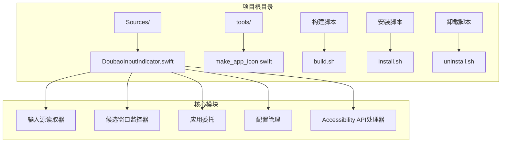
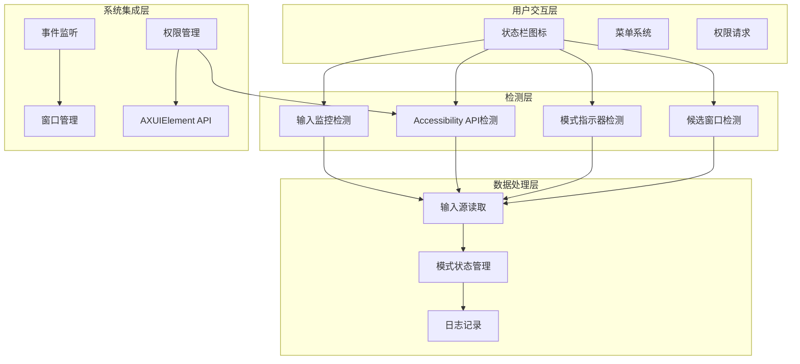
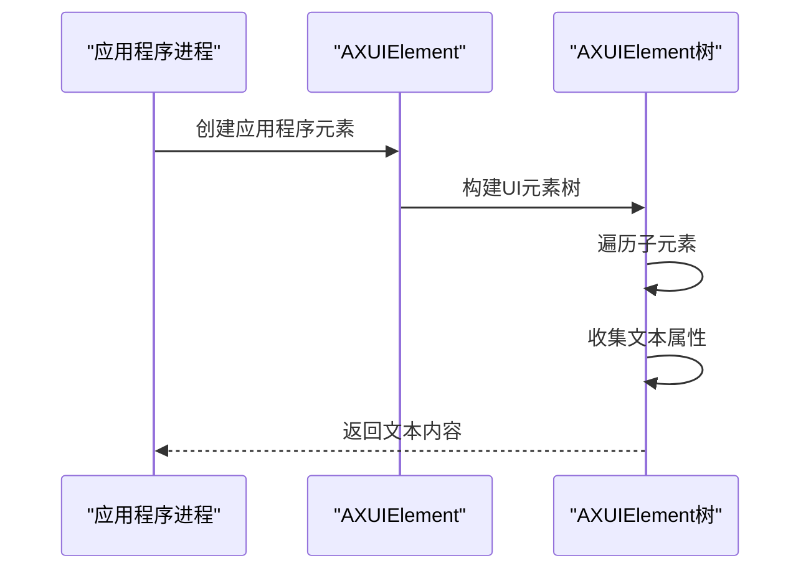
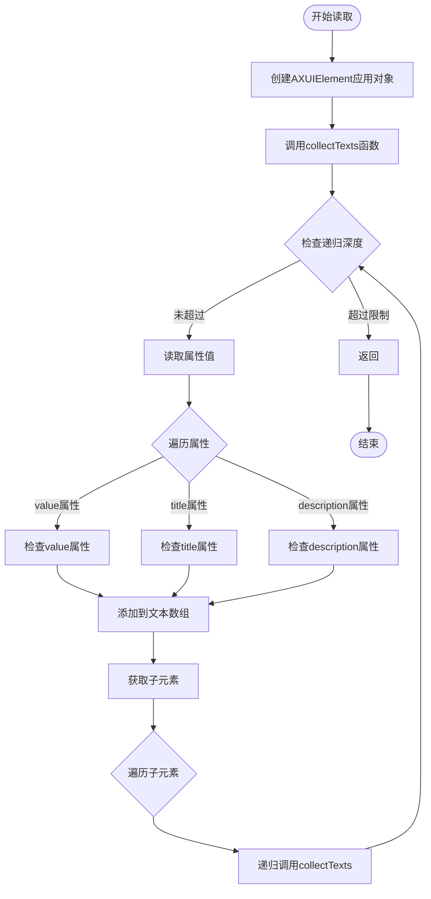
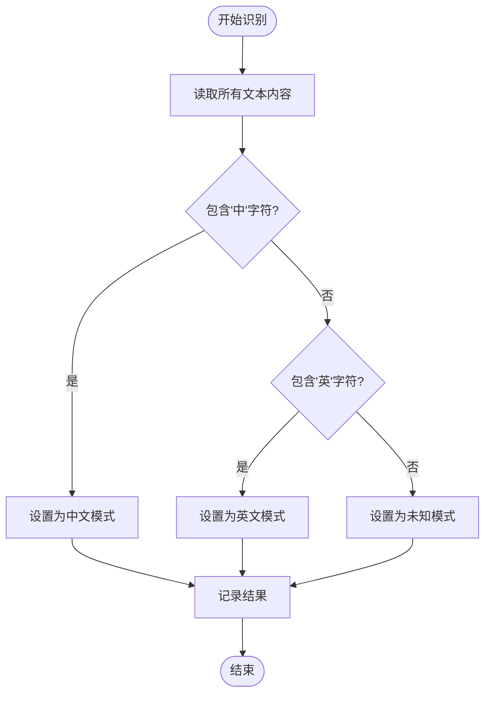
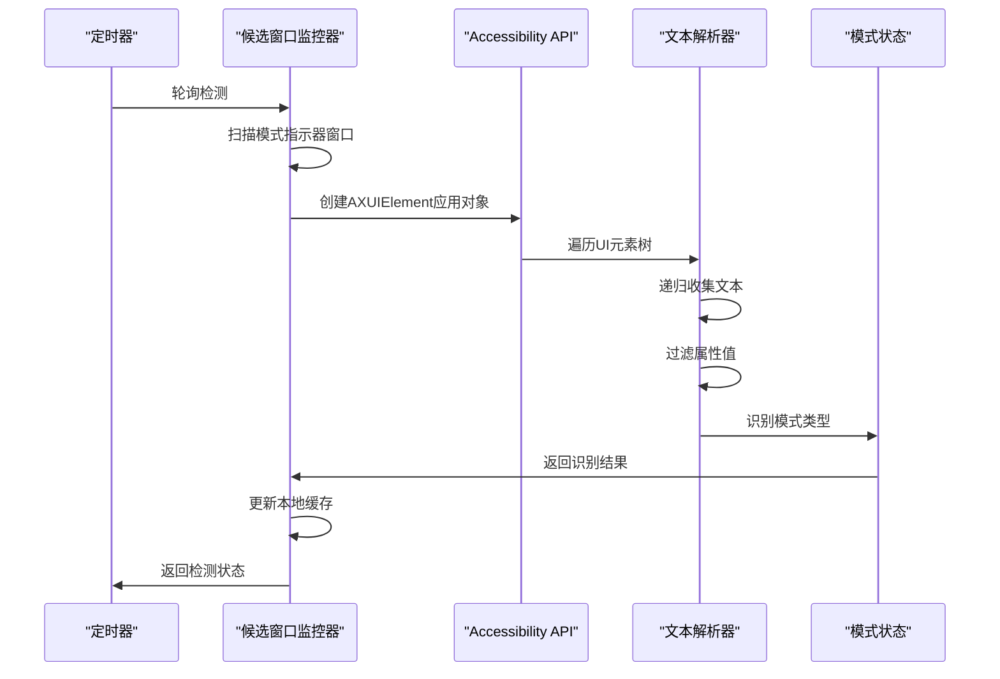
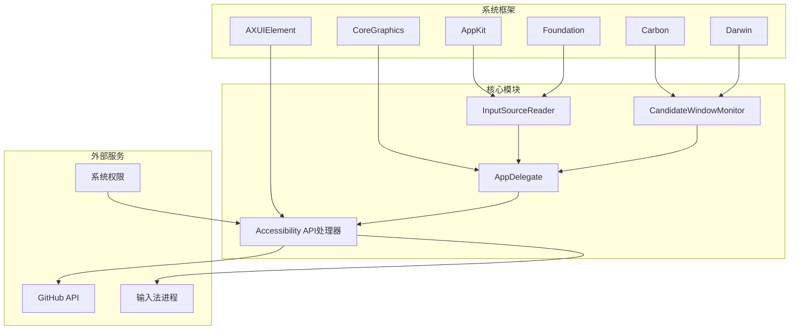

# 模式指示器读取

<cite>
**本文档引用的文件**
- [DoubaoInputIndicator.swift](file://Sources/DoubaoInputIndicator.swift)
- [build.sh](file://build.sh)
- [install.sh](file://install.sh)
- [uninstall.sh](file://uninstall.sh)
- [make_app_icon.swift](file://tools/make_app_icon.swift)
</cite>

## 更新摘要
**变更内容**
- 新增：引入了基于 Accessibility API 的模式指示器读取功能
- 新增：AXUIElement 递归遍历 UI 元素树来准确识别中文/英文模式
- 新增：collectTexts 函数实现递归文本收集算法
- 新增：recognizeModeFromAccessibility 函数实现模式识别逻辑
- 更新：完善了多层检测架构的 Accessibility API 集成

## 目录
1. [简介](#简介)
2. [项目结构](#项目结构)
3. [核心组件](#核心组件)
4. [架构概览](#架构概览)
5. [详细组件分析](#详细组件分析)
6. [依赖关系分析](#依赖关系分析)
7. [性能考虑](#性能考虑)
8. [故障排除指南](#故障排除指南)
9. [结论](#结论)

## 简介

本文档深入解析了Accessibility API在模式指示器读取中的应用。该系统通过macOS的Accessibility API（AXUIElement）来读取输入法应用程序的用户界面元素，从而自动检测当前的中英文输入模式。系统实现了四种主要的模式检测方法：候选窗口检测、模式指示器窗口检测、Accessibility API读取和输入监控检测。

系统的核心功能是自动检测输入法的中英文模式状态，并通过状态栏图标直观显示当前模式。它支持两种输入法：豆包输入法和微信输入法，具有智能的自动校准机制和手动校准选项。**新增的功能**通过AXUIElement递归遍历UI元素树，直接读取输入法显示的"中"/"英"提示文本，这是最准确的模式识别方法。

## 项目结构

该项目采用简洁的单文件架构设计，包含完整的构建和部署脚本：

**图表来源**
- [DoubaoInputIndicator.swift:1-1427](file://Sources/DoubaoInputIndicator.swift#L1-L1427)
- [build.sh:1-117](file://build.sh#L1-L117)
- [install.sh:1-60](file://install.sh#L1-L60)
- [uninstall.sh:1-30](file://uninstall.sh#L1-L30)

## 核心组件

### 输入源读取器（InputSourceReader）

负责获取当前系统输入法的状态信息，包括输入法ID、名称、bundle ID和输入模式ID。

### 候选窗口监控器（CandidateWindowMonitor）

这是系统的核心组件，实现了四种模式检测机制：

1. **候选窗口检测**：通过扫描屏幕上的窗口来判断中文输入模式
2. **模式指示器窗口检测**：专门检测输入法显示的"中"/"英"提示窗口
3. **Accessibility API检测**：使用AXUIElement API直接读取UI元素文本
4. **输入监控检测**：通过键盘事件监控来推断输入模式

### 应用委托（AppDelegate）

管理应用程序的生命周期、菜单系统、权限请求和用户交互。

**章节来源**
- [DoubaoInputIndicator.swift:104-131](file://Sources/DoubaoInputIndicator.swift#L104-L131)
- [DoubaoInputIndicator.swift:133-278](file://Sources/DoubaoInputIndicator.swift#L133-L278)
- [DoubaoInputIndicator.swift:280-1427](file://Sources/DoubaoInputIndicator.swift#L280-L1427)

## 架构概览

系统采用多层检测架构，确保在不同情况下都能准确识别输入法模式：

**图表来源**
- [DoubaoInputIndicator.swift:280-1427](file://Sources/DoubaoInputIndicator.swift#L280-L1427)

## 详细组件分析

### Accessibility API应用详解

#### AXUIElementCreateApplication函数

系统使用`AXUIElementCreateApplication`函数来创建应用程序的AXUIElement对象：

**图表来源**
- [DoubaoInputIndicator.swift:234](file://Sources/DoubaoInputIndicator.swift#L234)

#### AXUIElementCopyAttributeValue属性读取

系统通过`AXUIElementCopyAttributeValue`函数获取元素的关键属性：

**图表来源**
- [DoubaoInputIndicator.swift:252-277](file://Sources/DoubaoInputIndicator.swift#L252-L277)

#### 递归文本收集算法（collectTexts函数）

递归算法实现细节：

**最大递归深度限制**：`maxDepth: 5`
- 防止无限递归和性能问题
- 控制内存使用量
- 限制搜索范围以提高响应性

**属性遍历策略**：
1. 优先检查`kAXValueAttribute`（元素的当前值）
2. 检查`kAXTitleAttribute`（元素标题）
3. 检查`kAXDescriptionAttribute`（元素描述）

**文本内容过滤机制**：
- 只收集非空字符串
- 自动去除空白字符
- 过滤重复内容

**章节来源**
- [DoubaoInputIndicator.swift:229-277](file://Sources/DoubaoInputIndicator.swift#L229-L277)

### 模式识别逻辑

系统实现了基于字符的模式识别规则：

**图表来源**
- [DoubaoInputIndicator.swift:242-247](file://Sources/DoubaoInputIndicator.swift#L242-L247)

**模式识别规则**：
- `'中'`字符识别中文模式
- `'英'`字符识别英文模式
- 默认情况下返回未识别状态

### 完整流程示例

以下展示了从AXUIElement树遍历到最终模式识别的完整流程：

**图表来源**
- [DoubaoInputIndicator.swift:544-620](file://Sources/DoubaoInputIndicator.swift#L544-L620)

**章节来源**
- [DoubaoInputIndicator.swift:544-620](file://Sources/DoubaoInputIndicator.swift#L544-L620)

## 依赖关系分析

系统的主要依赖关系：

**图表来源**
- [DoubaoInputIndicator.swift:1-6](file://Sources/DoubaoInputIndicator.swift#L1-L6)

**章节来源**
- [DoubaoInputIndicator.swift:1-6](file://Sources/DoubaoInputIndicator.swift#L1-L6)

## 性能考虑

### 内存优化策略

1. **递归深度限制**：最大深度5，防止内存泄漏
2. **文本缓存管理**：定期清理无效的窗口ID集合
3. **事件去重**：避免重复处理相同的输入事件
4. **权限检查优化**：仅在必要时执行昂贵的AXUIElement操作

### 响应性优化

1. **定时器间隔**：0.3秒轮询间隔，平衡准确性与性能
2. **异步处理**：网络请求和文件操作使用异步方式
3. **条件检查**：仅在必要时执行昂贵的操作
4. **快速验证机制**：Shift键切换后立即进行多次验证

### 权限管理

1. **最小权限原则**：只请求必要的权限
2. **权限状态跟踪**：实时监控权限状态变化
3. **降级处理**：在权限不足时提供替代方案
4. **权限请求优化**：智能判断何时需要请求权限

## 故障排除指南

### 常见问题及解决方案

**问题1：Accessibility权限未授予**
- 症状：状态栏图标显示警告，Shift键切换失效
- 解决方案：通过菜单项打开系统偏好设置授予权限

**问题2：模式识别不准确**
- 症状：中文模式被错误识别为英文模式
- 解决方案：使用手动校准功能或等待自动校准

**问题3：候选窗口检测失败**
- 症状：无法检测到输入法的候选窗口
- 解决方案：检查输入法设置或重启应用程序

**问题4：Accessibility API读取失败**
- 症状：无法通过AXUIElement读取模式文本
- 解决方案：检查Accessibility权限，尝试重新授权

**问题5：性能问题**
- 症状：应用程序响应缓慢
- 解决方案：检查日志文件，确认是否存在异常循环

**章节来源**
- [DoubaoInputIndicator.swift:379-406](file://Sources/DoubaoInputIndicator.swift#L379-L406)
- [DoubaoInputIndicator.swift:1145-1150](file://Sources/DoubaoInputIndicator.swift#L1145-L1150)

## 结论

该系统通过巧妙结合多种检测技术，实现了高精度的输入法模式识别。**新增的Accessibility API功能**使得系统能够直接读取输入法UI元素的文本内容，这是最可靠的方法。通过`AXUIElementCreateApplication`和`collectTexts`函数的组合，系统能够递归遍历UI元素树，准确识别"中"/"英"提示文本。

同时，候选窗口检测、模式指示器检测和输入监控检测提供了冗余保障，确保在不同情况下都能准确识别输入模式。系统的架构设计体现了良好的可维护性和扩展性，支持两种主流输入法，并为未来支持更多输入法奠定了基础。

通过智能的自动校准机制和用户友好的界面，为用户提供了无缝的使用体验。Accessibility API的引入进一步提升了系统的可靠性，特别是在输入法界面发生变化时仍能保持准确的模式识别能力。