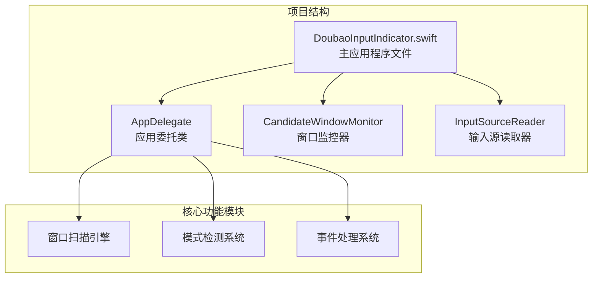
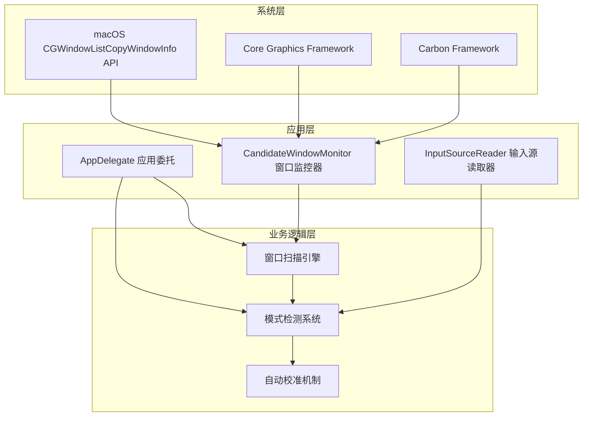
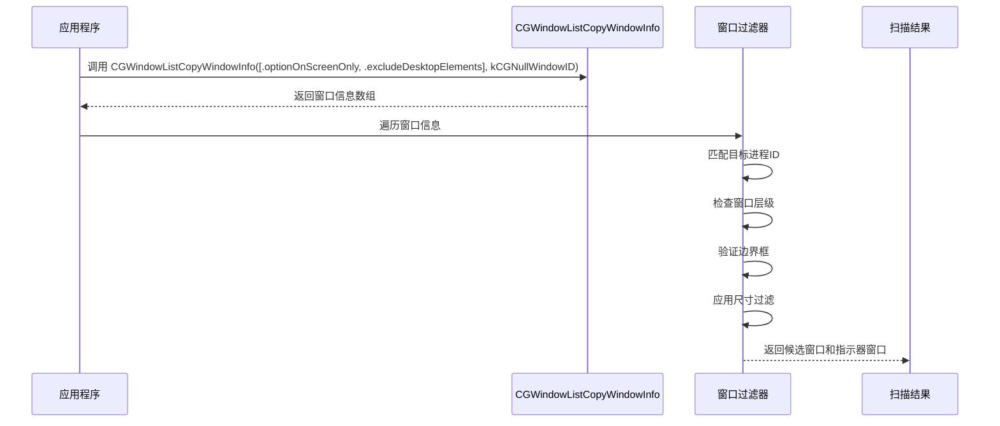
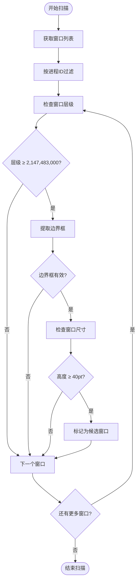
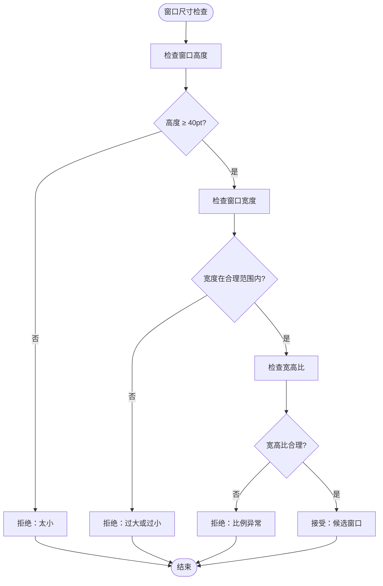
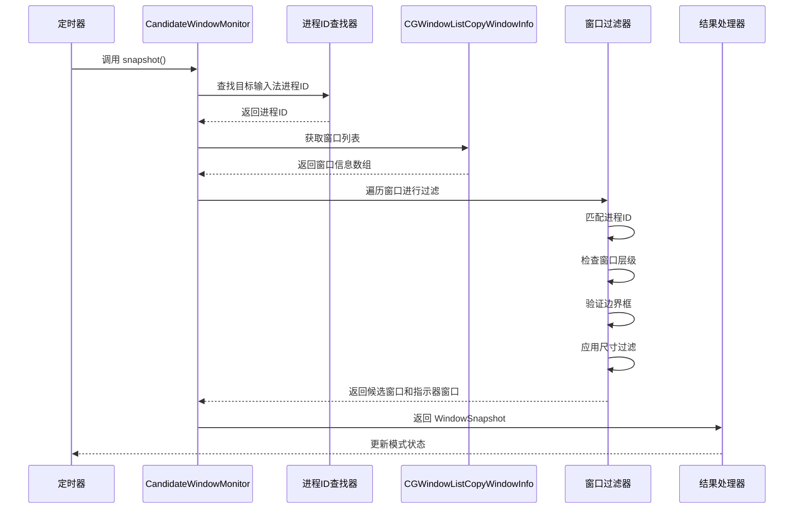
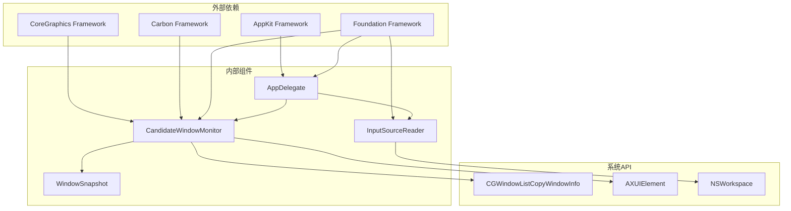

# 窗口扫描引擎

<cite>
**本文档引用的文件**
- [DoubaoInputIndicator.swift](file://Sources/DoubaoInputIndicator.swift)
</cite>

## 目录
1. [简介](#简介)
2. [项目结构](#项目结构)
3. [核心组件](#核心组件)
4. [架构概览](#架构概览)
5. [详细组件分析](#详细组件分析)
6. [依赖关系分析](#依赖关系分析)
7. [性能考虑](#性能考虑)
8. [故障排除指南](#故障排除指南)
9. [结论](#结论)

## 简介

本文档深入解析了输入指示器应用中的窗口扫描引擎核心实现机制。该引擎专门用于检测和识别输入法候选窗口，特别是针对中文输入法的候选面板和模式指示器窗口。通过使用 macOS 的 CGWindowListCopyWindowInfo API 和窗口层检测算法，系统能够准确区分候选窗口和工具栏窗口，并提供可靠的中英文模式检测功能。

## 项目结构

输入指示器项目采用简洁的单文件架构设计，所有核心逻辑都集中在 `Sources/DoubaoInputIndicator.swift` 文件中。该文件包含了完整的窗口扫描引擎实现，包括窗口列表获取、进程ID匹配、边界框提取和窗口属性验证等功能。

**图表来源**
- [DoubaoInputIndicator.swift:1-1410](file://Sources/DoubaoInputIndicator.swift#L1-L1410)

**章节来源**
- [DoubaoInputIndicator.swift:1-1410](file://Sources/DoubaoInputIndicator.swift#L1-L1410)

## 核心组件

窗口扫描引擎由多个关键组件构成，每个组件都有特定的功能和职责：

### CandidateWindowMonitor 类
这是窗口扫描引擎的核心类，负责：
- 进程ID查找和匹配
- 窗口列表获取和过滤
- 窗口层检测算法
- 尺寸过滤机制
- 候选窗口可见性判断

### WindowSnapshot 结构体
封装窗口扫描结果的数据结构，包含：
- `candidateVisible`: 候选面板可见性标志
- `indicatorWIDs`: 模式指示器窗口ID集合

### AppConfig 结构体
应用配置管理，包含目标输入法的Bundle ID等关键信息。

**章节来源**
- [DoubaoInputIndicator.swift:133-278](file://Sources/DoubaoInputIndicator.swift#L133-L278)
- [DoubaoInputIndicator.swift:156-161](file://Sources/DoubaoInputIndicator.swift#L156-L161)
- [DoubaoInputIndicator.swift:40-47](file://Sources/DoubaoInputIndicator.swift#L40-L47)

## 架构概览

窗口扫描引擎采用分层架构设计，从底层的窗口系统调用到高层的应用逻辑，形成了清晰的职责分离。

**图表来源**
- [DoubaoInputIndicator.swift:172-177](file://Sources/DoubaoInputIndicator.swift#L172-L177)
- [DoubaoInputIndicator.swift:280-362](file://Sources/DoubaoInputIndicator.swift#L280-L362)

## 详细组件分析

### CGWindowListCopyWindowInfo API 使用详解

窗口扫描引擎使用 macOS 的 CGWindowListCopyWindowInfo API 来获取当前屏幕上的所有窗口信息。该 API 提供了丰富的窗口元数据，包括窗口位置、大小、层级和所有者进程等信息。

#### 参数配置

API 调用使用了两个关键选项：

1. **optionOnScreenOnly**: 仅返回当前屏幕上的窗口，排除其他显示器的窗口
2. **excludeDesktopElements**: 排除桌面元素（如菜单栏、Dock 等）

这些选项确保了扫描结果的精确性和相关性，避免了不必要的系统界面干扰。

#### 返回数据结构解析

API 返回的数据是一个包含字典的数组，每个字典代表一个窗口的信息。主要字段包括：

- `kCGWindowOwnerPID`: 窗口所有者的进程ID
- `kCGWindowLayer`: 窗口的显示层级
- `kCGWindowBounds`: 窗口的边界框信息
- `kCGWindowNumber`: 窗口ID

**图表来源**
- [DoubaoInputIndicator.swift:172-177](file://Sources/DoubaoInputIndicator.swift#L172-L177)
- [DoubaoInputIndicator.swift:182-212](file://Sources/DoubaoInputIndicator.swift#L182-L212)

**章节来源**
- [DoubaoInputIndicator.swift:172-177](file://Sources/DoubaoInputIndicator.swift#L172-L177)
- [DoubaoInputIndicator.swift:182-212](file://Sources/DoubaoInputIndicator.swift#L182-L212)

### 窗口层检测算法

窗口扫描引擎使用基于窗口层级的检测算法来识别输入法候选窗口。该算法的核心是设置一个非常高的层级阈值。

#### 算法原理

**图表来源**
- [DoubaoInputIndicator.swift:139-146](file://Sources/DoubaoInputIndicator.swift#L139-L146)
- [DoubaoInputIndicator.swift:187-208](file://Sources/DoubaoInputIndicator.swift#L187-L208)

#### 为什么选择如此高的图层阈值

选择 2,147,483,000 作为层级阈值有以下原因：

1. **接近 INT32_MAX**: 这个值非常接近 32 位整数的最大值，确保只捕获最顶层的窗口
2. **输入法候选窗口特性**: 中文输入法的候选面板通常位于系统 UI 层之上
3. **避免误检**: 过高的阈值可以有效避免误检其他系统窗口
4. **稳定性保证**: 这个阈值在不同版本的 macOS 中都保持稳定

**章节来源**
- [DoubaoInputIndicator.swift:135-140](file://Sources/DoubaoInputIndicator.swift#L135-L140)
- [DoubaoInputIndicator.swift:187-190](file://Sources/DoubaoInputIndicator.swift#L187-L190)

### 窗口尺寸过滤机制

为了区分候选面板和工具栏窗口，窗口扫描引擎实现了基于尺寸的过滤机制。

#### 过滤策略

**图表来源**
- [DoubaoInputIndicator.swift:142-146](file://Sources/DoubaoInputIndicator.swift#L142-L146)
- [DoubaoInputIndicator.swift:197-207](file://Sources/DoubaoInputIndicator.swift#L197-L207)

#### 设计考量

1. **最小高度限制**: 40pt 的最小高度可以有效过滤掉工具栏窗口
2. **输入法特性**: 候选面板通常比工具栏高得多
3. **平台差异**: 不同输入法可能有不同的窗口尺寸特征
4. **误检防护**: 多重条件确保只有真正的候选窗口被识别

**章节来源**
- [DoubaoInputIndicator.swift:142-146](file://Sources/DoubaoInputIndicator.swift#L142-L146)
- [DoubaoInputIndicator.swift:197-207](file://Sources/DoubaoInputIndicator.swift#L197-L207)

### 完整的窗口扫描流程

下面展示了完整的窗口扫描流程，包括进程ID匹配、边界框提取和窗口属性验证：

**图表来源**
- [DoubaoInputIndicator.swift:165-212](file://Sources/DoubaoInputIndicator.swift#L165-L212)
- [DoubaoInputIndicator.swift:544-620](file://Sources/DoubaoInputIndicator.swift#L544-L620)

**章节来源**
- [DoubaoInputIndicator.swift:165-212](file://Sources/DoubaoInputIndicator.swift#L165-L212)
- [DoubaoInputIndicator.swift:544-620](file://Sources/DoubaoInputIndicator.swift#L544-L620)

## 依赖关系分析

窗口扫描引擎的依赖关系相对简单但功能明确，主要依赖于系统框架和应用内部组件。

**图表来源**
- [DoubaoInputIndicator.swift:1-5](file://Sources/DoubaoInputIndicator.swift#L1-L5)
- [DoubaoInputIndicator.swift:104-131](file://Sources/DoubaoInputIndicator.swift#L104-L131)

### 组件耦合度分析

- **低耦合**: 窗口扫描引擎与应用其他部分松散耦合
- **高内聚**: 窗口扫描功能集中在单一类中
- **清晰接口**: 通过明确的方法签名和返回类型定义接口

**章节来源**
- [DoubaoInputIndicator.swift:1-5](file://Sources/DoubaoInputIndicator.swift#L1-L5)
- [DoubaoInputIndicator.swift:104-131](file://Sources/DoubaoInputIndicator.swift#L104-L131)

## 性能考虑

窗口扫描引擎在设计时充分考虑了性能优化，采用了多种策略来确保高效的窗口检测：

### 性能优化策略

1. **延迟加载**: 只在需要时才执行窗口扫描
2. **快速过滤**: 使用层级阈值和尺寸过滤快速排除无关窗口
3. **缓存机制**: 缓存上一次的指示器窗口ID，减少重复扫描
4. **定时控制**: 使用定时器控制扫描频率，避免过度消耗系统资源

### 内存管理

- 使用 `Set<CGWindowID>` 存储窗口ID，提供高效的查找和去重
- 及时释放临时对象和字典引用
- 避免内存泄漏，特别是在回调函数中

### 系统资源使用

- 窗口扫描频率适中（每0.3秒）
- 仅在目标输入法激活时进行扫描
- 使用系统API进行高效的数据访问

## 故障排除指南

### 常见问题及解决方案

#### 窗口扫描失败

**症状**: 窗口扫描返回空结果或错误

**可能原因**:
1. 权限不足（需要输入监控权限）
2. 目标输入法进程未运行
3. CGWindowListCopyWindowInfo 调用失败

**解决方法**:
1. 检查并授予输入监控权限
2. 确认目标输入法已正确安装和运行
3. 验证 Bundle ID 配置正确

#### 候选窗口识别不准确

**症状**: 错误识别工具栏为候选窗口

**可能原因**:
1. 尺寸阈值设置不当
2. 窗口层级检测异常
3. 输入法版本差异

**解决方法**:
1. 调整 `minimumCandidateWindowHeight` 阈值
2. 检查 `candidateLayerThreshold` 设置
3. 更新输入法版本兼容性

#### 模式检测不稳定

**症状**: 中英文模式频繁切换

**可能原因**:
1. 自动校准过于敏感
2. 事件处理冲突
3. 权限变化

**解决方法**:
1. 调整 `autoCalibrationCooldown` 时间间隔
2. 检查事件监听器状态
3. 重新授权相关权限

**章节来源**
- [DoubaoInputIndicator.swift:379-406](file://Sources/DoubaoInputIndicator.swift#L379-L406)
- [DoubaoInputIndicator.swift:544-620](file://Sources/DoubaoInputIndicator.swift#L544-L620)

## 结论

窗口扫描引擎通过精心设计的算法和严格的过滤机制，成功实现了对输入法候选窗口的准确识别。其核心优势包括：

1. **精确的层级检测**: 使用 2,147,483,000 的高阈值确保只识别最顶层的候选窗口
2. **智能的尺寸过滤**: 40pt 的最小高度阈值有效区分候选面板和工具栏
3. **高效的扫描机制**: 结合进程ID匹配和多级过滤，提供快速准确的结果
4. **稳定的架构设计**: 清晰的组件分离和良好的错误处理机制

该引擎为输入指示器应用提供了可靠的基础，使得用户能够准确了解当前的输入法模式状态，并在需要时进行手动校准。通过持续的优化和改进，该系统能够在不同的 macOS 版本和输入法实现中保持稳定的性能表现。