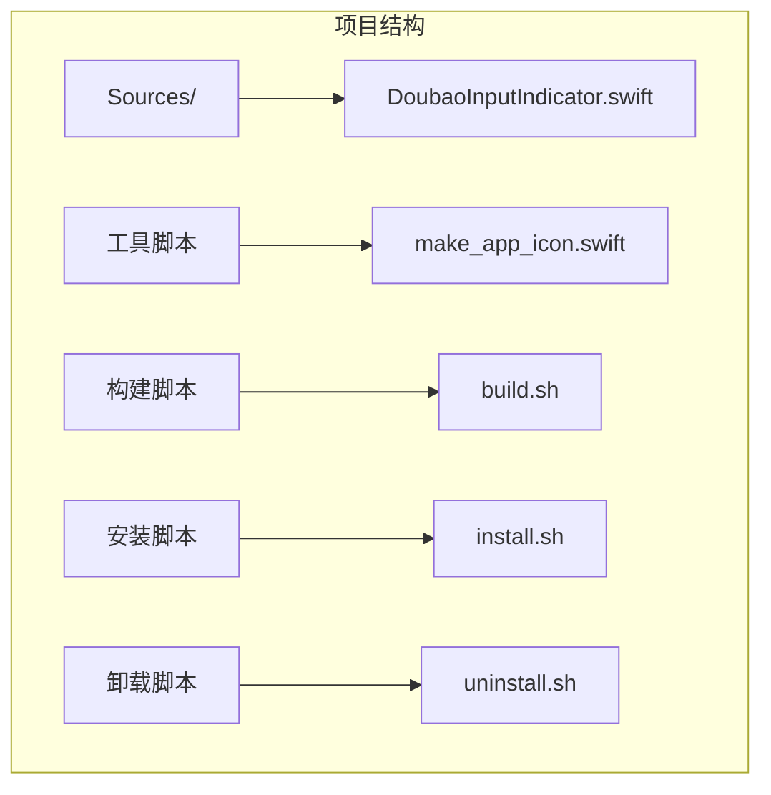
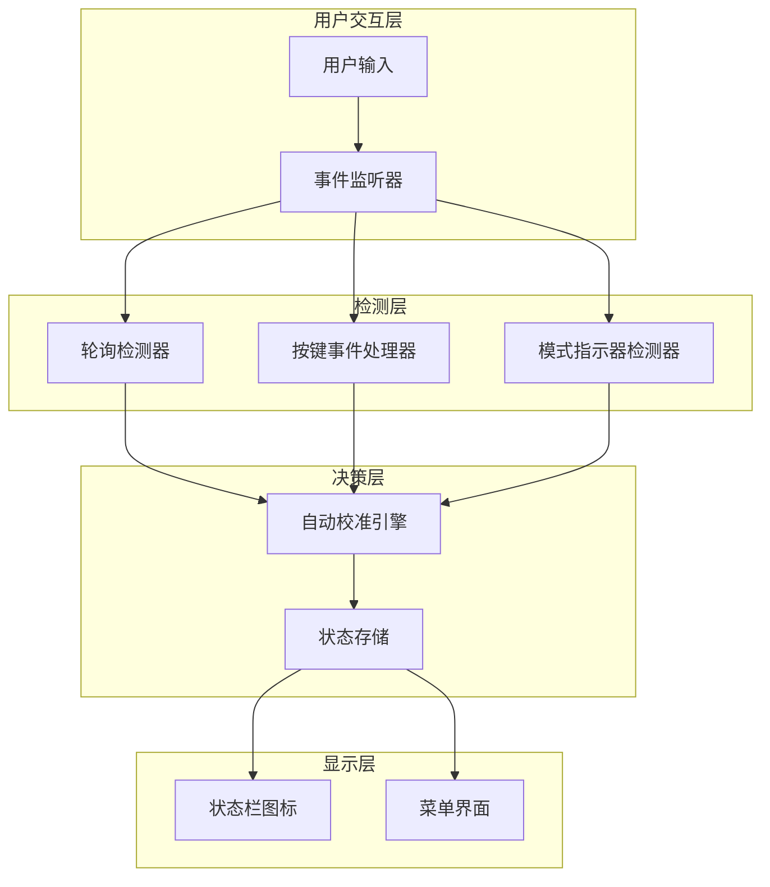
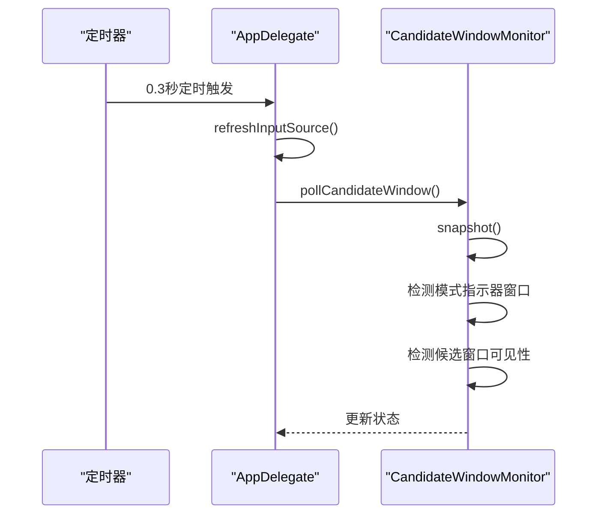
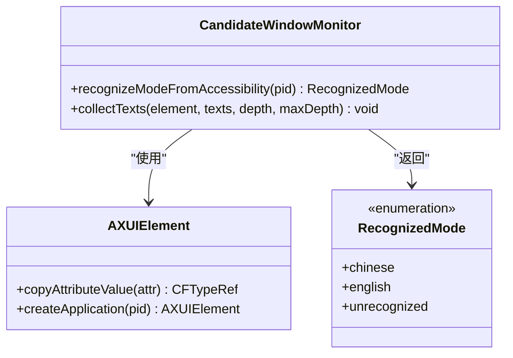
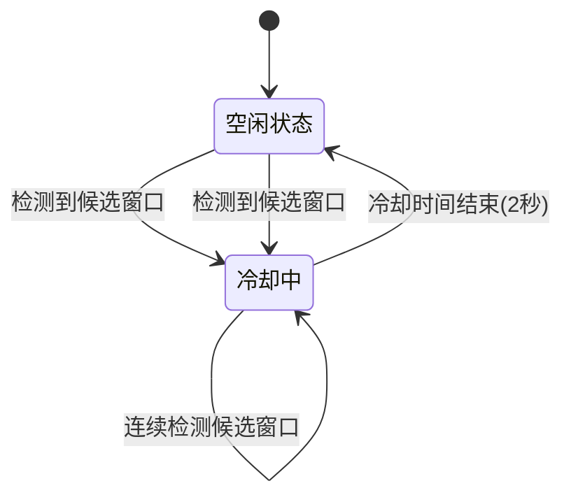
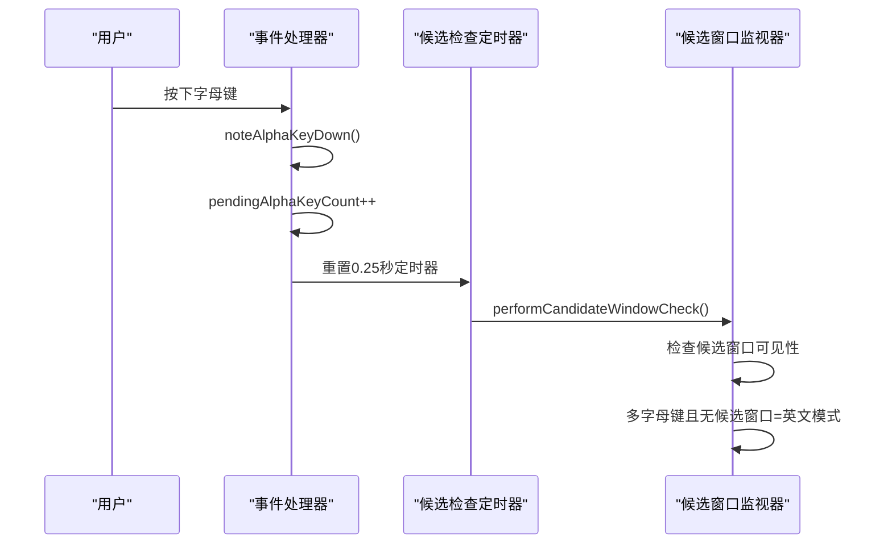
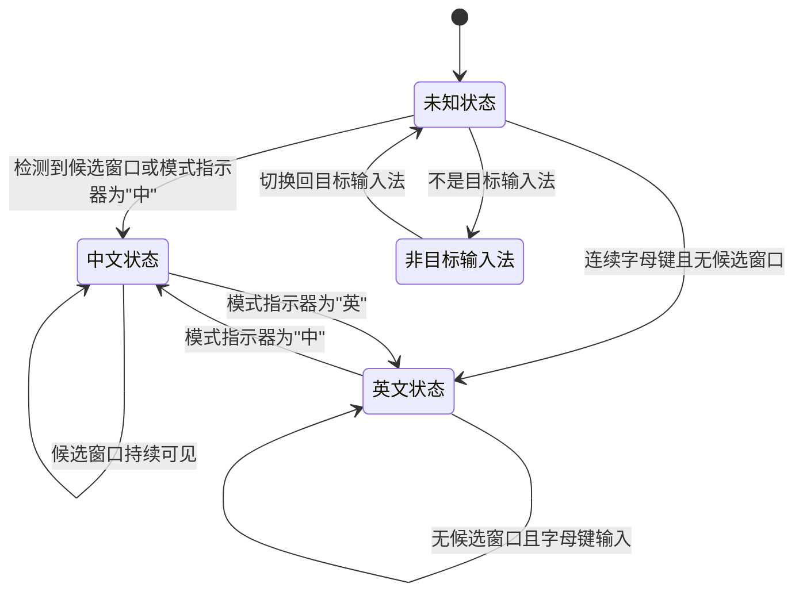
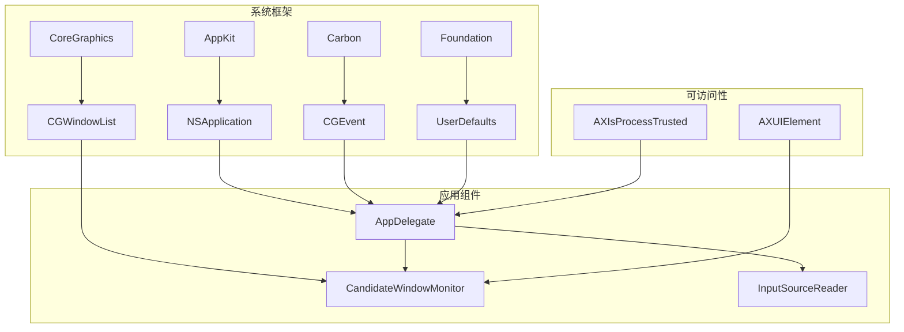

# 自动校准系统

<cite>
**本文档引用的文件**
- [DoubaoInputIndicator.swift](file://Sources/DoubaoInputIndicator.swift)
</cite>

## 目录
1. [简介](#简介)
2. [项目结构](#项目结构)
3. [核心组件](#核心组件)
4. [架构概览](#架构概览)
5. [详细组件分析](#详细组件分析)
6. [依赖关系分析](#依赖关系分析)
7. [性能考虑](#性能考虑)
8. [故障排除指南](#故障排除指南)
9. [结论](#结论)

## 简介

自动校准系统是一个用于检测和跟踪输入法模式状态的 macOS 应用程序。该系统实现了多层检测机制，通过轮询检测、模式指示器窗口检测和按键事件驱动的候选窗口检查来准确识别当前输入法的中英文模式状态。

该系统主要针对豆包输入法（Doubao IME）和微信输入法（WeType IME）设计，提供了精确的模式识别功能，包括中文、英文、未知和非目标输入法四种状态。

## 项目结构

项目采用简洁的单文件架构，所有核心功能都集中在 `DoubaoInputIndicator.swift` 文件中：



**图表来源**
- [DoubaoInputIndicator.swift:1-1410](file://Sources/DoubaoInputIndicator.swift#L1-L1410)

**章节来源**
- [DoubaoInputIndicator.swift:1-1410](file://Sources/DoubaoInputIndicator.swift#L1-L1410)

## 核心组件

自动校准系统由以下核心组件构成：

### 1. 输入源读取器（InputSourceReader）
负责获取当前系统输入法的状态信息，包括输入法ID、名称、捆绑标识符和输入模式ID。

### 2. 候选窗口监视器（CandidateWindowMonitor）
实现多层检测机制的核心组件，包含：
- 轮询检测功能
- 模式指示器窗口检测
- 候选窗口可见性检测
- 可访问性API集成

### 3. 应用委托（AppDelegate）
主控制器，管理整个应用的生命周期和各种检测机制。

**章节来源**
- [DoubaoInputIndicator.swift:104-278](file://Sources/DoubaoInputIndicator.swift#L104-L278)
- [DoubaoInputIndicator.swift:280-1410](file://Sources/DoubaoInputIndicator.swift#L280-L1410)

## 架构概览

系统采用分层架构设计，实现了多种检测策略的协同工作：



**图表来源**
- [DoubaoInputIndicator.swift:358-361](file://Sources/DoubaoInputIndicator.swift#L358-L361)
- [DoubaoInputIndicator.swift:540-716](file://Sources/DoubaoInputIndicator.swift#L540-L716)

## 详细组件分析

### 轮询检测机制（pollCandidateWindow）

轮询检测是系统的基础检测机制，每0.3秒执行一次，确保持续监控输入法状态。

#### 触发频率和控制流



**图表来源**
- [DoubaoInputIndicator.swift:358-361](file://Sources/DoubaoInputIndicator.swift#L358-L361)
- [DoubaoInputIndicator.swift:544-620](file://Sources/DoubaoInputIndicator.swift#L544-L620)

#### 检测优先级

轮询检测遵循以下优先级顺序：

1. **模式指示器窗口检测** - 高优先级
   - 检测新的模式指示器窗口（"中"/"英"）
   - 使用可访问性API读取窗口文本
   - 立即进行模式校准

2. **候选窗口可见性检测** - 低优先级
   - 检查候选窗口是否可见
   - 避免频繁模式切换的冷却机制
   - 基于时间延迟的检测

**章节来源**
- [DoubaoInputIndicator.swift:544-620](file://Sources/DoubaoInputIndicator.swift#L544-L620)

### 模式指示器窗口检测逻辑

模式指示器窗口检测是系统最精确的检测方式，专门用于识别输入法的中英文模式。

#### 新窗口ID识别机制（newWIDs）

```mermaid
flowchart TD
A[获取当前窗口快照] --> B[计算新窗口ID集合]
B --> C{新窗口ID是否存在?}
C --> |是| D[检测到模式切换]
C --> |否| E[无模式切换]
D --> F[使用可访问性API读取文本]
F --> G{文本内容分析}
G --> |包含"中"| H[设置为中文模式]
G --> |包含"英"| I[设置为英文模式]
G --> |其他| J[保持当前状态]
```

**图表来源**
- [DoubaoInputIndicator.swift:558-601](file://Sources/DoubaoInputIndicator.swift#L558-L601)

#### AXUIElement文本读取集成

系统使用可访问性API读取输入法进程的UI元素文本内容：



**图表来源**
- [DoubaoInputIndicator.swift:223-277](file://Sources/DoubaoInputIndicator.swift#L223-L277)

**章节来源**
- [DoubaoInputIndicator.swift:558-601](file://Sources/DoubaoInputIndicator.swift#L558-L601)
- [DoubaoInputIndicator.swift:223-277](file://Sources/DoubaoInputIndicator.swift#L223-L277)

### 候选窗口可见性检测

候选窗口可见性检测是基于窗口属性的被动检测方法，用于验证和补充其他检测结果。

#### 时间延迟机制（autoCalibrationCooldown = 2.0秒）



**图表来源**
- [DoubaoInputIndicator.swift](file://Sources/DoubaoInputIndicator.swift#L317)
- [DoubaoInputIndicator.swift:604-606](file://Sources/DoubaoInputIndicator.swift#L604-L606)

#### 候选窗口检测参数

系统使用严格的窗口属性过滤条件：

- **图层阈值**: 大于2,147,483,000的窗口被视为候选面板
- **最小高度**: 至少40点高才被认为是候选面板
- **指示器窗口尺寸**: 15-50点的方形窗口被识别为模式指示器

**章节来源**
- [DoubaoInputIndicator.swift:148-212](file://Sources/DoubaoInputIndicator.swift#L148-L212)
- [DoubaoInputIndicator.swift](file://Sources/DoubaoInputIndicator.swift#L317)
- [DoubaoInputIndicator.swift:604-620](file://Sources/DoubaoInputIndicator.swift#L604-L620)

### 按键事件驱动的候选窗口检查

按键事件驱动的检测机制提供了实时的主动检测能力，特别适用于快速输入场景。

#### 字母键累积机制（pendingAlphaKeyCount）



**图表来源**
- [DoubaoInputIndicator.swift:634-663](file://Sources/DoubaoInputIndicator.swift#L634-L663)
- [DoubaoInputIndicator.swift:669-716](file://Sources/DoubaoInputIndicator.swift#L669-L716)

#### 防抖动处理（lastAlphaKeyNoteAt）

系统实现了双重防抖动机制：

1. **事件源去重**: 防止同一物理按键通过不同事件源重复触发
2. **按键去重**: 防止极短时间内重复按键的误判

**章节来源**
- [DoubaoInputIndicator.swift:634-663](file://Sources/DoubaoInputIndicator.swift#L634-L663)
- [DoubaoInputIndicator.swift:669-716](file://Sources/DoubaoInputIndicator.swift#L669-L716)

### 完整状态转换流程

系统实现了完整的状态转换机制，支持四种输入法模式状态：



**图表来源**
- [DoubaoInputIndicator.swift:7-38](file://Sources/DoubaoInputIndicator.swift#L7-L38)
- [DoubaoInputIndicator.swift:845-854](file://Sources/DoubaoInputIndicator.swift#L845-L854)

## 依赖关系分析

系统的主要依赖关系如下：



**图表来源**
- [DoubaoInputIndicator.swift:1-6](file://Sources/DoubaoInputIndicator.swift#L1-L6)
- [DoubaoInputIndicator.swift:280-1410](file://Sources/DoubaoInputIndicator.swift#L280-L1410)

**章节来源**
- [DoubaoInputIndicator.swift:1-6](file://Sources/DoubaoInputIndicator.swift#L1-L6)
- [DoubaoInputIndicator.swift:280-1410](file://Sources/DoubaoInputIndicator.swift#L280-L1410)

## 性能考虑

### 1. 轮询优化
- 0.3秒轮询间隔平衡了响应速度和系统资源消耗
- 智能状态缓存避免不必要的重复检测

### 2. 冷却机制
- 2.0秒自动校准冷却时间防止频繁模式切换
- 0.35秒最小切换间隔模拟输入法内部去抖动

### 3. 事件处理优化
- 双重事件源去重机制
- 20毫秒防抖动窗口
- 异步定时器处理

## 故障排除指南

### 常见问题及解决方案

#### 1. 检测不准确
**症状**: 模式状态频繁切换
**原因**: 冷却时间不足或检测参数不当
**解决**: 检查 `autoCalibrationCooldown` 设置和窗口检测参数

#### 2. 权限问题
**症状**: 无法读取模式指示器文本
**原因**: 可访问性权限未授予
**解决**: 授予辅助功能权限或检查 `AXIsProcessTrusted()` 返回值

#### 3. 事件监听失效
**症状**: Shift键切换无响应
**原因**: 输入监控权限缺失或事件监听器异常
**解决**: 检查 `listenAccessGranted` 状态和事件监听器状态

**章节来源**
- [DoubaoInputIndicator.swift:379-406](file://Sources/DoubaoInputIndicator.swift#L379-L406)
- [DoubaoInputIndicator.swift:733-747](file://Sources/DoubaoInputIndicator.swift#L733-L747)

## 结论

自动校准系统通过多层检测机制实现了高精度的输入法模式识别。其核心优势包括：

1. **多层次检测**: 轮询检测、模式指示器检测和按键事件检测的有机结合
2. **智能防抖动**: 多种去重机制确保检测准确性
3. **时间延迟保护**: 冷却机制避免频繁模式切换
4. **可扩展架构**: 清晰的组件分离便于维护和扩展

该系统为用户提供了一个可靠、准确的输入法模式状态指示器，特别适用于需要精确控制输入法模式的专业用户。