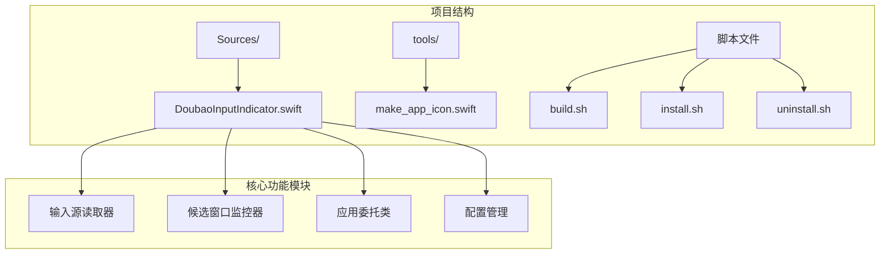
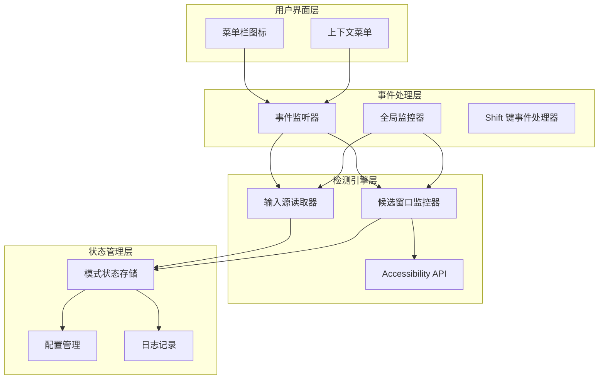
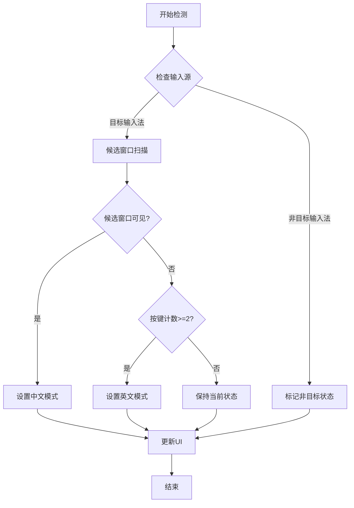
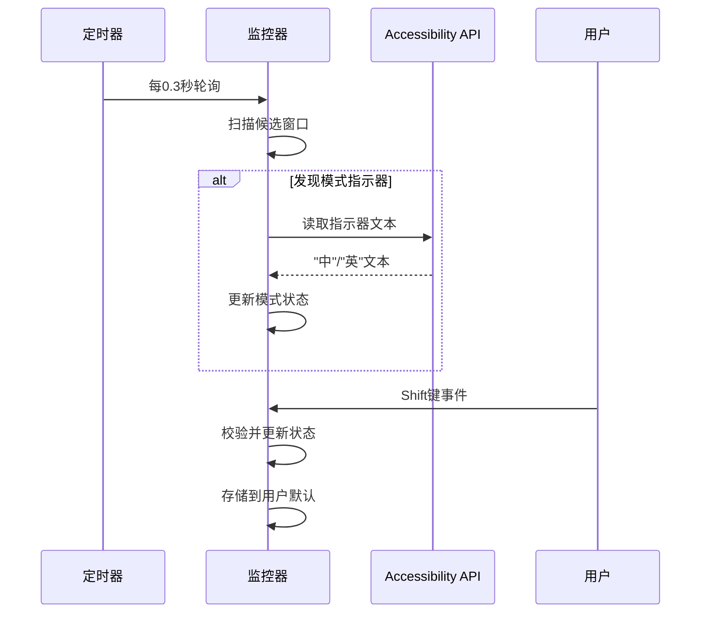
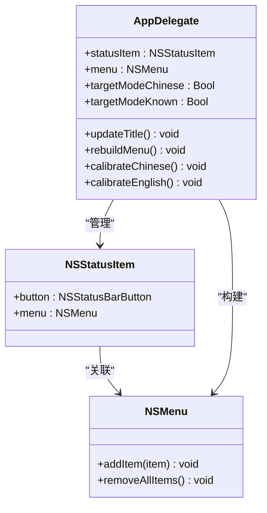
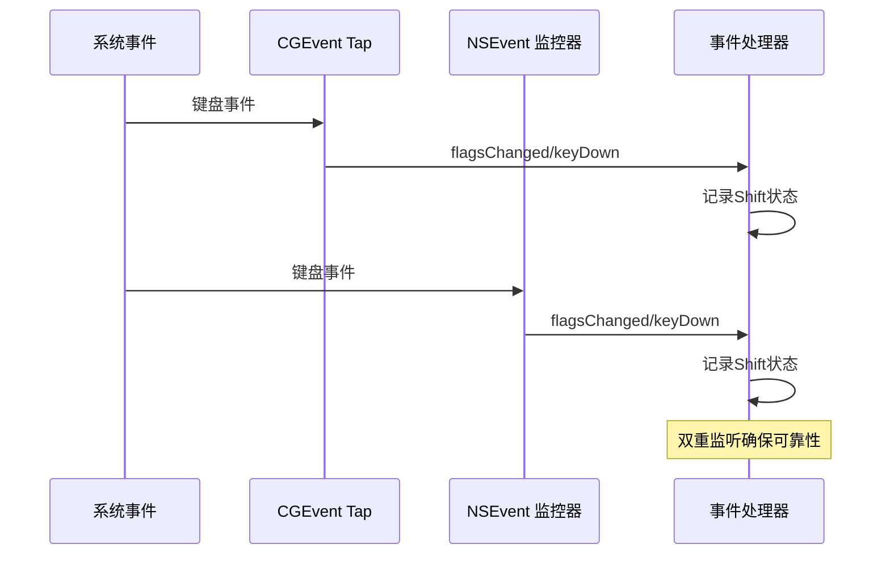
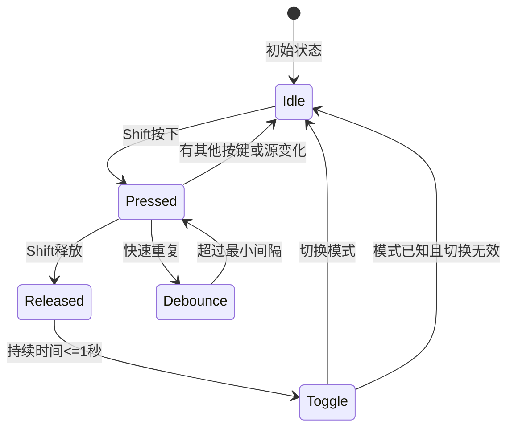
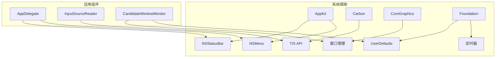
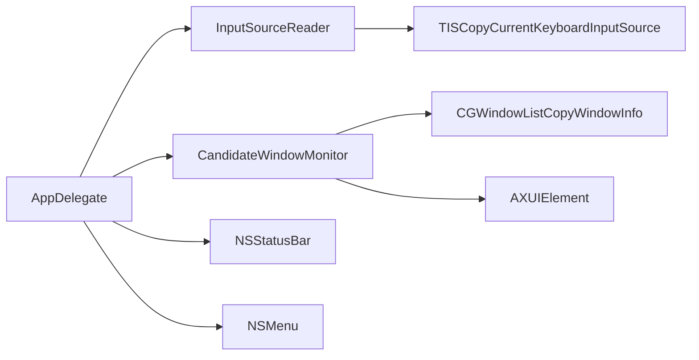
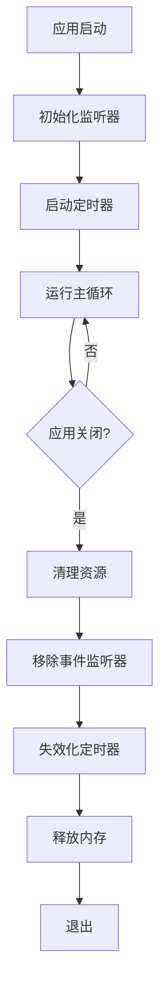

# 核心功能

<cite>
**本文档引用的文件**
- [DoubaoInputIndicator.swift](file://Sources/DoubaoInputIndicator.swift)
- [build.sh](file://build.sh)
- [install.sh](file://install.sh)
- [uninstall.sh](file://uninstall.sh)
- [make_app_icon.swift](file://tools/make_app_icon.swift)
</cite>

## 目录
1. [简介](#简介)
2. [项目结构](#项目结构)
3. [核心组件](#核心组件)
4. [架构概览](#架构概览)
5. [详细组件分析](#详细组件分析)
6. [依赖关系分析](#依赖关系分析)
7. [性能考虑](#性能考虑)
8. [故障排除指南](#故障排除指南)
9. [结论](#结论)

## 简介

这是一个基于 macOS 的输入法状态指示器应用，专门用于监控和显示中文/英文输入法状态。该应用通过多种技术手段实现准确的输入法状态检测，包括事件监听、窗口监控、Accessibility API 使用等核心技术。应用支持两种输入法：豆包输入法（默认）和微信输入法（可选），并通过菜单栏图标提供直观的状态显示。

## 项目结构

项目采用简洁的单文件架构设计，主要包含以下组件：



**图表来源**
- [DoubaoInputIndicator.swift:1-1410](file://Sources/DoubaoInputIndicator.swift#L1-L1410)
- [build.sh:1-117](file://build.sh#L1-L117)

**章节来源**
- [DoubaoInputIndicator.swift:1-1410](file://Sources/DoubaoInputIndicator.swift#L1-L1410)
- [build.sh:1-117](file://build.sh#L1-L117)

## 核心组件

### 输入源读取器（InputSourceReader）

输入源读取器负责从系统获取当前激活的输入法信息。它使用 TISCopyCurrentKeyboardInputSource API 来获取输入法的详细信息，包括输入源 ID、本地化名称、包标识符和输入模式 ID。

### 候选窗口监控器（CandidateWindowMonitor）

候选窗口监控器是整个系统的核心检测组件，负责：
- 扫描屏幕上的输入法窗口
- 识别候选词面板和模式指示器窗口
- 使用 Accessibility API 读取模式文本
- 实现自动校准算法

### 应用委托类（AppDelegate）

应用委托类管理整个应用的生命周期，包括：
- 菜单栏状态指示器的创建和管理
- 事件监听器的安装和配置
- 定时器管理
- 用户界面更新

**章节来源**
- [DoubaoInputIndicator.swift:104-131](file://Sources/DoubaoInputIndicator.swift#L104-L131)
- [DoubaoInputIndicator.swift:133-278](file://Sources/DoubaoInputIndicator.swift#L133-L278)
- [DoubaoInputIndicator.swift:280-480](file://Sources/DoubaoInputIndicator.swift#L280-L480)

## 架构概览

应用采用分层架构设计，各组件职责明确：



**图表来源**
- [DoubaoInputIndicator.swift:280-480](file://Sources/DoubaoInputIndicator.swift#L280-L480)
- [DoubaoInputIndicator.swift:104-131](file://Sources/DoubaoInputIndicator.swift#L104-L131)
- [DoubaoInputIndicator.swift:133-278](file://Sources/DoubaoInputIndicator.swift#L133-L278)

## 详细组件分析

### 输入法状态检测机制

#### 多重检测策略

应用实现了三种互补的检测策略来确保准确性：

1. **候选窗口检测**：通过扫描屏幕窗口识别输入法的候选词面板
2. **模式指示器检测**：使用 Accessibility API 读取输入法显示的"中"/"英"指示器
3. **输入源切换检测**：监控系统输入法切换事件



**图表来源**
- [DoubaoInputIndicator.swift:544-716](file://Sources/DoubaoInputIndicator.swift#L544-L716)

#### 自动校准算法

自动校准算法通过时间窗口内的多源数据融合来提高准确性：



**图表来源**
- [DoubaoInputIndicator.swift:544-620](file://Sources/DoubaoInputIndicator.swift#L544-L620)
- [DoubaoInputIndicator.swift:985-991](file://Sources/DoubaoInputIndicator.swift#L985-L991)

**章节来源**
- [DoubaoInputIndicator.swift:540-716](file://Sources/DoubaoInputIndicator.swift#L540-L716)

### 菜单栏显示功能

#### 动态状态显示

菜单栏图标根据输入法状态动态显示不同的表情符号：

| 状态类型 | 表情符号 | 显示文本 | 用途 |
|---------|---------|---------|------|
| 中文输入法 | 🇨🇳 | 中文 | 中文输入模式 |
| 英文输入法 | 🇺🇸 | 英文 | 英文输入模式 |
| 未知状态 | ? | 未知 | 需要校准 |
| 非目标输入法 | 🤐 | 非目标输入法 | 不是目标输入法 |

#### 菜单交互

菜单提供了完整的用户交互接口：



**图表来源**
- [DoubaoInputIndicator.swift:280-480](file://Sources/DoubaoInputIndicator.swift#L280-L480)
- [DoubaoInputIndicator.swift:1042-1128](file://Sources/DoubaoInputIndicator.swift#L1042-L1128)

**章节来源**
- [DoubaoInputIndicator.swift:1024-1040](file://Sources/DoubaoInputIndicator.swift#L1024-L1040)
- [DoubaoInputIndicator.swift:1042-1128](file://Sources/DoubaoInputIndicator.swift#L1042-L1128)

### Shift键事件监听

#### 双重事件监听机制

应用实现了双重事件监听机制以确保可靠性：

1. **CGEvent Tap**：低级别的系统级事件监听
2. **NSEvent 全局监控**：高级别的应用级事件监听



**图表来源**
- [DoubaoInputIndicator.swift:408-480](file://Sources/DoubaoInputIndicator.swift#L408-L480)
- [DoubaoInputIndicator.swift:482-538](file://Sources/DoubaoInputIndicator.swift#L482-L538)

#### Shift键状态跟踪

应用实现了复杂的 Shift 键状态跟踪逻辑：



**图表来源**
- [DoubaoInputIndicator.swift:866-980](file://Sources/DoubaoInputIndicator.swift#L866-L980)

**章节来源**
- [DoubaoInputIndicator.swift:749-774](file://Sources/DoubaoInputIndicator.swift#L749-L774)
- [DoubaoInputIndicator.swift:866-980](file://Sources/DoubaoInputIndicator.swift#L866-L980)

### Accessibility API 使用

#### 模式指示器读取

应用使用 Accessibility API 来读取输入法显示的模式指示器文本：

```mermaid
flowchart LR
A[输入法进程] --> B[AXUIElement]
B --> C[递归遍历]
C --> D{查找文本属性}
D --> |找到| E[提取"中"/"英"]
D --> |未找到| F[继续遍历]
E --> G[返回识别结果]
F --> C
```

**图表来源**
- [DoubaoInputIndicator.swift:229-277](file://Sources/DoubaoInputIndicator.swift#L229-L277)

#### 文本收集算法

应用实现了深度递归的文本收集算法：

1. **属性遍历**：检查常见文本属性（值、标题、描述）
2. **层级遍历**：递归访问子元素
3. **深度限制**：防止无限递归
4. **结果聚合**：收集所有找到的文本

**章节来源**
- [DoubaoInputIndicator.swift:229-277](file://Sources/DoubaoInputIndicator.swift#L229-L277)

### 手动校准选项

#### 用户干预机制

应用提供了完整的手动校准功能：

| 校准选项 | 触发方式 | 效果 |
|---------|---------|------|
| 校准为中文 | 点击菜单项 | 强制设置为中文模式 |
| 校准为英文 | 点击菜单项 | 强制设置为英文模式 |
| 状态需要校准 | 菜单提示 | 提醒用户进行校准 |

#### 校准状态管理

手动校准会更新应用的内部状态并持久化到用户默认设置中。

**章节来源**
- [DoubaoInputIndicator.swift:1130-1143](file://Sources/DoubaoInputIndicator.swift#L1130-L1143)
- [DoubaoInputIndicator.swift:1006-1011](file://Sources/DoubaoInputIndicator.swift#L1006-L1011)

## 依赖关系分析

### 外部框架依赖

应用依赖以下 macOS 系统框架：



**图表来源**
- [DoubaoInputIndicator.swift:1-6](file://Sources/DoubaoInputIndicator.swift#L1-L6)

### 内部组件依赖



**图表来源**
- [DoubaoInputIndicator.swift:104-131](file://Sources/DoubaoInputIndicator.swift#L104-L131)
- [DoubaoInputIndicator.swift:133-278](file://Sources/DoubaoInputIndicator.swift#L133-L278)

**章节来源**
- [DoubaoInputIndicator.swift:1-6](file://Sources/DoubaoInputIndicator.swift#L1-L6)
- [DoubaoInputIndicator.swift:104-131](file://Sources/DoubaoInputIndicator.swift#L104-L131)
- [DoubaoInputIndicator.swift:133-278](file://Sources/DoubaoInputIndicator.swift#L133-L278)

## 性能考虑

### 事件处理优化

应用采用了多项性能优化措施：

1. **事件去重**：通过时间戳过滤重复事件
2. **定时器节流**：限制自动校准频率
3. **窗口扫描优化**：使用阈值过滤无关窗口
4. **内存管理**：及时清理定时器和监听器

### 内存管理策略



**图表来源**
- [DoubaoInputIndicator.swift:364-372](file://Sources/DoubaoInputIndicator.swift#L364-L372)

### 系统资源使用

应用在设计时充分考虑了系统资源的合理使用：
- 低内存占用的后台应用
- 最小化的 CPU 占用
- 优雅的资源清理机制

## 故障排除指南

### 常见问题诊断

#### 输入监控权限问题

**症状**：Shift 键监听功能不可用，菜单显示需要授权

**解决方案**：
1. 检查系统偏好设置中的输入监控权限
2. 重新启动应用以重新请求权限
3. 在应用菜单中点击"重新检查权限"

#### Accessibility 权限问题

**症状**：模式指示器读取失败，状态显示为未知

**解决方案**：
1. 检查辅助功能权限设置
2. 确保应用具有 Accessibility 访问权限
3. 重启相关输入法进程

#### 事件监听器失效

**症状**：键盘事件无法被正确捕获

**解决方案**：
1. 检查事件监听器状态
2. 重新安装事件监听器
3. 重启系统以重置事件管道

**章节来源**
- [DoubaoInputIndicator.swift:379-406](file://Sources/DoubaoInputIndicator.swift#L379-L406)
- [DoubaoInputIndicator.swift:733-747](file://Sources/DoubaoInputIndicator.swift#L733-L747)

### 日志分析

应用会在用户目录下生成详细的日志文件，包含：
- 事件处理流程
- 状态转换记录
- 错误诊断信息
- 性能指标

日志文件路径：`~/Library/Logs/[应用名].log`

## 结论

输入法状态指示器是一个设计精良的 macOS 应用程序，通过多种技术手段实现了准确可靠的输入法状态检测。其核心优势包括：

1. **多重检测策略**：结合窗口扫描、Accessibility API 和事件监听实现高准确性
2. **智能校准算法**：通过时间窗口内的数据融合提高可靠性
3. **优雅的用户界面**：简洁直观的菜单栏显示和完整的用户交互
4. **完善的错误处理**：全面的权限检查和故障恢复机制

该应用为开发者提供了优秀的参考实现，展示了如何在 macOS 平台上构建高性能、用户体验良好的系统级应用。