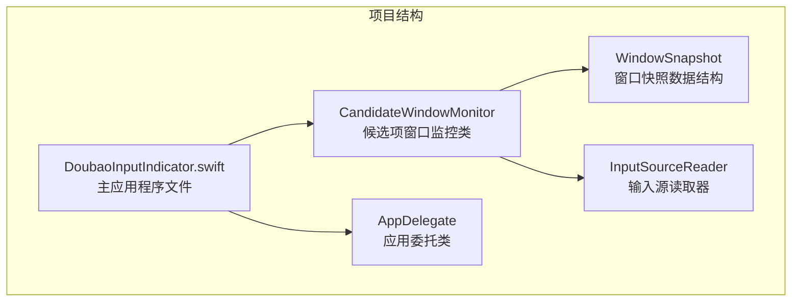
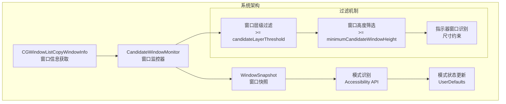
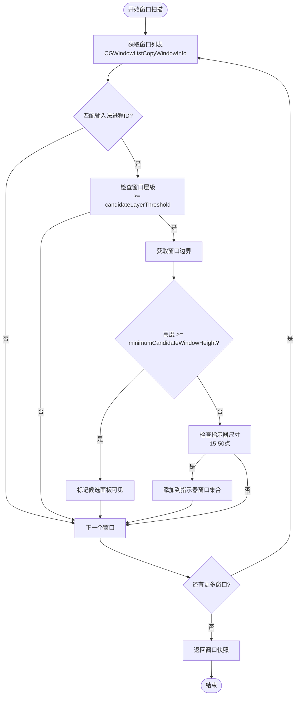
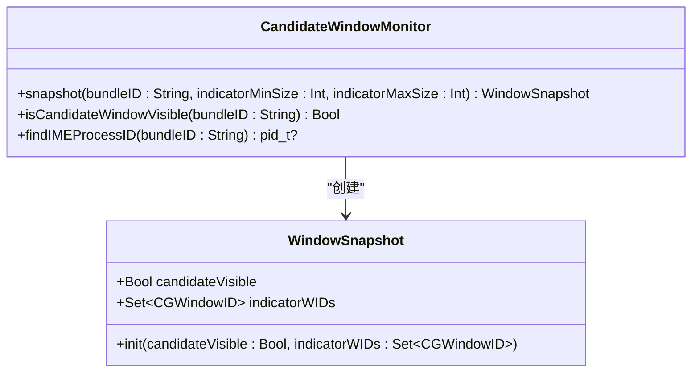
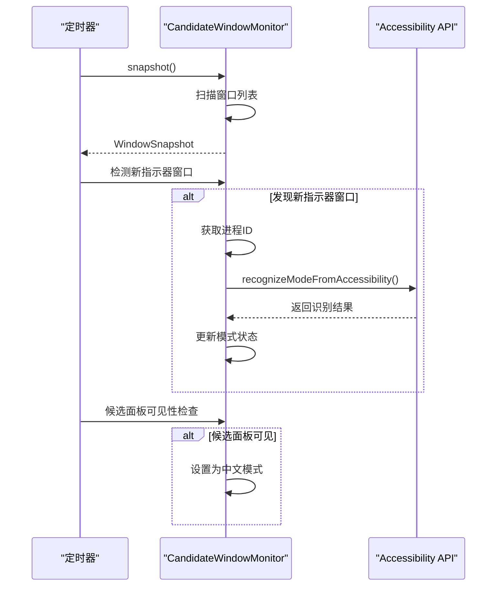
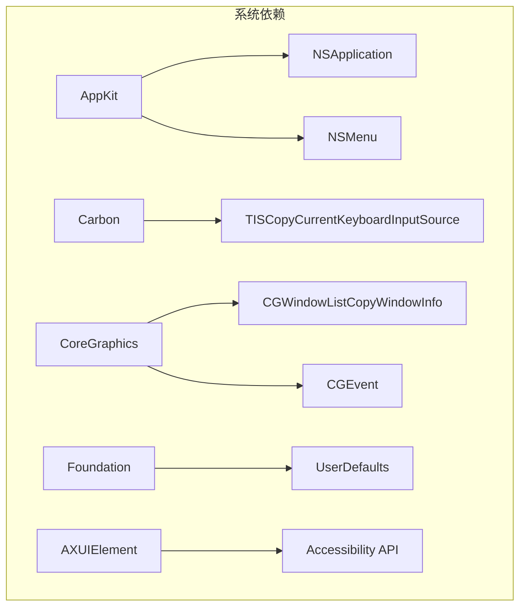

# 候选项窗口检测

<cite>
**本文档引用的文件**
- [DoubaoInputIndicator.swift](file://Sources/DoubaoInputIndicator.swift)
</cite>

## 目录
1. [简介](#简介)
2. [项目结构](#项目结构)
3. [核心组件](#核心组件)
4. [架构概览](#架构概览)
5. [详细组件分析](#详细组件分析)
6. [依赖关系分析](#依赖关系分析)
7. [性能考虑](#性能考虑)
8. [故障排除指南](#故障排除指南)
9. [结论](#结论)

## 简介

本文档深入解析了输入指示器应用中的候选项窗口检测核心算法实现。该系统通过分析 macOS 窗口管理器提供的窗口信息，智能识别输入法候选面板和模式指示器窗口，从而自动判断当前输入法的中英文状态。

该算法采用多层过滤机制，包括基于窗口层级的过滤、高度阈值筛选、以及基于窗口尺寸的模式指示器识别，确保能够准确区分候选面板和工具栏窗口。

## 项目结构

该项目采用简洁的单文件架构设计，所有功能都集中在 `Sources/DoubaoInputIndicator.swift` 一个文件中：

**图表来源**
- [DoubaoInputIndicator.swift:133-278](file://Sources/DoubaoInputIndicator.swift#L133-L278)

**章节来源**
- [DoubaoInputIndicator.swift:1-50](file://Sources/DoubaoInputIndicator.swift#L1-L50)

## 核心组件

### CandidateWindowMonitor - 候选项窗口监控器

这是系统的核心组件，负责监控和分析输入法相关的窗口状态。它包含以下关键功能：

- **窗口层级过滤**：通过 `candidateLayerThreshold` 阈值筛选高层级窗口
- **窗口高度筛选**：使用 `minimumCandidateWindowHeight` 过滤工具栏窗口
- **窗口快照生成**：创建 `WindowSnapshot` 对象包含候选面板可见性和指示器窗口ID
- **模式识别**：通过 Accessibility API 读取模式指示器文本

**章节来源**
- [DoubaoInputIndicator.swift:133-278](file://Sources/DoubaoInputIndicator.swift#L133-L278)

### WindowSnapshot - 窗口快照数据结构

这是一个轻量级的数据容器，用于封装当前屏幕上的输入法相关窗口状态：

- `candidateVisible`: 布尔值，表示高大候选面板是否可见
- `indicatorWIDs`: Set<CGWindowID>，包含小尺寸指示器窗口的窗口ID集合

**章节来源**
- [DoubaoInputIndicator.swift:155-161](file://Sources/DoubaoInputIndicator.swift#L155-L161)

## 架构概览

系统采用分层架构设计，从底层的窗口信息获取到高层的模式识别：

**图表来源**
- [DoubaoInputIndicator.swift:148-212](file://Sources/DoubaoInputIndicator.swift#L148-L212)
- [DoubaoInputIndicator.swift:229-277](file://Sources/DoubaoInputIndicator.swift#L229-L277)

## 详细组件分析

### 窗口扫描算法

候选项窗口检测的核心算法实现了三层过滤机制：

#### 第一层：进程所有权过滤
首先根据输入法进程ID过滤窗口，确保只处理目标输入法的窗口。

#### 第二层：窗口层级过滤
使用 `candidateLayerThreshold = 2,147,483,000` 阈值，筛选位于高层级的窗口。输入法候选面板通常位于接近 `INT32_MAX` 的层级。

#### 第三层：窗口尺寸和高度过滤
对通过层级过滤的窗口进行进一步筛选：
- **候选面板识别**：高度 >= `minimumCandidateWindowHeight = 40` 点
- **工具栏窗口过滤**：高度 < 40 点的窗口被排除
- **指示器窗口识别**：宽度和高度在 `indicatorMinSize=15` 到 `indicatorMaxSize=50` 之间的窗口

**图表来源**
- [DoubaoInputIndicator.swift:165-212](file://Sources/DoubaoInputIndicator.swift#L165-L212)

**章节来源**
- [DoubaoInputIndicator.swift:133-212](file://Sources/DoubaoInputIndicator.swift#L133-L212)

### WindowSnapshot 数据结构详解

`WindowSnapshot` 是一个不可变的数据结构，用于封装窗口扫描结果：

**图表来源**
- [DoubaoInputIndicator.swift:155-161](file://Sources/DoubaoInputIndicator.swift#L155-L161)
- [DoubaoInputIndicator.swift:165-212](file://Sources/DoubaoInputIndicator.swift#L165-L212)

#### candidateVisible 标志位的作用

`candidateVisible` 标志位用于跟踪是否存在高大候选面板。当检测到高度超过阈值的窗口时，系统将其标记为 `true`，这通常意味着用户处于中文输入模式。

#### indicatorWIDs 集合的维护机制

`indicatorWIDs` 使用 Swift 的 `Set<CGWindowID>` 来存储指示器窗口的唯一标识符。集合的特性确保：
- 自动去重：相同窗口ID不会重复存储
- 快速查找：O(1) 时间复杂度的成员检查
- 集合运算：支持差集运算来检测新增的指示器窗口

**章节来源**
- [DoubaoInputIndicator.swift:155-161](file://Sources/DoubaoInputIndicator.swift#L155-L161)

### 模式识别与自动校准

系统实现了双重模式识别机制：

#### 基于窗口的模式识别
通过检测候选面板的存在与否来判断模式状态：
- 存在候选面板 → 中文模式
- 不存在候选面板且输入多个字母键 → 英文模式

#### 基于 Accessibility API 的模式识别
当检测到新的模式指示器窗口（"中"/"英"）时，使用 Accessibility API 读取窗口中的文本内容来确认模式状态。

**图表来源**
- [DoubaoInputIndicator.swift:544-620](file://Sources/DoubaoInputIndicator.swift#L544-L620)
- [DoubaoInputIndicator.swift:229-277](file://Sources/DoubaoInputIndicator.swift#L229-L277)

**章节来源**
- [DoubaoInputIndicator.swift:544-620](file://Sources/DoubaoInputIndicator.swift#L544-L620)

## 依赖关系分析

系统主要依赖以下框架和API：

**图表来源**
- [DoubaoInputIndicator.swift:1-6](file://Sources/DoubaoInputIndicator.swift#L1-L6)

### 关键依赖说明

- **AppKit**: 提供状态栏界面、菜单系统和事件处理
- **Carbon**: 访问键盘输入源信息
- **CoreGraphics**: 获取窗口列表和处理窗口事件
- **Foundation**: 用户偏好设置存储和日期格式化
- **Accessibility**: 读取窗口文本内容

**章节来源**
- [DoubaoInputIndicator.swift:1-6](file://Sources/DoubaoInputIndicator.swift#L1-L6)

## 性能考虑

### 窗口扫描优化

系统采用了多项性能优化策略：

1. **延迟扫描**: 使用定时器每0.3秒执行一次扫描，避免频繁的系统调用
2. **早期退出**: 在条件不满足时立即跳过后续处理
3. **集合操作**: 使用 Set 进行快速的窗口ID比较和差集运算
4. **阈值过滤**: 通过层级和高度阈值减少不必要的处理

### 内存管理

- 使用不可变的 `WindowSnapshot` 结构体，避免不必要的内存复制
- Set 集合自动管理内存，无需手动释放
- 定时器在不需要时及时失效

## 故障排除指南

### 常见问题及解决方案

#### 1. 窗口扫描无结果
**症状**: `candidateVisible` 始终为 `false`
**可能原因**:
- 输入法进程ID未找到
- 窗口列表获取失败
- 窗口层级不符合阈值要求

**解决方法**:
- 检查输入法是否正确安装
- 验证应用程序是否有足够的权限
- 调整 `candidateLayerThreshold` 参数

#### 2. 模式识别不准确
**症状**: 模式状态频繁切换或错误识别
**可能原因**:
- Accessibility 权限未授予
- 窗口尺寸阈值设置不当
- 候选面板出现时间过短

**解决方法**:
- 授予 Accessibility 权限
- 调整指示器窗口尺寸范围
- 增加候选面板检测的延迟时间

#### 3. 性能问题
**症状**: 应用程序响应缓慢
**可能原因**:
- 扫描频率过高
- 窗口数量过多
- 频繁的模式切换

**解决方法**:
- 调整定时器间隔
- 优化窗口过滤条件
- 实施更严格的去重机制

**章节来源**
- [DoubaoInputIndicator.swift:379-406](file://Sources/DoubaoInputIndicator.swift#L379-L406)

## 结论

候选项窗口检测系统通过精心设计的多层过滤机制，实现了对输入法窗口状态的准确识别。其核心优势包括：

1. **精确的窗口层级过滤**：通过合理的阈值设置，有效区分候选面板和工具栏窗口
2. **智能的高度筛选**：利用最小高度约束消除误判
3. **双模式识别机制**：结合窗口检测和 Accessibility API 提供可靠的模式识别
4. **高效的性能表现**：通过优化的扫描算法和内存管理确保系统流畅运行

该系统为输入法指示器提供了稳定可靠的技术基础，能够准确反映用户的输入法状态，提升用户体验。