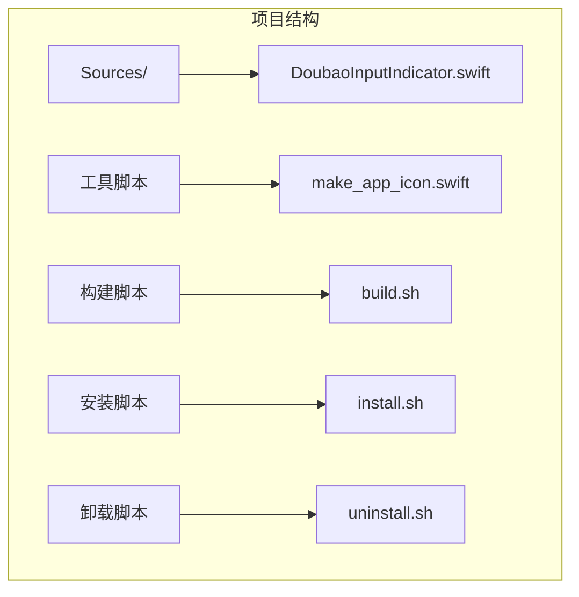
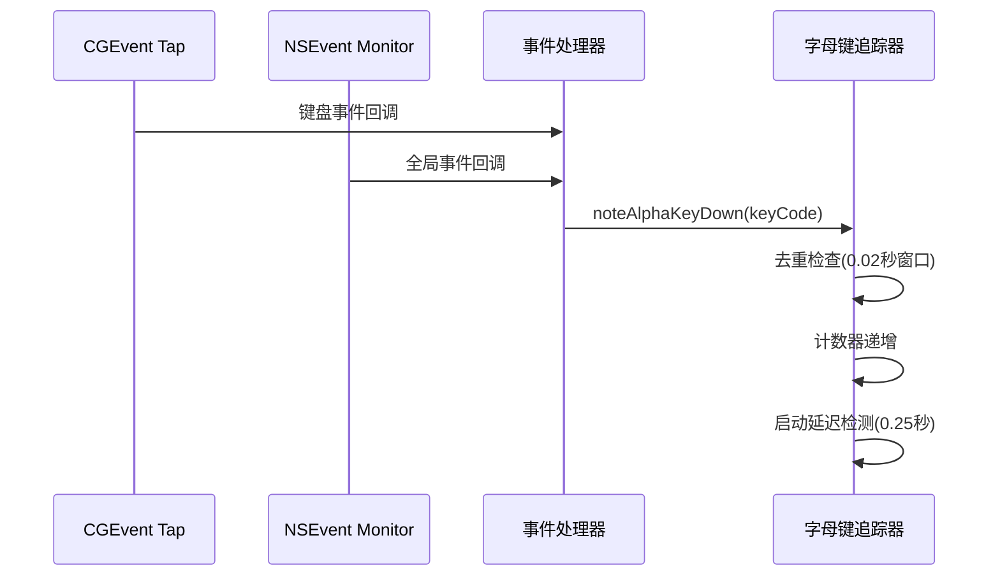
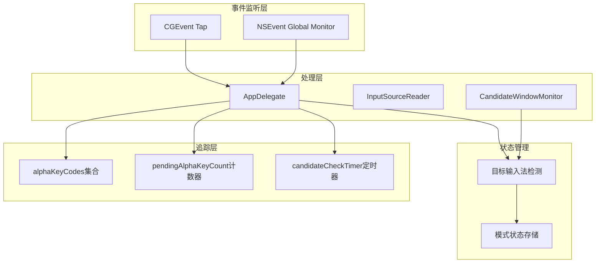
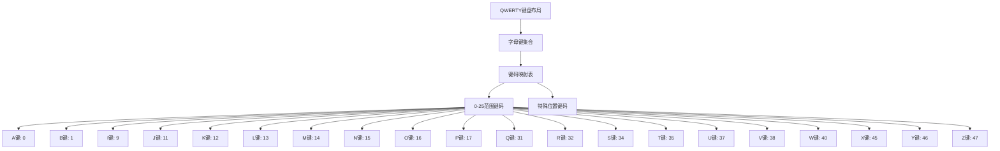
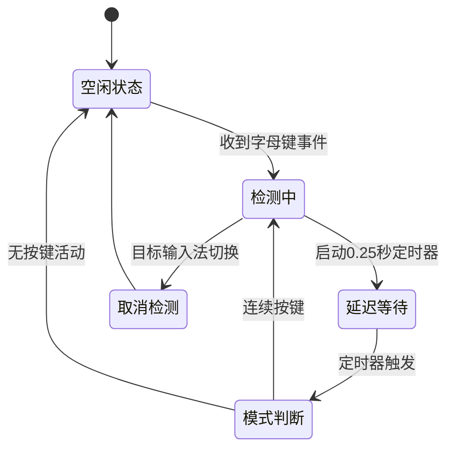
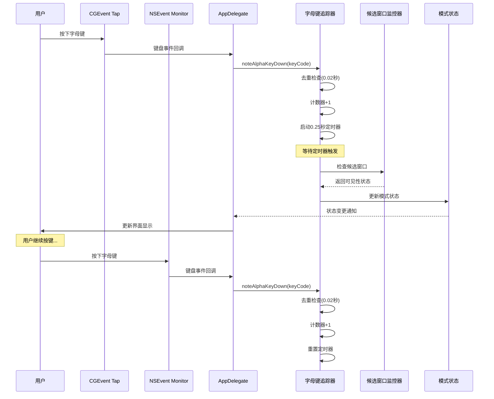
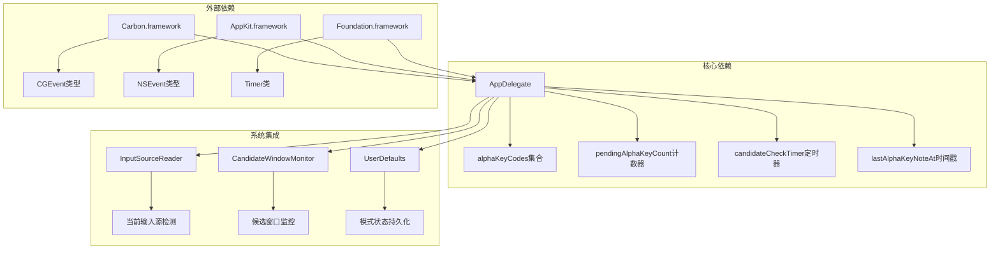
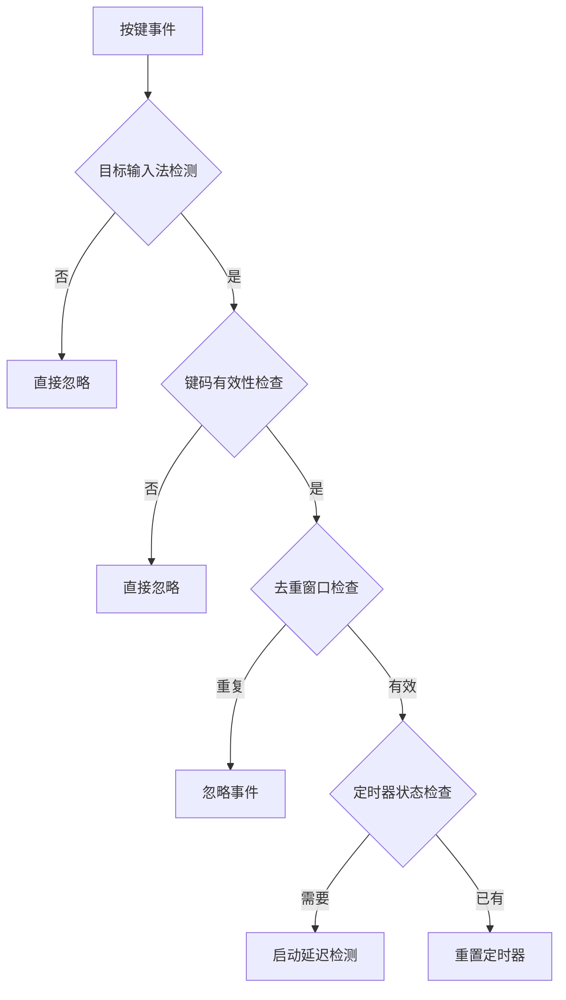

# 字母键追踪机制

<cite>
**本文档引用的文件**
- [DoubaoInputIndicator.swift](file://Sources/DoubaoInputIndicator.swift)
</cite>

## 目录
1. [简介](#简介)
2. [项目结构](#项目结构)
3. [核心组件](#核心组件)
4. [架构概览](#架构概览)
5. [详细组件分析](#详细组件分析)
6. [依赖关系分析](#依赖关系分析)
7. [性能考虑](#性能考虑)
8. [故障排除指南](#故障排除指南)
9. [结论](#结论)

## 简介

本文档深入解析了输入指示器应用中的字母键追踪和去重处理机制。该系统通过监听键盘事件，识别QWERTY键盘布局中A-Z键的按压，并实现智能去重和延迟检测功能，以准确判断中文输入法的当前模式状态。

## 项目结构

该项目采用简洁的单文件架构设计，所有功能集中在单一Swift源文件中：



**图表来源**
- [DoubaoInputIndicator.swift:1-50](file://Sources/DoubaoInputIndicator.swift#L1-L50)

**章节来源**
- [DoubaoInputIndicator.swift:1-50](file://Sources/DoubaoInputIndicator.swift#L1-L50)

## 核心组件

### 字母键追踪系统

字母键追踪系统是整个输入指示器的核心功能模块，主要包含以下关键组件：

1. **alphaKeyCodes集合** - 定义QWERTY键盘布局中A-Z键的键码映射
2. **noteAlphaKeyDown方法** - 实现去重逻辑和延迟检测
3. **pendingAlphaKeyCount计数器** - 跟踪连续字母键按压次数
4. **candidateCheckTimer定时器** - 协调延迟检测时机

### 键盘事件处理管道

系统通过双重事件监听机制确保事件捕获的完整性：



**图表来源**
- [DoubaoInputIndicator.swift:482-538](file://Sources/DoubaoInputIndicator.swift#L482-L538)
- [DoubaoInputIndicator.swift:634-663](file://Sources/DoubaoInputIndicator.swift#L634-L663)

**章节来源**
- [DoubaoInputIndicator.swift:482-538](file://Sources/DoubaoInputIndicator.swift#L482-L538)
- [DoubaoInputIndicator.swift:622-663](file://Sources/DoubaoInputIndicator.swift#L622-L663)

## 架构概览

字母键追踪机制在整个应用架构中扮演着关键角色，与输入源检测、候选窗口监控等功能紧密协作：



**图表来源**
- [DoubaoInputIndicator.swift:408-480](file://Sources/DoubaoInputIndicator.swift#L408-L480)
- [DoubaoInputIndicator.swift:622-663](file://Sources/DoubaoInputIndicator.swift#L622-L663)

## 详细组件分析

### QWERTY键盘布局键码映射

#### alphaKeyCodes集合构建原理

alphaKeyCodes集合精确定义了QWERTY键盘布局中A-Z字母键对应的键码值：



**图表来源**
- [DoubaoInputIndicator.swift:622-626](file://Sources/DoubaoInputIndicator.swift#L622-L626)

该映射基于以下设计考量：
- **连续性原则**：A-Z键码在0-25范围内连续分布
- **特殊位置处理**：某些字母键位于键盘的特殊位置，对应不同的键码值
- **兼容性保证**：确保与不同键盘布局的兼容性

**章节来源**
- [DoubaoInputIndicator.swift:622-626](file://Sources/DoubaoInputIndicator.swift#L622-L626)

### 去重逻辑实现

#### noteAlphaKeyDown方法分析

noteAlphaKeyDown方法实现了智能去重机制，防止同一物理按键事件被重复处理：

```mermaid
flowchart TD
A[接收字母键事件] --> B{目标输入法已选择?}
B --> |否| C[重置计数器并取消定时器]
B --> |是| D{键码在alphaKeyCodes中?}
D --> |否| E[直接返回]
D --> |是| F{距离上次记录时间<0.02秒?}
F --> |是| G[忽略重复事件]
F --> |否| H[更新时间戳]
H --> I[计数器+1]
I --> J[启动延迟检测定时器(0.25秒)]
J --> K[等待定时器触发]
```

**图表来源**
- [DoubaoInputIndicator.swift:634-663](file://Sources/DoubaoInputIndicator.swift#L634-L663)

去重窗口设计的考量因素：
- **硬件同步性**：0.02秒窗口能够有效过滤同一物理按键事件的重复触发
- **系统延迟**：考虑到CGEvent和NSEvent两种事件源的处理延迟差异
- **用户体验**：避免因去重机制导致的按键响应延迟感知

**章节来源**
- [DoubaoInputIndicator.swift:634-663](file://Sources/DoubaoInputIndicator.swift#L634-L663)

### 延迟检测机制

#### pendingAlphaKeyCount计数器工作机制

pendingAlphaKeyCount计数器负责跟踪连续字母键按压的次数，为模式判断提供数据支持：



**图表来源**
- [DoubaoInputIndicator.swift:669-716](file://Sources/DoubaoInputIndicator.swift#L669-L716)

延迟检测的业务逻辑：
- **候选窗口可见性**：当候选窗口显示时，确定为中文模式
- **按键数量阈值**：至少需要2个字母键且无候选窗口时，判定为英文模式
- **防抖机制**：通过定时器避免快速连续按键的影响

**章节来源**
- [DoubaoInputIndicator.swift:669-716](file://Sources/DoubaoInputIndicator.swift#L669-L716)

### 完整按键事件处理流程

#### 事件捕获到状态更新的全过程



**图表来源**
- [DoubaoInputIndicator.swift:482-538](file://Sources/DoubaoInputIndicator.swift#L482-L538)
- [DoubaoInputIndicator.swift:634-716](file://Sources/DoubaoInputIndicator.swift#L634-L716)

**章节来源**
- [DoubaoInputIndicator.swift:482-538](file://Sources/DoubaoInputIndicator.swift#L482-L538)
- [DoubaoInputIndicator.swift:634-716](file://Sources/DoubaoInputIndicator.swift#L634-L716)

## 依赖关系分析

字母键追踪机制与其他系统组件存在密切的依赖关系：



**图表来源**
- [DoubaoInputIndicator.swift:1-6](file://Sources/DoubaoInputIndicator.swift#L1-L6)
- [DoubaoInputIndicator.swift:104-131](file://Sources/DoubaoInputIndicator.swift#L104-L131)
- [DoubaoInputIndicator.swift:133-278](file://Sources/DoubaoInputIndicator.swift#L133-L278)

**章节来源**
- [DoubaoInputIndicator.swift:1-6](file://Sources/DoubaoInputIndicator.swift#L1-L6)
- [DoubaoInputIndicator.swift:104-131](file://Sources/DoubaoInputIndicator.swift#L104-L131)
- [DoubaoInputIndicator.swift:133-278](file://Sources/DoubaoInputIndicator.swift#L133-L278)

## 性能考虑

### 优化策略

1. **事件去重优化**
   - 使用0.02秒的时间窗口过滤重复事件
   - 避免同一物理按键事件的多次处理
   - 减少不必要的计算开销

2. **内存管理优化**
   - 定时器使用弱引用避免循环引用
   - 及时清理过期的定时器资源
   - 控制集合大小避免内存泄漏

3. **CPU使用优化**
   - 延迟检测机制减少频繁的候选窗口检查
   - 自动校准冷却时间避免过度查询
   - 条件判断优化减少分支开销

### 误触发防护机制

系统实现了多层次的误触发防护：



**图表来源**
- [DoubaoInputIndicator.swift:634-663](file://Sources/DoubaoInputIndicator.swift#L634-L663)

## 故障排除指南

### 常见问题及解决方案

1. **按键事件未被正确识别**
   - 检查alphaKeyCodes集合是否包含目标键盘布局的键码
   - 验证输入法是否为目标输入法（bundle ID匹配）
   - 确认事件监听权限是否已授予

2. **去重机制失效**
   - 检查lastAlphaKeyNoteAt时间戳是否正确更新
   - 验证0.02秒去重窗口设置是否合理
   - 确认定时器是否被意外取消

3. **延迟检测不准确**
   - 检查candidateCheckTimer是否正确启动
   - 验证0.25秒延迟时间是否满足候选窗口显示需求
   - 确认performCandidateWindowCheck方法是否被调用

**章节来源**
- [DoubaoInputIndicator.swift:634-716](file://Sources/DoubaoInputIndicator.swift#L634-L716)

## 结论

字母键追踪和去重处理机制通过精心设计的算法和优化策略，实现了对中文输入法模式状态的准确判断。该系统的关键优势包括：

1. **高精度识别**：通过双重事件监听和智能去重，确保事件处理的准确性
2. **低资源消耗**：延迟检测和条件判断优化减少了系统资源占用
3. **强健的容错能力**：多层次的误触发防护机制提高了系统的稳定性
4. **良好的扩展性**：模块化的架构设计便于功能扩展和维护

该实现为类似输入法指示器应用提供了优秀的参考范例，展示了如何在保证性能的同时实现复杂的输入事件处理逻辑。