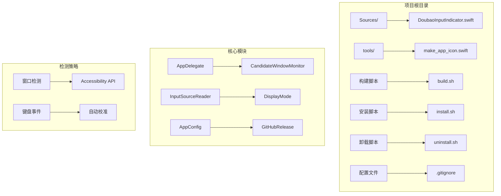
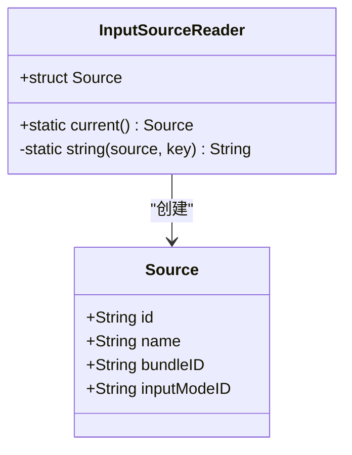
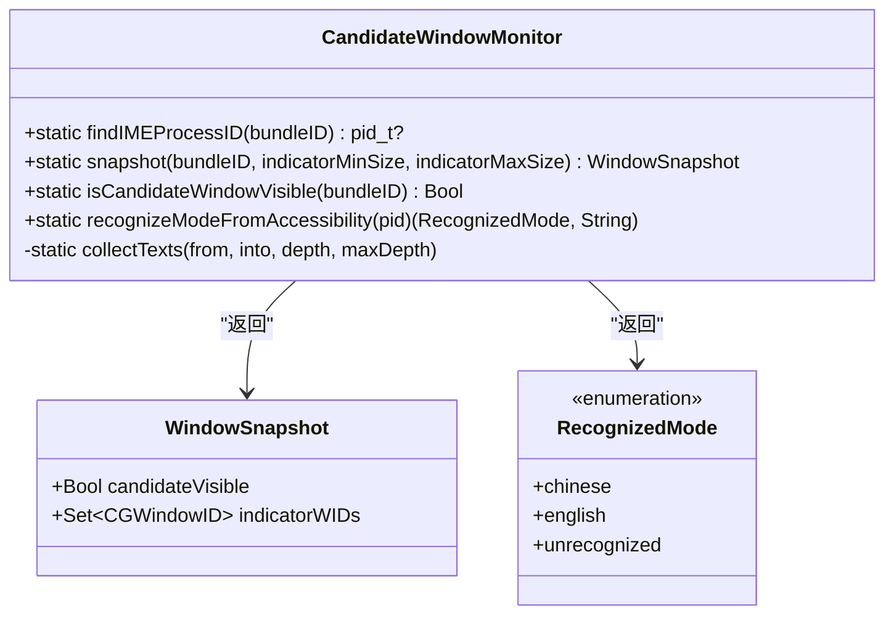
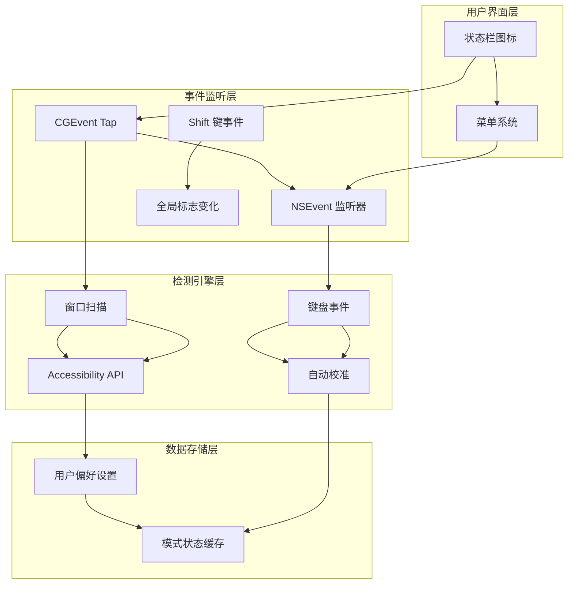
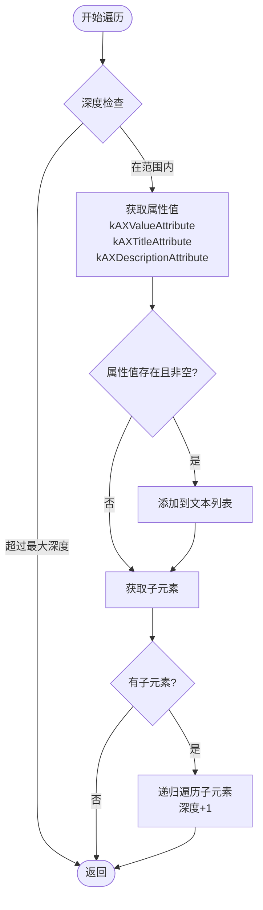
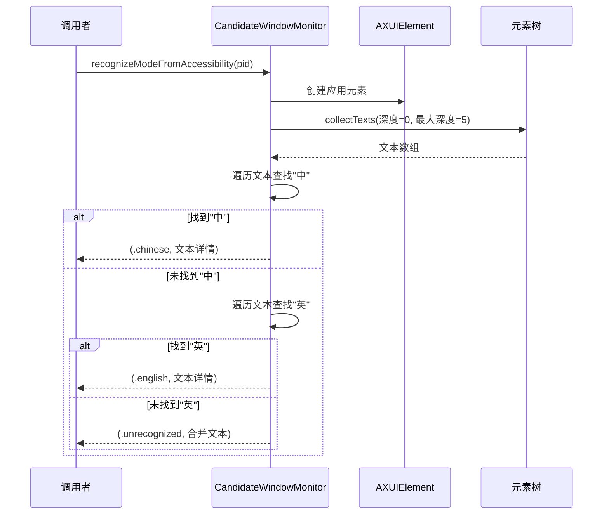
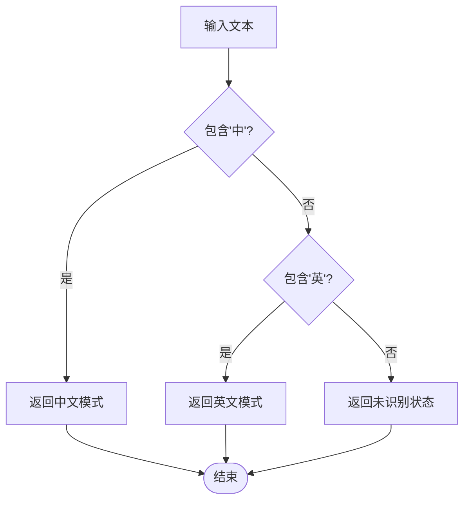
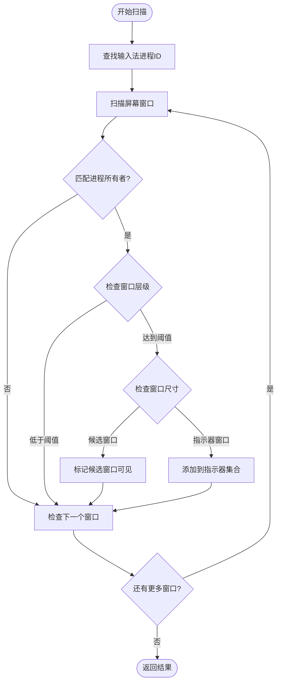
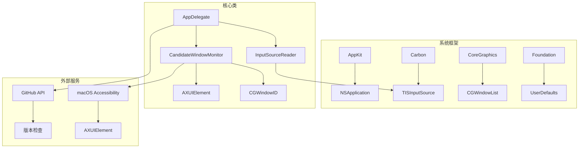
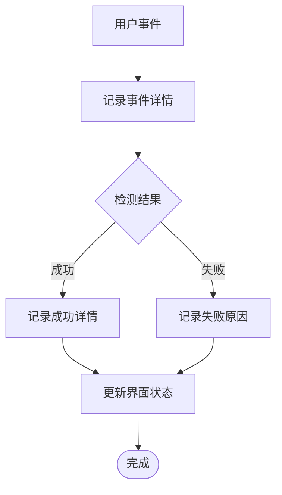

# 模式指示器识别

<cite>
**本文档引用的文件**
- [DoubaoInputIndicator.swift](file://Sources/DoubaoInputIndicator.swift)
- [build.sh](file://build.sh)
- [install.sh](file://install.sh)
- [uninstall.sh](file://uninstall.sh)
</cite>

## 目录
1. [简介](#简介)
2. [项目结构](#项目结构)
3. [核心组件](#核心组件)
4. [架构概览](#架构概览)
5. [详细组件分析](#详细组件分析)
6. [依赖关系分析](#依赖关系分析)
7. [性能考虑](#性能考虑)
8. [故障排除指南](#故障排除指南)
9. [结论](#结论)

## 简介

这是一个基于macOS Accessibility API的输入法模式指示器识别系统。该系统能够自动检测当前输入法的中英文状态，通过分析输入法进程的UI元素树来识别模式指示器中的"中"和"英"字符。

系统采用多层检测策略：
- **窗口检测**：通过CGWindowList扫描输入法进程的候选窗口和模式指示器窗口
- **Accessibility API**：使用AXUIElement遍历UI元素树，提取文本内容
- **键盘事件监听**：通过CGEvent和NSEvent监听Shift键切换事件
- **自动校准**：结合多种检测结果进行智能校准

## 项目结构

**图表来源**
- [DoubaoInputIndicator.swift:1-1410](file://Sources/DoubaoInputIndicator.swift#L1-L1410)

**章节来源**
- [DoubaoInputIndicator.swift:1-1410](file://Sources/DoubaoInputIndicator.swift#L1-L1410)
- [build.sh:1-117](file://build.sh#L1-L117)

## 核心组件

### 输入源读取器 (InputSourceReader)

负责获取当前输入法的状态信息，包括输入源ID、本地化名称、bundle ID和输入模式ID。

**图表来源**
- [DoubaoInputIndicator.swift:104-131](file://Sources/DoubaoInputIndicator.swift#L104-L131)

### 候选窗口监控器 (CandidateWindowMonitor)

这是系统的核心组件，负责通过多种方式检测输入法模式状态。

**图表来源**
- [DoubaoInputIndicator.swift:133-278](file://Sources/DoubaoInputIndicator.swift#L133-L278)

**章节来源**
- [DoubaoInputIndicator.swift:104-131](file://Sources/DoubaoInputIndicator.swift#L104-L131)
- [DoubaoInputIndicator.swift:133-278](file://Sources/DoubaoInputIndicator.swift#L133-L278)

## 架构概览

系统采用分层架构设计，从底层的窗口检测到高层的模式识别：

**图表来源**
- [DoubaoInputIndicator.swift:280-1410](file://Sources/DoubaoInputIndicator.swift#L280-L1410)

## 详细组件分析

### AXUIElement树遍历算法

系统使用递归算法遍历AXUIElement树来收集文本内容：

**图表来源**
- [DoubaoInputIndicator.swift:250-277](file://Sources/DoubaoInputIndicator.swift#L250-L277)

#### collectTexts函数实现细节

collectTexts函数实现了以下关键功能：

1. **深度限制**：防止无限递归，默认最大深度为5层
2. **属性优先级**：按kAXValueAttribute → kAXTitleAttribute → kAXDescriptionAttribute的顺序获取文本
3. **递归遍历**：对每个元素的所有子元素进行深度优先搜索
4. **去重机制**：通过集合存储窗口ID避免重复检测

**章节来源**
- [DoubaoInputIndicator.swift:250-277](file://Sources/DoubaoInputIndicator.swift#L250-L277)

### recognizeModeFromAccessibility方法

该方法是系统的核心识别逻辑：

**图表来源**
- [DoubaoInputIndicator.swift:229-248](file://Sources/DoubaoInputIndicator.swift#L229-L248)

#### 文本识别优先级顺序

系统采用严格的文本识别优先级：

1. **kAXValueAttribute**：首选属性，通常包含最直接的文本内容
2. **kAXTitleAttribute**：次选属性，用于标题或标签文本
3. **kAXDescriptionAttribute**：最后选择，用于描述性文本

这种优先级设计基于Accessibility API的最佳实践，确保能够捕获到最相关的文本内容。

**章节来源**
- [DoubaoInputIndicator.swift:229-248](file://Sources/DoubaoInputIndicator.swift#L229-L248)

### 文本匹配规则

系统使用简单的字符匹配规则来识别输入法模式：

**图表来源**
- [DoubaoInputIndicator.swift:242-245](file://Sources/DoubaoInputIndicator.swift#L242-L245)

#### 错误处理机制

系统实现了多层次的错误处理：

1. **AXUIElement创建失败**：返回空文本列表
2. **属性获取失败**：跳过该属性，继续下一个属性
3. **子元素遍历失败**：跳过该元素，继续遍历其他子元素
4. **未识别状态**：返回unrecognized模式和合并的文本详情

**章节来源**
- [DoubaoInputIndicator.swift:229-248](file://Sources/DoubaoInputIndicator.swift#L229-L248)

### 窗口检测策略

除了Accessibility API，系统还使用窗口检测作为补充：

**图表来源**
- [DoubaoInputIndicator.swift:148-212](file://Sources/DoubaoInputIndicator.swift#L148-L212)

**章节来源**
- [DoubaoInputIndicator.swift:148-212](file://Sources/DoubaoInputIndicator.swift#L148-L212)

## 依赖关系分析

系统的主要依赖关系如下：

**图表来源**
- [DoubaoInputIndicator.swift:1-6](file://Sources/DoubaoInputIndicator.swift#L1-L6)

**章节来源**
- [DoubaoInputIndicator.swift:1-6](file://Sources/DoubaoInputIndicator.swift#L1-L6)

## 性能考虑

### 内存管理

- 使用弱引用避免循环引用
- 及时释放CGEvent和AXUIElement资源
- 合理使用Set和Array避免内存泄漏

### 计算优化

- 递归深度限制为5层，防止深度过大影响性能
- 文本匹配使用早期退出（找到"中"或"英"立即返回）
- 窗口扫描使用过滤条件减少不必要的遍历

### 线程安全

- 所有UI更新都在主线程执行
- 异步操作使用DispatchQueue.main
- 事件处理使用线程安全的数据结构

## 故障排除指南

### 常见问题及解决方案

#### Accessibility权限问题

**症状**：系统显示需要授权但无法正常工作
**解决方法**：
1. 检查辅助功能权限设置
2. 重新启动应用程序
3. 在系统偏好设置中重新授权

#### 窗口检测失败

**症状**：候选窗口检测不到，但输入法正常
**解决方法**：
1. 检查输入法进程是否在运行
2. 验证bundle ID配置正确
3. 调整窗口层级阈值

#### 模式识别不准确

**症状**：经常出现unrecognized状态
**解决方法**：
1. 检查输入法版本兼容性
2. 验证文本属性获取是否正常
3. 查看日志文件定位具体问题

**章节来源**
- [DoubaoInputIndicator.swift:379-406](file://Sources/DoubaoInputIndicator.swift#L379-L406)

### 日志分析

系统提供了详细的日志记录功能：

**图表来源**
- [DoubaoInputIndicator.swift:1388-1403](file://Sources/DoubaoInputIndicator.swift#L1388-L1403)

**章节来源**
- [DoubaoInputIndicator.swift:1388-1403](file://Sources/DoubaoInputIndicator.swift#L1388-L1403)

## 结论

基于Accessibility API的模式指示器识别系统是一个设计精良的macOS应用程序，具有以下特点：

### 技术优势

1. **多层检测策略**：结合窗口检测、Accessibility API和键盘事件监听
2. **智能校准机制**：通过多种信号源进行交叉验证
3. **优雅降级**：当某一层检测失败时，系统仍能正常工作
4. **性能优化**：合理的深度限制和早期退出机制

### 实现特色

1. **递归遍历算法**：高效地遍历AXUIElement树结构
2. **属性优先级处理**：严格按照Accessibility API规范处理文本属性
3. **错误处理机制**：完善的异常处理和恢复策略
4. **状态管理模式**：清晰的状态定义和转换逻辑

### 应用价值

该系统为用户提供了一个可靠的输入法模式检测工具，特别适用于需要频繁切换中英文输入法的用户场景。其开源特性也为其他开发者提供了学习和参考的价值。

通过深入分析代码结构和实现细节，我们可以看到这是一个高质量的macOS应用程序，体现了良好的软件工程实践和用户体验设计原则。