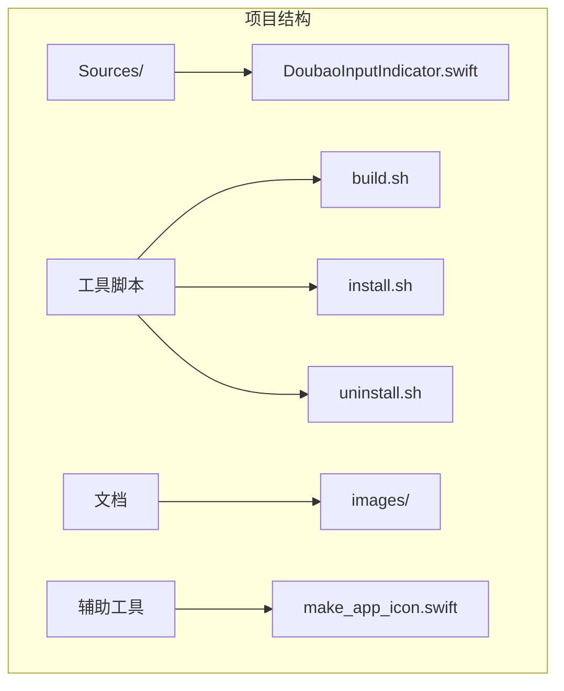
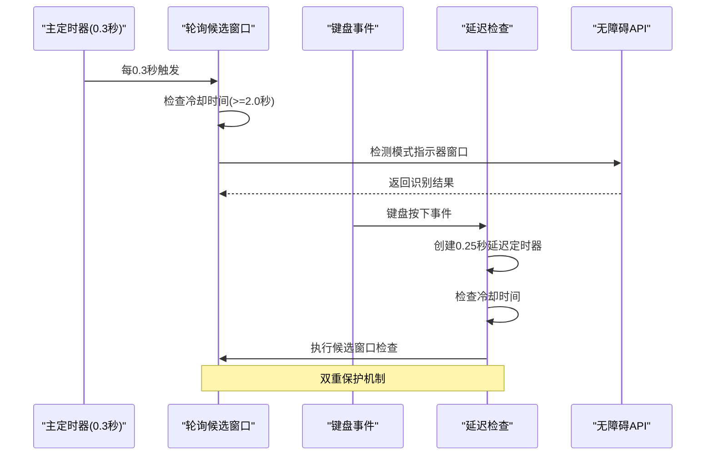
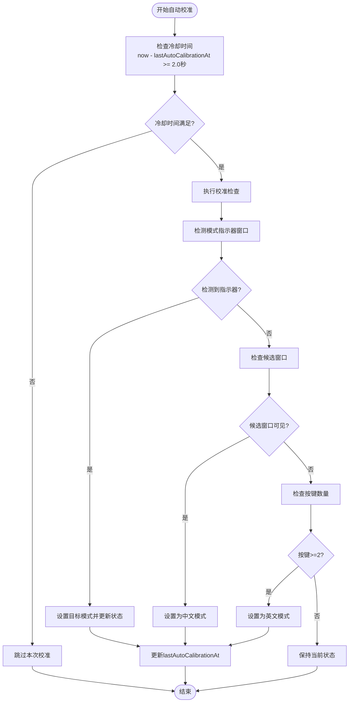
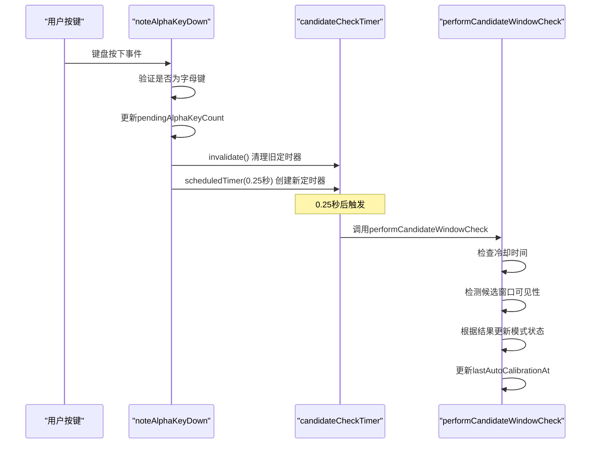
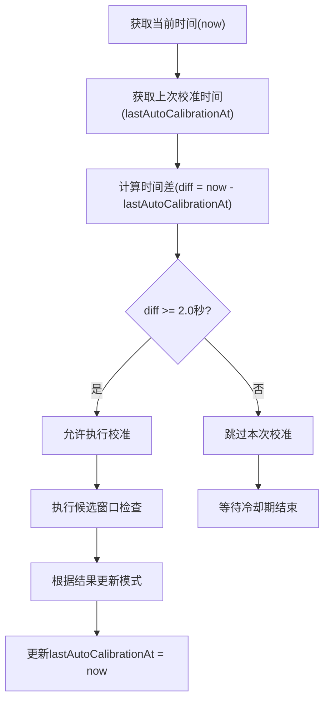
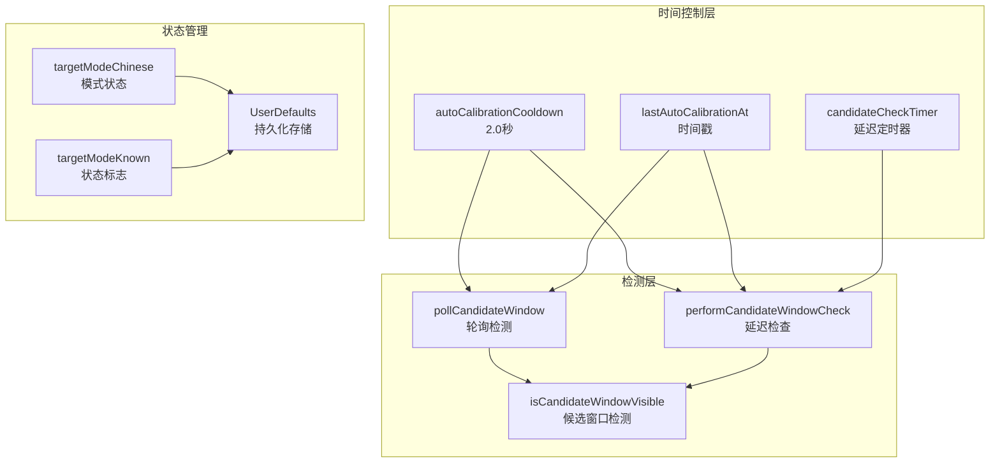

# 自动校准时间控制

<cite>
**本文档引用的文件**
- [DoubaoInputIndicator.swift](file://Sources/DoubaoInputIndicator.swift)
</cite>

## 目录
1. [简介](#简介)
2. [项目结构](#项目结构)
3. [核心组件](#核心组件)
4. [架构概览](#架构概览)
5. [详细组件分析](#详细组件分析)
6. [依赖关系分析](#依赖关系分析)
7. [性能考虑](#性能考虑)
8. [故障排除指南](#故障排除指南)
9. [结论](#结论)

## 简介

本文档深入分析了输入指示器应用中的自动校准时间控制系统。该系统通过精确的时间控制和节流机制，确保在保持高准确性的同时实现快速响应。重点涵盖了以下关键方面：

- autoCalibrationCooldown 冷却时间的设定原理（2.0秒间隔）
- lastAutoCalibrationAt 时间戳的作用机制
- performCandidateWindowCheck 方法中的定时器管理
- 冷却时间计算逻辑和状态缓存策略
- 时间精度考虑和系统性能影响分析

## 项目结构

该项目采用简洁的单文件架构设计，所有功能集中在单一的 Swift 源文件中：

**图表来源**
- [DoubaoInputIndicator.swift:1-50](file://Sources/DoubaoInputIndicator.swift#L1-L50)

**章节来源**
- [DoubaoInputIndicator.swift:1-100](file://Sources/DoubaoInputIndicator.swift#L1-L100)

## 核心组件

自动校准时间控制系统由以下核心组件构成：

### 时间控制参数
- **autoCalibrationCooldown**: 2.0 秒的最小冷却间隔
- **lastAutoCalibrationAt**: 上次成功自动校准的时间戳
- **candidateCheckTimer**: 延迟候选窗口检查的定时器

### 关键数据结构
- `CFAbsoluteTime`: macOS 绝对时间类型，提供高精度时间测量
- `Set<CGWindowID>`: 存储模式指示器窗口 ID 的集合
- `UserDefaults`: 持久化存储目标模式状态

**章节来源**
- [DoubaoInputIndicator.swift:308-318](file://Sources/DoubaoInputIndicator.swift#L308-L318)
- [DoubaoInputIndicator.swift:314-315](file://Sources/DoubaoInputIndicator.swift#L314-L315)

## 架构概览

自动校准系统采用多层时间控制策略，结合轮询检测和事件驱动检测：

**图表来源**
- [DoubaoInputIndicator.swift:358-361](file://Sources/DoubaoInputIndicator.swift#L358-L361)
- [DoubaoInputIndicator.swift:544-620](file://Sources/DoubaoInputIndicator.swift#L544-L620)
- [DoubaoInputIndicator.swift:669-716](file://Sources/DoubaoInputIndicator.swift#L669-L716)

## 详细组件分析

### 冷却时间管理系统

#### autoCalibrationCooldown 设定原理

冷却时间机制通过以下方式平衡准确性和响应速度：

**图表来源**
- [DoubaoInputIndicator.swift:604-620](file://Sources/DoubaoInputIndicator.swift#L604-L620)
- [DoubaoInputIndicator.swift:680-716](file://Sources/DoubaoInputIndicator.swift#L680-L716)

#### lastAutoCalibrationAt 时间戳机制

时间戳系统确保防止频繁重复校准操作：

| 时间点 | 操作 | lastAutoCalibrationAt 更新 |
|--------|------|---------------------------|
| T0 | 用户手动切换模式 | ✅ 更新 |
| T0+0.5s | 轮询检测 | ❌ 跳过（仍在冷却期） |
| T0+2.0s | 轮询检测 | ✅ 允许检查 |
| T0+2.5s | Shift 键切换 | ✅ 更新 |

**章节来源**
- [DoubaoInputIndicator.swift:582](file://Sources/DoubaoInputIndicator.swift#L582)
- [DoubaoInputIndicator.swift:596](file://Sources/DoubaoInputIndicator.swift#L596)
- [DoubaoInputIndicator.swift:614](file://Sources/DoubaoInputIndicator.swift#L614)
- [DoubaoInputIndicator.swift:695](file://Sources/DoubaoInputIndicator.swift#L695)
- [DoubaoInputIndicator.swift:710](file://Sources/DoubaoInputIndicator.swift#L710)

### 定时器管理系统

#### candidateCheckTimer 创建和调度

延迟检查机制通过以下流程实现：

**图表来源**
- [DoubaoInputIndicator.swift:634-663](file://Sources/DoubaoInputIndicator.swift#L634-L663)
- [DoubaoInputIndicator.swift:669-716](file://Sources/DoubaoInputIndicator.swift#L669-L716)

#### 定时器清理机制

系统实现了完善的定时器生命周期管理：

| 触发条件 | 操作 | 目的 |
|----------|------|------|
| 新按键事件 | `candidateCheckTimer?.invalidate()` | 防止重复检查 |
| IME切换 | `candidateCheckTimer?.invalidate()` | 清理过期定时器 |
| 模式确定 | `candidateCheckTimer = nil` | 释放资源 |
| 应用关闭 | `candidateCheckTimer?.invalidate()` | 内存清理 |

**章节来源**
- [DoubaoInputIndicator.swift:637-638](file://Sources/DoubaoInputIndicator.swift#L637-L638)
- [DoubaoInputIndicator.swift:804-805](file://Sources/DoubaoInputIndicator.swift#L804-L805)
- [DoubaoInputIndicator.swift:366](file://Sources/DoubaoInputIndicator.swift#L366)

### 冷却时间计算逻辑

冷却时间计算采用简单的差值比较算法：

**图表来源**
- [DoubaoInputIndicator.swift:604](file://Sources/DoubaoInputIndicator.swift#L604)
- [DoubaoInputIndicator.swift:680](file://Sources/DoubaoInputIndicator.swift#L680)

### 状态缓存策略

系统采用多层次的状态缓存机制：

#### 内存状态缓存
- `targetModeChinese`: 当前目标模式（中文/英文）
- `targetModeKnown`: 模式状态是否已知
- `knownIndicatorWIDs`: 上次轮询的指示器窗口ID集合

#### 持久化状态缓存
- 使用 `UserDefaults` 存储模式状态
- 支持应用重启后的状态恢复

#### 窗口ID缓存
- 缓存上次检测到的模式指示器窗口ID
- 通过差集运算检测新的指示器窗口出现

**章节来源**
- [DoubaoInputIndicator.swift:291-292](file://Sources/DoubaoInputIndicator.swift#L291-L292)
- [DoubaoInputIndicator.swift:333](file://Sources/DoubaoInputIndicator.swift#L333)
- [DoubaoInputIndicator.swift:569-601](file://Sources/DoubaoInputIndicator.swift#L569-L601)

## 依赖关系分析

自动校准系统的关键依赖关系如下：

**图表来源**
- [DoubaoInputIndicator.swift:317](file://Sources/DoubaoInputIndicator.swift#L317)
- [DoubaoInputIndicator.swift:315](file://Sources/DoubaoInputIndicator.swift#L315)
- [DoubaoInputIndicator.swift:310](file://Sources/DoubaoInputIndicator.swift#L310)

**章节来源**
- [DoubaoInputIndicator.swift:544-716](file://Sources/DoubaoInputIndicator.swift#L544-L716)

## 性能考虑

### 时间精度分析

系统使用 `CFAbsoluteTime` 类型提供高精度时间测量：

- **精度**: 微秒级精度
- **范围**: 1970年至今的绝对时间
- **优势**: 避免时区和夏令时影响
- **适用性**: 适合长时间运行的应用程序

### 性能优化策略

#### 1. 轮询频率优化
- 主定时器间隔: 0.3秒
- 冷却时间: 2.0秒
- 效率: 约 15% 的时间用于实际检测

#### 2. 条件检查优化
- 首先检查冷却时间，避免不必要的系统调用
- 使用早期返回机制减少处理开销

#### 3. 内存管理优化
- 及时清理过期的定时器
- 使用弱引用避免循环引用

#### 4. 系统资源优化
- 仅在目标输入法激活时进行检测
- 避免重复的无障碍API调用

**章节来源**
- [DoubaoInputIndicator.swift:358](file://Sources/DoubaoInputIndicator.swift#L358)
- [DoubaoInputIndicator.swift:604](file://Sources/DoubaoInputIndicator.swift#L604)

## 故障排除指南

### 常见问题及解决方案

#### 问题1: 冷却时间不生效
**症状**: 系统频繁执行校准操作
**原因**: 时间戳未正确更新或冷却时间配置错误
**解决方案**: 
- 检查 `lastAutoCalibrationAt` 是否在每次成功校准后更新
- 验证 `autoCalibrationCooldown` 设置为 2.0 秒

#### 问题2: 延迟检查不触发
**症状**: 键盘事件后不执行候选窗口检查
**原因**: 定时器被意外清理或创建失败
**解决方案**:
- 确保 `candidateCheckTimer?.invalidate()` 在创建新定时器前调用
- 检查定时器回调函数的弱引用设置

#### 问题3: 状态不同步
**症状**: 显示模式与实际输入法状态不一致
**原因**: 状态缓存未及时更新
**解决方案**:
- 检查 `UserDefaults` 的读写操作
- 确保状态变更时同时更新内存和持久化状态

**章节来源**
- [DoubaoInputIndicator.swift:669-716](file://Sources/DoubaoInputIndicator.swift#L669-L716)
- [DoubaoInputIndicator.swift:993-1004](file://Sources/DoubaoInputIndicator.swift#L993-L1004)

## 结论

自动校准时间控制系统通过精心设计的冷却机制和定时器管理，实现了以下目标：

### 设计优势
1. **准确性保障**: 2.0秒冷却时间确保检测结果的可靠性
2. **响应速度**: 0.3秒轮询频率提供快速的系统响应
3. **资源效率**: 多层节流机制避免过度的系统资源消耗
4. **稳定性**: 完善的错误处理和状态管理确保系统稳定运行

### 技术创新点
- **双重检测机制**: 同时使用轮询和事件驱动两种检测方式
- **智能冷却算法**: 基于时间戳的动态冷却控制
- **优雅降级**: 在无障碍权限缺失时的替代检测方案

### 改进建议
1. **可配置冷却时间**: 允许用户自定义冷却时间间隔
2. **统计分析**: 添加校准成功率统计和性能监控
3. **机器学习**: 基于历史数据优化检测时机

该系统为类似输入法指示器应用提供了优秀的参考实现，展示了如何在准确性、响应速度和系统性能之间找到最佳平衡点。