# 自动校准系统

<cite>
**本文档引用的文件**
- [DoubaoInputIndicator.swift](file://Sources/DoubaoInputIndicator.swift)
- [build.sh](file://build.sh)
- [install.sh](file://install.sh)
- [uninstall.sh](file://uninstall.sh)
</cite>

## 更新摘要
**变更内容**
- 优化了轮询间隔从 0.5 秒调整为 0.3 秒，提升检测响应速度
- 改进了防抖机制，基于 Accessibility API 可用性条件性应用去抖动策略
- 增强了 Shift 切换验证机制，增加重新进入目标输入法时的模式重置逻辑
- 更新了相关参数配置和算法流程图

## 目录
1. [简介](#简介)
2. [项目结构](#项目结构)
3. [核心组件](#核心组件)
4. [架构概览](#架构概览)
5. [详细组件分析](#详细组件分析)
6. [依赖关系分析](#依赖关系分析)
7. [性能考虑](#性能考虑)
8. [故障排除指南](#故障排除指南)
9. [结论](#结论)

## 简介

自动校准系统是一个基于 macOS 平台的智能输入法状态检测工具，专门用于自动识别和校准中文/英文输入法模式。该系统通过多种检测机制实现高精度的状态跟踪，包括候选项窗口检测、多键输入统计和模式状态更新，同时支持基于模式指示器的校准流程。

系统的核心创新在于实现了双重校准机制：
- **候选项窗口校准**：通过检测输入法候选面板的可见性来判断当前输入模式
- **模式指示器校准**：利用 Accessibility API 从输入法的模式指示器窗口中提取文本信息进行精确识别

**更新** 新版本优化了轮询频率和防抖机制，提升了系统的响应速度和准确性。

## 项目结构

该项目采用简洁的单文件架构设计，所有功能都集中在单一的 Swift 源文件中，便于维护和部署。

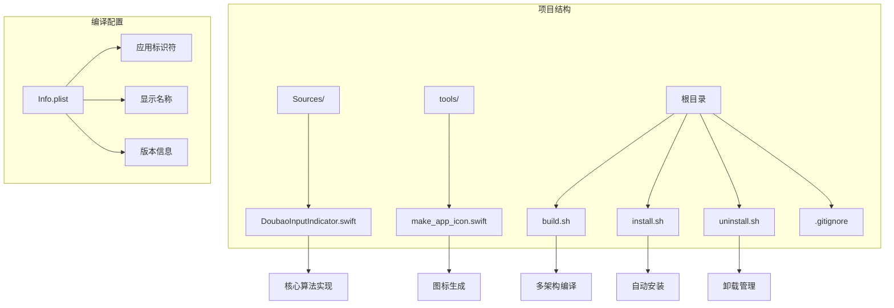

**图表来源**
- [DoubaoInputIndicator.swift:1-1427](file://Sources/DoubaoInputIndicator.swift#L1-L1427)
- [build.sh:1-117](file://build.sh#L1-L117)

**章节来源**
- [DoubaoInputIndicator.swift:1-1427](file://Sources/DoubaoInputIndicator.swift#L1-L1427)
- [build.sh:1-117](file://build.sh#L1-L117)

## 核心组件

### 输入源读取器 (InputSourceReader)

负责获取当前活动的输入法信息，包括输入法 ID、名称、包标识符和输入模式 ID。

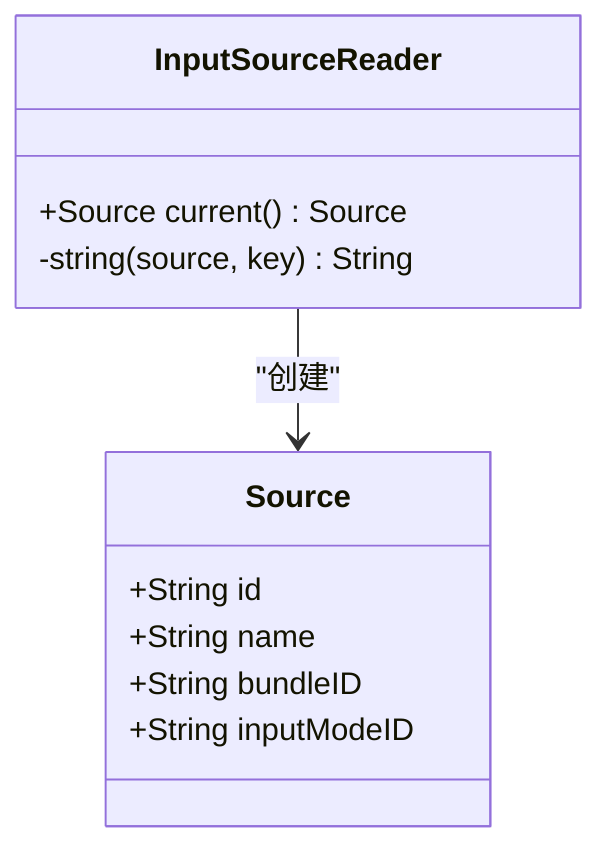

**图表来源**
- [DoubaoInputIndicator.swift:104-131](file://Sources/DoubaoInputIndicator.swift#L104-L131)

### 候选窗口监控器 (CandidateWindowMonitor)

实现候选项窗口检测和模式指示器识别的核心组件。

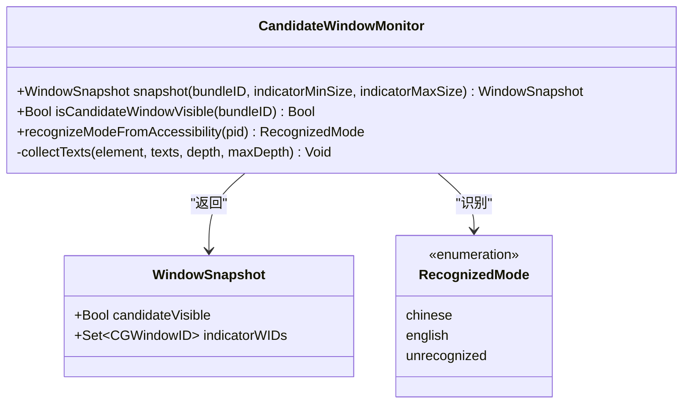

**图表来源**
- [DoubaoInputIndicator.swift:133-278](file://Sources/DoubaoInputIndicator.swift#L133-L278)

### 应用委托 (AppDelegate)

主控制器，协调所有校准逻辑和用户界面交互。

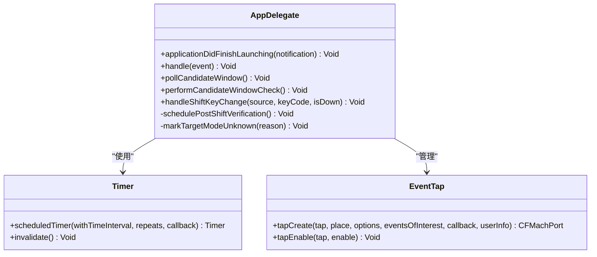

**图表来源**
- [DoubaoInputIndicator.swift:280-1427](file://Sources/DoubaoInputIndicator.swift#L280-L1427)

**章节来源**
- [DoubaoInputIndicator.swift:104-1427](file://Sources/DoubaoInputIndicator.swift#L104-L1427)

## 架构概览

系统采用分层架构设计，实现了事件监听、状态检测和用户界面的清晰分离。

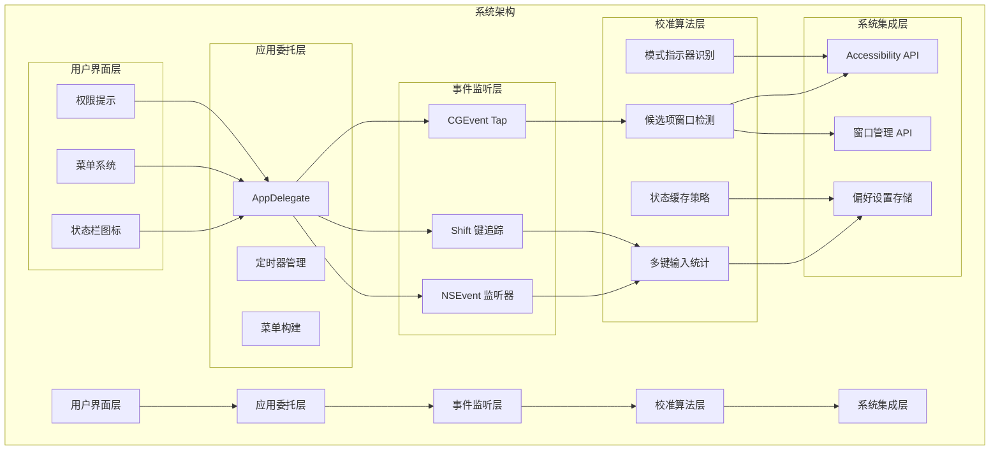

**图表来源**
- [DoubaoInputIndicator.swift:280-1427](file://Sources/DoubaoInputIndicator.swift#L280-L1427)

## 详细组件分析

### 候选项窗口检测算法

候选项窗口检测是系统最核心的功能之一，通过分析屏幕上的窗口属性来判断输入法状态。

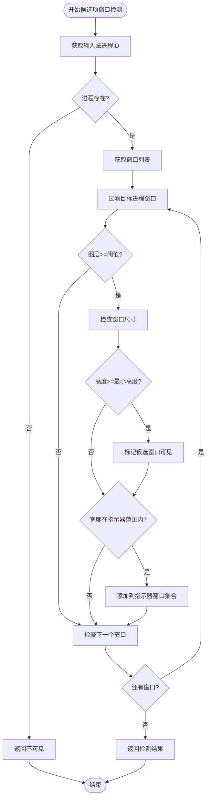

**图表来源**
- [DoubaoInputIndicator.swift:148-212](file://Sources/DoubaoInputIndicator.swift#L148-L212)

#### 关键参数配置

系统使用精心调优的参数来确保检测精度：

| 参数 | 值 | 描述 | 用途 |
|------|-----|------|------|
| `candidateLayerThreshold` | 2,147,483,000 | 候选窗口图层阈值 | 区分候选面板和普通窗口 |
| `minimumCandidateWindowHeight` | 40 | 候选窗口最小高度 | 过滤工具栏等小窗口 |
| `indicatorMinSize` | 15 | 模式指示器最小尺寸 | 识别"中"/"英"提示框 |
| `indicatorMaxSize` | 50 | 模式指示器最大尺寸 | 识别"中"/"英"提示框 |
| `autoCalibrationCooldown` | 2.0秒 | 自动校准冷却时间 | 防止频繁校准 |
| **轮询间隔** | **0.3秒** | **主定时器轮询频率** | **提升检测响应速度** |

**更新** 轮询间隔从 0.5 秒优化为 0.3 秒，显著提升系统响应速度。

**章节来源**
- [DoubaoInputIndicator.swift:133-212](file://Sources/DoubaoInputIndicator.swift#L133-L212)

### 多键输入统计机制

系统实现了智能的多键输入统计来区分中文和英文输入模式。

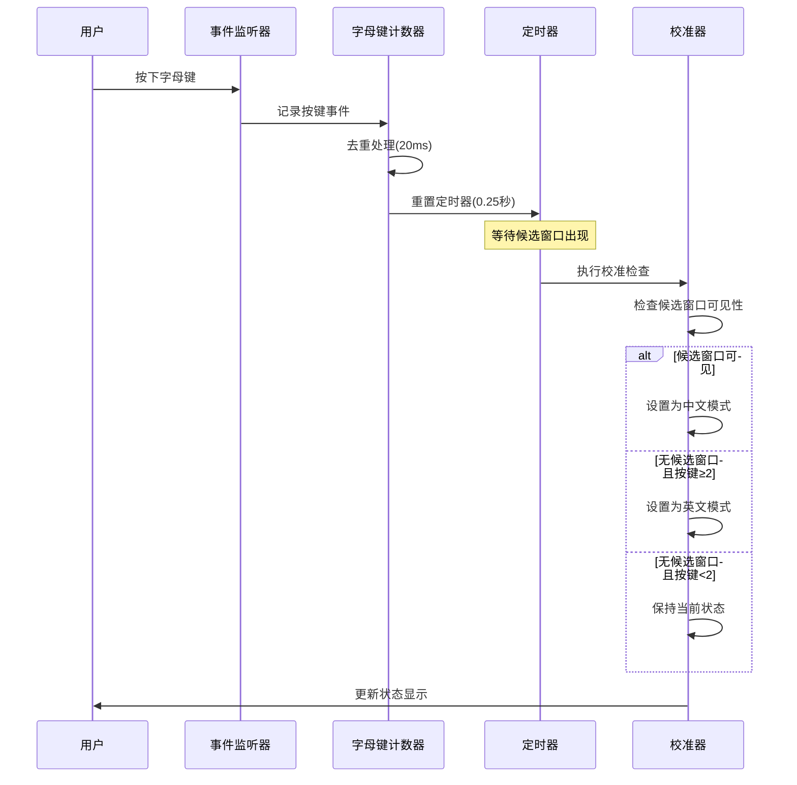

**图表来源**
- [DoubaoInputIndicator.swift:622-716](file://Sources/DoubaoInputIndicator.swift#L622-L716)

#### 多键统计算法特点

1. **去重处理**：通过 20ms 时间窗口消除重复事件
2. **延迟检测**：等待 0.25 秒让候选窗口有足够时间出现
3. **阈值判断**：至少 2 个字母键才判定为英文模式
4. **状态缓存**：使用冷却时间防止频繁状态切换

**章节来源**
- [DoubaoInputIndicator.swift:622-716](file://Sources/DoubaoInputIndicator.swift#L622-L716)

### 模式指示器识别算法

系统通过 Accessibility API 从输入法的模式指示器窗口中提取文本信息。

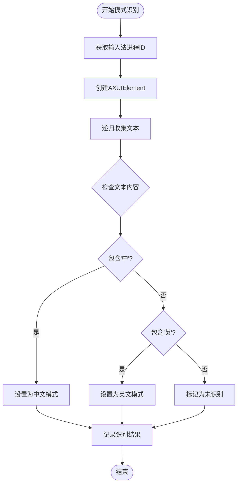

**图表来源**
- [DoubaoInputIndicator.swift:229-277](file://Sources/DoubaoInputIndicator.swift#L229-L277)

#### Accessibility API 使用策略

1. **深度遍历**：最多递归 5 层深度搜索 UI 元素
2. **多属性读取**：同时检查 `value`、`title`、`description` 属性
3. **文本匹配**：使用包含匹配而非精确匹配提高容错性
4. **错误处理**：对无法识别的情况提供降级处理

**章节来源**
- [DoubaoInputIndicator.swift:229-277](file://Sources/DoubaoInputIndicator.swift#L229-L277)

### Shift 键追踪与去抖动机制

系统实现了复杂的 Shift 键追踪机制来处理输入法切换操作。

```mermaid
stateDiagram-v2
[*] --> Idle : 系统启动
Idle --> ShiftDown : 检测到 Shift 按下
ShiftDown --> Tracking : 记录按压状态
Tracking --> ShiftUp : Shift 松开
ShiftUp --> CheckDuration : 检查按压时长
CheckDuration --> ValidDuration : 时长<=1秒
CheckDuration --> InvalidDuration : 时长>1秒
ValidDuration --> CheckCombined : 检查是否与其他键组合
CheckCombined --> Combined : 发现其他键
CheckCombined --> Standalone : 独立按键
Combined --> [*] : 忽略事件
Standalone --> DebounceCheck : 检查去抖动间隔
DebounceCheck --> AXAvailable{"Accessibility 可用?"}
AXAvailable --> |是| ValidToggle : 直接切换无需去抖动
AXAvailable --> |否| Debounced : 距离上次切换<0.35秒
DebounceCheck --> [*] : 忽略事件
ValidToggle --> ToggleMode : 切换输入模式
ToggleMode --> PostVerification : 安排后续验证
PostVerification --> [*] : 完成处理
InvalidDuration --> [*] : 忽略事件
Debounced --> [*] : 忽略事件
```

**图表来源**
- [DoubaoInputIndicator.swift:866-980](file://Sources/DoubaoInputIndicator.swift#L866-L980)

#### 去抖动参数配置

| 参数 | 值 | 描述 | 用途 |
|------|-----|------|------|
| `maximumStandaloneShiftTapDuration` | 1.0秒 | 独立 Shift 按压最大时长 | 区分快速切换和长按操作 |
| `minimumShiftToggleGap` | 0.35秒 | 连续 Shift 切换最小间隔 | 与输入法内部去抖动同步 |
| `lastShiftToggleAt` | 时间戳 | 上次有效切换时间 | 实现去抖动控制 |
| **轮询间隔** | **0.3秒** | **主定时器轮询频率** | **提升检测响应速度** |

**更新** 增强了去抖动机制，基于 Accessibility API 可用性条件性应用去抖动策略，当 Accessibility 不可用时才应用 0.35 秒的去抖动间隔。

**章节来源**
- [DoubaoInputIndicator.swift:866-980](file://Sources/DoubaoInputIndicator.swift#L866-L980)

### 自动校准时间控制机制

系统实现了多层次的时间控制机制来平衡准确性与性能。

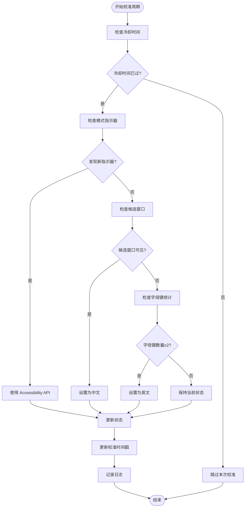

**图表来源**
- [DoubaoInputIndicator.swift:544-620](file://Sources/DoubaoInputIndicator.swift#L544-L620)

#### 时间控制策略

1. **冷却时间限制**：2.0 秒的最小间隔防止过度校准
2. **状态缓存策略**：成功校准后立即更新时间戳避免重复触发
3. **优先级队列**：模式指示器检测具有最高优先级
4. **降级路径**：当指示器不可用时使用候选项窗口检测

**更新** 主定时器轮询频率从 0.5 秒优化为 0.3 秒，提升系统响应速度。

**章节来源**
- [DoubaoInputIndicator.swift:544-620](file://Sources/DoubaoInputIndicator.swift#L544-L620)

### 增强的 Shift 切换验证机制

系统增加了重新进入目标输入法时的模式重置逻辑，确保状态准确性。

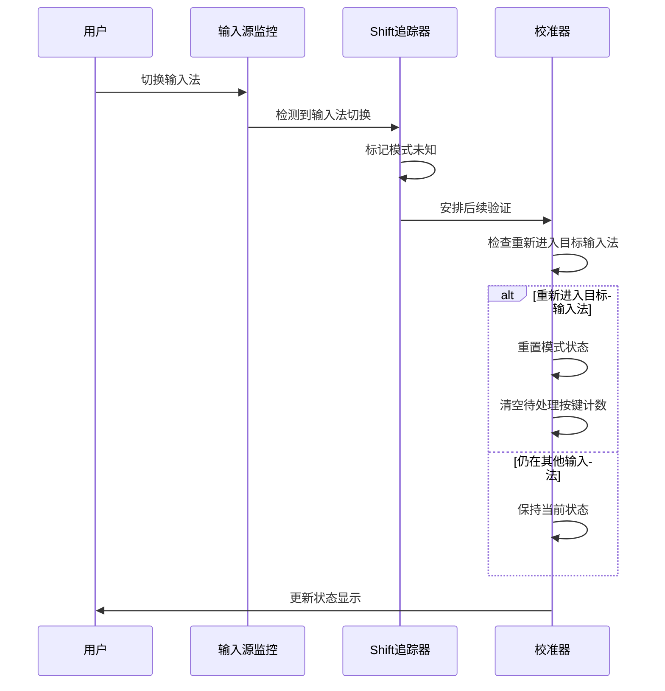

**图表来源**
- [DoubaoInputIndicator.swift:794-807](file://Sources/DoubaoInputIndicator.swift#L794-L807)

#### 重新进入检测逻辑

当用户从目标输入法切换到其他输入法后再次切换回目标输入法时，系统会：
1. 检测到输入法切换并标记模式未知
2. 清空待处理的字母键计数
3. 重新安排后续验证以确保状态准确性
4. 允许候选项窗口检测或模式指示器识别重新校准

**更新** 新增了重新进入目标输入法时的模式重置逻辑，提升系统在复杂输入法切换场景下的准确性。

**章节来源**
- [DoubaoInputIndicator.swift:794-807](file://Sources/DoubaoInputIndicator.swift#L794-L807)

## 依赖关系分析

系统依赖于多个 macOS 系统框架和 API：

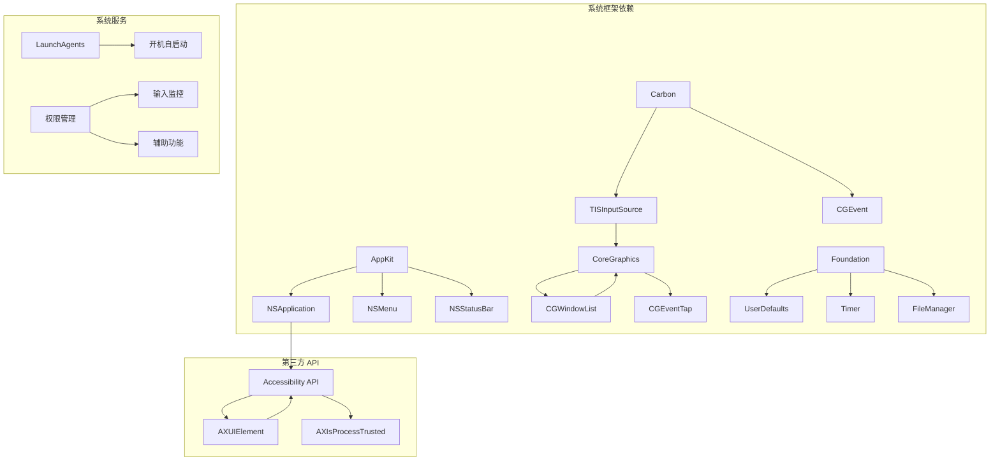

**图表来源**
- [DoubaoInputIndicator.swift:1-6](file://Sources/DoubaoInputIndicator.swift#L1-L6)

### 权限管理机制

系统需要多种系统权限才能正常工作：

| 权限类型 | 获取方式 | 用途 | 必需性 |
|----------|----------|------|--------|
| 输入监控权限 | `CGPreflightListenEventAccess()` | 监控键盘事件 | ✅ 必需 |
| 辅助功能权限 | `AXIsProcessTrusted()` | 读取 UI 元素 | ✅ 必需 |
| 窗口管理权限 | `CGWindowListCopyWindowInfo()` | 检测窗口属性 | ✅ 必需 |
| 文件系统权限 | `FileManager` | 读写偏好设置 | ✅ 必需 |

**章节来源**
- [DoubaoInputIndicator.swift:379-406](file://Sources/DoubaoInputIndicator.swift#L379-L406)

## 性能考虑

### 内存管理优化

系统采用了多种内存管理策略来确保长期运行的稳定性：

1. **弱引用模式**：定时器和回调函数使用弱引用避免循环引用
2. **及时释放**：事件处理完成后立即清理临时状态
3. **懒加载机制**：仅在需要时创建昂贵的对象实例

### CPU 使用优化

1. **定时器节流**：主循环每 0.3 秒执行一次轮询（优化后）
2. **条件检查**：只有在目标输入法激活时才进行复杂计算
3. **早期退出**：在不可能产生结果的情况下提前返回

**更新** 轮询间隔从 0.5 秒优化为 0.3 秒，在保证性能的同时提升响应速度。

### 磁盘 I/O 优化

1. **日志轮转**：使用追加模式写入日志文件
2. **最小化文件操作**：只在必要时访问文件系统
3. **异步处理**：网络请求和文件操作都在后台线程执行

## 故障排除指南

### 常见问题诊断

#### 输入监控权限问题

**症状**：Shift 键切换功能失效，状态栏显示警告图标

**解决方案**：
1. 检查系统偏好设置中的输入监控权限
2. 重新启动应用程序以重新请求权限
3. 在应用程序菜单中点击"重新检查权限"

#### 辅助功能权限问题

**症状**：模式指示器识别失败，日志显示"unrecognized"结果

**解决方案**：
1. 在系统偏好设置中启用辅助功能权限
2. 重启应用程序以重新建立 AX 连接
3. 检查输入法是否支持 Accessibility API

#### 窗口检测失败

**症状**：候选项窗口检测不准确，状态经常变化

**解决方案**：
1. 调整候选窗口高度阈值（当前为 40pt）
2. 检查输入法版本兼容性
3. 重启输入法服务

### 日志分析

系统会在用户主目录的 `~/Library/Logs/` 目录下生成日志文件：

- **DoubaoInputIndicator.log**：主应用程序日志
- **WeTypeInputIndicator.log**：微信输入法版本日志

日志格式包含时间戳、模块标识和详细的操作信息，便于问题诊断。

**更新** 新版本的日志中会包含轮询间隔优化和去抖动机制相关的调试信息。

**章节来源**
- [DoubaoInputIndicator.swift:1405-1420](file://Sources/DoubaoInputIndicator.swift#L1405-L1420)

## 结论

自动校准系统通过巧妙的算法设计和系统集成，实现了高精度的输入法状态检测。其核心优势包括：

1. **多层检测机制**：结合候选项窗口检测和模式指示器识别，提供冗余保护
2. **智能去抖动**：通过时间窗口和状态缓存避免误触发，基于 Accessibility API 可用性条件性应用
3. **性能优化**：合理的定时器配置和条件检查确保低资源占用，轮询间隔从 0.5 秒优化为 0.3 秒
4. **用户体验**：简洁的界面设计和透明的状态反馈
5. **增强的输入法切换处理**：重新进入目标输入法时的模式重置逻辑

**更新** 新版本在保持原有稳定性的基础上，通过优化轮询间隔、改进防抖机制和增强 Shift 切换验证，进一步提升了系统的响应速度和准确性。

该系统为开发者提供了可扩展的基础架构，可以轻松适配不同的输入法产品，并可根据具体需求调整检测参数和算法策略。