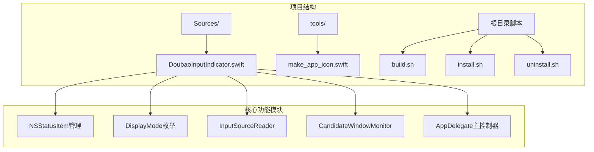
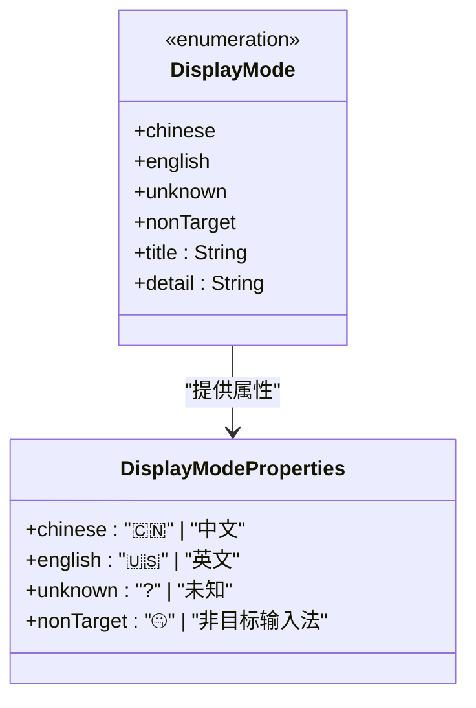
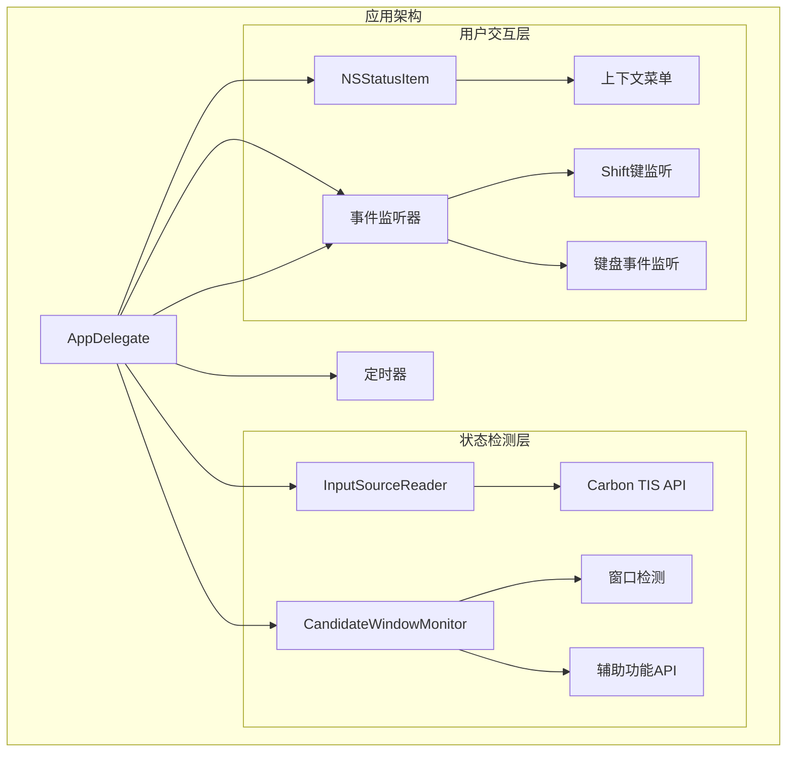
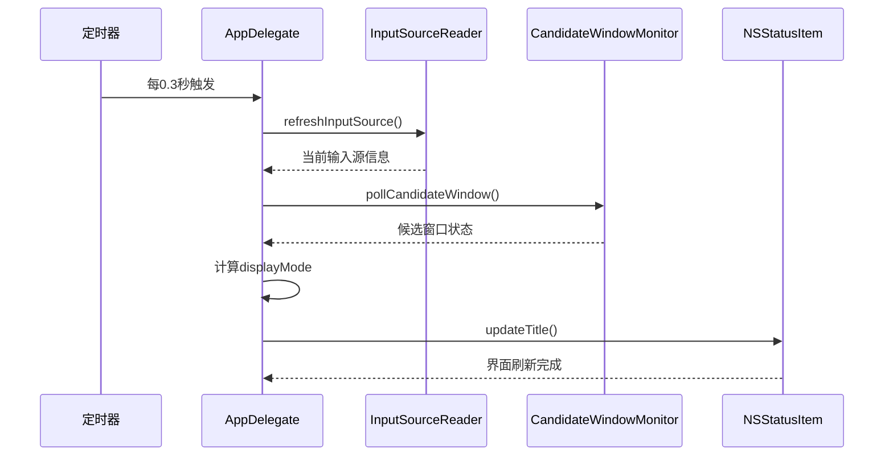
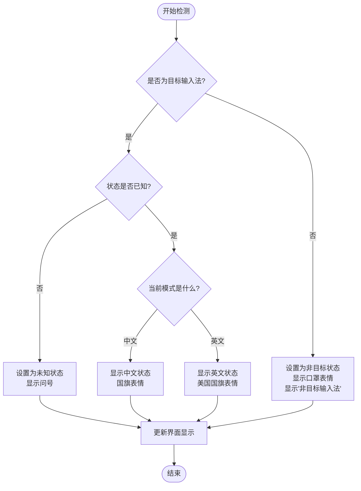
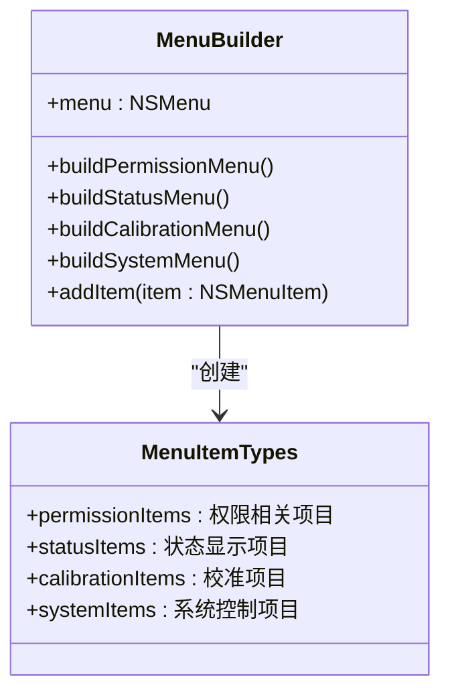
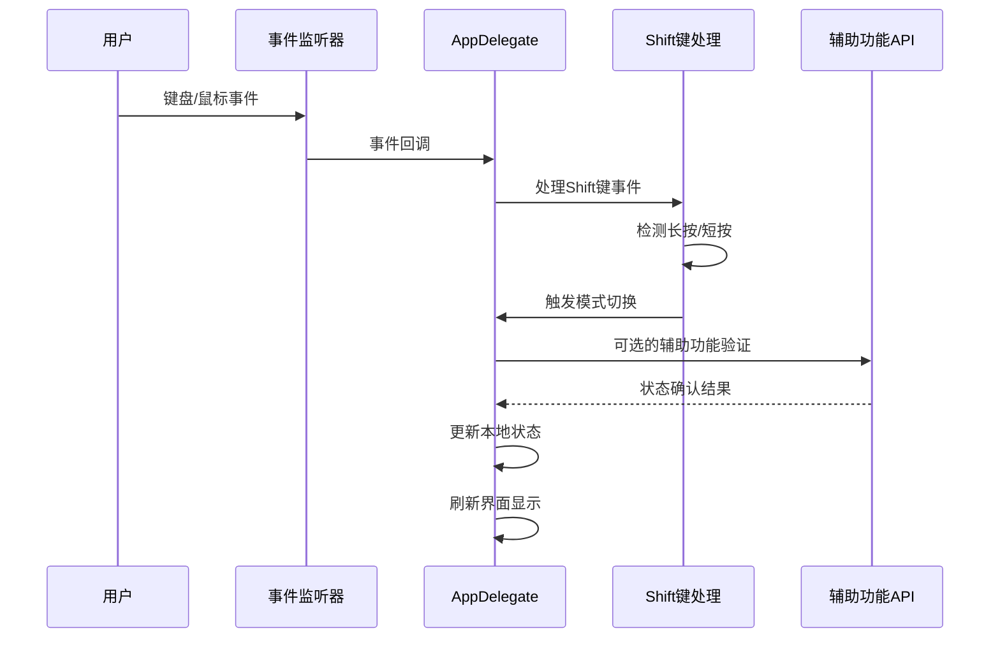
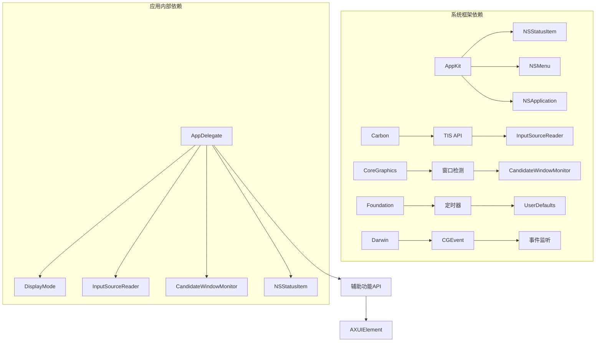

# 菜单栏显示功能

<cite>
**本文档引用的文件**
- [DoubaoInputIndicator.swift](file://Sources/DoubaoInputIndicator.swift)
- [build.sh](file://build.sh)
- [install.sh](file://install.sh)
- [uninstall.sh](file://uninstall.sh)
- [make_app_icon.swift](file://tools/make_app_icon.swift)
</cite>

## 更新摘要
**变更内容**
- 新增 DisplayMode.nonTarget 状态支持，提供专门的非目标输入法视觉表示
- 更新状态显示逻辑，增强对非目标输入法的识别和反馈
- 完善菜单栏图标和状态文本的动态更新机制

## 目录
1. [简介](#简介)
2. [项目结构](#项目结构)
3. [核心组件](#核心组件)
4. [架构概览](#架构概览)
5. [详细组件分析](#详细组件分析)
6. [依赖关系分析](#依赖关系分析)
7. [性能考虑](#性能考虑)
8. [故障排除指南](#故障排除指南)
9. [结论](#结论)

## 简介

这是一个基于 macOS 的菜单栏输入法状态指示器应用，能够实时显示当前输入法的中英文状态。该应用通过多种技术手段检测输入法状态，包括窗口检测、辅助功能 API 和键盘事件监听，为用户提供准确的输入法状态反馈。

**更新** 新增了对非目标输入法的专门支持，提供更精确的状态识别和用户界面反馈。

## 项目结构

项目采用简洁的单文件架构设计，主要包含以下组件：

**图表来源**
- [DoubaoInputIndicator.swift:1-1427](file://Sources/DoubaoInputIndicator.swift#L1-L1427)
- [build.sh:1-117](file://build.sh#L1-L117)

**章节来源**
- [DoubaoInputIndicator.swift:1-1427](file://Sources/DoubaoInputIndicator.swift#L1-L1427)
- [build.sh:1-117](file://build.sh#L1-L117)

## 核心组件

### NSStatusItem 初始化配置

应用使用 `NSStatusBar.system.statusItem(withLength: 22)` 创建菜单栏状态项，配置如下：

- **按钮属性设置**：
  - 固定宽度：22点
  - 字体：等宽系统字体，大小13，字重semibold
  - 对齐方式：居中对齐
  - 工具提示：动态生成的状态信息

- **菜单集成**：状态项与上下文菜单关联，支持右键交互

**章节来源**
- [DoubaoInputIndicator.swift:280-362](file://Sources/DoubaoInputIndicator.swift#L280-L362)

### DisplayMode 枚举设计

DisplayMode 是一个私有枚举，定义了四种输入法状态：

**图表来源**
- [DoubaoInputIndicator.swift:7-38](file://Sources/DoubaoInputIndicator.swift#L7-L38)

每种状态都包含两个关键属性：

- **title属性**：用于菜单栏显示的图标字符
- **detail属性**：用于工具提示和菜单显示的详细描述

**更新** 新增了 `nonTarget` 状态，提供专门的非目标输入法视觉表示：
- 图标：使用 🤐（口罩表情符号）表示非目标输入法状态
- 文本：显示 "非目标输入法" 作为详细描述
- 用途：当当前选择的输入法不是应用的目标输入法时显示此状态

**章节来源**
- [DoubaoInputIndicator.swift:7-38](file://Sources/DoubaoInputIndicator.swift#L7-L38)

## 架构概览

应用采用事件驱动的架构模式，通过多个监听器实时监控输入法状态变化：

**图表来源**
- [DoubaoInputIndicator.swift:280-814](file://Sources/DoubaoInputIndicator.swift#L280-L814)

## 详细组件分析

### 状态更新机制

应用通过定时器和事件监听器双重机制确保状态的实时更新：

**图表来源**
- [DoubaoInputIndicator.swift:358-362](file://Sources/DoubaoInputIndicator.swift#L358-L362)
- [DoubaoInputIndicator.swift:776-814](file://Sources/DoubaoInputIndicator.swift#L776-L814)

#### 定时器配置

- **触发间隔**：0.3秒
- **监听任务**：
  - 刷新输入源状态
  - 轮询候选窗口状态
  - 自动校准输入法模式

**章节来源**
- [DoubaoInputIndicator.swift:358-362](file://Sources/DoubaoInputIndicator.swift#L358-L362)

### 状态变化检测算法

应用实现了复杂的输入法状态检测逻辑：

**图表来源**
- [DoubaoInputIndicator.swift:845-854](file://Sources/DoubaoInputIndicator.swift#L845-L854)

**更新** 状态检测算法现已包含非目标输入法的专门处理逻辑：
- 当检测到当前输入法不是目标输入法时，直接设置为 `.nonTarget` 状态
- 显示 🤐 图标和 "非目标输入法" 文本
- 跳过后续的状态校准流程，因为非目标输入法不需要模式切换

**章节来源**
- [DoubaoInputIndicator.swift:845-854](file://Sources/DoubaoInputIndicator.swift#L845-L854)

### 上下文菜单构建

应用的上下文菜单根据当前状态动态构建：

**图表来源**
- [DoubaoInputIndicator.swift:1042-1128](file://Sources/DoubaoInputIndicator.swift#L1042-L1128)

**章节来源**
- [DoubaoInputIndicator.swift:1042-1128](file://Sources/DoubaoInputIndicator.swift#L1042-L1128)

### 事件处理系统

应用实现了多层次的事件处理机制：

**图表来源**
- [DoubaoInputIndicator.swift:482-538](file://Sources/DoubaoInputIndicator.swift#L482-L538)
- [DoubaoInputIndicator.swift:866-980](file://Sources/DoubaoInputIndicator.swift#L866-L980)

**章节来源**
- [DoubaoInputIndicator.swift:482-538](file://Sources/DoubaoInputIndicator.swift#L482-L538)
- [DoubaoInputIndicator.swift:866-980](file://Sources/DoubaoInputIndicator.swift#L866-L980)

## 依赖关系分析

应用的核心依赖关系如下：

**图表来源**
- [DoubaoInputIndicator.swift:1-6](file://Sources/DoubaoInputIndicator.swift#L1-L6)

**章节来源**
- [DoubaoInputIndicator.swift:1-6](file://Sources/DoubaoInputIndicator.swift#L1-L6)

## 性能考虑

### 内存管理
- 使用弱引用避免循环引用
- 及时清理定时器和事件监听器
- 合理的内存释放策略

### CPU优化
- 定时器间隔0.3秒，平衡准确性与性能
- 事件去重机制减少重复处理
- 条件化状态检查避免不必要的计算

### 窗口检测优化
- 使用图层阈值过滤无关窗口
- 设置最小窗口高度阈值避免误判
- 缓存已知窗口ID减少重复扫描

## 故障排除指南

### 常见问题及解决方案

#### 权限问题
- **症状**：Shift键切换无效，显示警告图标
- **原因**：缺少输入监控权限或辅助功能权限
- **解决**：通过菜单中的"打开输入监控授权"选项重新授权

#### 状态显示异常
- **症状**：显示"未知"状态
- **原因**：首次运行或输入法切换导致状态丢失
- **解决**：使用"校准为中文/英文"手动设置状态

#### 窗口检测失败
- **症状**：候选窗口检测不准确
- **原因**：不同输入法的窗口特性差异
- **解决**：等待自动校准或手动校准

#### 非目标输入法显示问题
- **症状**：非目标输入法显示异常
- **原因**：当前输入法不是应用配置的目标输入法
- **解决**：切换到目标输入法或调整应用配置

**章节来源**
- [DoubaoInputIndicator.swift:1042-1128](file://Sources/DoubaoInputIndicator.swift#L1042-L1128)
- [DoubaoInputIndicator.swift:1174-1240](file://Sources/DoubaoInputIndicator.swift#L1174-L1240)

## 结论

该菜单栏输入法状态指示器应用展现了优秀的架构设计和实现细节：

### 技术亮点
- **多层检测机制**：结合窗口检测、辅助功能API和事件监听提供高精度状态判断
- **优雅降级**：在权限受限情况下仍能提供基本功能
- **用户友好**：直观的图标显示和详细的上下文菜单
- **可维护性**：清晰的代码结构和完善的错误处理
- **增强的状态支持**：新增非目标输入法的专门视觉表示，提供更精确的状态反馈

### 应用价值
- 为用户提供实时的输入法状态反馈
- 支持快速切换中英文输入模式
- 提供完整的状态管理和校准功能
- 具备良好的扩展性和维护性
- **新增** 对非目标输入法的专门识别和处理能力

### 非目标输入法支持的价值
- **用户体验提升**：明确区分目标和非目标输入法状态
- **视觉反馈增强**：使用 🤐 表情符号提供直观的视觉提示
- **状态管理完善**：避免对非目标输入法进行不必要的模式切换尝试
- **系统兼容性**：支持多种输入法环境，提高应用的通用性

该应用为 macOS 平台的输入法状态显示提供了一个高质量的参考实现，其设计理念和实现技巧值得其他类似应用借鉴。