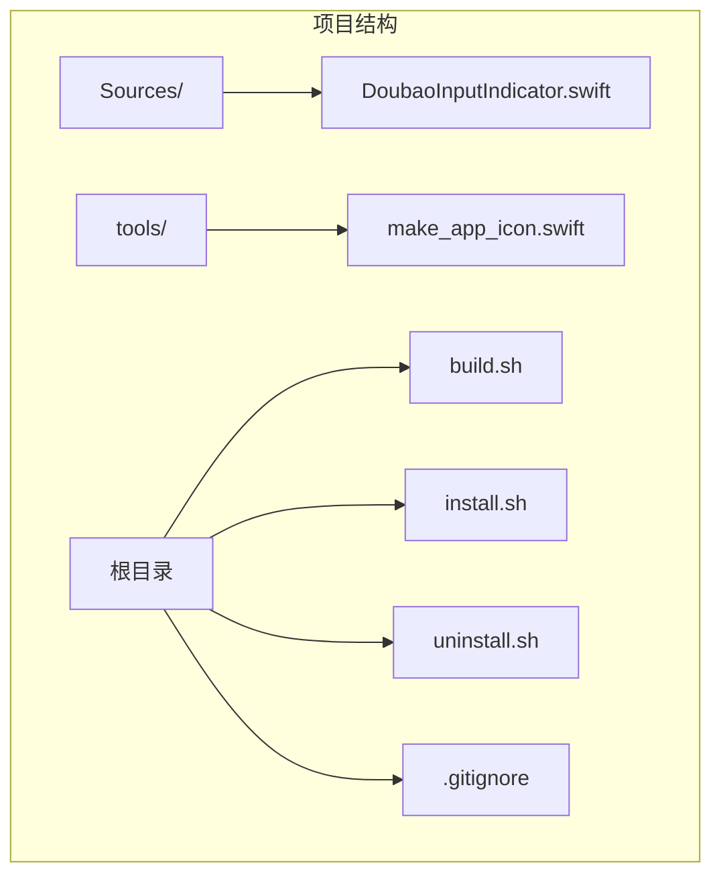
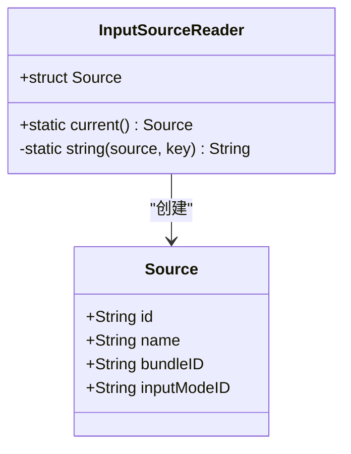
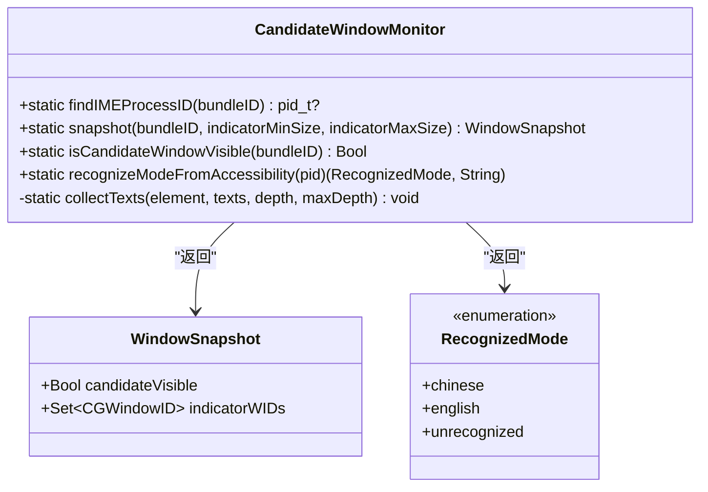
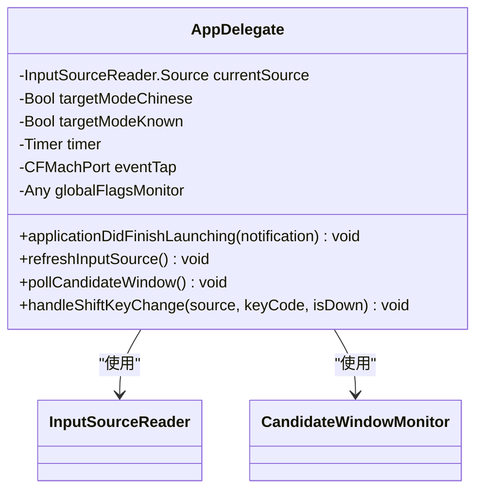
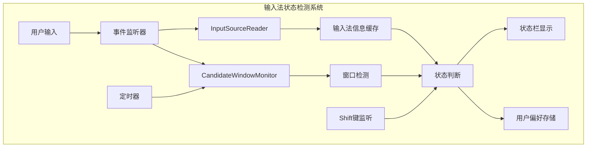
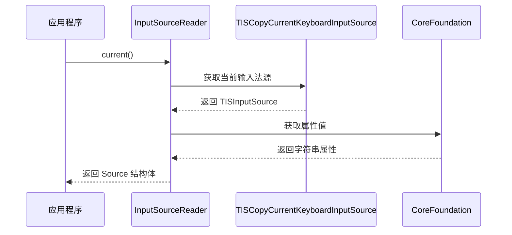
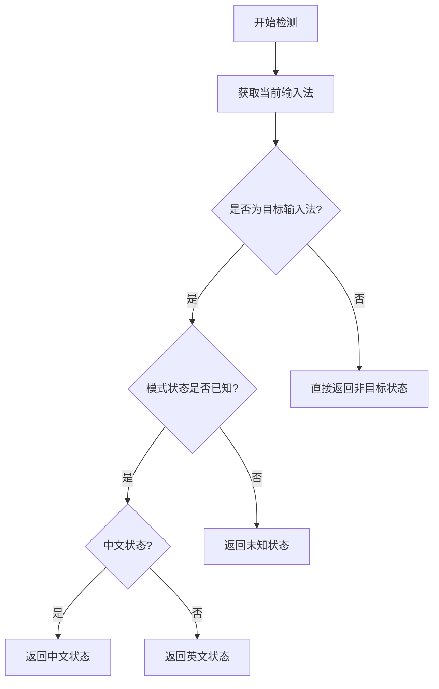
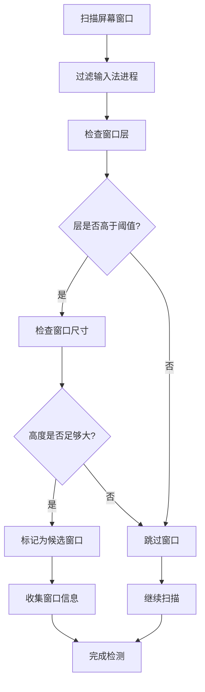
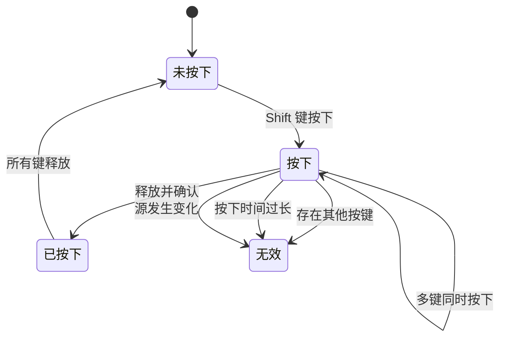
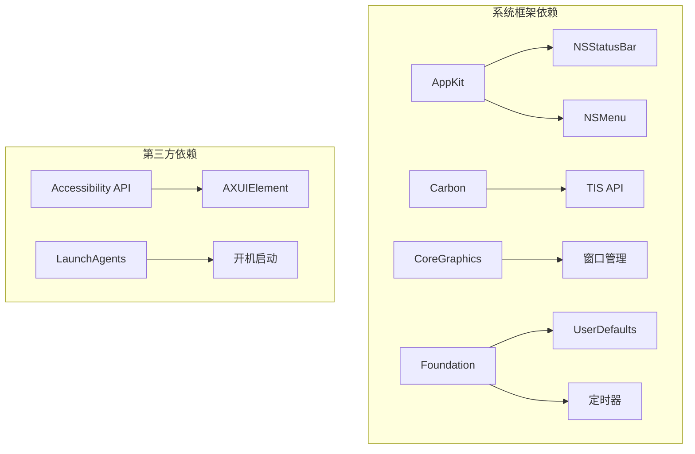

# 输入法状态检测

<cite>
**本文档引用的文件**
- [DoubaoInputIndicator.swift](file://Sources/DoubaoInputIndicator.swift)
- [build.sh](file://build.sh)
- [install.sh](file://install.sh)
- [uninstall.sh](file://uninstall.sh)
</cite>

## 更新摘要
**所做更改**
- 更新了输入源检测逻辑的简化说明，反映了移除复杂字符串匹配和推理机制的新架构
- 新增了简化的状态判断流程说明
- 更新了架构图以反映简化的决策流程
- 补充了新的状态检测算法说明

## 目录
1. [简介](#简介)
2. [项目结构](#项目结构)
3. [核心组件](#核心组件)
4. [架构概览](#架构概览)
5. [详细组件分析](#详细组件分析)
6. [依赖关系分析](#依赖关系分析)
7. [性能考虑](#性能考虑)
8. [故障排除指南](#故障排除指南)
9. [结论](#结论)

## 简介

这是一个基于 macOS 平台的输入法状态检测工具，主要功能是检测和显示当前输入法的中英文状态。该工具通过多种技术手段来准确识别输入法状态，包括：

- 使用 TISCopyCurrentKeyboardInputSource API 获取当前输入法信息
- 通过窗口检测识别候选词面板和模式指示器
- 利用 Accessibility API 读取输入法的模式文本
- 实现智能的输入法切换检测算法

**更新** 该工具现已采用简化的输入源检测逻辑，移除了复杂的字符串匹配和推理机制，直接返回非目标状态，大幅简化了决策流程。

该工具支持两种输入法：豆包输入法（Doubao）和微信输入法（WeType），并通过状态栏图标直观地显示当前输入法状态。

## 项目结构

项目采用简洁的单文件架构设计，所有功能都集中在单一的 Swift 源文件中：



**图表来源**
- [DoubaoInputIndicator.swift:1-1427](file://Sources/DoubaoInputIndicator.swift#L1-L1427)
- [build.sh:1-117](file://build.sh#L1-L117)

**章节来源**
- [DoubaoInputIndicator.swift:1-1427](file://Sources/DoubaoInputIndicator.swift#L1-L1427)
- [build.sh:1-117](file://build.sh#L1-L117)

## 核心组件

### InputSourceReader 类

InputSourceReader 是输入法状态检测的核心组件，负责通过系统 API 获取当前输入法的详细信息。



**图表来源**
- [DoubaoInputIndicator.swift:104-131](file://Sources/DoubaoInputIndicator.swift#L104-L131)

### 候选窗口监控器

CandidateWindowMonitor 负责监控输入法的候选词窗口和模式指示器，通过屏幕截图和 Accessibility API 来检测输入法状态。



**图表来源**
- [DoubaoInputIndicator.swift:133-278](file://Sources/DoubaoInputIndicator.swift#L133-L278)

### 应用委托类

AppDelegate 是应用程序的主要控制器，管理整个输入法状态检测流程。



**图表来源**
- [DoubaoInputIndicator.swift:280-1427](file://Sources/DoubaoInputIndicator.swift#L280-L1427)

**章节来源**
- [DoubaoInputIndicator.swift:104-131](file://Sources/DoubaoInputIndicator.swift#L104-L131)
- [DoubaoInputIndicator.swift:133-278](file://Sources/DoubaoInputIndicator.swift#L133-L278)
- [DoubaoInputIndicator.swift:280-1427](file://Sources/DoubaoInputIndicator.swift#L280-L1427)

## 架构概览

系统采用事件驱动的架构设计，通过多种监听机制来实时检测输入法状态变化：



**图表来源**
- [DoubaoInputIndicator.swift:358-362](file://Sources/DoubaoInputIndicator.swift#L358-L362)
- [DoubaoInputIndicator.swift:408-480](file://Sources/DoubaoInputIndicator.swift#L408-L480)
- [DoubaoInputIndicator.swift:544-620](file://Sources/DoubaoInputIndicator.swift#L544-L620)

**更新** 系统的核心工作流程现在包含简化的状态判断逻辑，直接返回非目标状态而无需复杂的字符串匹配。

系统的核心工作流程包括：

1. **初始化阶段**：设置定时器、安装事件监听器、请求权限
2. **实时监控阶段**：通过多种方式持续检测输入法状态
3. **状态判断阶段**：综合各种检测结果得出最终状态（采用简化的直接判断逻辑）
4. **结果显示阶段**：更新状态栏图标和菜单

**章节来源**
- [DoubaoInputIndicator.swift:339-362](file://Sources/DoubaoInputIndicator.swift#L339-L362)
- [DoubaoInputIndicator.swift:408-480](file://Sources/DoubaoInputIndicator.swift#L408-L480)
- [DoubaoInputIndicator.swift:544-620](file://Sources/DoubaoInputIndicator.swift#L544-L620)

## 详细组件分析

### InputSourceReader 类详解

InputSourceReader 类通过 TISCopyCurrentKeyboardInputSource API 获取当前输入法的完整信息：

#### API 调用流程



**图表来源**
- [DoubaoInputIndicator.swift:112-131](file://Sources/DoubaoInputIndicator.swift#L112-L131)

#### 属性提取过程

InputSourceReader 从输入法源中提取以下关键属性：

1. **输入源ID (id)**：唯一标识符，用于检测输入法切换
2. **名称 (name)**：本地化显示名称
3. **Bundle ID (bundleID)**：输入法的应用标识符
4. **输入模式ID (inputModeID)**：当前输入模式标识符

#### 错误处理机制

当 API 调用失败时，InputSourceReader 返回空字符串的 Source 对象，确保应用程序的稳定性。

**章节来源**
- [DoubaoInputIndicator.swift:104-131](file://Sources/DoubaoInputIndicator.swift#L104-L131)

### 输入法切换检测算法

**更新** 系统现在采用简化的输入法切换检测算法，移除了复杂的字符串匹配和推理机制。

#### 简化后的状态判断逻辑



**图表来源**
- [DoubaoInputIndicator.swift:845-854](file://Sources/DoubaoInputIndicator.swift#L845-L854)

#### 简化的状态缓存机制

系统维护了多个状态缓存变量来跟踪输入法状态：

- `currentSource`：当前输入法的完整信息
- `previousSourceBundleID`：上次输入法的Bundle ID
- `targetModeChinese`：目标输入法的中文状态
- `targetModeKnown`：目标输入法状态是否已知

#### 直接状态返回机制

**新增** 当输入法不是目标输入法时，系统直接返回 `.nonTarget` 状态，无需进一步的字符串匹配和推理：

```swift
private var displayMode: DisplayMode {
    if isTargetInputMethodSelected {
        guard targetModeKnown else {
            return .unknown
        }
        return targetModeChinese ? .chinese : .english
    }

    return .nonTarget  // 简化：直接返回非目标状态
}
```

**章节来源**
- [DoubaoInputIndicator.swift:845-854](file://Sources/DoubaoInputIndicator.swift#L845-L854)

### 候选窗口检测机制

CandidateWindowMonitor 通过以下三种方式检测输入法状态：

#### 窗口层检测



**图表来源**
- [DoubaoInputIndicator.swift:165-212](file://Sources/DoubaoInputIndicator.swift#L165-L212)

#### Accessibility API 检测

系统使用 Accessibility API 来直接读取输入法模式指示器的文本内容：

- 支持读取 `kAXValueAttribute`、`kAXTitleAttribute`、`kAXDescriptionAttribute`
- 递归遍历 UI 元素树以找到模式文本
- 自动识别包含"中"或"英"字符的文本

**章节来源**
- [DoubaoInputIndicator.swift:133-278](file://Sources/DoubaoInputIndicator.swift#L133-L278)

### Shift 键切换检测

系统实现了智能的 Shift 键检测机制来处理输入法模式切换：

#### Shift 键状态跟踪



**图表来源**
- [DoubaoInputIndicator.swift:866-980](file://Sources/DoubaoInputIndicator.swift#L866-L980)

#### 检测参数配置

系统使用以下参数来优化 Shift 键检测：

- `maximumStandaloneShiftTapDuration`：最大独立按压时间（1.0秒）
- `minimumShiftToggleGap`：最小切换间隔（0.35秒）
- `alphaKeyCodes`：QWERTY键盘上的字母键码集合

**章节来源**
- [DoubaoInputIndicator.swift:866-980](file://Sources/DoubaoInputIndicator.swift#L866-L980)

## 依赖关系分析

系统依赖于多个 macOS 框架和 API：



**图表来源**
- [DoubaoInputIndicator.swift:1-6](file://Sources/DoubaoInputIndicator.swift#L1-L6)

### 关键 API 依赖

1. **TIS API**：获取当前输入法信息
2. **CoreGraphics API**：窗口列表和属性查询
3. **Accessibility API**：UI 元素文本读取
4. **Carbon Event API**：事件监听和处理

**章节来源**
- [DoubaoInputIndicator.swift:1-6](file://Sources/DoubaoInputIndicator.swift#L1-L6)

## 性能考虑

### 内存管理

系统采用了高效的内存管理模式：

- 使用 `takeRetainedValue()` 和 `takeUnretainedValue()` 确保正确的内存所有权
- 及时清理定时器和事件监听器
- 使用弱引用避免循环引用

### 计算优化

- 定时器间隔设置为 0.3 秒，平衡准确性与性能
- 使用集合操作进行窗口 ID 比较
- 缓存输入法进程 ID 避免重复查询

### 资源管理

- 合理使用 LaunchAgents 进行开机启动
- 优雅处理权限请求失败的情况
- 提供卸载脚本清理残留文件

**更新** 简化的输入源检测逻辑显著减少了不必要的字符串匹配和推理计算，提升了整体性能。

## 故障排除指南

### 常见问题及解决方案

#### 输入监控权限问题

**症状**：状态栏显示警告图标，Shift 切换功能不可用

**解决方法**：
1. 在系统偏好设置中启用"输入监控"权限
2. 重启应用程序
3. 检查日志文件了解具体错误信息

#### Accessibility 权限问题

**症状**：候选窗口检测正常但模式识别不准确

**解决方法**：
1. 在系统偏好设置中启用"辅助功能"权限
2. 确保应用程序具有必要的权限
3. 重新启动应用程序

#### 输入法识别问题

**症状**：无法正确识别特定输入法的状态

**解决方法**：
1. 检查输入法的 Bundle ID 配置
2. 验证输入法是否在运行状态
3. 查看日志文件获取详细信息

**章节来源**
- [DoubaoInputIndicator.swift:379-383](file://Sources/DoubaoInputIndicator.swift#L379-L383)
- [DoubaoInputIndicator.swift:389-406](file://Sources/DoubaoInputIndicator.swift#L389-L406)

### 日志分析

系统会将详细的操作日志写入用户主目录的 Logs 文件夹中：

- 日志文件名：`DoubaoInputIndicator.log` 或 `WeTypeInputIndicator.log`
- 包含时间戳和详细的操作信息
- 便于诊断和问题排查

**章节来源**
- [DoubaoInputIndicator.swift:1388-1427](file://Sources/DoubaoInputIndicator.swift#L1388-L1427)

## 结论

输入法状态检测系统通过精心设计的多层检测机制，实现了对 macOS 输入法状态的准确识别和实时监控。其核心优势包括：

1. **多源验证**：结合 TIS API、窗口检测和 Accessibility API 三种方式
2. **智能缓存**：有效的状态缓存和去重机制
3. **容错设计**：完善的错误处理和降级策略
4. **性能优化**：合理的资源管理和计算优化
5. **简化的决策流程**：移除复杂的字符串匹配，直接返回非目标状态

**更新** 新的简化架构显著提升了系统的性能和可靠性，通过直接的状态判断逻辑减少了不必要的计算开销，同时保持了原有的检测精度。

该系统为开发者提供了可扩展的基础架构，可以轻松适配不同的输入法产品，并可根据具体需求调整检测参数和算法。

对于实际应用中的使用场景，建议：

- 在集成到其他应用程序时，注意权限管理和用户体验
- 根据目标输入法的特点调整检测参数
- 提供清晰的用户反馈和故障排除指导
- 考虑网络环境和系统版本的兼容性
- 利用简化的状态判断逻辑提升应用性能