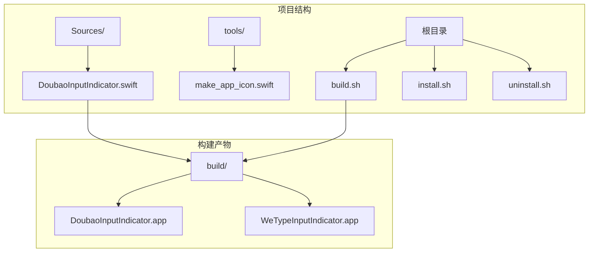
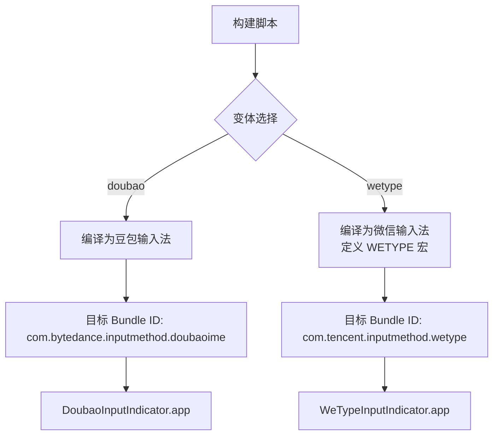
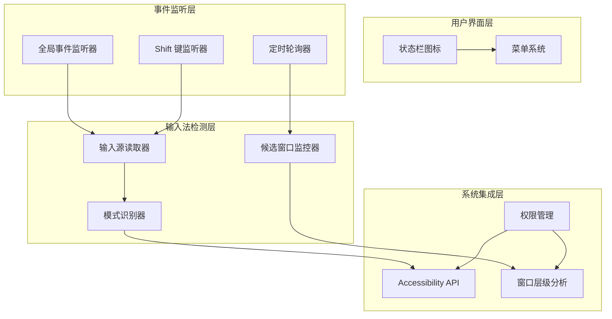
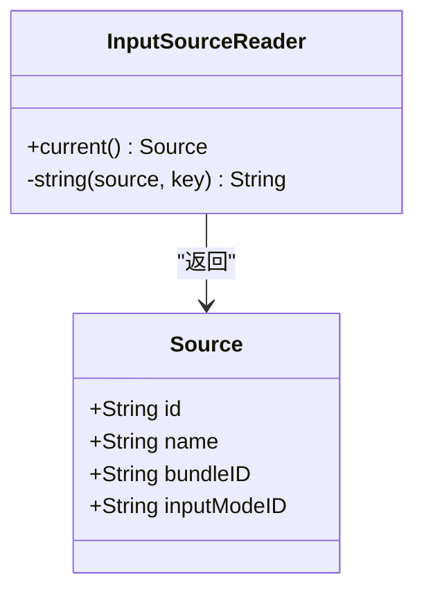
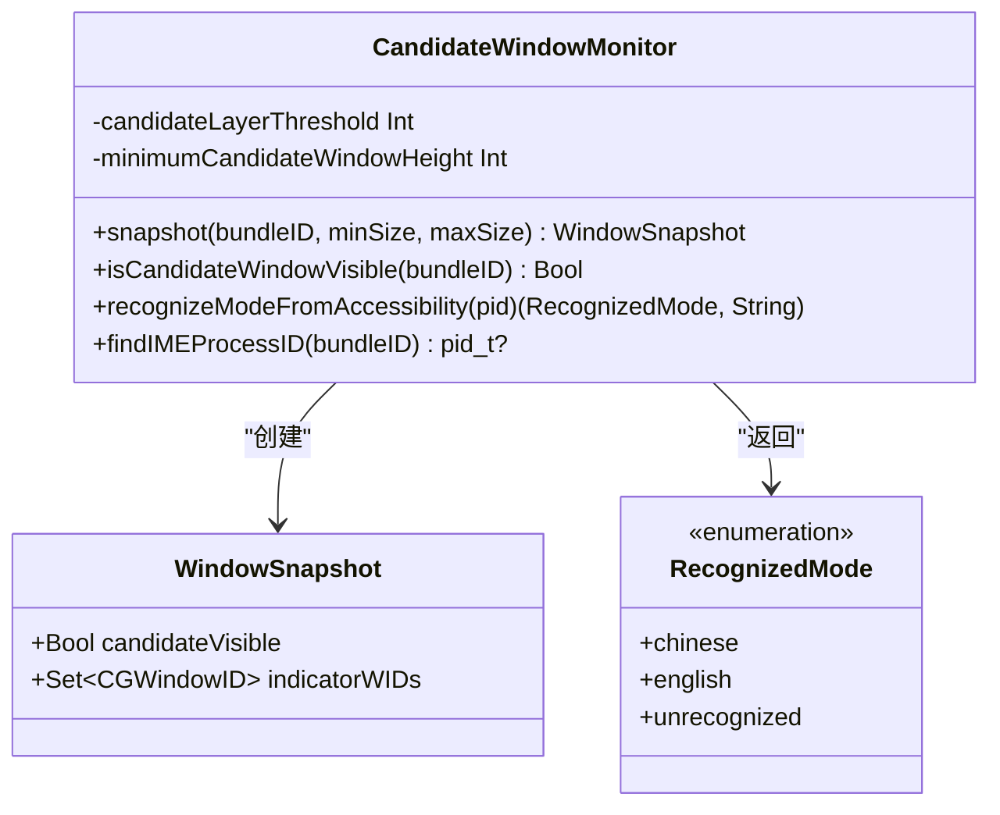
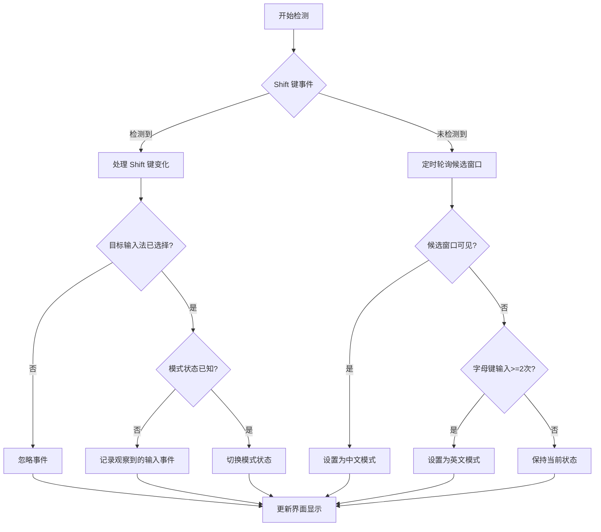
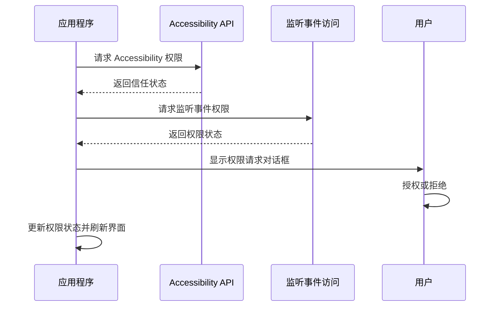
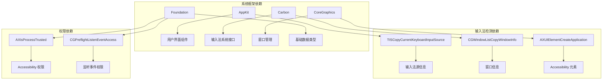

# 输入法支持

<cite>
**本文档引用的文件**
- [DoubaoInputIndicator.swift](file://Sources/DoubaoInputIndicator.swift)
- [build.sh](file://build.sh)
- [install.sh](file://install.sh)
- [uninstall.sh](file://uninstall.sh)
</cite>

## 目录
1. [简介](#简介)
2. [项目结构](#项目结构)
3. [核心组件](#核心组件)
4. [架构概览](#架构概览)
5. [详细组件分析](#详细组件分析)
6. [依赖关系分析](#依赖关系分析)
7. [性能考虑](#性能考虑)
8. [故障排除指南](#故障排除指南)
9. [结论](#结论)

## 简介

这是一个专为 macOS 设计的输入法指示器应用，主要支持豆包输入法（Doubao IME）和微信输入法（WeType）。该应用通过多种技术手段检测当前输入法的状态，包括候选窗口识别、模式状态判断和 Accessibility 权限检测，为用户提供直观的中英文输入模式指示。

## 项目结构

项目采用简洁的单文件架构设计，所有功能都集中在单一的 Swift 源文件中，便于维护和理解。

**图表来源**
- [DoubaoInputIndicator.swift:1-50](file://Sources/DoubaoInputIndicator.swift#L1-L50)
- [build.sh:29-34](file://build.sh#L29-L34)

**章节来源**
- [DoubaoInputIndicator.swift:1-1410](file://Sources/DoubaoInputIndicator.swift#L1-L1410)
- [build.sh:1-117](file://build.sh#L1-L117)

## 核心组件

### 双输入法变体支持

项目实现了双输入法变体的编译配置，通过条件编译宏实现：

**图表来源**
- [build.sh:10-27](file://build.sh#L10-L27)
- [DoubaoInputIndicator.swift:84-102](file://Sources/DoubaoInputIndicator.swift#L84-L102)

### 应用配置管理

每个输入法变体都有独立的应用配置：

| 配置项 | 豆包输入法 | 微信输入法 |
|--------|------------|------------|
| 应用名称 | DoubaoInputIndicator | WeTypeInputIndicator |
| 显示名称 | 豆包输入法指示器 | 微信输入法指示器 |
| 目标输入法 Bundle ID | com.bytedance.inputmethod.doubaoime | com.tencent.inputmethod.wetype |
| LaunchAgent ID | local.doubao-input-indicator | local.wetype-input-indicator |
| 模式状态键 | doubaoModeChinese | wetypeModeChinese |
| 日志文件名 | DoubaoInputIndicator.log | WeTypeInputIndicator.log |

**章节来源**
- [DoubaoInputIndicator.swift:40-47](file://Sources/DoubaoInputIndicator.swift#L40-L47)
- [DoubaoInputIndicator.swift:84-102](file://Sources/DoubaoInputIndicator.swift#L84-L102)

## 架构概览

应用采用事件驱动的架构模式，通过多种监听机制实时监控输入法状态变化。

**图表来源**
- [DoubaoInputIndicator.swift:280-362](file://Sources/DoubaoInputIndicator.swift#L280-L362)
- [DoubaoInputIndicator.swift:104-131](file://Sources/DoubaoInputIndicator.swift#L104-L131)
- [DoubaoInputIndicator.swift:133-278](file://Sources/DoubaoInputIndicator.swift#L133-L278)

## 详细组件分析

### 输入源读取器

负责从系统获取当前活动的输入法信息：

**图表来源**
- [DoubaoInputIndicator.swift:104-131](file://Sources/DoubaoInputIndicator.swift#L104-L131)

### 候选窗口监控器

这是最复杂的组件，实现了多层检测机制：

**图表来源**
- [DoubaoInputIndicator.swift:133-278](file://Sources/DoubaoInputIndicator.swift#L133-L278)

### 模式状态判断逻辑

应用实现了多层次的模式状态判断机制：

**图表来源**
- [DoubaoInputIndicator.swift:544-716](file://Sources/DoubaoInputIndicator.swift#L544-L716)
- [DoubaoInputIndicator.swift:866-980](file://Sources/DoubaoInputIndicator.swift#L866-L980)

### Accessibility 权限管理

应用通过多种方式请求和管理必要的系统权限：

**图表来源**
- [DoubaoInputIndicator.swift:379-406](file://Sources/DoubaoInputIndicator.swift#L379-L406)
- [DoubaoInputIndicator.swift:1042-1128](file://Sources/DoubaoInputIndicator.swift#L1042-L1128)

**章节来源**
- [DoubaoInputIndicator.swift:104-131](file://Sources/DoubaoInputIndicator.swift#L104-L131)
- [DoubaoInputIndicator.swift:133-278](file://Sources/DoubaoInputIndicator.swift#L133-L278)
- [DoubaoInputIndicator.swift:544-716](file://Sources/DoubaoInputIndicator.swift#L544-L716)
- [DoubaoInputIndicator.swift:866-980](file://Sources/DoubaoInputIndicator.swift#L866-L980)

## 依赖关系分析

应用依赖于多个系统框架和 API：

**图表来源**
- [DoubaoInputIndicator.swift:1-6](file://Sources/DoubaoInputIndicator.swift#L1-L6)
- [DoubaoInputIndicator.swift:112-130](file://Sources/DoubaoInputIndicator.swift#L112-L130)
- [DoubaoInputIndicator.swift:172-177](file://Sources/DoubaoInputIndicator.swift#L172-L177)
- [DoubaoInputIndicator.swift:234-248](file://Sources/DoubaoInputIndicator.swift#L234-L248)

### 权限要求详解

应用需要以下权限才能正常工作：

1. **Accessibility 权限**：用于读取输入法模式指示器的文本内容
2. **监听事件权限**：用于捕获键盘和鼠标事件
3. **输入监控权限**：用于检测输入事件

**章节来源**
- [DoubaoInputIndicator.swift:379-406](file://Sources/DoubaoInputIndicator.swift#L379-L406)
- [DoubaoInputIndicator.swift:233-248](file://Sources/DoubaoInputIndicator.swift#L233-L248)

## 性能考虑

应用在设计时充分考虑了性能优化：

### 事件去重机制
- 使用时间戳去重，避免同一物理按键通过不同路径重复触发
- 设置最小按键间隔（20ms）来过滤重复事件

### 自动校准节流
- 设置最小自动校准间隔（2秒），避免频繁的模式切换
- 在 Shift 键切换后抑制候选窗口检测，防止误判

### 内存管理
- 使用弱引用避免循环引用
- 及时清理定时器和监听器

## 故障排除指南

### 常见问题及解决方案

#### 1. 输入法指示器不显示
**症状**：状态栏图标不显示或显示问号
**可能原因**：
- 未正确安装应用
- 权限未授予
- 输入法未正确配置

**解决步骤**：
1. 检查应用是否正确安装到 `/Applications` 目录
2. 运行安装脚本重新安装：`./install.sh [doubao|wetype]`
3. 在系统偏好设置中授予必要的权限

#### 2. Shift 键切换无效
**症状**：按住 Shift 键无法切换中英文模式
**可能原因**：
- 输入监控权限未授予
- Accessibility 权限未授予
- 模式状态已知但切换失败

**解决步骤**：
1. 检查菜单中的权限状态
2. 点击"重新检查权限"按钮
3. 手动校准模式状态

#### 3. 候选窗口检测失败
**症状**：候选窗口出现但模式状态未更新
**可能原因**：
- 窗口层级识别错误
- 模式指示器窗口尺寸不符合预期
- Accessibility 权限不足

**解决步骤**：
1. 检查日志文件获取详细信息
2. 确认输入法版本兼容性
3. 重新授权 Accessibility 权限

### 日志分析

应用会将详细的操作日志写入用户主目录的 `Library/Logs/` 目录：

- **豆包输入法日志**：`DoubaoInputIndicator.log`
- **微信输入法日志**：`WeTypeInputIndicator.log`

日志格式包含时间戳和操作描述，便于诊断问题。

**章节来源**
- [DoubaoInputIndicator.swift:1388-1403](file://Sources/DoubaoInputIndicator.swift#L1388-L1403)
- [install.sh:26-31](file://install.sh#L26-L31)

## 结论

这个输入法指示器应用通过精心设计的多层检测机制，为用户提供了可靠的中英文输入模式指示功能。其特点包括：

1. **双输入法支持**：通过条件编译实现豆包输入法和微信输入法的统一支持
2. **多层次检测**：结合候选窗口检测、模式指示器识别和 Shift 键监听
3. **智能权限管理**：动态检测和请求必要的系统权限
4. **优雅降级**：在权限不足时仍能提供基本功能
5. **详细日志记录**：便于问题诊断和功能调试

该应用为 macOS 用户提供了直观、可靠的输入法状态指示，特别适合需要频繁切换中英文输入模式的用户使用。