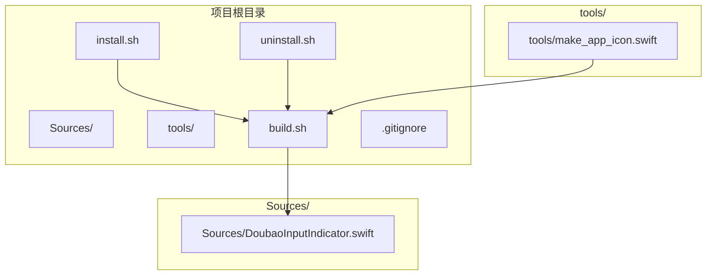
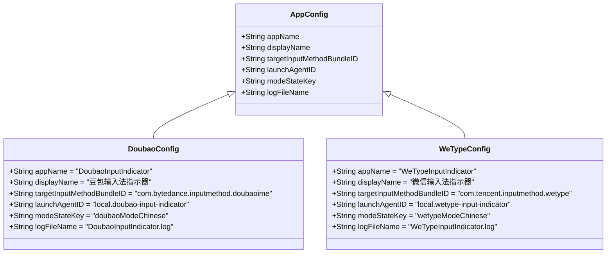
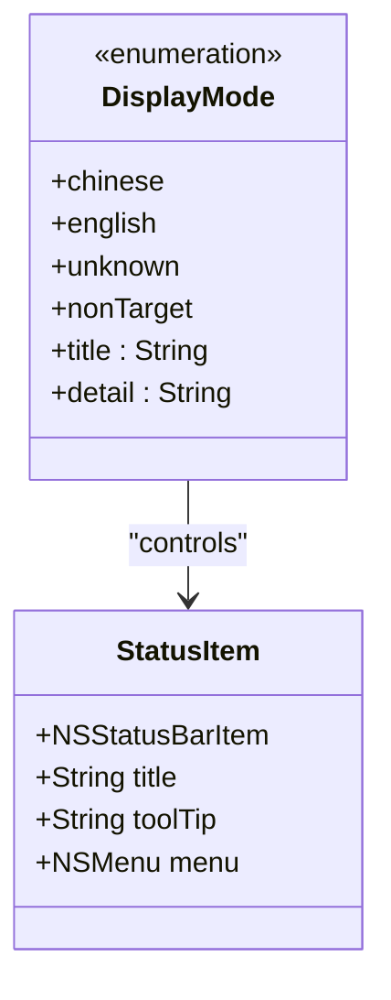
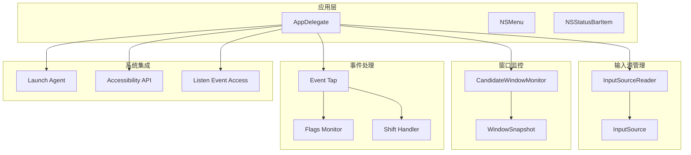
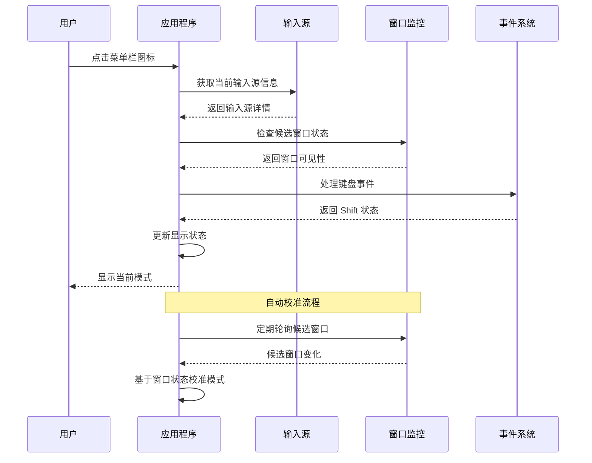
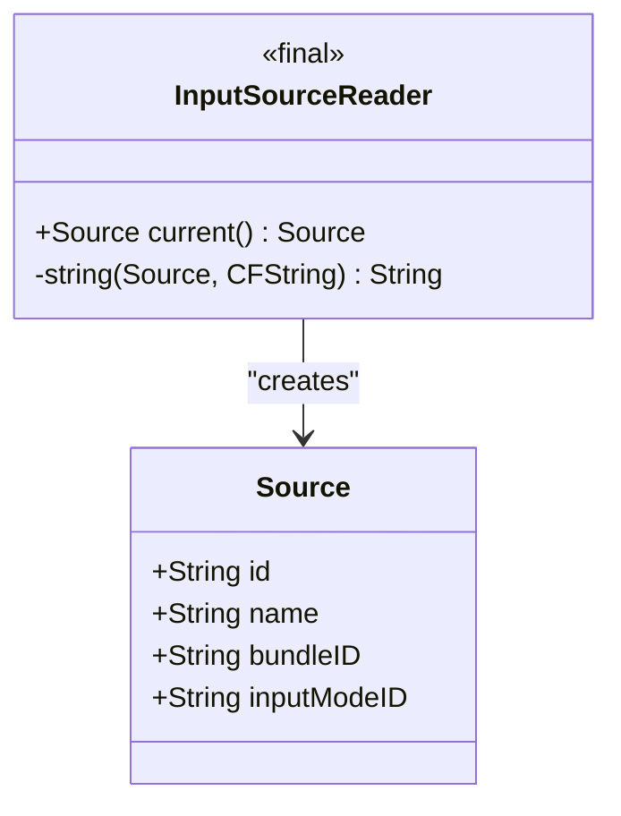
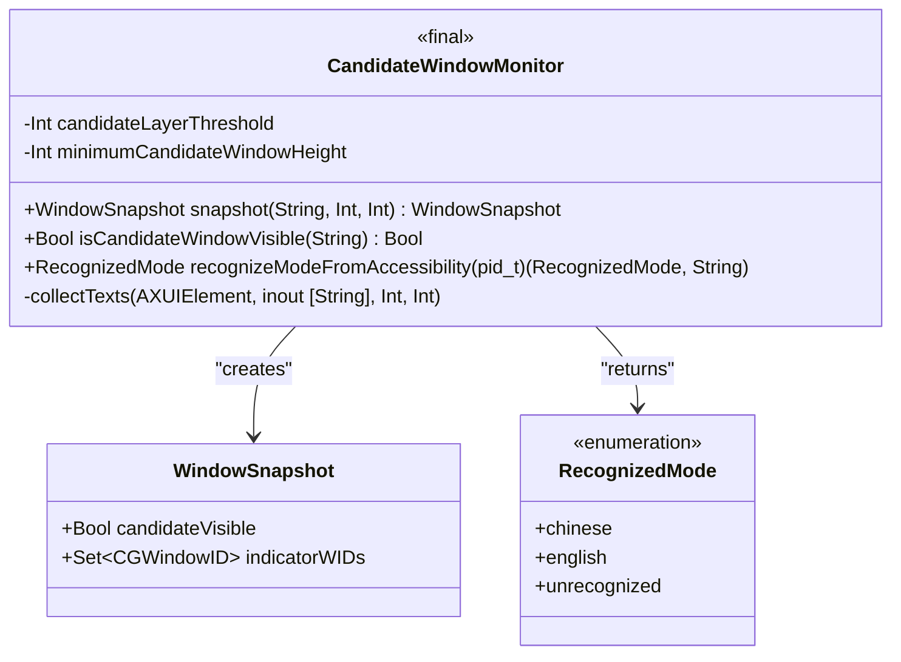
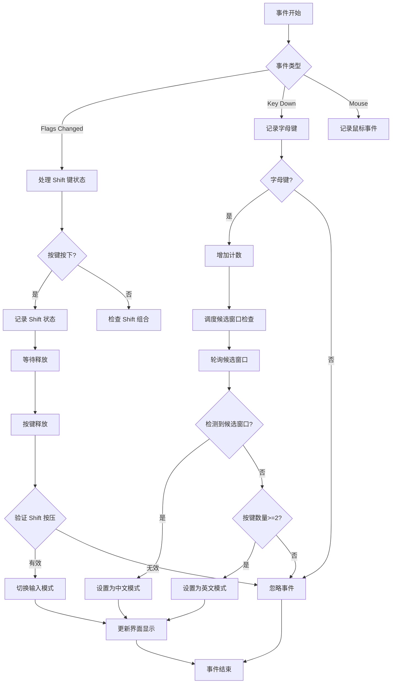
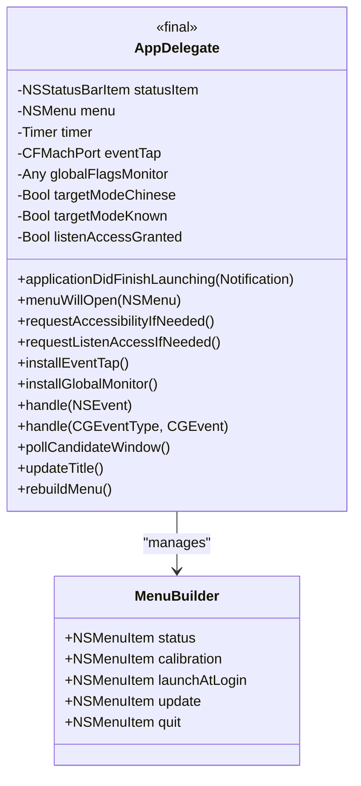
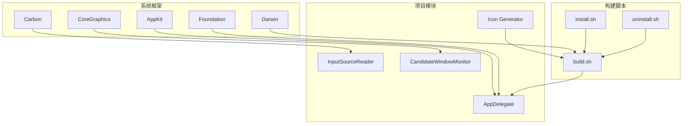

# 项目概述

<cite>
**本文档引用的文件**
- [DoubaoInputIndicator.swift](file://Sources/DoubaoInputIndicator.swift)
- [build.sh](file://build.sh)
- [install.sh](file://install.sh)
- [uninstall.sh](file://uninstall.sh)
- [make_app_icon.swift](file://tools/make_app_icon.swift)
</cite>

## 目录
1. [项目简介](#项目简介)
2. [项目结构](#项目结构)
3. [核心组件](#核心组件)
4. [架构概览](#架构概览)
5. [详细组件分析](#详细组件分析)
6. [依赖关系分析](#依赖关系分析)
7. [性能考虑](#性能考虑)
8. [故障排除指南](#故障排除指南)
9. [结论](#结论)

## 项目简介

输入法状态指示器是一个专为 macOS 设计的菜单栏应用程序，旨在为豆包输入法（Doubao IME）和微信输入法（WeType IME）提供实时的状态指示功能。该项目的核心目标是显示当前的中英文输入模式，通过直观的图标和工具提示帮助用户快速了解输入法的工作状态。

### 主要功能特性

- **双输入法支持**：同时支持豆包输入法和微信输入法两种主流中文输入法
- **智能状态检测**：通过多种技术手段自动检测输入法的中英文状态
- **Shift 键切换**：支持通过 Shift 键手动切换中英文输入模式
- **开机自启动**：可配置为随系统启动自动运行
- **更新检查**：内置版本更新检查功能
- **权限管理**：完善的系统权限请求和管理机制

### 技术亮点

- **多层检测机制**：结合窗口检测、辅助功能 API 和键盘事件监听
- **智能去重处理**：避免重复事件触发导致的状态误判
- **优雅降级**：在不同权限条件下提供相应的功能限制
- **跨架构支持**：同时支持 Intel 和 Apple Silicon 架构

## 项目结构

项目采用简洁而高效的组织方式，主要包含以下核心文件：

**图表来源**
- [DoubaoInputIndicator.swift:1-1410](file://Sources/DoubaoInputIndicator.swift#L1-L1410)
- [build.sh:1-117](file://build.sh#L1-L117)
- [install.sh:1-60](file://install.sh#L1-L60)
- [uninstall.sh:1-30](file://uninstall.sh#L1-L30)
- [make_app_icon.swift:1-95](file://tools/make_app_icon.swift#L1-L95)

**章节来源**
- [DoubaoInputIndicator.swift:1-1410](file://Sources/DoubaoInputIndicator.swift#L1-L1410)
- [build.sh:1-117](file://build.sh#L1-L117)

## 核心组件

项目的核心由一个主要的 Swift 源文件构成，该文件实现了完整的应用程序逻辑。主要组件包括：

### 应用程序配置系统

项目通过条件编译支持两种不同的输入法变体：

**图表来源**
- [DoubaoInputIndicator.swift:40-102](file://Sources/DoubaoInputIndicator.swift#L40-L102)

### 状态显示系统

应用使用枚举类型来管理显示模式：

**图表来源**
- [DoubaoInputIndicator.swift:7-38](file://Sources/DoubaoInputIndicator.swift#L7-L38)
- [DoubaoInputIndicator.swift:280-350](file://Sources/DoubaoInputIndicator.swift#L280-L350)

**章节来源**
- [DoubaoInputIndicator.swift:40-102](file://Sources/DoubaoInputIndicator.swift#L40-L102)
- [DoubaoInputIndicator.swift:7-38](file://Sources/DoubaoInputIndicator.swift#L7-L38)
- [DoubaoInputIndicator.swift:280-350](file://Sources/DoubaoInputIndicator.swift#L280-L350)

## 架构概览

项目采用模块化设计，将不同功能职责分离到独立的类和模块中：

**图表来源**
- [DoubaoInputIndicator.swift:104-131](file://Sources/DoubaoInputIndicator.swift#L104-L131)
- [DoubaoInputIndicator.swift:133-278](file://Sources/DoubaoInputIndicator.swift#L133-L278)
- [DoubaoInputIndicator.swift:280-480](file://Sources/DoubaoInputIndicator.swift#L280-L480)

### 数据流图

**图表来源**
- [DoubaoInputIndicator.swift:544-620](file://Sources/DoubaoInputIndicator.swift#L544-L620)
- [DoubaoInputIndicator.swift:669-716](file://Sources/DoubaoInputIndicator.swift#L669-L716)

## 详细组件分析

### 输入源读取器

InputSourceReader 类负责从系统获取当前的输入法信息：

**图表来源**
- [DoubaoInputIndicator.swift:104-131](file://Sources/DoubaoInputIndicator.swift#L104-L131)

该组件使用 Carbon 框架的 TIS（Text Input System）API 来获取输入法的详细信息，包括输入法的唯一标识符、本地化名称、Bundle ID 和输入模式 ID。

### 候选窗口监控器

CandidateWindowMonitor 是项目的核心组件之一，负责检测输入法的候选窗口状态：

**图表来源**
- [DoubaoInputIndicator.swift:133-278](file://Sources/DoubaoInputIndicator.swift#L133-L278)

该组件采用三层检测策略：
1. **窗口层检测**：通过 CGWindowListCopyWindowInfo API 检测窗口层级
2. **尺寸过滤**：排除不符合候选窗口特征的小窗口
3. **文本识别**：使用 Accessibility API 读取模式指示器文本

### 事件处理系统

项目实现了复杂的事件处理机制来跟踪用户的输入行为：

**图表来源**
- [DoubaoInputIndicator.swift:482-538](file://Sources/DoubaoInputIndicator.swift#L482-L538)
- [DoubaoInputIndicator.swift:634-716](file://Sources/DoubaoInputIndicator.swift#L634-L716)

**章节来源**
- [DoubaoInputIndicator.swift:104-131](file://Sources/DoubaoInputIndicator.swift#L104-L131)
- [DoubaoInputIndicator.swift:133-278](file://Sources/DoubaoInputIndicator.swift#L133-L278)
- [DoubaoInputIndicator.swift:482-538](file://Sources/DoubaoInputIndicator.swift#L482-L538)
- [DoubaoInputIndicator.swift:634-716](file://Sources/DoubaoInputIndicator.swift#L634-L716)

### 应用委托类

AppDelegate 作为应用程序的主要协调者，管理着所有核心功能：

**图表来源**
- [DoubaoInputIndicator.swift:280-480](file://Sources/DoubaoInputIndicator.swift#L280-L480)
- [DoubaoInputIndicator.swift:1042-1128](file://Sources/DoubaoInputIndicator.swift#L1042-L1128)

该类实现了完整的应用程序生命周期管理，包括权限请求、事件监听、定时任务调度和用户界面更新。

## 依赖关系分析

项目使用了多个系统框架和模块：

**图表来源**
- [DoubaoInputIndicator.swift:1-6](file://Sources/DoubaoInputIndicator.swift#L1-L6)
- [build.sh:48-61](file://build.sh#L48-L61)

### 外部依赖

项目的主要外部依赖包括：

- **AppKit**：用于用户界面和菜单栏集成
- **Carbon**：用于输入法管理和窗口操作
- **CoreGraphics**：用于窗口信息查询和图形处理
- **Darwin**：用于系统调用和进程管理
- **Foundation**：用于数据存储和系统服务

**章节来源**
- [DoubaoInputIndicator.swift:1-6](file://Sources/DoubaoInputIndicator.swift#L1-L6)
- [build.sh:48-61](file://build.sh#L48-L61)

## 性能考虑

项目在设计时充分考虑了性能优化：

### 内存管理
- 使用弱引用避免循环引用
- 及时清理定时器和事件监听器
- 合理使用结构体而非类以减少内存开销

### 计算效率
- 事件去重机制避免重复计算
- 智能缓存机制减少系统调用频率
- 延迟加载和按需初始化

### 资源优化
- 图标生成使用高效的位图处理
- 日志系统采用异步写入
- 权限检查避免不必要的系统调用

## 故障排除指南

### 常见问题及解决方案

#### 权限相关问题

**问题**：Shift 键切换功能不可用
**原因**：缺少输入监控权限或辅助功能权限
**解决方法**：
1. 在菜单中选择"打开输入监控授权"
2. 在系统偏好设置中授予相应权限
3. 重启应用程序

#### 状态检测不准确

**问题**：应用程序无法正确检测输入法状态
**解决方法**：
1. 手动点击"校准为中文/英文"
2. 检查输入法是否在系统中正确安装
3. 重启输入法服务

#### 候选窗口检测失败

**问题**：候选窗口检测功能异常
**原因**：窗口层级或尺寸检测参数不匹配
**解决方法**：
1. 检查输入法版本兼容性
2. 更新应用程序到最新版本
3. 联系开发者报告具体问题

**章节来源**
- [DoubaoInputIndicator.swift:1042-1128](file://Sources/DoubaoInputIndicator.swift#L1042-L1128)
- [DoubaoInputIndicator.swift:1174-1240](file://Sources/DoubaoInputIndicator.swift#L1174-L1240)

## 结论

输入法状态指示器项目展现了优秀的软件工程实践，通过精心设计的架构和多种检测技术的组合，成功解决了 macOS 平台上输入法状态可视化这一实际需求。

### 项目优势

1. **技术成熟度高**：充分利用了 macOS 系统提供的各种 API
2. **用户体验优秀**：提供直观的状态指示和便捷的操作方式
3. **扩展性强**：模块化设计便于添加新的输入法支持
4. **维护成本低**：简洁的代码结构和完善的错误处理

### 技术创新点

- 多层检测机制确保状态判断的准确性
- 智能事件去重避免误触发
- 优雅的权限降级处理提升用户体验
- 完善的日志系统便于问题诊断

该项目为开发者提供了良好的学习参考，展示了如何在 macOS 平台上开发高质量的系统级应用程序。