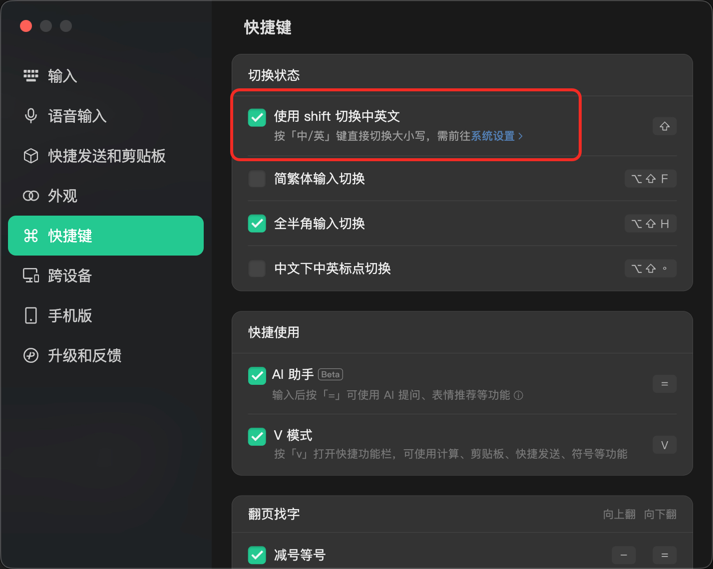
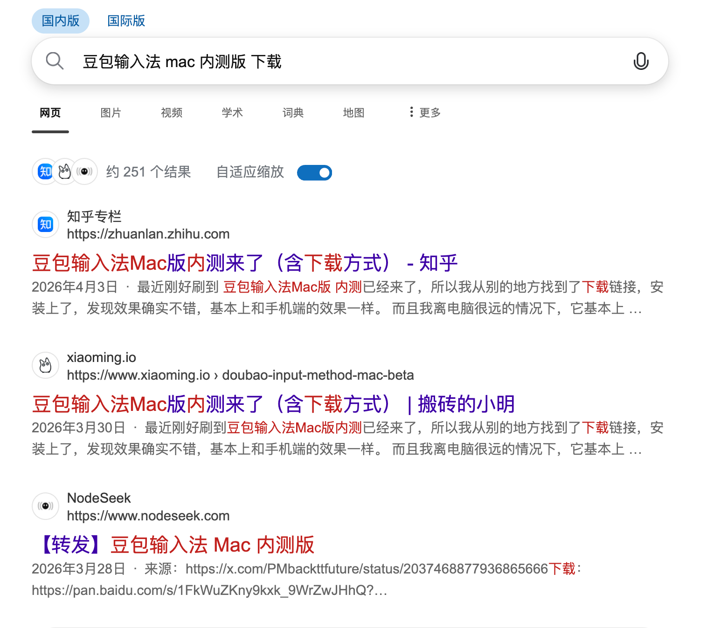

# 中文输入法指示器


一个专为豆包输入法、微信输入法设计的 macOS 菜单栏状态指示器。

它用一个简洁的菜单栏图标显示当前是中文模式还是英文模式，不占用 Dock，不打开主窗口，适合长期常驻使用。

## 介绍

部分第三方中文输入法会把“中文 / 英文”状态保存在输入法进程内部。macOS 自带输入法菜单通常只能显示当前输入法，不能稳定显示输入法内部的中英文模式。

中文输入法指示器通过监听当前输入法和 Shift 切换行为，在菜单栏提供一个稳定、直观的状态提示：

| 图标 | 含义 |
| --- | --- |
| `🇨🇳` | 中文模式 |
| `🇺🇸` | 英文模式 |
| `?` | 中英文状态未知，需要在菜单中校准 |
| `⚠️` | 输入监控权限未开启或未确认 |

当前提供两个版本：

| 版本 | 适用输入法 | 应用名称 | Homebrew Cask |
| --- | --- | --- | --- |
| 豆包输入法指示器 | 豆包输入法 | `DoubaoInputIndicator.app` | `doubao-input-indicator` |
| 微信输入法指示器 | 微信输入法 | `WeTypeInputIndicator.app` | `wetype-input-indicator` |

## 安装

推荐使用 Homebrew 安装。先添加 tap：

```bash
brew tap jianzhoujz/tap
```

然后根据你使用的输入法二选一安装。

### 豆包输入法

```bash
brew install --cask doubao-input-indicator
```

### 微信输入法

```bash
brew install --cask wetype-input-indicator
```

### 卸载

```bash
brew uninstall --cask doubao-input-indicator
brew uninstall --cask wetype-input-indicator
```

### 手动安装

如果不使用 Homebrew，可以从 [GitHub Releases](https://github.com/jianzhoujz/input-indicator/releases) 下载对应压缩包：

- `DoubaoInputIndicator-版本号.zip`
- `WeTypeInputIndicator-版本号.zip`

解压后，将 `.app` 拖到 `/Applications` 或 `~/Applications`，然后启动应用。

## 首次启动

当前应用没有 Apple Developer ID 签名。首次启动时，macOS 可能提示无法验证开发者、应用已损坏，或者阻止打开。

如果你确认应用来源可信，可以先尝试：

1. 打开 `系统设置 -> 隐私与安全性`
2. 在安全性提示中选择 `仍要打开`
3. 再次启动应用

如果仍然无法打开，可以移除 quarantine 标记。

豆包输入法版本：

```bash
xattr -dr com.apple.quarantine /Applications/DoubaoInputIndicator.app
```

微信输入法版本：

```bash
xattr -dr com.apple.quarantine /Applications/WeTypeInputIndicator.app
```

如果你安装在 `~/Applications`，请把命令里的 `/Applications` 改成 `~/Applications`。

## 使用说明

启动后，应用会出现在 macOS 菜单栏。点击菜单栏图标可以打开菜单。

菜单中提供：

- `开机启动`：登录 macOS 后自动启动
- `版本`：查看当前安装版本
- `检查更新...`：检查 GitHub Releases 中的新版本
- `退出`：退出应用

如果显示状态和实际输入状态不一致，可以在菜单中手动校准：

- `校准为中文`
- `校准为英文`

如果应用检测到可能漏掉了一次 Shift 切换，例如启动瞬间按了 Shift、事件监听被系统临时禁用、或者 Shift 按下到松开期间输入源发生变化，菜单栏会显示 `?`。这种情况下请用菜单里的校准项重新同步。

### 输入监控权限

如果菜单显示输入监控权限未完成，请打开：

```text
系统设置 -> 隐私与安全性 -> 输入监控
```

然后启用对应应用：

- `DoubaoInputIndicator.app`
- `WeTypeInputIndicator.app`

授权后请退出并重新启动应用。

### 微信输入法设置

使用微信输入法版本时，请先在微信输入法设置中打开：

```text
快捷键 -> 切换状态 -> 使用 shift 切换中英文
```



## 系统要求

- macOS 12.0 Monterey 或更高版本
- 支持 Intel Mac 和 Apple Silicon Mac

## 反馈与问题

如果遇到状态不准、权限异常、安装失败或其他问题，请在 [GitHub Issues](https://github.com/jianzhoujz/input-indicator/issues) 提交反馈。

## FAQ

### 在哪里下载 Mac 版豆包输入法？

官网还没有，但是网上有泄露的内测版，大家可以自行搜索下载，注意鉴别。


